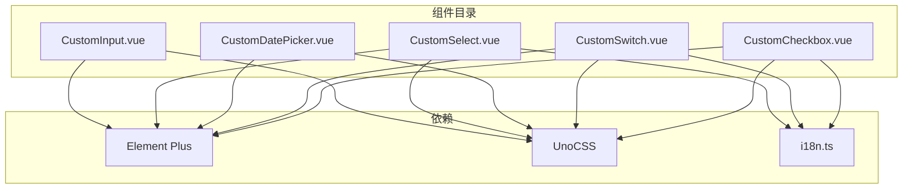
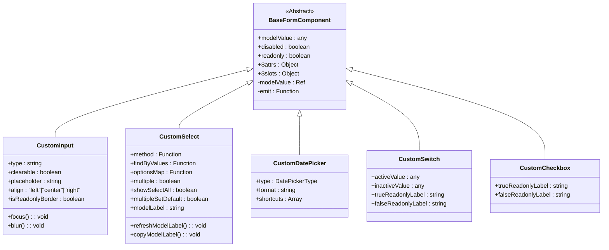
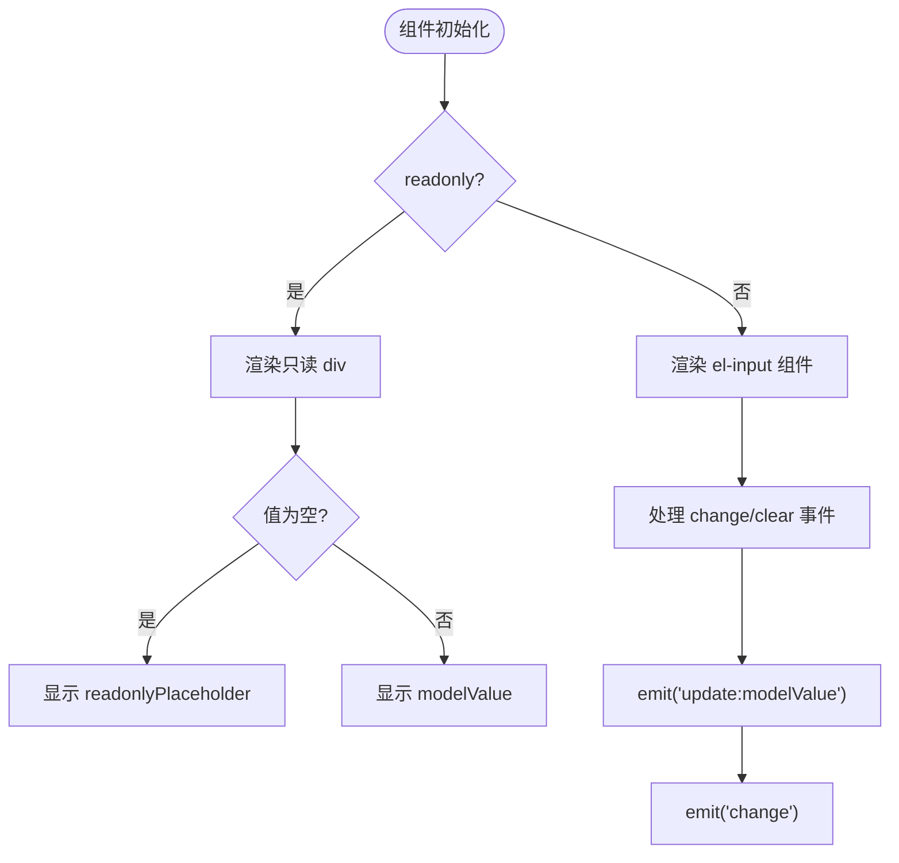
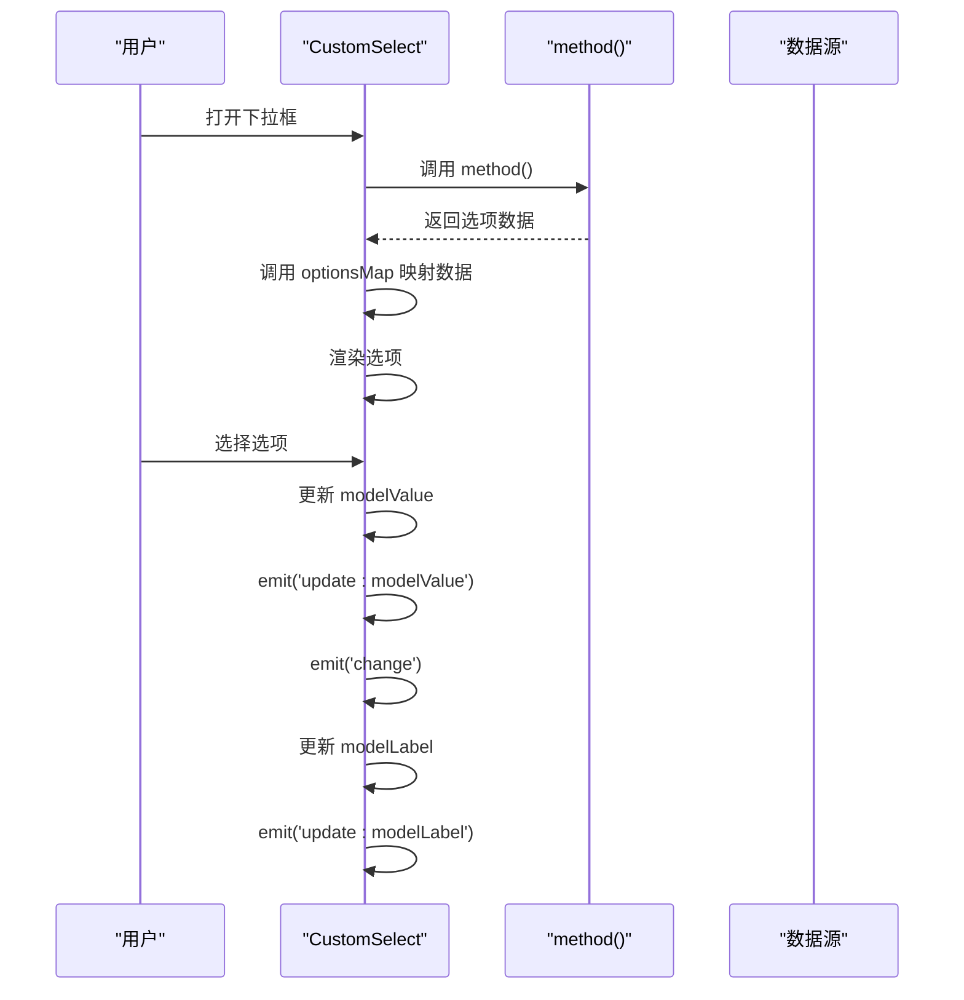
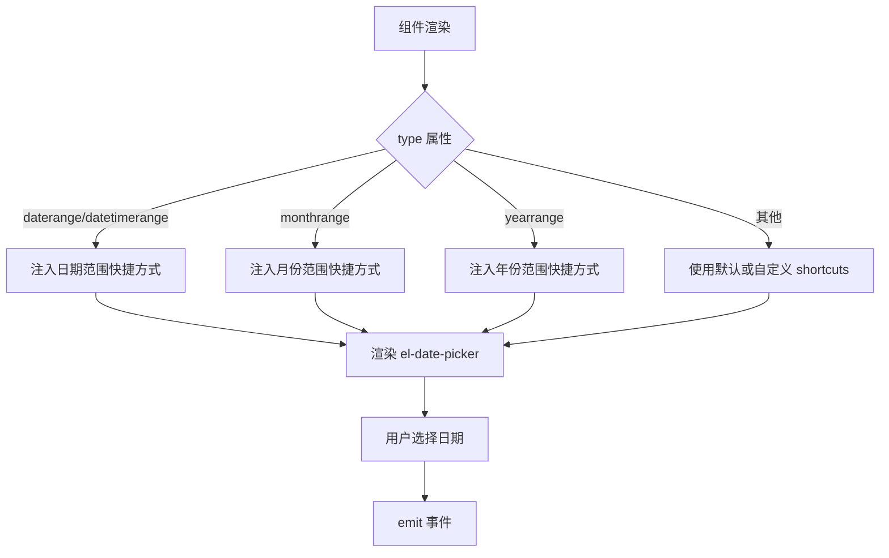
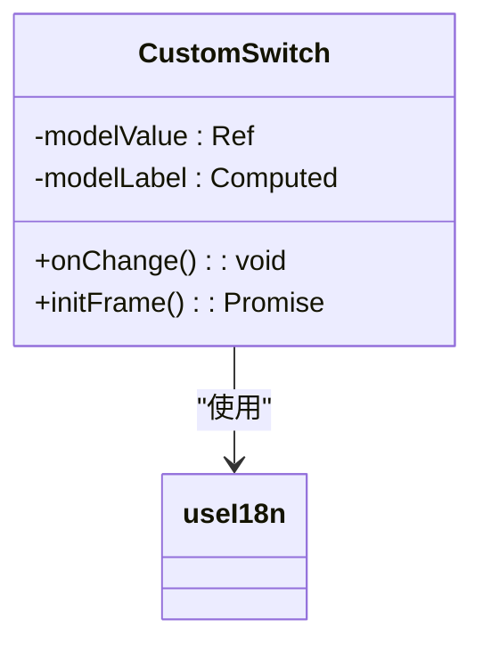
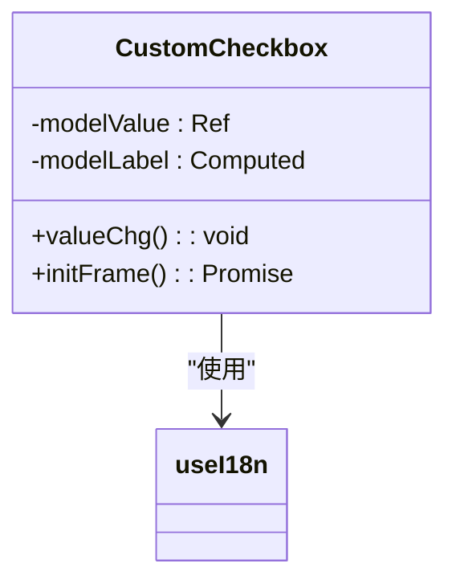
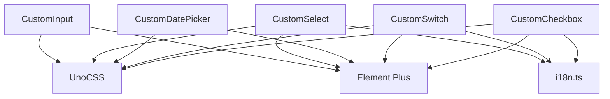

# 基础表单组件

**本文档中引用的文件**  
- [CustomInput.vue](https://github.com/sail-sail/nest/blob/main/pc/src/components/CustomInput.vue)
- [CustomSelect.vue](https://github.com/sail-sail/nest/blob/main/pc/src/components/CustomSelect.vue)
- [CustomDatePicker.vue](https://github.com/sail-sail/nest/blob/main/pc/src/components/CustomDatePicker.vue)
- [CustomSwitch.vue](https://github.com/sail-sail/nest/blob/main/pc/src/components/CustomSwitch.vue)
- [CustomCheckbox.vue](https://github.com/sail-sail/nest/blob/main/pc/src/components/CustomCheckbox.vue)

## 目录
1. [简介](#简介)
2. [项目结构](#项目结构)
3. [核心组件](#核心组件)
4. [架构概览](#架构概览)
5. [详细组件分析](#详细组件分析)
6. [依赖分析](#依赖分析)
7. [性能考虑](#性能考虑)
8. [故障排除指南](#故障排除指南)
9. [结论](#结论)

## 简介
本文档旨在为 `CustomInput`、`CustomSelect`、`CustomDatePicker`、`CustomSwitch` 和 `CustomCheckbox` 等基础表单组件提供全面的技术文档。这些组件封装了 Element Plus 的原生输入控件，并添加了项目特定的业务逻辑、样式定制、只读模式支持以及国际化处理。文档将深入分析每个组件的属性（props）、事件机制、插槽使用方式、验证逻辑、无障碍访问支持及性能优化建议，帮助开发者高效使用并避免常见陷阱。

## 项目结构
基础表单组件位于 `pc/src/components/` 目录下，是前端项目 `pc` 模块的核心 UI 组件库。这些组件被设计为可复用的原子级单元，广泛应用于各种数据录入和配置界面中。

**Diagram sources**
- [CustomInput.vue](https://github.com/sail-sail/nest/blob/main/pc/src/components/CustomInput.vue)
- [CustomSelect.vue](https://github.com/sail-sail/nest/blob/main/pc/src/components/CustomSelect.vue)
- [CustomDatePicker.vue](https://github.com/sail-sail/nest/blob/main/pc/src/components/CustomDatePicker.vue)
- [CustomSwitch.vue](https://github.com/sail-sail/nest/blob/main/pc/src/components/CustomSwitch.vue)
- [CustomCheckbox.vue](https://github.com/sail-sail/nest/blob/main/pc/src/components/CustomCheckbox.vue)

**Section sources**
- [CustomInput.vue](https://github.com/sail-sail/nest/blob/main/pc/src/components/CustomInput.vue)
- [CustomSelect.vue](https://github.com/sail-sail/nest/blob/main/pc/src/components/CustomSelect.vue)
- [CustomDatePicker.vue](https://github.com/sail-sail/nest/blob/main/pc/src/components/CustomDatePicker.vue)
- [CustomSwitch.vue](https://github.com/sail-sail/nest/blob/main/pc/src/components/CustomSwitch.vue)
- [CustomCheckbox.vue](https://github.com/sail-sail/nest/blob/main/pc/src/components/CustomCheckbox.vue)

## 核心组件
本文档涵盖的五个核心表单组件均遵循一致的设计模式：封装 Element Plus 原生组件，通过 `v-bind="$attrs"` 透传所有原生属性，并在此基础上扩展项目特定的功能，如只读视图、对齐方式、快捷键支持和国际化标签等。

**Section sources**
- [CustomInput.vue](https://github.com/sail-sail/nest/blob/main/pc/src/components/CustomInput.vue#L1-L253)
- [CustomSelect.vue](https://github.com/sail-sail/nest/blob/main/pc/src/components/CustomSelect.vue#L1-L1011)
- [CustomDatePicker.vue](https://github.com/sail-sail/nest/blob/main/pc/src/components/CustomDatePicker.vue#L1-L222)
- [CustomSwitch.vue](https://github.com/sail-sail/nest/blob/main/pc/src/components/CustomSwitch.vue#L1-L125)
- [CustomCheckbox.vue](https://github.com/sail-sail/nest/blob/main/pc/src/components/CustomCheckbox.vue#L1-L102)

## 架构概览
所有基础表单组件均采用 Vue 3 的 `<script setup>` 语法，利用响应式 API（如 `$ref`, `$computed`, `watch`）管理内部状态。它们通过 `defineProps` 接收外部配置，通过 `defineEmits` 定义事件接口，并通过 `defineExpose` 暴露内部方法（如 `focus`, `blur`）供父组件调用。组件普遍实现了 `readonly` 模式，当 `readonly` 属性为 `true` 时，会渲染一个无交互的只读视图，以保持 UI 的一致性。

**Diagram sources**
- [CustomInput.vue](https://github.com/sail-sail/nest/blob/main/pc/src/components/CustomInput.vue#L1-L253)
- [CustomSelect.vue](https://github.com/sail-sail/nest/blob/main/pc/src/components/CustomSelect.vue#L1-L1011)
- [CustomDatePicker.vue](https://github.com/sail-sail/nest/blob/main/pc/src/components/CustomDatePicker.vue#L1-L222)
- [CustomSwitch.vue](https://github.com/sail-sail/nest/blob/main/pc/src/components/CustomSwitch.vue#L1-L125)
- [CustomCheckbox.vue](https://github.com/sail-sail/nest/blob/main/pc/src/components/CustomCheckbox.vue#L1-L102)

## 详细组件分析

### CustomInput 分析
`CustomInput` 组件封装了 `el-input`，提供了文本、密码、文本域等多种输入类型的支持。它通过 `align` 属性控制内容对齐方式（左、中、右），并为只读模式提供了两种样式：带边框和无边框。组件还支持通过 `myAppend` 插槽自定义后缀内容。

#### 属性 (Props)
| 属性名 | 类型 | 默认值 | 说明 |
| :--- | :--- | :--- | :--- |
| `modelValue` | any | undefined | 绑定的值 |
| `type` | string | "text" | 输入框类型 |
| `clearable` | boolean | true | 是否可清空 |
| `disabled` | boolean | undefined | 是否禁用 |
| `readonly` | boolean | undefined | 是否只读 |
| `placeholder` | string | undefined | 普通状态占位符 |
| `readonlyPlaceholder` | string | "" | 只读状态占位符 |
| `isReadonlyBorder` | boolean | true | 只读时是否显示边框 |
| `align` | "left" \| "center" \| "right" | undefined | 内容对齐方式 |

#### 事件 (Events)
| 事件名 | 参数 | 说明 |
| :--- | :--- | :--- |
| `update:modelValue` | value | 值更新时触发 |
| `change` | value | 值改变时触发 |
| `clear` | - | 清空时触发 |

#### 插槽 (Slots)
| 插槽名 | 说明 |
| :--- | :--- |
| default | 默认插槽，用于自定义输入框内容 |
| myAppend | 自定义后缀内容，位于输入框右侧 |

**Diagram sources**
- [CustomInput.vue](https://github.com/sail-sail/nest/blob/main/pc/src/components/CustomInput.vue#L1-L253)

**Section sources**
- [CustomInput.vue](https://github.com/sail-sail/nest/blob/main/pc/src/components/CustomInput.vue#L1-L253)

### CustomSelect 分析
`CustomSelect` 是一个功能强大的下拉选择器，基于 `ElSelectV2` 实现。它支持异步数据加载、多选、全选、设为默认值等高级功能。组件通过 `method` 属性获取选项数据，并通过 `findByValues` 在只读模式下反查标签。

#### 属性 (Props)
| 属性名 | 类型 | 默认值 | 说明 |
| :--- | :--- | :--- | :--- |
| `method` | Function | - | 获取选项数据的方法 |
| `findByValues` | Function | undefined | 通过值反查数据的方法 |
| `optionsMap` | Function | (item) => { label: item.lbl, value: item.id } | 数据映射函数 |
| `multiple` | boolean | false | 是否多选 |
| `showSelectAll` | boolean | true | 是否显示全选 |
| `multipleSetDefault` | boolean | false | 多选时是否显示“设为默认” |
| `modelLabel` | string | undefined | 模型标签，用于只读模式显示 |
| `readonlyMaxCollapseTags` | number | 1 | 只读模式下折叠标签数 |

#### 事件 (Events)
| 事件名 | 参数 | 说明 |
| :--- | :--- | :--- |
| `update:modelValue` | value | 值更新时触发 |
| `update:modelLabel` | label | 标签更新时触发 |
| `change` | value | 值改变时触发 |
| `clear` | - | 清空时触发 |
| `data` | data[] | 数据加载完成后触发 |

#### 插槽 (Slots)
| 插槽名 | 说明 |
| :--- | :--- |
| default | 自定义选项内容 |
| header | 自定义下拉框头部内容 |
| suffix | 自定义后缀图标 |

**Diagram sources**
- [CustomSelect.vue](https://github.com/sail-sail/nest/blob/main/pc/src/components/CustomSelect.vue#L1-L1011)

**Section sources**
- [CustomSelect.vue](https://github.com/sail-sail/nest/blob/main/pc/src/components/CustomSelect.vue#L1-L1011)

### CustomDatePicker 分析
`CustomDatePicker` 封装了 `el-date-picker`，为日期和日期范围选择提供了便捷的快捷方式。组件根据 `type` 属性自动注入“今天”、“当月”、“上个月”等常用快捷选项。

#### 属性 (Props)
| 属性名 | 类型 | 默认值 | 说明 |
| :--- | :--- | :--- | :--- |
| `type` | string | undefined | 选择器类型 (date, daterange 等) |
| `format` | string | undefined | 显示格式 |
| `shortcuts` | Array | undefined | 自定义快捷方式 |
| `startPlaceholder` | string | "开始" | 范围选择开始占位符 |
| `endPlaceholder` | string | "结束" | 范围选择结束占位符 |

#### 事件 (Events)
| 事件名 | 参数 | 说明 |
| :--- | :--- | :--- |
| `update:modelValue` | value | 值更新时触发 |
| `change` | value | 值改变时触发 |
| `clear` | - | 清空时触发 |

#### 快捷方式逻辑
组件内置了根据 `type` 动态生成快捷方式的逻辑：
- `daterange` / `datetimerange`: 提供“今天”、“当月”、“上个月”、“最近三个月”、“最近六个月”。
- `monthrange`: 提供“当月”、“上个月”、“最近三个月”、“最近六个月”。
- `yearrange`: 提供“今年”、“去年”。

**Diagram sources**
- [CustomDatePicker.vue](https://github.com/sail-sail/nest/blob/main/pc/src/components/CustomDatePicker.vue#L1-L222)

**Section sources**
- [CustomDatePicker.vue](https://github.com/sail-sail/nest/blob/main/pc/src/components/CustomDatePicker.vue#L1-L222)

### CustomSwitch 分析
`CustomSwitch` 封装了 `el-switch`，允许自定义开关的激活值和非激活值。在只读模式下，它会显示 `是` 或 `否` 的文本标签，支持通过 `trueReadonlyLabel` 和 `falseReadonlyLabel` 进行定制。

#### 属性 (Props)
| 属性名 | 类型 | 默认值 | 说明 |
| :--- | :--- | :--- | :--- |
| `activeValue` | any | 1 | 开启时的值 |
| `inactiveValue` | any | 0 | 关闭时的值 |
| `trueReadonlyLabel` | string | "是" | 只读模式下开启状态的标签 |
| `falseReadonlyLabel` | string | "否" | 只读模式下关闭状态的标签 |

#### 事件 (Events)
| 事件名 | 参数 | 说明 |
| :--- | :--- | :--- |
| `update:modelValue` | value | 值更新时触发 |
| `change` | value | 值改变时触发 |

**Diagram sources**
- [CustomSwitch.vue](https://github.com/sail-sail/nest/blob/main/pc/src/components/CustomSwitch.vue#L1-L125)

**Section sources**
- [CustomSwitch.vue](https://github.com/sail-sail/nest/blob/main/pc/src/components/CustomSwitch.vue#L1-L125)

### CustomCheckbox 分析
`CustomCheckbox` 封装了 `el-checkbox`，与 `CustomSwitch` 类似，它将 `true-label` 和 `false-label` 固定为 `1` 和 `0`，并在只读模式下显示“是”或“否”的文本。

#### 属性 (Props)
| 属性名 | 类型 | 默认值 | 说明 |
| :--- | :--- | :--- | :--- |
| `trueReadonlyLabel` | string | undefined | 只读模式下选中状态的标签 |
| `falseReadonlyLabel` | string | undefined | 只读模式下未选中状态的标签 |

#### 事件 (Events)
| 事件名 | 参数 | 说明 |
| :--- | :--- | :--- |
| `update:modelValue` | value | 值更新时触发 |
| `change` | value | 值改变时触发 |

**Diagram sources**
- [CustomCheckbox.vue](https://github.com/sail-sail/nest/blob/main/pc/src/components/CustomCheckbox.vue#L1-L102)

**Section sources**
- [CustomCheckbox.vue](https://github.com/sail-sail/nest/blob/main/pc/src/components/CustomCheckbox.vue#L1-L102)

## 依赖分析
这些基础表单组件共同依赖于以下几个核心模块：
- **Element Plus**: 提供所有原生 UI 组件的基础。
- **UnoCSS**: 提供原子化 CSS 类，用于快速布局和样式定制。
- **i18n.ts**: 提供国际化支持，`CustomSelect`、`CustomSwitch` 和 `CustomCheckbox` 均使用 `useI18n` 来加载“是”、“否”等系统级翻译。

**Diagram sources**
- [CustomInput.vue](https://github.com/sail-sail/nest/blob/main/pc/src/components/CustomInput.vue)
- [CustomSelect.vue](https://github.com/sail-sail/nest/blob/main/pc/src/components/CustomSelect.vue)
- [CustomDatePicker.vue](https://github.com/sail-sail/nest/blob/main/pc/src/components/CustomDatePicker.vue)
- [CustomSwitch.vue](https://github.com/sail-sail/nest/blob/main/pc/src/components/CustomSwitch.vue)
- [CustomCheckbox.vue](https://github.com/sail-sail/nest/blob/main/pc/src/components/CustomCheckbox.vue)

**Section sources**
- [CustomInput.vue](https://github.com/sail-sail/nest/blob/main/pc/src/components/CustomInput.vue)
- [CustomSelect.vue](https://github.com/sail-sail/nest/blob/main/pc/src/components/CustomSelect.vue)
- [CustomDatePicker.vue](https://github.com/sail-sail/nest/blob/main/pc/src/components/CustomDatePicker.vue)
- [CustomSwitch.vue](https://github.com/sail-sail/nest/blob/main/pc/src/components/CustomSwitch.vue)
- [CustomCheckbox.vue](https://github.com/sail-sail/nest/blob/main/pc/src/components/CustomCheckbox.vue)

## 性能考虑
- **CustomSelect**: `refreshDropdownWidth` 方法在每次下拉框打开时都会计算选项宽度，对于选项数量巨大的场景可能影响性能。建议在数据量大时禁用 `autoWidth`。
- **响应式监听**: 所有组件都使用 `watch` 监听 `props.modelValue`，这是必要的，但应避免在 `props` 中传递大型对象。
- **初始化**: `CustomSwitch` 和 `CustomCheckbox` 在 `initFrame` 中进行国际化初始化，这是一个异步操作，但对用户体验影响极小。

## 故障排除指南
- **只读模式不显示标签**: 确保 `modelValue` 的值与 `activeValue`/`inactiveValue` 或 `true-label`/`false-label` 匹配。例如，`CustomSwitch` 的 `modelValue` 应为 `1` 或 `0`。
- **CustomSelect 数据不显示**: 检查 `method` 返回的数据格式是否正确，并确认 `optionsMap` 函数能正确提取 `label` 和 `value`。
- **事件未触发**: 确保父组件正确监听了 `update:modelValue` 和 `change` 事件。
- **样式错乱**: 检查是否正确引入了 UnoCSS 和 Element Plus 的样式文件。

**Section sources**
- [CustomInput.vue](https://github.com/sail-sail/nest/blob/main/pc/src/components/CustomInput.vue)
- [CustomSelect.vue](https://github.com/sail-sail/nest/blob/main/pc/src/components/CustomSelect.vue)
- [CustomDatePicker.vue](https://github.com/sail-sail/nest/blob/main/pc/src/components/CustomDatePicker.vue)
- [CustomSwitch.vue](https://github.com/sail-sail/nest/blob/main/pc/src/components/CustomSwitch.vue)
- [CustomCheckbox.vue](https://github.com/sail-sail/nest/blob/main/pc/src/components/CustomCheckbox.vue)

## 结论
`CustomInput`、`CustomSelect`、`CustomDatePicker`、`CustomSwitch` 和 `CustomCheckbox` 这五个基础表单组件通过封装 Element Plus 并添加项目特定逻辑，为开发者提供了强大且一致的表单构建能力。它们的设计注重可复用性、可配置性和用户体验，是项目前端开发的基石。遵循本文档的指导，开发者可以高效地使用这些组件，并避免常见的使用问题。