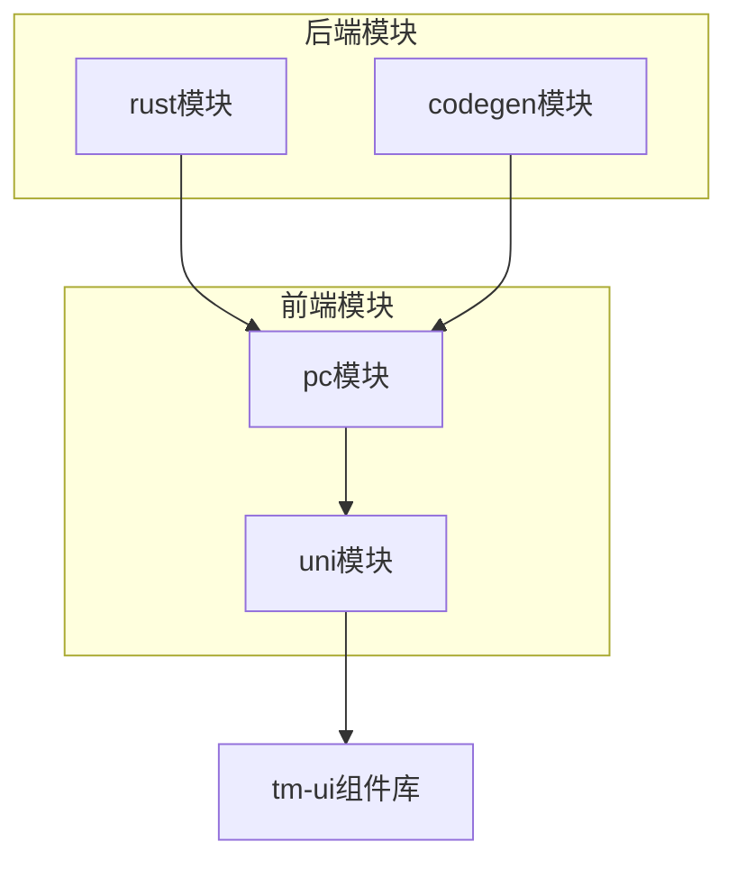
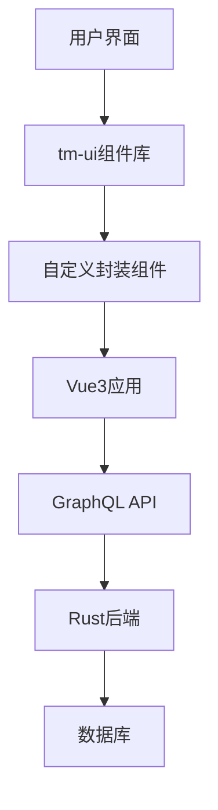
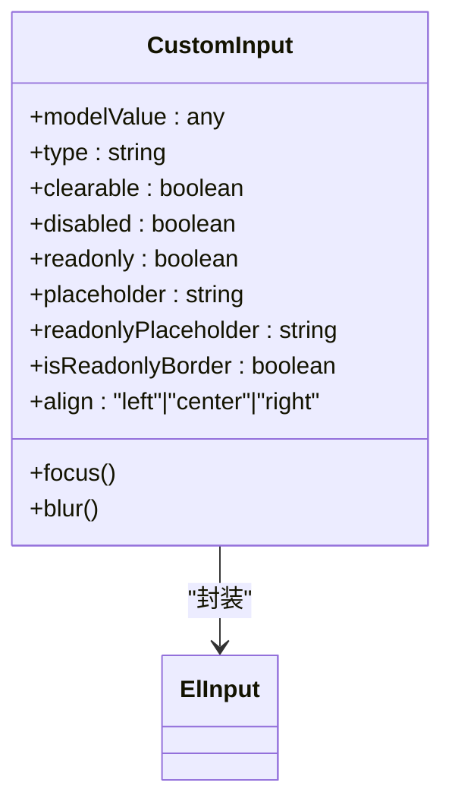
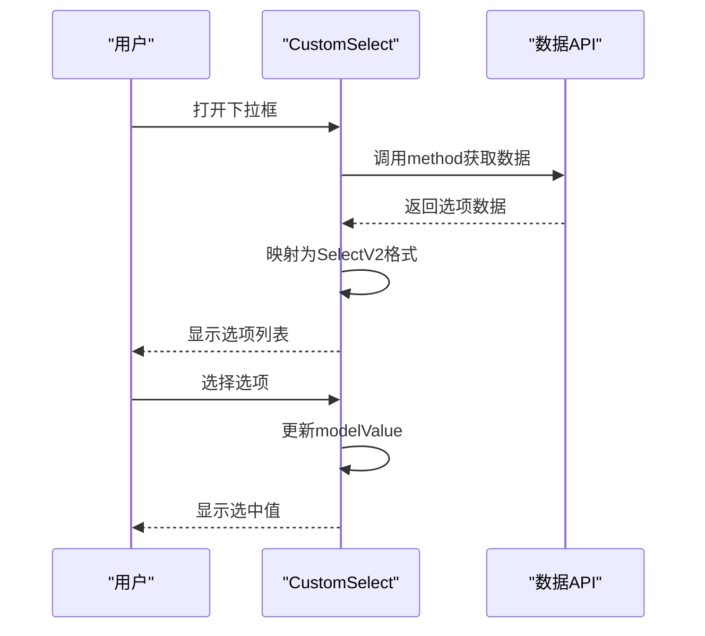
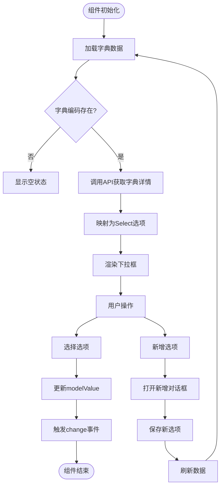
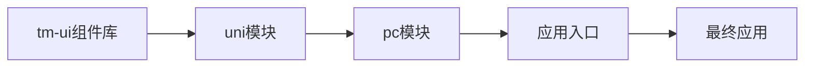

# tm-ui组件库集成

**本文档引用文件**  
- [tm-ui/package.json](https://github.com/sail-sail/nest/blob/main/uni/src/uni_modules/tm-ui/package.json)
- [main.ts](https://github.com/sail-sail/nest/blob/main/pc/src/main.ts)
- [CustomInput.vue](https://github.com/sail-sail/nest/blob/main/pc/src/components/CustomInput.vue)
- [CustomSelect.vue](https://github.com/sail-sail/nest/blob/main/pc/src/components/CustomSelect.vue)
- [DictSelect.vue](https://github.com/sail-sail/nest/blob/main/pc/src/components/DictSelect.vue)
- [index.ts](https://github.com/sail-sail/nest/blob/main/uni/src/uni_modules/tm-ui/index.ts)

## 目录
1. [简介](#简介)
2. [项目结构](#项目结构)
3. [核心组件](#核心组件)
4. [架构概览](#架构概览)
5. [详细组件分析](#详细组件分析)
6. [依赖分析](#依赖分析)
7. [性能考虑](#性能考虑)
8. [故障排除指南](#故障排除指南)
9. [结论](#结论)

## 简介
本文档全面阐述了tm-ui组件库在项目中的集成方案，涵盖引入、配置、定制化策略、二次封装机制、主题与国际化支持、性能优化及版本管理实践。tm-ui是一个基于Vue3和TypeScript的现代化UI组件库，为项目提供了一致且可复用的界面元素。

## 项目结构
项目采用多模块架构，包含codegen、pc、rust、uni四个主要模块。其中，`uni`模块下的`uni_modules/tm-ui`目录存放了tm-ui组件库的源码，`pc`模块则实现了对tm-ui组件的二次封装和集成。

**图示来源**
- [package.json](https://github.com/sail-sail/nest/blob/main/uni/src/uni_modules/tm-ui/package.json)
- [main.ts](https://github.com/sail-sail/nest/blob/main/pc/src/main.ts)

**本节来源**
- [package.json](https://github.com/sail-sail/nest/blob/main/uni/src/uni_modules/tm-ui/package.json)
- [main.ts](https://github.com/sail-sail/nest/blob/main/pc/src/main.ts)

## 核心组件
项目通过`CustomInput.vue`、`CustomSelect.vue`和`DictSelect.vue`等自定义组件对tm-ui及Element Plus组件进行二次封装，实现了统一的样式、行为和API简化。这些组件增强了可读性、可维护性和复用性。

**本节来源**
- [CustomInput.vue](https://github.com/sail-sail/nest/blob/main/pc/src/components/CustomInput.vue)
- [CustomSelect.vue](https://github.com/sail-sail/nest/blob/main/pc/src/components/CustomSelect.vue)
- [DictSelect.vue](https://github.com/sail-sail/nest/blob/main/pc/src/components/DictSelect.vue)

## 架构概览
系统采用前后端分离架构，前端基于Vue3和UniApp，后端使用Rust。tm-ui组件库作为UI层的基础，通过`pc`模块的自定义组件进行适配和扩展，与后端通过GraphQL API进行数据交互。

**图示来源**
- [main.ts](https://github.com/sail-sail/nest/blob/main/pc/src/main.ts)
- [CustomInput.vue](https://github.com/sail-sail/nest/blob/main/pc/src/components/CustomInput.vue)
- [DictSelect.vue](https://github.com/sail-sail/nest/blob/main/pc/src/components/DictSelect.vue)

## 详细组件分析
### CustomInput组件分析
`CustomInput.vue`是对Element Plus的`el-input`组件的封装，提供了只读模式、对齐方式、自定义插槽等增强功能。

**图示来源**
- [CustomInput.vue](https://github.com/sail-sail/nest/blob/main/pc/src/components/CustomInput.vue)

**本节来源**
- [CustomInput.vue](https://github.com/sail-sail/nest/blob/main/pc/src/components/CustomInput.vue)

### CustomSelect组件分析
`CustomSelect.vue`是对Element Plus的`ElSelectV2`组件的高级封装，支持多选、全选、设为默认、异步数据加载等功能。

**图示来源**
- [CustomSelect.vue](https://github.com/sail-sail/nest/blob/main/pc/src/components/CustomSelect.vue)

**本节来源**
- [CustomSelect.vue](https://github.com/sail-sail/nest/blob/main/pc/src/components/CustomSelect.vue)

### DictSelect组件分析
`DictSelect.vue`是专门用于系统字典的下拉选择组件，集成了字典数据的自动加载、新增选项功能，实现了业务层面的专用封装。

**图示来源**
- [DictSelect.vue](https://github.com/sail-sail/nest/blob/main/pc/src/components/DictSelect.vue)

**本节来源**
- [DictSelect.vue](https://github.com/sail-sail/nest/blob/main/pc/src/components/DictSelect.vue)

## 依赖分析
项目通过npm管理前端依赖，tm-ui组件库作为`uni`模块的子模块被引用。`pc`模块通过Vue的组件系统集成和扩展tm-ui组件，形成了一套完整的UI解决方案。

**图示来源**
- [package.json](https://github.com/sail-sail/nest/blob/main/uni/src/uni_modules/tm-ui/package.json)
- [main.ts](https://github.com/sail-sail/nest/blob/main/pc/src/main.ts)

**本节来源**
- [package.json](https://github.com/sail-sail/nest/blob/main/uni/src/uni_modules/tm-ui/package.json)
- [main.ts](https://github.com/sail-sail/nest/blob/main/pc/src/main.ts)

## 性能考虑
- 使用`$shallowRef`优化大型选项列表的响应式性能
- 采用异步数据加载避免阻塞主线程
- 通过`v-if`和`v-else`实现只读和编辑模式的条件渲染，减少不必要的DOM操作
- 利用`watch`的`deep`选项精确控制响应式更新

## 故障排除指南
- **组件不显示**：检查`main.ts`中是否正确引入和注册组件
- **数据不加载**：确认`method`属性是否正确指向数据获取函数
- **样式异常**：检查SCSS变量是否正确配置，确保UnoCSS正常工作
- **国际化失效**：验证`i18n`配置是否正确初始化

**本节来源**
- [CustomInput.vue](https://github.com/sail-sail/nest/blob/main/pc/src/components/CustomInput.vue)
- [CustomSelect.vue](https://github.com/sail-sail/nest/blob/main/pc/src/components/CustomSelect.vue)
- [DictSelect.vue](https://github.com/sail-sail/nest/blob/main/pc/src/components/DictSelect.vue)

## 结论
tm-ui组件库通过合理的二次封装策略，成功集成到项目中，提供了统一、高效、可维护的UI解决方案。通过自定义组件的抽象，实现了业务逻辑与UI表现的分离，提高了开发效率和代码质量。建议持续关注tm-ui的版本更新，及时进行兼容性测试和升级。