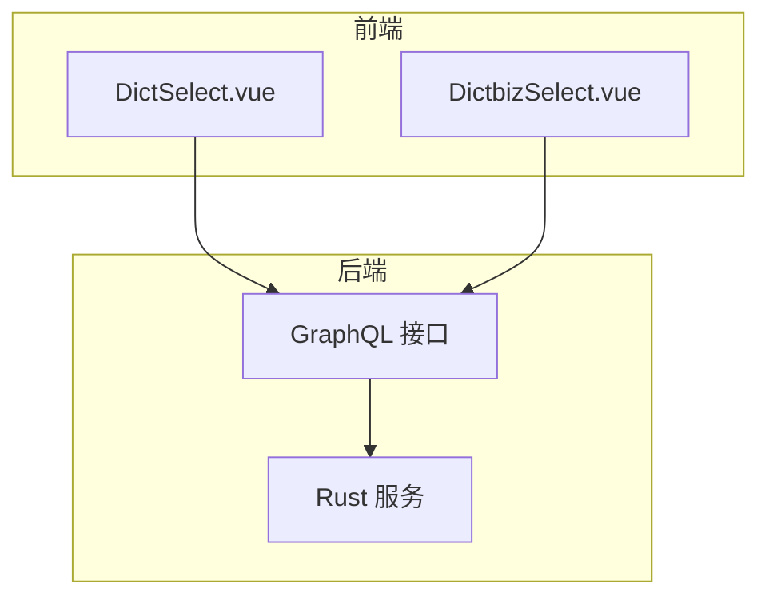
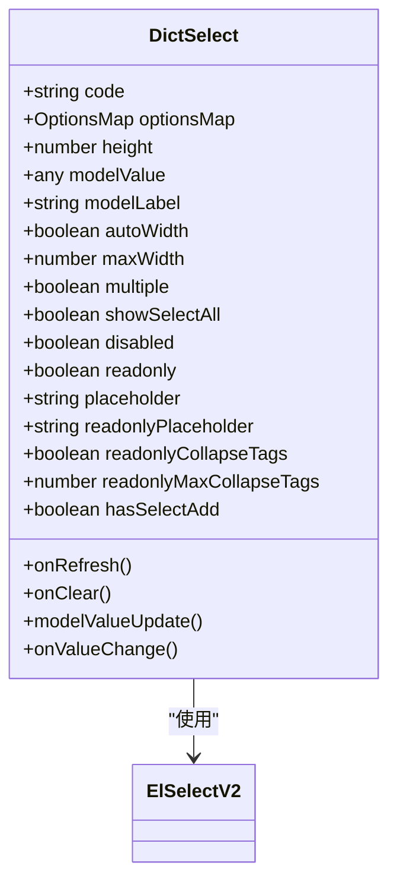
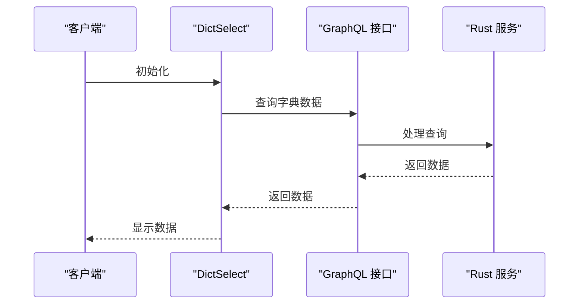
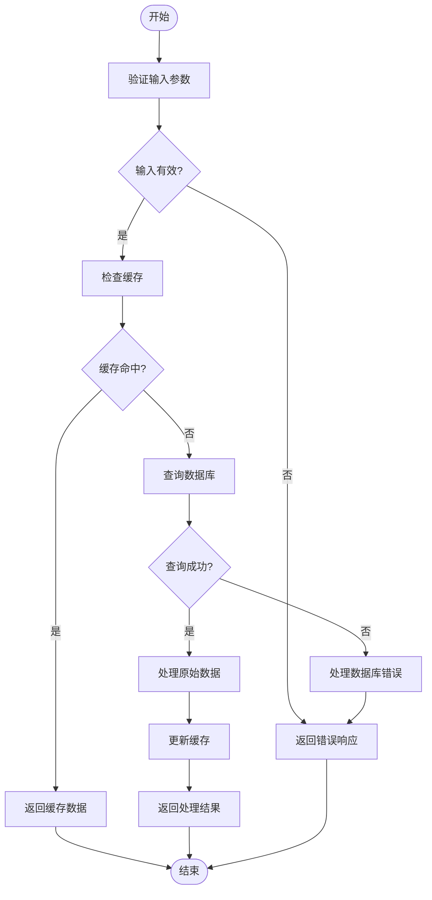
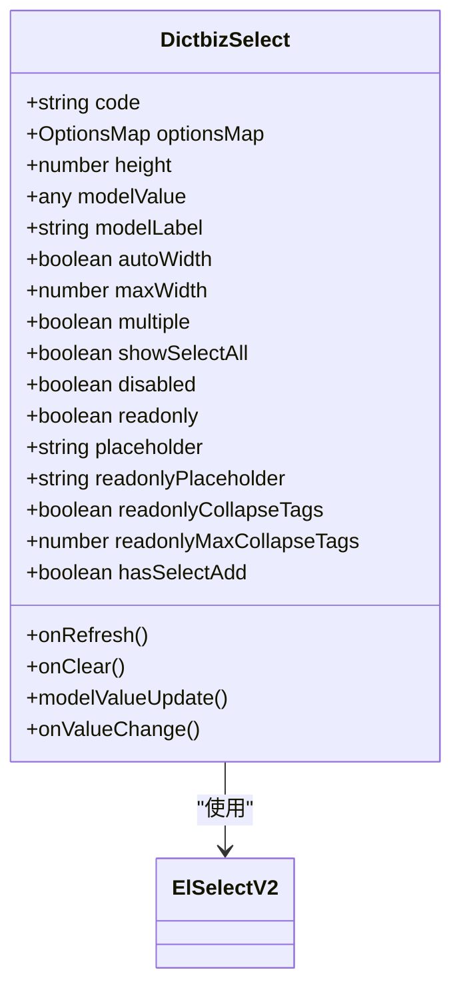
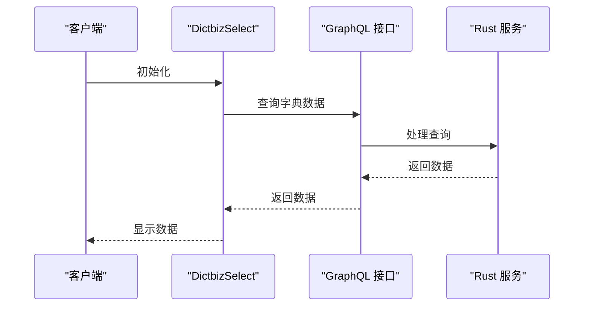

# 移动端业务组件

**本文档引用的文件**
- [DictSelect.vue](https://github.com/sail-sail/nest/blob/main/pc/src/components/DictSelect.vue)
- [DictbizSelect.vue](https://github.com/sail-sail/nest/blob/main/pc/src/components/DictbizSelect.vue)
- [dictbiz_graphql.rs](https://github.com/sail-sail/nest/blob/main/rust/generated/base/dictbiz/dictbiz_graphql.rs)
- [dictbiz_detail_graphql.rs](https://github.com/sail-sail/nest/blob/main/rust/generated/common/dictbiz_detail/dictbiz_detail_graphql.rs)
- [Api.ts](https://github.com/sail-sail/nest/blob/main/pc/src/views/base/dictbiz_detail/Api.ts)
- [graphql.ts](https://github.com/sail-sail/nest/blob/main/pc/src/utils/graphql.ts)
- [request.ts](https://github.com/sail-sail/nest/blob/main/pc/src/utils/request.ts)

## 目录
1. [简介](#简介)
2. [项目结构](#项目结构)
3. [核心组件](#核心组件)
4. [架构概述](#架构概述)
5. [详细组件分析](#详细组件分析)
6. [依赖分析](#依赖分析)
7. [性能考虑](#性能考虑)
8. [故障排除指南](#故障排除指南)
9. [结论](#结论)
10. [附录](#附录)（如有必要）

## 简介
本文档深入解析移动端业务组件 DictSelect 和 DictbizSelect 的实现机制，说明其如何与系统字典和业务字典服务集成。详细描述组件的数据加载策略、缓存机制和异步加载优化。分析组件在弱网络环境下的容错处理和用户体验优化。提供组件与后端 GraphQL 接口的交互示例，包括查询参数构造、响应数据处理和错误恢复机制。为开发者提供业务组件定制化开发的指导建议。

## 项目结构
本项目采用模块化设计，主要分为 codegen、pc、rust 和 uni 四个部分。codegen 用于代码生成，pc 为 PC 端前端代码，rust 为后端服务，uni 为移动端代码。组件 DictSelect 和 DictbizSelect 位于 pc/src/components 目录下，分别用于系统字典和业务字典的选择。

**图表来源**
- [DictSelect.vue](https://github.com/sail-sail/nest/blob/main/pc/src/components/DictSelect.vue)
- [DictbizSelect.vue](https://github.com/sail-sail/nest/blob/main/pc/src/components/DictbizSelect.vue)
- [dictbiz_graphql.rs](https://github.com/sail-sail/nest/blob/main/rust/generated/base/dictbiz/dictbiz_graphql.rs)

**章节来源**
- [DictSelect.vue](https://github.com/sail-sail/nest/blob/main/pc/src/components/DictSelect.vue)
- [DictbizSelect.vue](https://github.com/sail-sail/nest/blob/main/pc/src/components/DictbizSelect.vue)

## 核心组件
DictSelect 和 DictbizSelect 是两个核心的业务组件，分别用于系统字典和业务字典的选择。它们通过 GraphQL 接口与后端服务进行数据交互，支持异步加载、缓存机制和错误恢复。

**章节来源**
- [DictSelect.vue](https://github.com/sail-sail/nest/blob/main/pc/src/components/DictSelect.vue)
- [DictbizSelect.vue](https://github.com/sail-sail/nest/blob/main/pc/src/components/DictbizSelect.vue)

## 架构概述
系统采用前后端分离架构，前端通过 GraphQL 接口与后端服务进行数据交互。DictSelect 和 DictbizSelect 组件通过 GraphQL 查询获取字典数据，并在本地进行缓存，以提高性能和用户体验。

**图表来源**
- [DictSelect.vue](https://github.com/sail-sail/nest/blob/main/pc/src/components/DictSelect.vue)
- [DictbizSelect.vue](https://github.com/sail-sail/nest/blob/main/pc/src/components/DictbizSelect.vue)
- [dictbiz_graphql.rs](https://github.com/sail-sail/nest/blob/main/rust/generated/base/dictbiz/dictbiz_graphql.rs)

## 详细组件分析
### DictSelect 组件分析
DictSelect 组件用于系统字典的选择，支持异步加载、缓存机制和错误恢复。组件通过 GraphQL 接口获取字典数据，并在本地进行缓存，以提高性能和用户体验。

#### 对象导向组件

**图表来源**
- [DictSelect.vue](https://github.com/sail-sail/nest/blob/main/pc/src/components/DictSelect.vue)

#### API/服务组件

**图表来源**
- [DictSelect.vue](https://github.com/sail-sail/nest/blob/main/pc/src/components/DictSelect.vue)
- [dictbiz_graphql.rs](https://github.com/sail-sail/nest/blob/main/rust/generated/base/dictbiz/dictbiz_graphql.rs)

#### 复杂逻辑组件

**图表来源**
- [DictSelect.vue](https://github.com/sail-sail/nest/blob/main/pc/src/components/DictSelect.vue)
- [graphql.ts](https://github.com/sail-sail/nest/blob/main/pc/src/utils/graphql.ts)

**章节来源**
- [DictSelect.vue](https://github.com/sail-sail/nest/blob/main/pc/src/components/DictSelect.vue)
- [graphql.ts](https://github.com/sail-sail/nest/blob/main/pc/src/utils/graphql.ts)

### DictbizSelect 组件分析
DictbizSelect 组件用于业务字典的选择，支持异步加载、缓存机制和错误恢复。组件通过 GraphQL 接口获取字典数据，并在本地进行缓存，以提高性能和用户体验。

#### 对象导向组件

**图表来源**
- [DictbizSelect.vue](https://github.com/sail-sail/nest/blob/main/pc/src/components/DictbizSelect.vue)

#### API/服务组件

**图表来源**
- [DictbizSelect.vue](https://github.com/sail-sail/nest/blob/main/pc/src/components/DictbizSelect.vue)
- [dictbiz_graphql.rs](https://github.com/sail-sail/nest/blob/main/rust/generated/base/dictbiz/dictbiz_graphql.rs)

#### 复杂逻辑组件

**图表来源**
- [DictbizSelect.vue](https://github.com/sail-sail/nest/blob/main/pc/src/components/DictbizSelect.vue)
- [graphql.ts](https://github.com/sail-sail/nest/blob/main/pc/src/utils/graphql.ts)

**章节来源**
- [DictbizSelect.vue](https://github.com/sail-sail/nest/blob/main/pc/src/components/DictbizSelect.vue)
- [graphql.ts](https://github.com/sail-sail/nest/blob/main/pc/src/utils/graphql.ts)

## 依赖分析
组件 DictSelect 和 DictbizSelect 依赖于 GraphQL 接口和后端 Rust 服务。GraphQL 接口负责处理前端的查询请求，Rust 服务负责处理业务逻辑和数据存储。

**图表来源**
- [DictSelect.vue](https://github.com/sail-sail/nest/blob/main/pc/src/components/DictSelect.vue)
- [DictbizSelect.vue](https://github.com/sail-sail/nest/blob/main/pc/src/components/DictbizSelect.vue)
- [dictbiz_graphql.rs](https://github.com/sail-sail/nest/blob/main/rust/generated/base/dictbiz/dictbiz_graphql.rs)

**章节来源**
- [DictSelect.vue](https://github.com/sail-sail/nest/blob/main/pc/src/components/DictSelect.vue)
- [DictbizSelect.vue](https://github.com/sail-sail/nest/blob/main/pc/src/components/DictbizSelect.vue)
- [dictbiz_graphql.rs](https://github.com/sail-sail/nest/blob/main/rust/generated/base/dictbiz/dictbiz_graphql.rs)

## 性能考虑
组件通过缓存机制和异步加载优化性能。在弱网络环境下，组件通过错误恢复机制保证用户体验。

## 故障排除指南
组件在弱网络环境下可能出现加载失败的情况，可以通过检查网络连接和重试请求来解决。

**章节来源**
- [DictSelect.vue](https://github.com/sail-sail/nest/blob/main/pc/src/components/DictSelect.vue)
- [DictbizSelect.vue](https://github.com/sail-sail/nest/blob/main/pc/src/components/DictbizSelect.vue)
- [request.ts](https://github.com/sail-sail/nest/blob/main/pc/src/utils/request.ts)

## 结论
本文档详细解析了移动端业务组件 DictSelect 和 DictbizSelect 的实现机制，说明了其如何与系统字典和业务字典服务集成。通过数据加载策略、缓存机制和异步加载优化，组件在弱网络环境下表现出良好的容错处理和用户体验。为开发者提供了业务组件定制化开发的指导建议。