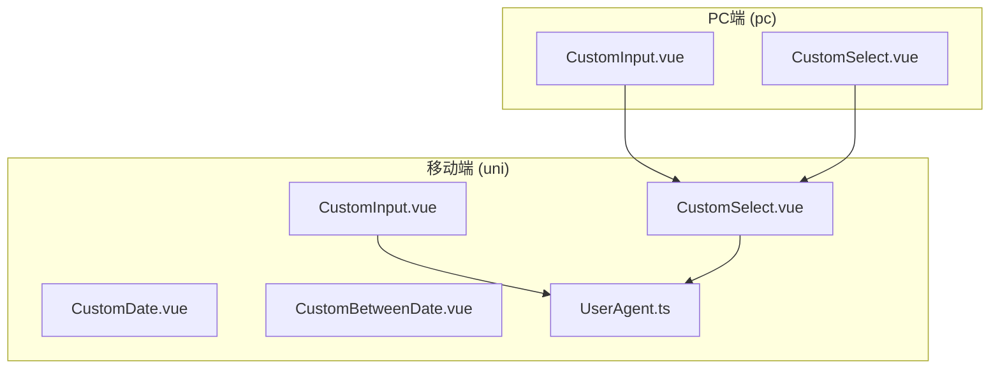
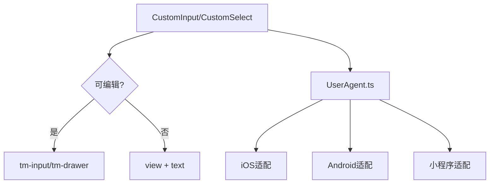
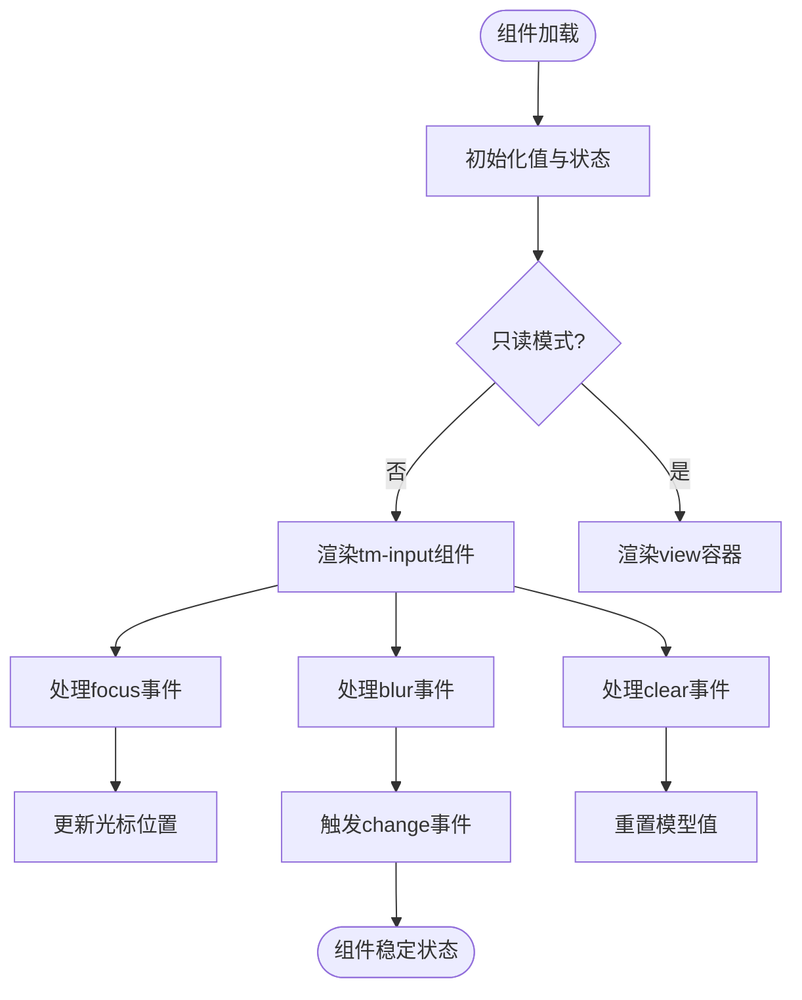
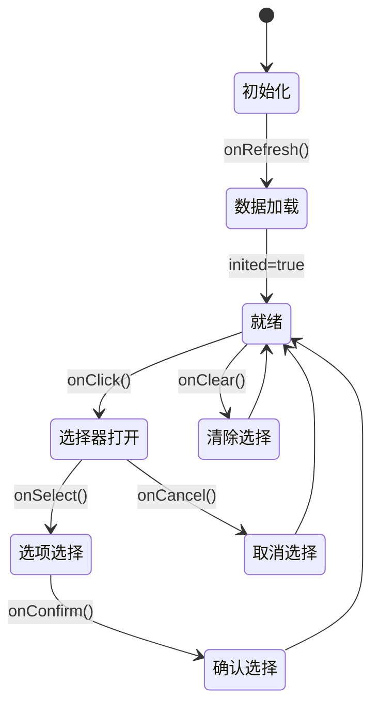
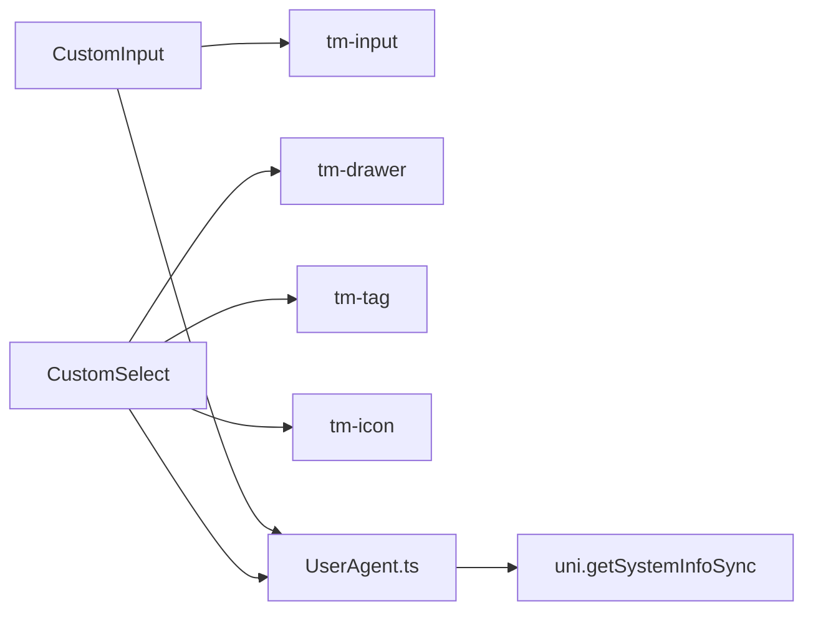

# 移动端基础组件

**本文档引用文件**  
- [CustomInput.vue](https://github.com/sail-sail/nest/blob/main/uni/src/components/CustomInput/CustomInput.vue)
- [CustomSelect.vue](https://github.com/sail-sail/nest/blob/main/uni/src/components/CustomSelect/CustomSelect.vue)
- [UserAgent.ts](https://github.com/sail-sail/nest/blob/main/uni/src/utils/UserAgent.ts)
- [pc/CustomInput.vue](https://github.com/sail-sail/nest/blob/main/pc/src/components/CustomInput.vue)
- [pc/CustomSelect.vue](https://github.com/sail-sail/nest/blob/main/pc/src/components/CustomSelect.vue)

## 目录
1. [简介](#简介)
2. [项目结构](#项目结构)
3. [核心组件](#核心组件)
4. [架构概述](#架构概述)
5. [详细组件分析](#详细组件分析)
6. [依赖分析](#依赖分析)
7. [性能考量](#性能考量)
8. [故障排除指南](#故障排除指南)
9. [结论](#结论)

## 简介
本文档详细阐述了在UniApp框架下移动端基础组件的设计与实现，重点分析CustomInput和CustomSelect等表单组件的触摸交互优化、虚拟键盘适配及性能表现。文档说明了组件如何处理移动端特有的输入场景（如日期选择、下拉筛选），提供完整的API接口文档，并展示组件在iOS、Android及小程序平台的兼容性处理方案。通过实际代码示例演示组件的使用方法和常见配置。

## 项目结构
本项目采用多端统一架构设计，包含PC端（pc目录）和移动端（uni目录）共享组件逻辑。移动端组件位于`uni/src/components`目录下，基于UniApp框架实现，适配多种移动平台。

**图示来源**  
- [CustomInput.vue](https://github.com/sail-sail/nest/blob/main/uni/src/components/CustomInput/CustomInput.vue)
- [CustomSelect.vue](https://github.com/sail-sail/nest/blob/main/uni/src/components/CustomSelect/CustomSelect.vue)
- [UserAgent.ts](https://github.com/sail-sail/nest/blob/main/uni/src/utils/UserAgent.ts)

**本节来源**  
- [CustomInput.vue](https://github.com/sail-sail/nest/blob/main/uni/src/components/CustomInput/CustomInput.vue)
- [CustomSelect.vue](https://github.com/sail-sail/nest/blob/main/uni/src/components/CustomSelect/CustomSelect.vue)

## 核心组件
移动端基础组件主要包括CustomInput和CustomSelect两大核心表单控件，分别用于文本输入和选项选择场景。组件设计充分考虑移动端特性，支持触摸优化、虚拟键盘控制、多平台兼容等关键功能。

**本节来源**  
- [CustomInput.vue](https://github.com/sail-sail/nest/blob/main/uni/src/components/CustomInput/CustomInput.vue#L1-L314)
- [CustomSelect.vue](https://github.com/sail-sail/nest/blob/main/uni/src/components/CustomSelect/CustomSelect.vue#L1-L510)

## 架构概述
系统采用分层架构设计，上层为组件表现层，中间为逻辑控制层，底层为平台适配层。CustomInput和CustomSelect组件通过条件渲染区分可编辑与只读状态，利用tm-ui组件库实现基础UI能力，并通过UserAgent识别实现平台差异化处理。

**图示来源**  
- [CustomInput.vue](https://github.com/sail-sail/nest/blob/main/uni/src/components/CustomInput/CustomInput.vue#L1-L314)
- [CustomSelect.vue](https://github.com/sail-sail/nest/blob/main/uni/src/components/CustomSelect/CustomSelect.vue#L1-L510)
- [UserAgent.ts](https://github.com/sail-sail/nest/blob/main/uni/src/utils/UserAgent.ts#L1-L96)

## 详细组件分析

### CustomInput组件分析
CustomInput组件封装了移动端文本输入的核心功能，支持多种输入类型、小数精度控制、清除操作及只读模式展示。

#### 组件交互流程

**图示来源**  
- [CustomInput.vue](https://github.com/sail-sail/nest/blob/main/uni/src/components/CustomInput/CustomInput.vue#L1-L314)

#### API接口文档
**Props参数**

| 参数名 | 类型 | 默认值 | 说明 |
|-------|------|--------|------|
| modelValue | any | undefined | 绑定值 |
| type | string | undefined | 输入类型（text, number, digit等） |
| readonly | boolean | undefined | 是否只读 |
| clearable | boolean | null | 是否显示清除按钮 |
| placeholder | string | undefined | 占位符 |
| readonlyPlaceholder | string | undefined | 只读模式占位符 |
| isDecimal | boolean | false | 是否为小数 |
| isNumber | boolean | false | 是否为数字 |
| precision | number | 2 | 数值精度 |

**Events事件**

| 事件名 | 参数 | 说明 |
|-------|------|------|
| update:modelValue | value | 更新绑定值 |
| change | value | 值改变时触发 |
| blur | value | 失去焦点时触发 |
| clear | - | 清除时触发 |

**Slots插槽**

| 插槽名 | 说明 |
|-------|------|
| left | 左侧内容插槽 |
| right | 右侧内容插槽 |

**本节来源**  
- [CustomInput.vue](https://github.com/sail-sail/nest/blob/main/uni/src/components/CustomInput/CustomInput.vue#L1-L314)

### CustomSelect组件分析
CustomSelect组件实现了移动端下拉选择功能，采用抽屉式选择器替代原生select，提升移动端用户体验。

#### 组件状态转换

**图示来源**  
- [CustomSelect.vue](https://github.com/sail-sail/nest/blob/main/uni/src/components/CustomSelect/CustomSelect.vue#L1-L510)

#### API接口文档
**Props参数**

| 参数名 | 类型 | 默认值 | 说明 |
|-------|------|--------|------|
| method | Function | required | 获取数据的方法 |
| optionsMap | Function | 内置映射 | 数据映射函数 |
| modelValue | any | undefined | 绑定值 |
| multiple | boolean | false | 是否多选 |
| placeholder | string | "" | 占位符 |
| height | number | 700 | 选择器高度 |
| clearable | boolean | true | 是否可清除 |
| readonly | boolean | undefined | 是否只读 |

**Events事件**

| 事件名 | 参数 | 说明 |
|-------|------|------|
| update:modelValue | value | 更新绑定值 |
| confirm | data | 确认选择时触发 |
| change | value/data | 值改变时触发 |
| clear | - | 清除时触发 |
| data | array | 数据加载完成时触发 |

**Slots插槽**

| 插槽名 | 说明 |
|-------|------|
| left | 左侧内容插槽 |
| right | 右侧内容插槽 |

**本节来源**  
- [CustomSelect.vue](https://github.com/sail-sail/nest/blob/main/uni/src/components/CustomSelect/CustomSelect.vue#L1-L510)

## 依赖分析
组件依赖关系清晰，CustomInput和CustomSelect均依赖tm-ui组件库的基础组件，并通过UserAgent进行平台特征检测。

**图示来源**  
- [CustomInput.vue](https://github.com/sail-sail/nest/blob/main/uni/src/components/CustomInput/CustomInput.vue)
- [CustomSelect.vue](https://github.com/sail-sail/nest/blob/main/uni/src/components/CustomSelect/CustomSelect.vue)
- [UserAgent.ts](https://github.com/sail-sail/nest/blob/main/uni/src/utils/UserAgent.ts)

**本节来源**  
- [CustomInput.vue](https://github.com/sail-sail/nest/blob/main/uni/src/components/CustomInput/CustomInput.vue)
- [CustomSelect.vue](https://github.com/sail-sail/nest/blob/main/uni/src/components/CustomSelect/CustomSelect.vue)
- [UserAgent.ts](https://github.com/sail-sail/nest/blob/main/uni/src/utils/UserAgent.ts)

## 性能考量
组件在性能方面进行了多项优化：
- 使用$shallowRef减少响应式开销
- 合理使用computed和watch避免重复计算
- 抽屉组件懒加载减少初始渲染压力
- 事件委托优化触摸交互响应
- 数值处理使用Decimal库保证精度同时控制性能损耗

## 故障排除指南
常见问题及解决方案：

1. **虚拟键盘遮挡输入框**
   - 检查页面是否正确处理键盘弹起事件
   - 确保使用了正确的viewport设置
   - 在iOS上检查input的focus行为

2. **选择器无法正常打开**
   - 确认method方法返回Promise
   - 检查数据格式是否符合optionsMap要求
   - 验证网络权限是否开启

3. **小数输入精度异常**
   - 确认isDecimal和precision参数正确设置
   - 检查Decimal库是否正确引入
   - 验证输入值的类型转换逻辑

4. **多平台样式不一致**
   - 使用UserAgent进行平台判断
   - 针对不同平台设置特定样式
   - 测试真机表现而非仅模拟器

**本节来源**  
- [CustomInput.vue](https://github.com/sail-sail/nest/blob/main/uni/src/components/CustomInput/CustomInput.vue)
- [CustomSelect.vue](https://github.com/sail-sail/nest/blob/main/uni/src/components/CustomSelect/CustomSelect.vue)
- [UserAgent.ts](https://github.com/sail-sail/nest/blob/main/uni/src/utils/UserAgent.ts)

## 结论
CustomInput和CustomSelect组件在UniApp框架下实现了优秀的移动端表单体验，通过合理的架构设计和平台适配，解决了移动端特有的输入交互问题。组件具有良好的扩展性和维护性，支持多种输入场景和平台兼容性要求，为移动端应用开发提供了可靠的表单基础能力。