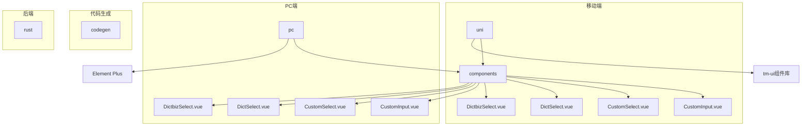
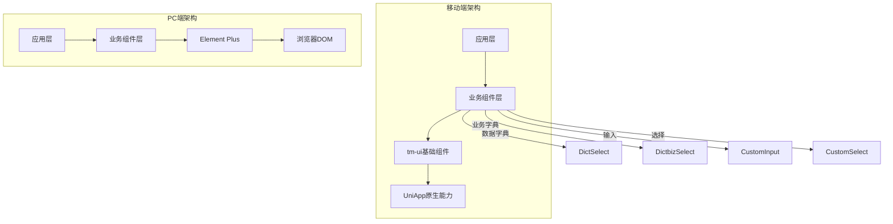
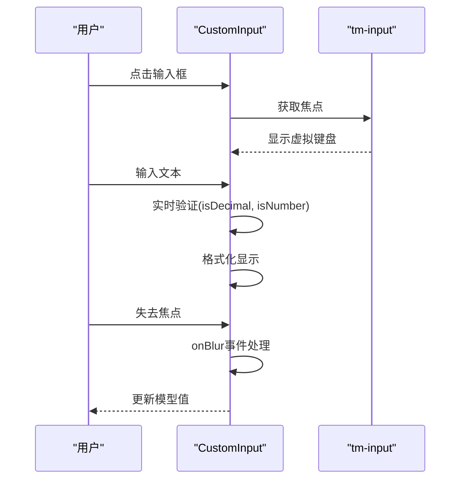
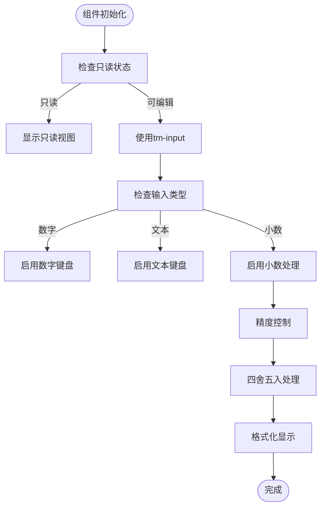
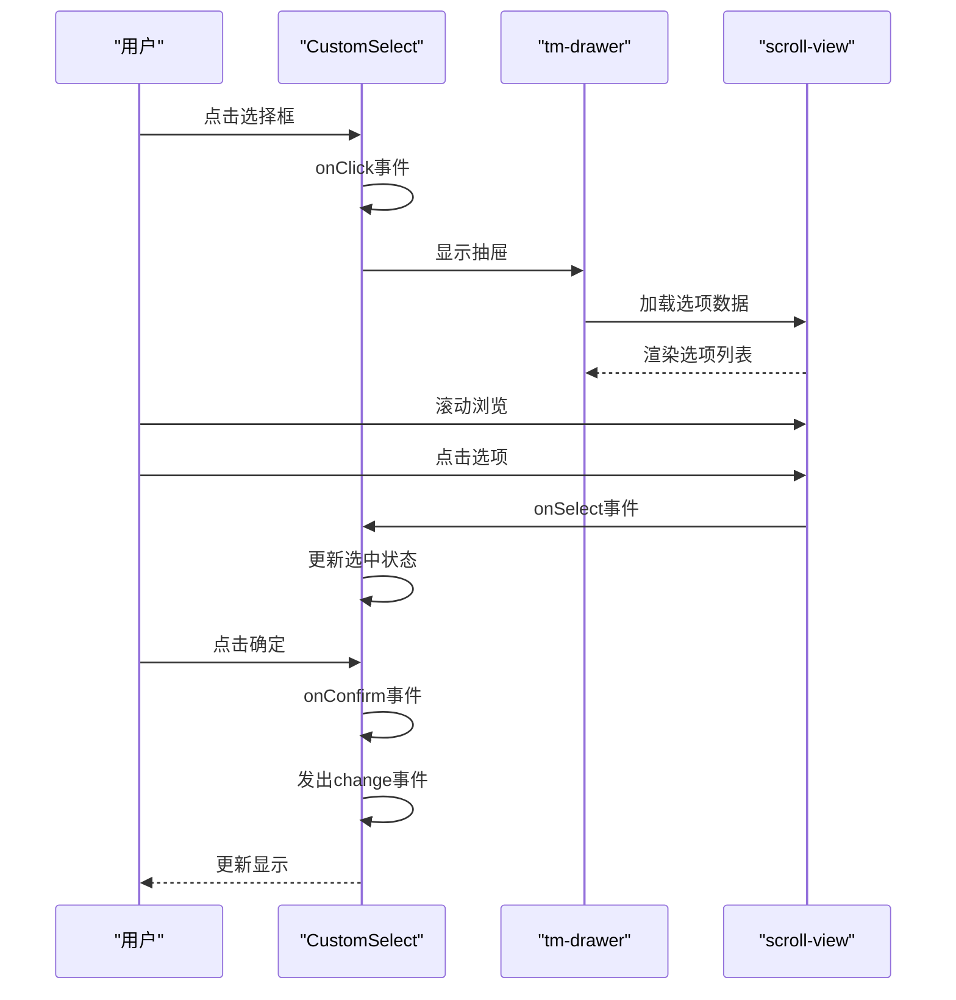
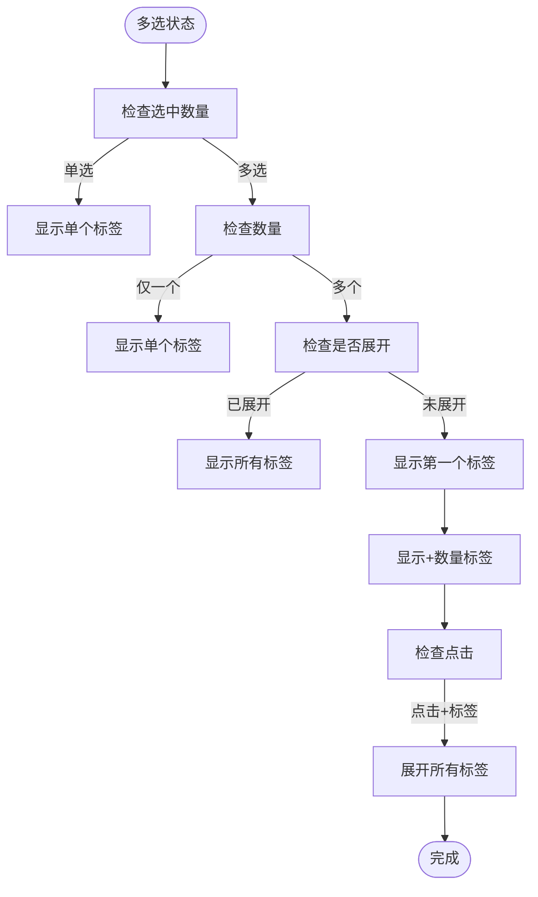
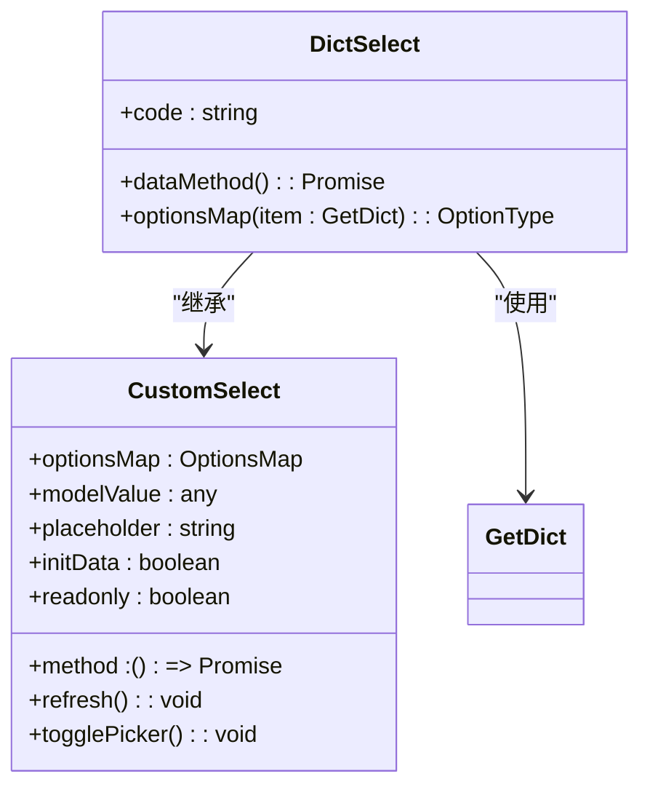
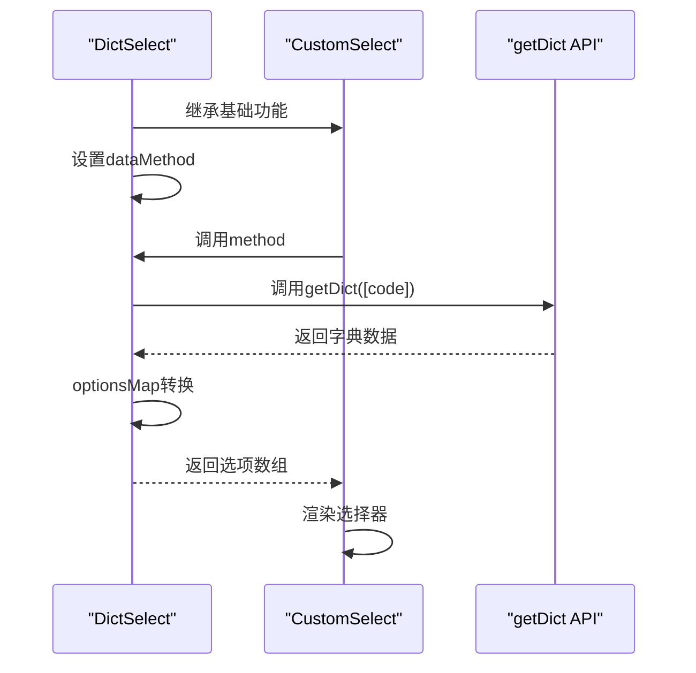
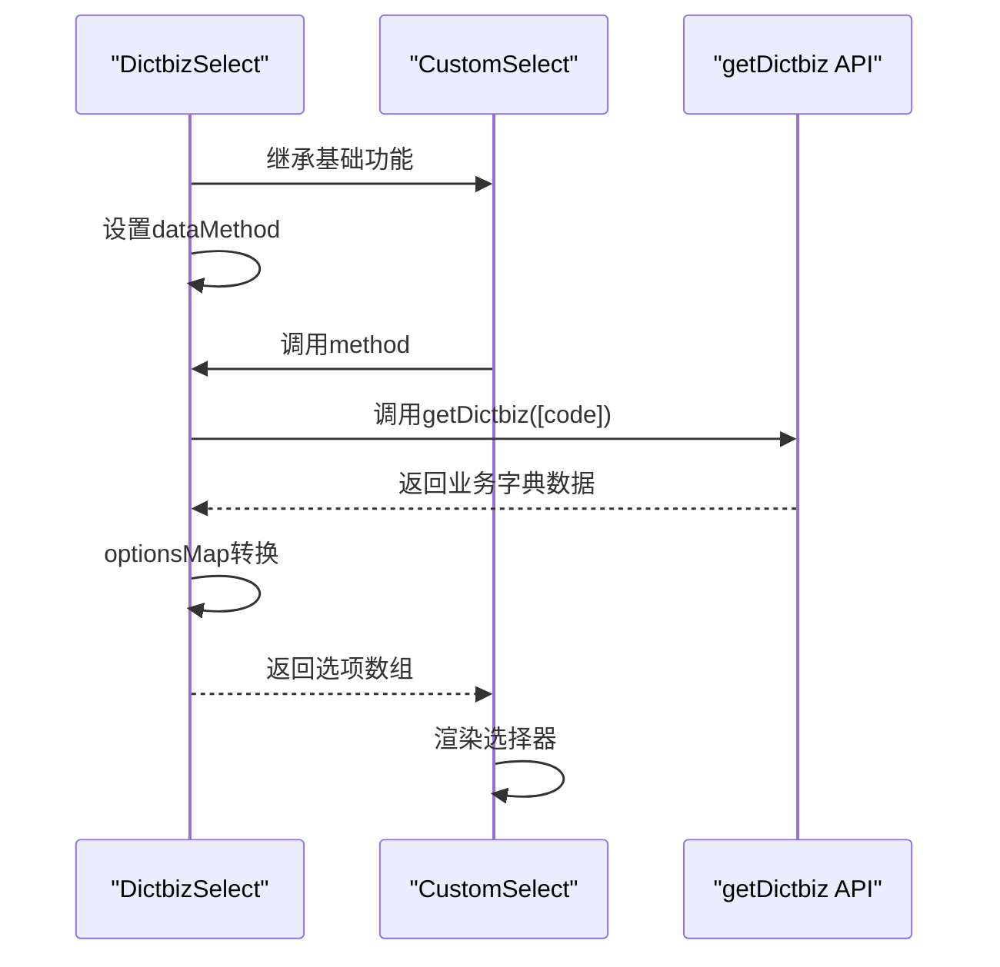
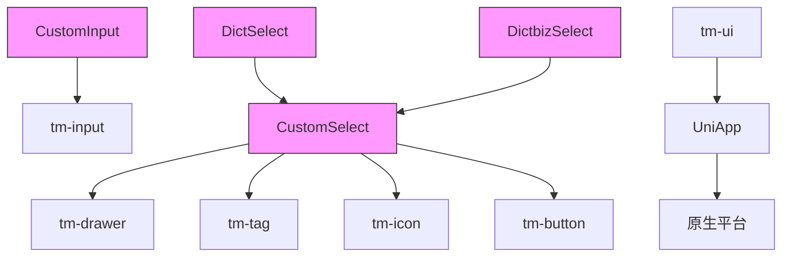

# 移动端组件体系

**本文档引用文件**  
- [CustomInput.vue](https://github.com/sail-sail/nest/blob/main/uni/src/components/CustomInput/CustomInput.vue)
- [CustomSelect.vue](https://github.com/sail-sail/nest/blob/main/uni/src/components/CustomSelect/CustomSelect.vue)
- [DictSelect.vue](https://github.com/sail-sail/nest/blob/main/uni/src/components/DictSelect/DictSelect.vue)
- [DictbizSelect.vue](https://github.com/sail-sail/nest/blob/main/uni/src/components/DictbizSelect/DictbizSelect.vue)
- [CustomInput.vue](https://github.com/sail-sail/nest/blob/main/pc/src/components/CustomInput.vue)
- [CustomSelect.vue](https://github.com/sail-sail/nest/blob/main/pc/src/components/CustomSelect.vue)
- [DictSelect.vue](https://github.com/sail-sail/nest/blob/main/pc/src/components/DictSelect.vue)
- [DictbizSelect.vue](https://github.com/sail-sail/nest/blob/main/pc/src/components/DictbizSelect.vue)

## 目录
1. [简介](#简介)
2. [项目结构](#项目结构)
3. [核心组件](#核心组件)
4. [架构概述](#架构概述)
5. [详细组件分析](#详细组件分析)
6. [依赖分析](#依赖分析)
7. [性能考虑](#性能考虑)
8. [故障排除指南](#故障排除指南)
9. [结论](#结论)

## 简介
本文档旨在全面分析基于UniApp平台的移动端组件体系，重点研究CustomInput、CustomSelect、DictSelect和DictbizSelect等组件的实现方式。通过与PC端同类组件的对比，阐述移动端组件在交互设计、布局适配和性能优化方面的特殊考量。文档详细解析了基于tm-ui组件库的二次封装策略，包括样式覆盖、功能扩展和平台兼容性处理，并为开发者提供跨平台组件开发的最佳实践。

## 项目结构
项目采用模块化结构，分为`codegen`、`pc`、`rust`和`uni`四个主要目录。`uni`目录包含移动端组件，`pc`目录包含PC端组件，两者在组件实现上存在显著差异以适应不同平台的交互特性。

**图示来源**
- [uni/src/components](https://github.com/sail-sail/nest/blob/main/uni/src/components)
- [pc/src/components](https://github.com/sail-sail/nest/blob/main/pc/src/components)

**章节来源**
- [uni/src/components](https://github.com/sail-sail/nest/blob/main/uni/src/components)
- [pc/src/components](https://github.com/sail-sail/nest/blob/main/pc/src/components)

## 核心组件
移动端组件体系的核心包括CustomInput、CustomSelect、DictSelect和DictbizSelect四个组件。这些组件基于tm-ui组件库进行二次封装，针对移动端的触摸交互、虚拟键盘和性能限制进行了特殊优化。

**章节来源**
- [CustomInput.vue](https://github.com/sail-sail/nest/blob/main/uni/src/components/CustomInput/CustomInput.vue)
- [CustomSelect.vue](https://github.com/sail-sail/nest/blob/main/uni/src/components/CustomSelect/CustomSelect.vue)
- [DictSelect.vue](https://github.com/sail-sail/nest/blob/main/uni/src/components/DictSelect/DictSelect.vue)
- [DictbizSelect.vue](https://github.com/sail-sail/nest/blob/main/uni/src/components/DictbizSelect/DictbizSelect.vue)

## 架构概述
移动端组件采用分层架构设计，底层依赖tm-ui组件库提供基础UI元素，中层通过二次封装实现业务适配，上层提供统一的API接口。与PC端使用Element Plus不同，移动端选择tm-ui以更好地支持跨平台和移动端特性。

**图示来源**
- [CustomInput.vue](https://github.com/sail-sail/nest/blob/main/uni/src/components/CustomInput/CustomInput.vue)
- [CustomSelect.vue](https://github.com/sail-sail/nest/blob/main/uni/src/components/CustomSelect/CustomSelect.vue)
- [DictSelect.vue](https://github.com/sail-sail/nest/blob/main/uni/src/components/DictSelect/DictSelect.vue)
- [DictbizSelect.vue](https://github.com/sail-sail/nest/blob/main/uni/src/components/DictbizSelect/DictbizSelect.vue)

## 详细组件分析

### CustomInput组件分析
CustomInput组件是移动端基础输入组件，封装了tm-input并针对移动端特性进行了优化。

#### 组件交互流程

**图示来源**
- [CustomInput.vue](https://github.com/sail-sail/nest/blob/main/uni/src/components/CustomInput/CustomInput.vue#L1-L314)

#### 移动端特殊处理

**图示来源**
- [CustomInput.vue](https://github.com/sail-sail/nest/blob/main/uni/src/components/CustomInput/CustomInput.vue#L1-L314)

**章节来源**
- [CustomInput.vue](https://github.com/sail-sail/nest/blob/main/uni/src/components/CustomInput/CustomInput.vue#L1-L314)

### CustomSelect组件分析
CustomSelect组件是移动端选择器组件，采用抽屉式交互模式，优化了移动端的选择体验。

#### 选择器交互流程

**图示来源**
- [CustomSelect.vue](https://github.com/sail-sail/nest/blob/main/uni/src/components/CustomSelect/CustomSelect.vue#L1-L510)

#### 多选标签处理

**图示来源**
- [CustomSelect.vue](https://github.com/sail-sail/nest/blob/main/uni/src/components/CustomSelect/CustomSelect.vue#L1-L510)

**章节来源**
- [CustomSelect.vue](https://github.com/sail-sail/nest/blob/main/uni/src/components/CustomSelect/CustomSelect.vue#L1-L510)

### DictSelect组件分析
DictSelect组件是基于CustomSelect的二次封装，专门用于处理数据字典选择。

#### 组件继承关系

**图示来源**
- [DictSelect.vue](https://github.com/sail-sail/nest/blob/main/uni/src/components/DictSelect/DictSelect.vue#L1-L71)
- [CustomSelect.vue](https://github.com/sail-sail/nest/blob/main/uni/src/components/CustomSelect/CustomSelect.vue#L1-L510)

#### 数据字典处理流程

**图示来源**
- [DictSelect.vue](https://github.com/sail-sail/nest/blob/main/uni/src/components/DictSelect/DictSelect.vue#L1-L71)

**章节来源**
- [DictSelect.vue](https://github.com/sail-sail/nest/blob/main/uni/src/components/DictSelect/DictSelect.vue#L1-L71)

### DictbizSelect组件分析
DictbizSelect组件与DictSelect类似，但用于处理业务字典选择。

#### 业务字典处理流程

**图示来源**
- [DictbizSelect.vue](https://github.com/sail-sail/nest/blob/main/uni/src/components/DictbizSelect/DictbizSelect.vue#L1-L73)

**章节来源**
- [DictbizSelect.vue](https://github.com/sail-sail/nest/blob/main/uni/src/components/DictbizSelect/DictbizSelect.vue#L1-L73)

## 依赖分析
移动端组件体系依赖于tm-ui组件库，通过二次封装实现业务适配。与PC端的Element Plus相比，tm-ui更适合移动端的触摸交互和性能要求。

**图示来源**
- [CustomInput.vue](https://github.com/sail-sail/nest/blob/main/uni/src/components/CustomInput/CustomInput.vue)
- [CustomSelect.vue](https://github.com/sail-sail/nest/blob/main/uni/src/components/CustomSelect/CustomSelect.vue)
- [DictSelect.vue](https://github.com/sail-sail/nest/blob/main/uni/src/components/DictSelect/DictSelect.vue)
- [DictbizSelect.vue](https://github.com/sail-sail/nest/blob/main/uni/src/components/DictbizSelect/DictbizSelect.vue)

**章节来源**
- [uni/src/components](https://github.com/sail-sail/nest/blob/main/uni/src/components)

## 性能考虑
移动端组件在性能优化方面采取了多项措施，包括虚拟滚动、按需加载和内存管理等策略。

### 移动端与PC端组件对比
| 特性 | 移动端组件 | PC端组件 |
|------|-----------|---------|
| **交互模式** | 抽屉式选择器 | 下拉式选择器 |
| **键盘处理** | 自动适配虚拟键盘 | 基于物理键盘 |
| **触摸优化** | 大点击区域 | 标准点击区域 |
| **性能优化** | 虚拟滚动 | 全量渲染 |
| **内存管理** | 及时释放 | 持久化 |
| **网络请求** | 懒加载 | 预加载 |
| **样式适配** | 响应式设计 | 固定布局 |

**章节来源**
- [CustomInput.vue](https://github.com/sail-sail/nest/blob/main/uni/src/components/CustomInput/CustomInput.vue)
- [CustomSelect.vue](https://github.com/sail-sail/nest/blob/main/uni/src/components/CustomSelect/CustomSelect.vue)
- [pc/src/components/CustomInput.vue](https://github.com/sail-sail/nest/blob/main/pc/src/components/CustomInput.vue)
- [pc/src/components/CustomSelect.vue](https://github.com/sail-sail/nest/blob/main/pc/src/components/CustomSelect.vue)

## 故障排除指南
### 常见问题及解决方案
| 问题现象 | 可能原因 | 解决方案 |
|--------|--------|--------|
| **输入框无法获取焦点** | readonly属性设置错误 | 检查readonly计算逻辑 |
| **选择器不显示数据** | dataMethod未正确调用 | 确保initData为true |
| **小数输入精度错误** | precision设置不当 | 检查precision属性值 |
| **多选标签显示异常** | isTagExpanded状态管理 | 检查标签展开逻辑 |
| **虚拟键盘遮挡输入框** | 滚动处理缺失 | 确保页面可滚动 |

**章节来源**
- [CustomInput.vue](https://github.com/sail-sail/nest/blob/main/uni/src/components/CustomInput/CustomInput.vue)
- [CustomSelect.vue](https://github.com/sail-sail/nest/blob/main/uni/src/components/CustomSelect/CustomSelect.vue)

## 结论
移动端组件体系通过基于tm-ui的二次封装，实现了针对移动设备的优化。与PC端组件相比，移动端组件在交互设计、布局适配和性能优化方面有显著差异。建议开发者在跨平台开发时充分考虑这些差异，采用适当的封装策略以确保一致的用户体验。