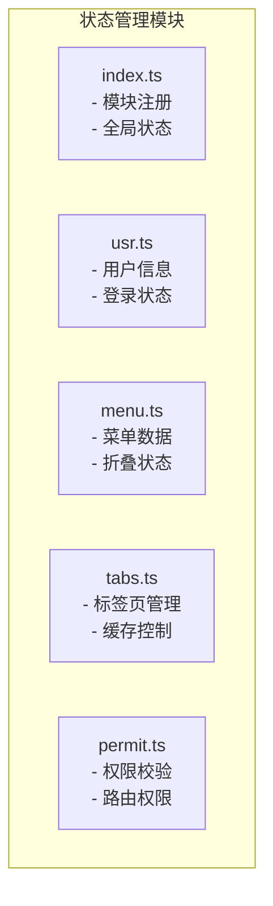
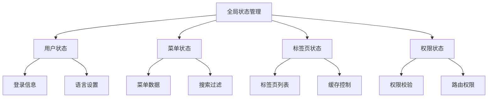
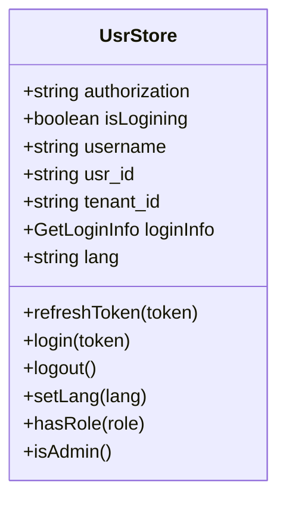
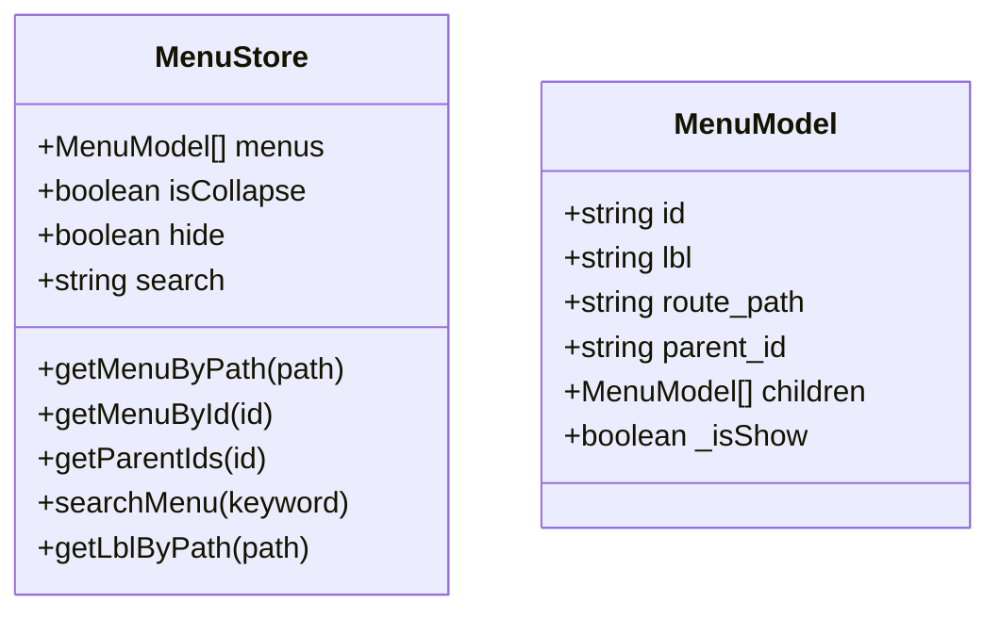
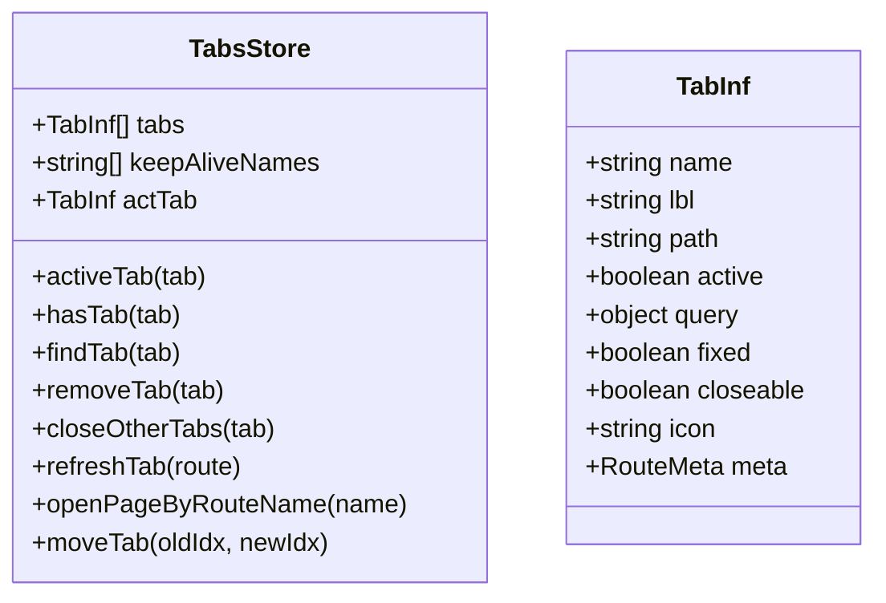
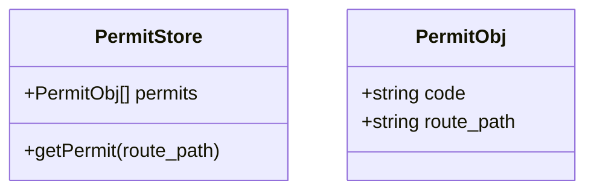
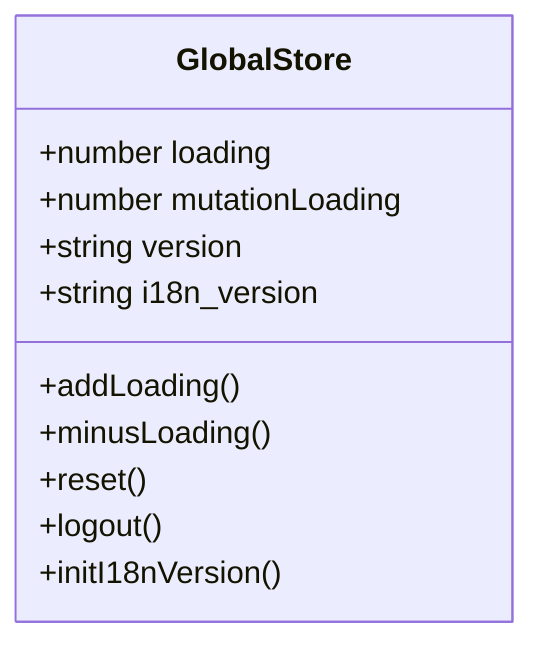
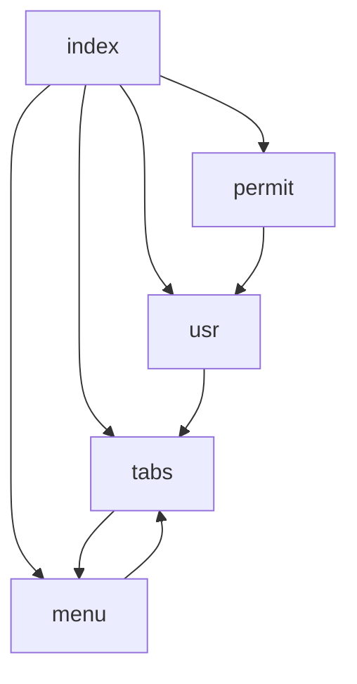

# 状态管理

**本文档中引用的文件**  
- [index.ts](https://github.com/sail-sail/nest/blob/main/pc/src/store/index.ts)
- [usr.ts](https://github.com/sail-sail/nest/blob/main/pc/src/store/usr.ts)
- [menu.ts](https://github.com/sail-sail/nest/blob/main/pc/src/store/menu.ts)
- [tabs.ts](https://github.com/sail-sail/nest/blob/main/pc/src/store/tabs.ts)
- [permit.ts](https://github.com/sail-sail/nest/blob/main/pc/src/store/permit.ts)

## 目录
1. [引言](#引言)
2. [项目结构](#项目结构)
3. [核心组件](#核心组件)
4. [架构概览](#架构概览)
5. [详细组件分析](#详细组件分析)
6. [依赖分析](#依赖分析)
7. [性能考虑](#性能考虑)
8. [故障排除指南](#故障排除指南)
9. [结论](#结论)

## 引言
本文档全面介绍基于Pinia的状态管理模式，重点分析`store/index.ts`中的模块注册机制。深入探讨`usr.ts`用户状态、`menu.ts`菜单状态、`tabs.ts`标签页状态和`permit.ts`权限状态的具体实现。解释各state的初始化流程、actions的业务逻辑封装以及getters的计算属性使用。阐述状态持久化策略和跨组件状态共享的最佳实践。为开发者提供状态调试技巧和性能优化建议。

## 项目结构
状态管理模块位于`pc/src/store`目录下，采用模块化设计，每个功能模块独立维护其状态。通过Pinia的store机制实现全局状态的集中管理与响应式更新。

**Diagram sources**
- [index.ts](https://github.com/sail-sail/nest/blob/main/pc/src/store/index.ts)
- [usr.ts](https://github.com/sail-sail/nest/blob/main/pc/src/store/usr.ts)
- [menu.ts](https://github.com/sail-sail/nest/blob/main/pc/src/store/menu.ts)
- [tabs.ts](https://github.com/sail-sail/nest/blob/main/pc/src/store/tabs.ts)
- [permit.ts](https://github.com/sail-sail/nest/blob/main/pc/src/store/permit.ts)

**Section sources**
- [index.ts](https://github.com/sail-sail/nest/blob/main/pc/src/store/index.ts)
- [usr.ts](https://github.com/sail-sail/nest/blob/main/pc/src/store/usr.ts)
- [menu.ts](https://github.com/sail-sail/nest/blob/main/pc/src/store/menu.ts)
- [tabs.ts](https://github.com/sail-sail/nest/blob/main/pc/src/store/tabs.ts)
- [permit.ts](https://github.com/sail-sail/nest/blob/main/pc/src/store/permit.ts)

## 核心组件
状态管理核心由五个主要模块构成：全局状态管理（index.ts）、用户状态（usr.ts）、菜单状态（menu.ts）、标签页状态（tabs.ts）和权限状态（permit.ts）。各模块通过useStorage实现浏览器本地持久化存储，确保页面刷新后状态不丢失。

**Section sources**
- [index.ts](https://github.com/sail-sail/nest/blob/main/pc/src/store/index.ts)
- [usr.ts](https://github.com/sail-sail/nest/blob/main/pc/src/store/usr.ts)
- [menu.ts](https://github.com/sail-sail/nest/blob/main/pc/src/store/menu.ts)
- [tabs.ts](https://github.com/sail-sail/nest/blob/main/pc/src/store/tabs.ts)
- [permit.ts](https://github.com/sail-sail/nest/blob/main/pc/src/store/permit.ts)

## 架构概览
系统采用分层状态管理模式，顶层为全局状态管理器，负责协调各子模块状态。各功能模块独立维护自身状态，通过计算属性和响应式机制实现状态同步。

**Diagram sources**
- [index.ts](https://github.com/sail-sail/nest/blob/main/pc/src/store/index.ts)
- [usr.ts](https://github.com/sail-sail/nest/blob/main/pc/src/store/usr.ts)
- [menu.ts](https://github.com/sail-sail/nest/blob/main/pc/src/store/menu.ts)
- [tabs.ts](https://github.com/sail-sail/nest/blob/main/pc/src/store/tabs.ts)
- [permit.ts](https://github.com/sail-sail/nest/blob/main/pc/src/store/permit.ts)

## 详细组件分析

### 用户状态分析
用户状态模块管理用户登录信息、权限令牌和个性化设置，通过localStorage实现持久化存储。

**Diagram sources**
- [usr.ts](https://github.com/sail-sail/nest/blob/main/pc/src/store/usr.ts#L1-L147)

**Section sources**
- [usr.ts](https://github.com/sail-sail/nest/blob/main/pc/src/store/usr.ts#L1-L147)

### 菜单状态分析
菜单状态模块负责管理侧边栏菜单数据结构、折叠状态和搜索功能，支持树形结构遍历和动态过滤。

**Diagram sources**
- [menu.ts](https://github.com/sail-sail/nest/blob/main/pc/src/store/menu.ts#L1-L228)

**Section sources**
- [menu.ts](https://github.com/sail-sail/nest/blob/main/pc/src/store/menu.ts#L1-L228)

### 标签页状态分析
标签页状态模块实现多标签页管理，包括标签页的增删改查、缓存控制和路由同步，支持拖拽排序和快捷操作。

**Diagram sources**
- [tabs.ts](https://github.com/sail-sail/nest/blob/main/pc/src/store/tabs.ts#L1-L394)

**Section sources**
- [tabs.ts](https://github.com/sail-sail/nest/blob/main/pc/src/store/tabs.ts#L1-L394)

### 权限状态分析
权限状态模块提供细粒度的权限校验功能，基于路由路径和权限码进行动态权限判断，支持管理员特权。

**Diagram sources**
- [permit.ts](https://github.com/sail-sail/nest/blob/main/pc/src/store/permit.ts#L1-L41)

**Section sources**
- [permit.ts](https://github.com/sail-sail/nest/blob/main/pc/src/store/permit.ts#L1-L41)

### 全局状态管理分析
全局状态管理模块负责初始化各子模块，提供统一的加载状态管理和版本控制，实现登出时的全局状态重置。

**Diagram sources**
- [index.ts](https://github.com/sail-sail/nest/blob/main/pc/src/store/index.ts#L1-L127)

**Section sources**
- [index.ts](https://github.com/sail-sail/nest/blob/main/pc/src/store/index.ts#L1-L127)

## 依赖分析
各状态模块之间存在明确的依赖关系，通过模块间调用实现功能协同。

**Diagram sources**
- [index.ts](https://github.com/sail-sail/nest/blob/main/pc/src/store/index.ts)
- [usr.ts](https://github.com/sail-sail/nest/blob/main/pc/src/store/usr.ts)
- [menu.ts](https://github.com/sail-sail/nest/blob/main/pc/src/store/menu.ts)
- [tabs.ts](https://github.com/sail-sail/nest/blob/main/pc/src/store/tabs.ts)
- [permit.ts](https://github.com/sail-sail/nest/blob/main/pc/src/store/permit.ts)

**Section sources**
- [index.ts](https://github.com/sail-sail/nest/blob/main/pc/src/store/index.ts)
- [usr.ts](https://github.com/sail-sail/nest/blob/main/pc/src/store/usr.ts)
- [menu.ts](https://github.com/sail-sail/nest/blob/main/pc/src/store/menu.ts)
- [tabs.ts](https://github.com/sail-sail/nest/blob/main/pc/src/store/tabs.ts)
- [permit.ts](https://github.com/sail-sail/nest/blob/main/pc/src/store/permit.ts)

## 性能考虑
状态管理模块在设计时充分考虑了性能优化：
- 使用useStorage实现持久化，减少重复请求
- 采用计算属性缓存派生状态
- 菜单搜索使用防抖处理
- 标签页缓存采用keep-alive机制
- 权限校验结果通过计算属性缓存

## 故障排除指南
常见问题及解决方案：
- **状态未持久化**：检查localStorage是否被禁用或存储空间不足
- **标签页缓存失效**：确认keepAliveNames正确维护
- **权限校验异常**：检查管理员特权逻辑和权限数据加载
- **菜单搜索无响应**：验证搜索关键字绑定和防抖设置
- **多标签页冲突**：确保tabEqual比较逻辑正确处理查询参数

**Section sources**
- [usr.ts](https://github.com/sail-sail/nest/blob/main/pc/src/store/usr.ts)
- [menu.ts](https://github.com/sail-sail/nest/blob/main/pc/src/store/menu.ts)
- [tabs.ts](https://github.com/sail-sail/nest/blob/main/pc/src/store/tabs.ts)
- [permit.ts](https://github.com/sail-sail/nest/blob/main/pc/src/store/permit.ts)

## 结论
本状态管理方案采用模块化设计，各功能职责清晰，通过Pinia实现响应式状态管理。持久化策略确保用户体验一致性，模块间依赖关系明确，便于维护和扩展。建议开发者遵循现有模式进行新功能开发，保持代码风格统一。