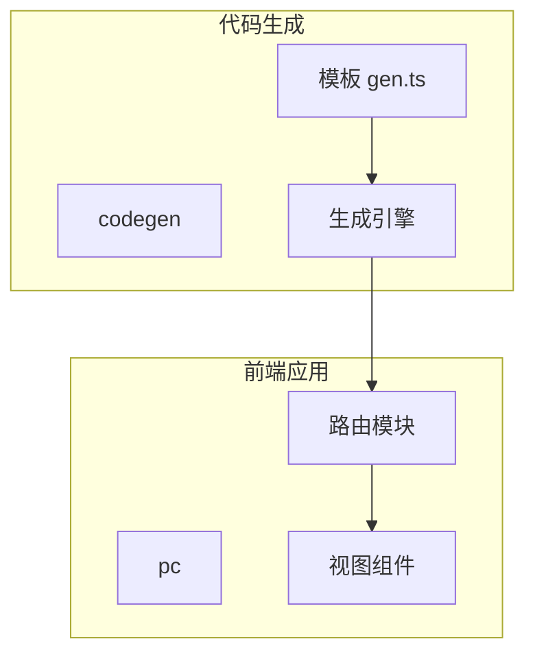
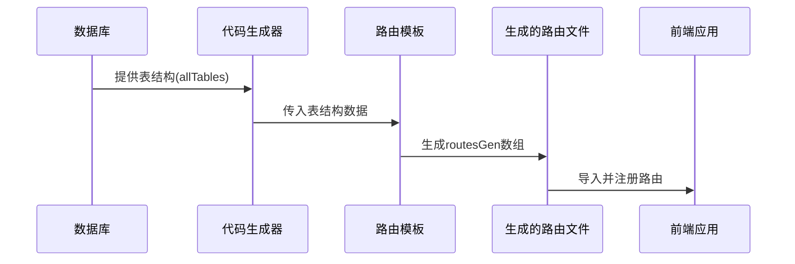
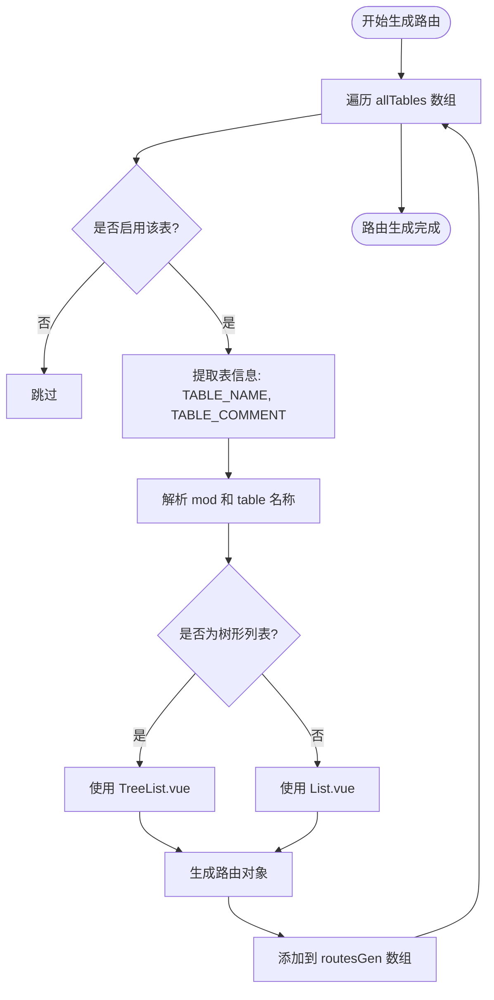
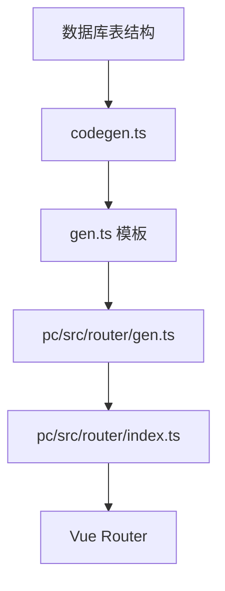

# 动态路由生成

**本文档引用文件**  
- [gen.ts](https://github.com/sail-sail/nest/blob/main/codegen/src/template/pc/src/router/gen.ts)
- [gen.ts](https://github.com/sail-sail/nest/blob/main/pc/src/router/gen.ts)
- [index.ts](https://github.com/sail-sail/nest/blob/main/pc/src/router/index.ts)
- [codegen.ts](https://github.com/sail-sail/nest/blob/main/codegen/src/lib/codegen.ts)
- [util.ts](https://github.com/sail-sail/nest/blob/main/pc/src/router/util.ts)

## 目录
1. [简介](#简介)
2. [项目结构](#项目结构)
3. [核心组件](#核心组件)
4. [架构概览](#架构概览)
5. [详细组件分析](#详细组件分析)
6. [依赖分析](#依赖分析)
7. [性能考量](#性能考量)
8. [故障排除指南](#故障排除指南)
9. [结论](#结论)

## 简介
本文档详细解析基于代码生成系统的动态路由生成机制。重点阐述 `gen.ts` 文件如何根据数据库表结构自动生成前端路由配置，确保前后端模块的同步性。文档涵盖变量替换机制、路由懒加载实现、元信息设计、自定义路由添加方法以及与代码生成引擎的集成策略。

## 项目结构
项目采用模块化设计，`codegen` 目录包含代码生成逻辑，`pc` 目录为前端应用，`rust` 目录为后端服务。路由生成的核心模板位于 `codegen/src/template/pc/src/router/gen.ts`，生成结果输出至 `pc/src/router/gen.ts`。

**Diagram sources**
- [gen.ts](https://github.com/sail-sail/nest/blob/main/codegen/src/template/pc/src/router/gen.ts)
- [gen.ts](https://github.com/sail-sail/nest/blob/main/pc/src/router/gen.ts)

**Section sources**
- [gen.ts](https://github.com/sail-sail/nest/blob/main/codegen/src/template/pc/src/router/gen.ts)
- [gen.ts](https://github.com/sail-sail/nest/blob/main/pc/src/router/gen.ts)

## 核心组件
`gen.ts` 模板文件通过遍历数据库表结构（`allTables`）动态生成 Vue Router 路由配置。每张表对应一个路由项，路径基于模块名和表名生成，组件采用动态导入实现懒加载，元信息包含菜单名称等权限相关字段。

**Section sources**
- [gen.ts](https://github.com/sail-sail/nest/blob/main/codegen/src/template/pc/src/router/gen.ts)
- [gen.ts](https://github.com/sail-sail/nest/blob/main/pc/src/router/gen.ts)

## 架构概览
系统通过代码生成引擎在构建时解析数据库 schema，结合模板引擎生成前端路由配置文件。生成的路由与后端模块保持同步，确保新增或修改表结构后，前端能自动获得对应的路由配置。

**Diagram sources**
- [gen.ts](https://github.com/sail-sail/nest/blob/main/codegen/src/template/pc/src/router/gen.ts)
- [index.ts](https://github.com/sail-sail/nest/blob/main/pc/src/router/index.ts)

## 详细组件分析

### 路由生成机制分析
路由生成机制基于模板文件和数据驱动的方式，通过预定义的逻辑将数据库表映射为前端路由。

#### 变量替换机制
模板使用 `<#=variable#>` 语法进行变量替换，`allTables` 数组中的每个表记录都会被处理，提取模块名、表名、注释等信息，用于构建路由路径、组件路径和元数据。

**Diagram sources**
- [gen.ts](https://github.com/sail-sail/nest/blob/main/codegen/src/template/pc/src/router/gen.ts)

#### 路由懒加载实现
通过 `component: () => import("@/views/<#=mod#>/<#=table_name#>/<#=fileNameVue#>")` 语法实现组件的动态导入，确保路由对应的视图组件仅在访问时才加载，优化应用启动性能。

**Section sources**
- [gen.ts](https://github.com/sail-sail/nest/blob/main/codegen/src/template/pc/src/router/gen.ts)

#### 路由元信息设计
路由的 `meta` 字段包含 `name` 属性，其值为数据库表的中文注释（`TABLE_COMMENT`），用于在菜单、标签页等 UI 元素中显示可读的名称，支持国际化和权限控制。

**Section sources**
- [gen.ts](https://github.com/sail-sail/nest/blob/main/codegen/src/template/pc/src/router/gen.ts)

### 手动添加自定义路由
开发者可在 `pc/src/router/index.ts` 中手动添加静态路由，如首页、登录页等。为避免与自动生成的路由冲突，应确保自定义路由的路径不与 `routesGen` 中的路径重复，或通过 `redirect` 等机制进行合理规划。

**Section sources**
- [index.ts](https://github.com/sail-sail/nest/blob/main/pc/src/router/index.ts)

## 依赖分析
路由生成机制依赖于代码生成引擎（`codegen.ts`）提供的表结构数据。`genRouter` 函数负责协调模板渲染和文件输出，确保 `pc/src/router/gen.ts` 文件的及时更新。

**Diagram sources**
- [codegen.ts](https://github.com/sail-sail/nest/blob/main/codegen/src/lib/codegen.ts)
- [gen.ts](https://github.com/sail-sail/nest/blob/main/pc/src/router/gen.ts)
- [index.ts](https://github.com/sail-sail/nest/blob/main/pc/src/router/index.ts)

**Section sources**
- [codegen.ts](https://github.com/sail-sail/nest/blob/main/codegen/src/lib/codegen.ts)

## 性能考量
动态导入（懒加载）显著减少了应用的初始加载体积。代码生成在构建时完成，避免了运行时的性能开销。增量更新策略确保只有变更的文件才会被重新生成和提交。

## 故障排除指南
若新表未生成对应路由，请检查：
1. 表是否在 `optTables` 配置中启用。
2. `codegen` 脚本是否已执行。
3. 生成的 `pc/src/router/gen.ts` 文件是否包含新路由。
4. 前端应用是否重新编译。

**Section sources**
- [util.ts](https://github.com/sail-sail/nest/blob/main/pc/src/router/util.ts)
- [menu.ts](https://github.com/sail-sail/nest/blob/main/pc/src/store/menu.ts)

## 结论
该动态路由生成机制通过代码生成技术实现了前后端的高度同步，提高了开发效率和系统一致性。通过模板化和自动化，减少了手动配置错误，是现代化全栈应用开发的优秀实践。