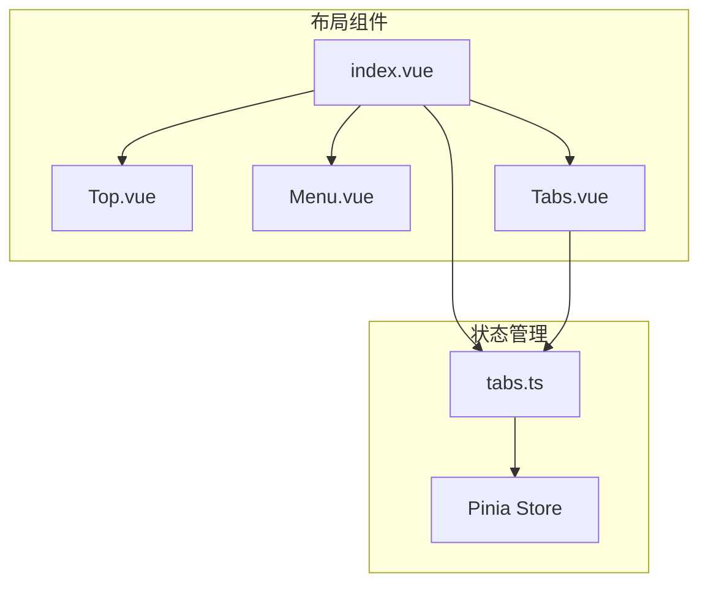
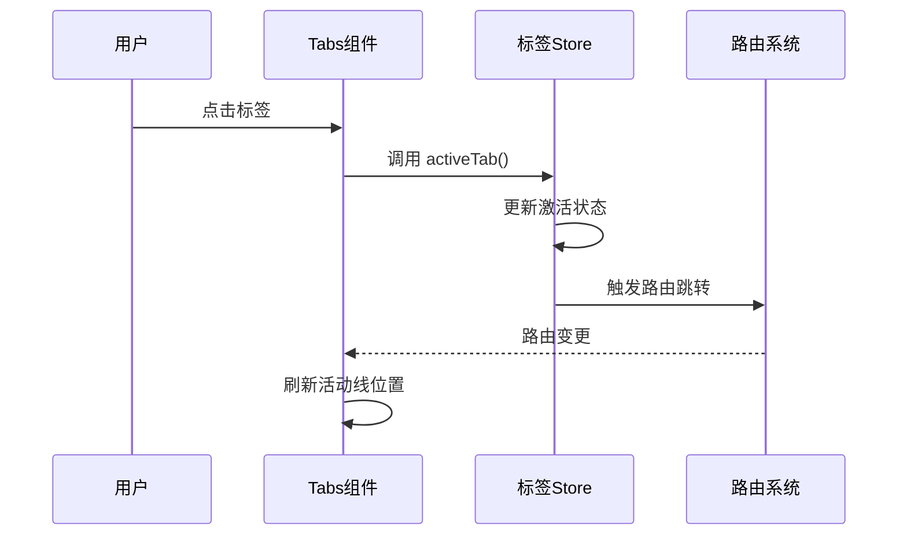
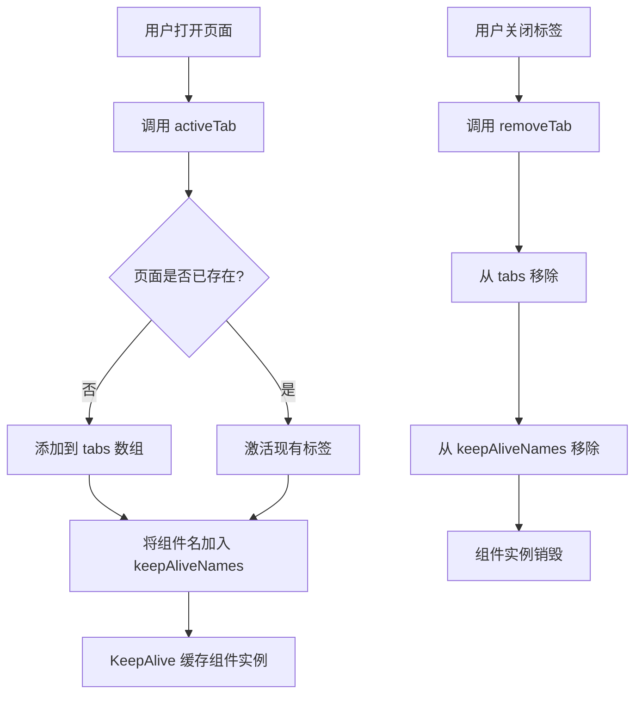

# 布局与标签页管理

**本文档引用文件**  
- [index.vue](https://github.com/sail-sail/nest/blob/main/pc/src/layout/layout1/index.vue)
- [Top.vue](https://github.com/sail-sail/nest/blob/main/pc/src/layout/layout1/Top.vue)
- [Menu.vue](https://github.com/sail-sail/nest/blob/main/pc/src/layout/layout1/Menu.vue)
- [Tabs.vue](https://github.com/sail-sail/nest/blob/main/pc/src/layout/layout1/Tabs.vue)
- [tabs.ts](https://github.com/sail-sail/nest/blob/main/pc/src/store/tabs.ts)

## 目录
1. [项目结构](#项目结构)  
2. [主界面布局解析](#主界面布局解析)  
3. [顶部导航组件分析](#顶部导航组件分析)  
4. [侧边菜单组件分析](#侧边菜单组件分析)  
5. [标签页管理功能详解](#标签页管理功能详解)  
6. [标签状态管理逻辑](#标签状态管理逻辑)  
7. [标签页缓存策略](#标签页缓存策略)  
8. [自定义布局配置](#自定义布局配置)  
9. [响应式设计表现](#响应式设计表现)  
10. [总结](#总结)

## 项目结构

系统布局核心组件位于 `pc/src/layout/layout1` 目录下，包含主界面容器、顶部导航、侧边菜单和标签页组件。状态管理模块位于 `store` 目录中，通过 Pinia 实现标签页状态的持久化与响应式控制。

**Diagram sources**  
- [index.vue](https://github.com/sail-sail/nest/blob/main/pc/src/layout/layout1/index.vue)
- [tabs.ts](https://github.com/sail-sail/nest/blob/main/pc/src/store/tabs.ts)

**Section sources**  
- [index.vue](https://github.com/sail-sail/nest/blob/main/pc/src/layout/layout1/index.vue)
- [Top.vue](https://github.com/sail-sail/nest/blob/main/pc/src/layout/layout1/Top.vue)
- [Menu.vue](https://github.com/sail-sail/nest/blob/main/pc/src/layout/layout1/Menu.vue)
- [Tabs.vue](https://github.com/sail-sail/nest/blob/main/pc/src/layout/layout1/Tabs.vue)
- [tabs.ts](https://github.com/sail-sail/nest/blob/main/pc/src/store/tabs.ts)

## 主界面布局解析

主界面由 `index.vue` 构建，采用 Flex 布局实现三栏式结构：左侧为可折叠的侧边菜单，中间为标签页导航区域，下方为内容展示区。整体布局通过 `un-w="full"` 和 `un-h="full"` 实现全屏适配。

布局结构如下：
- 外层容器：全屏 Flex 容器
- 左侧区域：包含 Top 和 Menu 组件，宽度根据 `menuStore.isCollapse` 动态调整（60px 或 250px）
- 右侧区域：包含 Tabs、滚动控制按钮、用户操作菜单和路由视图

标签页下方通过 `KeepAlive` 组件实现页面状态缓存，确保切换时不丢失数据。

**Section sources**  
- [index.vue](https://github.com/sail-sail/nest/blob/main/pc/src/layout/layout1/index.vue#L1-L668)

## 顶部导航组件分析

`Top.vue` 组件负责显示应用标题，标题内容从租户信息中获取并存储于本地缓存。组件通过 `useTitle` 响应式绑定页面标题，并在初始化时调用 `findByIdTenant` 接口获取当前租户的 `title` 字段。

当侧边栏处于展开状态时，标题才会显示，增强界面简洁性。该设计支持多租户场景下的动态标题切换。

**Section sources**  
- [Top.vue](https://github.com/sail-sail/nest/blob/main/pc/src/layout/layout1/Top.vue#L1-L47)

## 侧边菜单组件分析

`Menu.vue` 组件实现可搜索、可折叠的侧边菜单功能：
- 支持通过输入框进行菜单项模糊搜索
- 提供折叠/展开切换按钮，状态由 `menuStore.isCollapse` 控制
- 使用 `el-menu` 和 `AppSubMenu` 递归渲染菜单树
- 菜单项点击后触发路由跳转，并自动激活对应标签页

菜单数据通过 `getMenus` API 获取，权限控制由 `usrStore` 管理。选中状态通过 `defaultActive` 与当前路由路径同步，确保高亮准确。

**Section sources**  
- [Menu.vue](https://github.com/sail-sail/nest/blob/main/pc/src/layout/layout1/Menu.vue#L1-L295)

## 标签页管理功能详解

`Tabs.vue` 组件实现标签页的可视化管理，支持以下核心功能：

### 标签操作
- **点击切换**：点击标签激活对应页面
- **双击关闭**：双击标签关闭当前页
- **右键菜单**：提供“关闭”、“关闭其他”、“全部关闭”选项
- **拖拽排序**：集成 SortableJS 实现标签拖拽重排

### 滚动控制
当标签数量超出可视范围时，显示左右滚动按钮：
- `scrollLeftVisible` 和 `scrollRightVisible` 控制按钮显隐
- 每次滚动 228px，通过 `scrollLeftClk` 和 `scrollRightClk` 实现
- 滚动后自动调用 `refreshScrollVisible` 更新状态

### 活动线动画
底部蓝色活动线通过 `tab_active_lineRef` 元素实现：
- 位置和宽度随当前激活标签动态调整
- 使用 `resetTab_active_line` 计算偏移量
- 添加 CSS 过渡效果，提升用户体验

**Diagram sources**  
- [Tabs.vue](https://github.com/sail-sail/nest/blob/main/pc/src/layout/layout1/Tabs.vue#L1-L287)
- [index.vue](https://github.com/sail-sail/nest/blob/main/pc/src/layout/layout1/index.vue#L420-L500)

**Section sources**  
- [Tabs.vue](https://github.com/sail-sail/nest/blob/main/pc/src/layout/layout1/Tabs.vue#L1-L287)

## 标签状态管理逻辑

`tabs.ts` 是标签页状态的核心管理模块，基于 Pinia 构建，主要功能包括：

### 核心状态
- `tabs`: 标签数组，使用 `useStorage` 持久化存储
- `actTab`: 计算属性，返回当前激活标签
- `keepAliveNames`: 缓存组件名称列表

### 核心方法
- `activeTab(tab)`: 激活指定标签，若不存在则添加
- `removeTab(tab)`: 移除标签，自动激活相邻标签
- `closeOtherTabs(tab)`: 关闭其他标签，保留固定标签
- `moveTab(oldIndex, newIndex)`: 拖拽排序逻辑
- `hasTab(tab)`: 判断标签是否存在（路径+查询参数匹配）

### 路由同步机制
通过监听 `route.path` 和 `route.query`，自动将当前路由映射为标签页。若访问无对应菜单的路由，仍可创建临时标签。

**Section sources**  
- [tabs.ts](https://github.com/sail-sail/nest/blob/main/pc/src/store/tabs.ts#L1-L395)

## 标签页缓存策略

系统采用 Vue 的 `KeepAlive` 组件实现页面状态缓存：
- `include` 属性绑定 `tabsStore.keepAliveNames`
- 每当激活新标签时，其名称自动加入 `keepAliveNames`
- 关闭标签时，从 `keepAliveNames` 中移除对应名称
- 确保只有当前打开的页面被缓存，避免内存浪费

此策略保证了用户在多个页面间切换时，表单数据、滚动位置等状态得以保留，提升操作连续性。

**Diagram sources**  
- [index.vue](https://github.com/sail-sail/nest/blob/main/pc/src/layout/layout1/index.vue#L240-L246)
- [tabs.ts](https://github.com/sail-sail/nest/blob/main/pc/src/store/tabs.ts#L100-L130)

**Section sources**  
- [index.vue](https://github.com/sail-sail/nest/blob/main/pc/src/layout/layout1/index.vue#L240-L246)
- [tabs.ts](https://github.com/sail-sail/nest/blob/main/pc/src/store/tabs.ts#L1-L395)

## 自定义布局配置

系统支持通过配置文件调整布局样式：
- **侧边栏宽度**：通过 `menuStore.isCollapse` 控制折叠状态，展开时宽度为 250px
- **主题色**：通过 `un-bg="[var(--el-color-primary)]"` 使用 Element Plus 主题变量
- **图标字体**：使用 `un-i="iconfont-*"` 引入自定义图标

如需修改默认宽度，可在 `Menu.vue` 中调整 `:style` 绑定值；主题色可通过覆盖 CSS 变量自定义。

**Section sources**  
- [index.vue](https://github.com/sail-sail/nest/blob/main/pc/src/layout/layout1/index.vue#L15-L20)
- [Menu.vue](https://github.com/sail-sail/nest/blob/main/pc/src/layout/layout1/Menu.vue#L10-L15)

## 响应式设计表现

系统在不同屏幕尺寸下表现良好：
- 小屏幕下自动隐藏侧边栏标题，仅显示图标
- 标签页区域支持横向滚动，避免换行
- 用户操作菜单垂直居中对齐，适配不同高度
- 使用 UnoCSS 原子化样式，确保快速响应

通过 `useResizeObserver` 监听容器尺寸变化，动态更新滚动按钮状态，保障用户体验一致性。

**Section sources**  
- [index.vue](https://github.com/sail-sail/nest/blob/main/pc/src/layout/layout1/index.vue#L50-L60)
- [Tabs.vue](https://github.com/sail-sail/nest/blob/main/pc/src/layout/layout1/Tabs.vue#L150-L154)

## 总结

本系统实现了功能完整的布局与标签页管理体系：
- 采用模块化组件设计，职责清晰
- 标签页支持增删改查、拖拽排序、右键操作
- 状态通过 Pinia + localStorage 持久化
- 页面状态由 KeepAlive 高效缓存
- 支持响应式布局与主题定制

整体架构合理，扩展性强，适用于中后台管理系统。

**Section sources**  
- [index.vue](https://github.com/sail-sail/nest/blob/main/pc/src/layout/layout1/index.vue)
- [Top.vue](https://github.com/sail-sail/nest/blob/main/pc/src/layout/layout1/Top.vue)
- [Menu.vue](https://github.com/sail-sail/nest/blob/main/pc/src/layout/layout1/Menu.vue)
- [Tabs.vue](https://github.com/sail-sail/nest/blob/main/pc/src/layout/layout1/Tabs.vue)
- [tabs.ts](https://github.com/sail-sail/nest/blob/main/pc/src/store/tabs.ts)