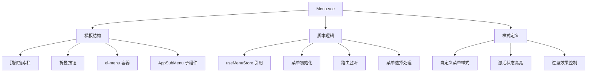
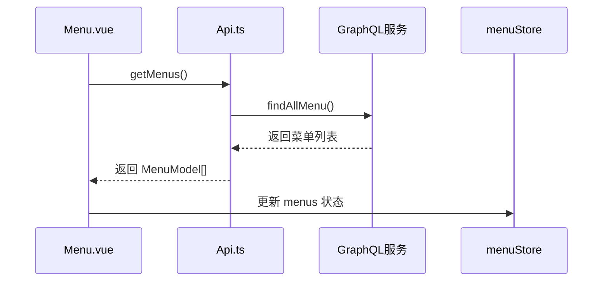
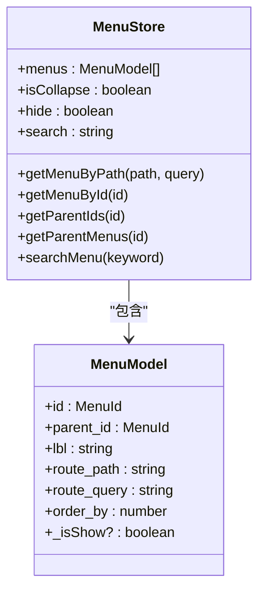
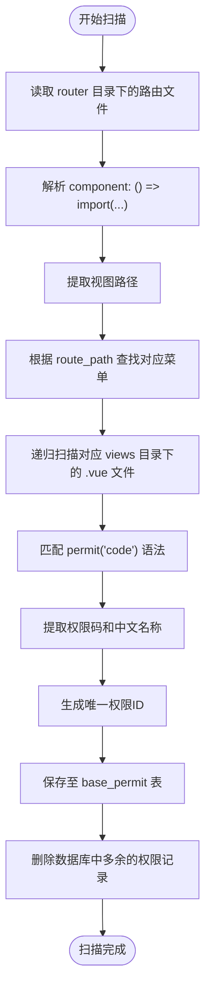
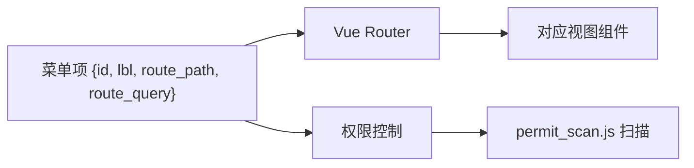
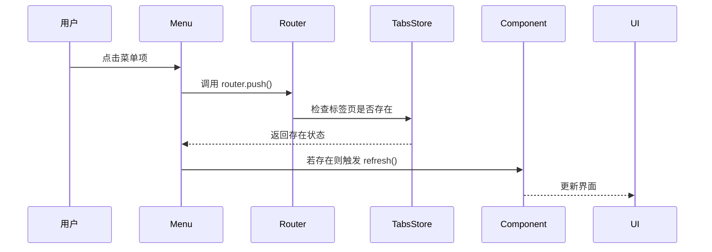

# 菜单渲染机制


**本文档中引用的文件**  
- [Menu.vue](https://github.com/sail-sail/nest/blob/main/pc/src/layout/layout1/Menu.vue)
- [permit_scan.js](https://github.com/sail-sail/nest/blob/main/pc/src/utils/permit_scan.js)
- [menu.ts](https://github.com/sail-sail/nest/blob/main/pc/src/store/menu.ts)
- [Api.ts](https://github.com/sail-sail/nest/blob/main/codegen/__out__/pc/src/views/base/menu/Api.ts)


## 目录
1. [简介](#简介)
2. [核心组件分析](#核心组件分析)
3. [菜单数据获取机制](#菜单数据获取机制)
4. [状态管理逻辑](#状态管理逻辑)
5. [权限扫描与菜单生成](#权限扫描与菜单生成)
6. [菜单层级与交互处理](#菜单层级与交互处理)
7. [路由映射与嵌套路由处理](#路由映射与嵌套路由处理)
8. [自定义样式与主题配置](#自定义样式与主题配置)
9. [性能优化策略](#性能优化策略)

## 简介
本系统通过动态菜单渲染机制实现基于用户权限的导航菜单生成。系统结合前端组件、状态管理、权限扫描和后端接口，构建了一套完整的菜单控制体系。菜单根据用户角色权限动态展示，支持多级嵌套、搜索过滤、展开/折叠等交互功能，并可通过配置实现样式定制与性能优化。

## 核心组件分析

### Menu.vue 组件结构
`Menu.vue` 是菜单渲染的核心组件，位于布局模块中，负责展示和交互控制。



**Diagram sources**  
- [Menu.vue](https://github.com/sail-sail/nest/blob/main/pc/src/layout/layout1/Menu.vue#L1-L295)

**Section sources**  
- [Menu.vue](https://github.com/sail-sail/nest/blob/main/pc/src/layout/layout1/Menu.vue#L1-L295)

## 菜单数据获取机制

### 接口设计与调用流程
`Api.ts` 文件定义了与菜单相关的 GraphQL 接口，用于从后端获取菜单数据。



#### 主要接口方法
- `findAllMenu`: 根据条件查询菜单列表
- `findTreeMenu`: 获取树形结构的菜单数据
- `getListMenu`: 获取排序后的菜单列表（无加载提示）
- `getTreeMenu`: 获取树形菜单数据（无加载提示）

**Diagram sources**  
- [Api.ts](https://github.com/sail-sail/nest/blob/main/codegen/__out__/pc/src/views/base/menu/Api.ts#L1-L799)

**Section sources**  
- [Api.ts](https://github.com/sail-sail/nest/blob/main/codegen/__out__/pc/src/views/base/menu/Api.ts#L1-L799)

## 状态管理逻辑

### menu.ts 状态模块
`menu.ts` 使用 Pinia 实现菜单状态管理，包含菜单数据、折叠状态、搜索关键字等。



#### 核心功能说明
- **响应式存储**：使用 `useStorage` 持久化菜单状态
- **路径映射**：通过 `pathMenuMap` 计算属性快速查找菜单
- **树遍历**：`treeMenu` 方法递归遍历菜单树
- **搜索过滤**：输入搜索关键词时延迟执行过滤操作
- **父子关系**：支持向上查找父菜单 ID 列表

**Diagram sources**  
- [menu.ts](https://github.com/sail-sail/nest/blob/main/pc/src/store/menu.ts#L1-L229)

**Section sources**  
- [menu.ts](https://github.com/sail-sail/nest/blob/main/pc/src/store/menu.ts#L1-L229)

## 权限扫描与菜单生成

### permit_scan.js 扫描机制
该脚本在构建时运行，自动扫描前端代码中的权限标识并同步到数据库。



#### 权限提取规则
- 使用正则 `/permit\('(.*)?'\)/g` 匹配权限声明
- 若权限码包含逗号格式 `'code,name'`，则分别提取
- 若未显式指定名称，则从后续中文注释中提取
- 使用 SparkMD5 生成基于菜单ID和权限码的唯一ID

**Diagram sources**  
- [permit_scan.js](https://github.com/sail-sail/nest/blob/main/pc/src/utils/permit_scan.js#L1-L374)

**Section sources**  
- [permit_scan.js](https://github.com/sail-sail/nest/blob/main/pc/src/utils/permit_scan.js#L1-L374)

## 菜单层级与交互处理

### 层级结构处理
系统支持无限层级的菜单嵌套，通过递归方式处理父子关系。

```mermaid
tree
root
--> 菜单1
--> 菜单2
--> 子菜单2-1
--> 子菜单2-2
--> 子子菜单2-2-1
--> 菜单3
```

#### 展开/折叠状态管理
- 使用 `openedIndex` 数组记录当前展开的菜单项
- `menuOpen` 和 `menuClose` 事件更新展开状态
- 搜索时自动展开匹配项的父级菜单

#### 图标显示逻辑
- 图标由 `el-icon` 组件渲染
- 折叠状态切换使用 `ElIconExpand` 和 `ElIconFold`
- 搜索功能使用 `ElIconSearch` 和 `ElIconClose`

**Section sources**  
- [Menu.vue](https://github.com/sail-sail/nest/blob/main/pc/src/layout/layout1/Menu.vue#L1-L295)
- [menu.ts](https://github.com/sail-sail/nest/blob/main/pc/src/store/menu.ts#L1-L229)

## 路由映射与嵌套路由处理

### 菜单项与路由映射
每个菜单项通过 `route_path` 字段与 Vue Router 路径关联。



#### 多级嵌套路由处理
- 使用 `getParentIds` 方法获取所有父级菜单ID
- `getMenuByPath` 支持带查询参数的精确匹配
- 特殊路由 `/myiframe` 通过 `oldRoute_path` 和 `name` 双重匹配

#### 路由选择处理流程


**Section sources**  
- [Menu.vue](https://github.com/sail-sail/nest/blob/main/pc/src/layout/layout1/Menu.vue#L1-L295)
- [menu.ts](https://github.com/sail-sail/nest/blob/main/pc/src/store/menu.ts#L1-L229)

## 自定义样式与主题配置

### 样式定制能力
系统提供灵活的样式覆盖机制，支持深度定制。

```scss
.AppMenu {
  --el-menu-item-height: 40px;
  border: 0;
  :deep(.el-menu-item.is-active) {
    background-color: var(--el-menu-hover-bg-color);
  }
  :deep(.el-menu-item.is-active:after) {
    content: "";
    width: 6px;
    height: 100%;
    position: absolute;
    top: 0;
    left: 0;
    background-color: var(--el-color-primary);
  }
}
```

#### 主题颜色配置
- 使用 CSS 变量 `--el-color-primary` 控制主题色
- 激活状态使用 `var(--el-menu-hover-bg-color)` 背景色
- 边框和文字颜色支持暗色模式适配

#### 布局调整
- 使用 UnoCSS 实现原子化样式
- 支持水平/垂直布局切换
- 折叠宽度自适应调整

**Section sources**  
- [Menu.vue](https://github.com/sail-sail/nest/blob/main/pc/src/layout/layout1/Menu.vue#L1-L295)

## 性能优化策略

### 初始化性能优化
- 使用 `inited` 标志控制渲染时机
- `AppMenuNotInited` 类禁用过渡动画
- 路由监听使用 `immediate: true` 避免重复执行

### 数据处理优化
- 菜单数据在 `menuStore` 中全局缓存
- `pathMenuMap` 计算属性提升查找效率
- 搜索功能添加 300ms 防抖处理

### 构建时优化
- `permit_scan.js` 在构建阶段预处理权限数据
- 使用文件系统 API 批量读取避免重复IO
- 权限ID使用哈希算法确保唯一性

### 潜在优化建议
- 对深层嵌套菜单实现虚拟滚动
- 大量菜单项时采用分页加载
- 搜索功能可引入 Web Worker 避免阻塞主线程

**Section sources**  
- [Menu.vue](https://github.com/sail-sail/nest/blob/main/pc/src/layout/layout1/Menu.vue#L1-L295)
- [menu.ts](https://github.com/sail-sail/nest/blob/main/pc/src/store/menu.ts#L1-L229)
- [permit_scan.js](https://github.com/sail-sail/nest/blob/main/pc/src/utils/permit_scan.js#L1-L374)