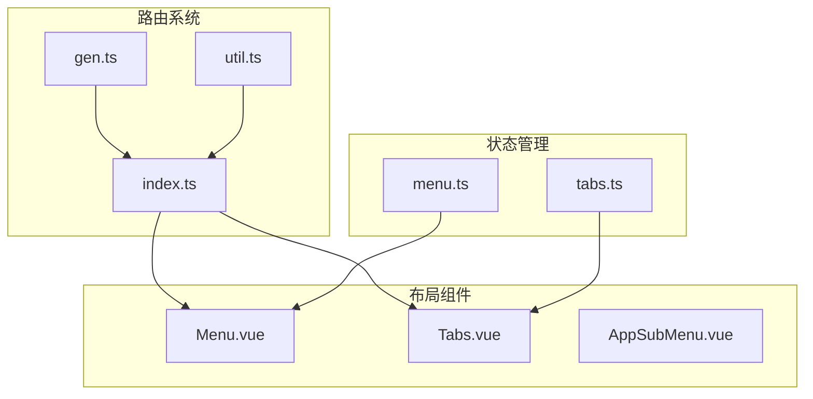
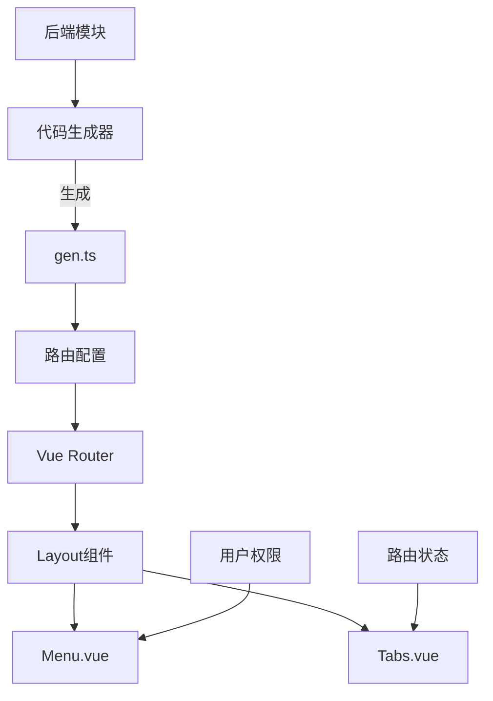
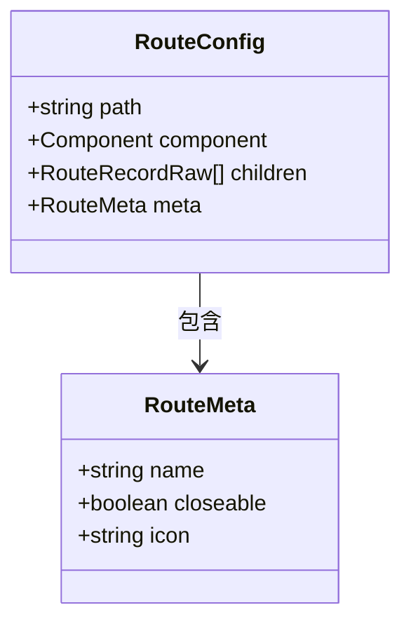
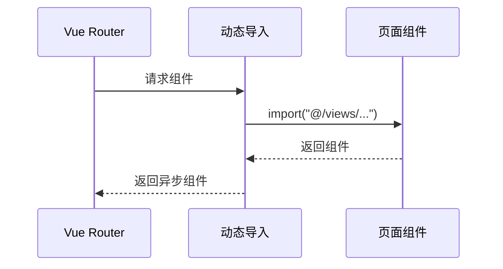
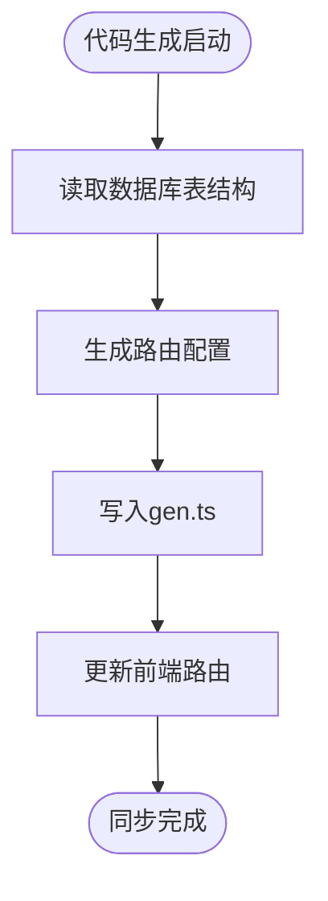
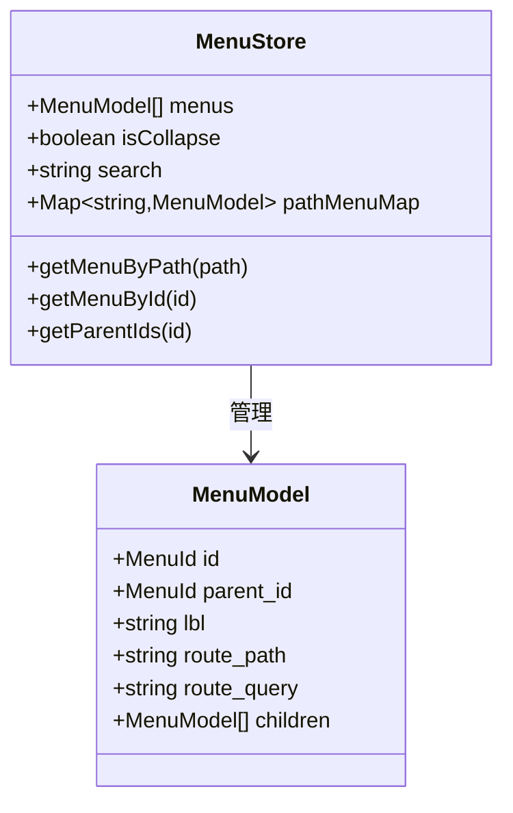
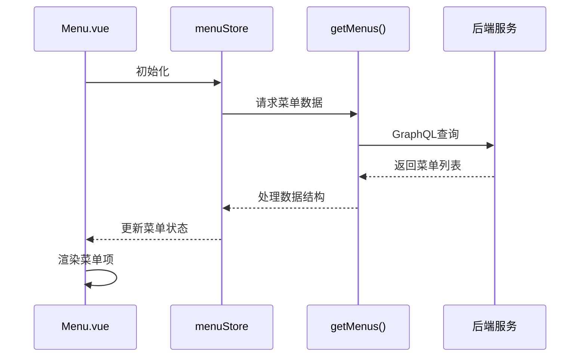
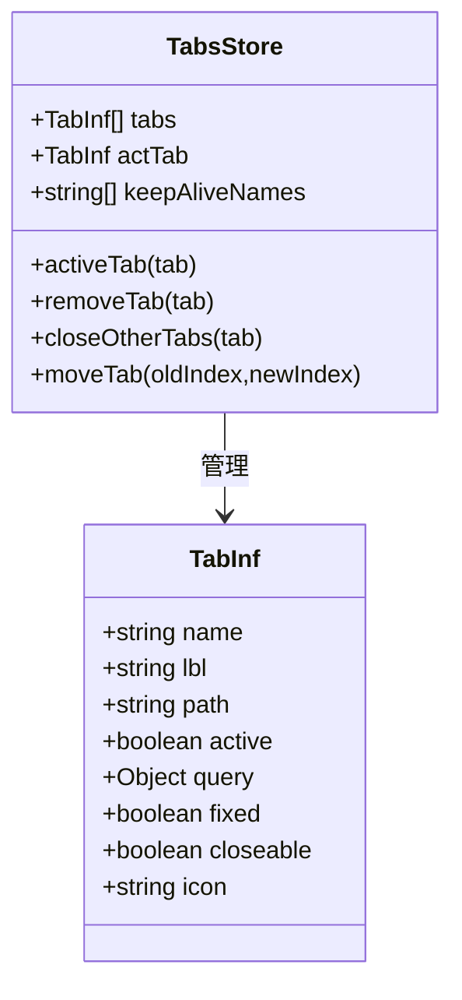
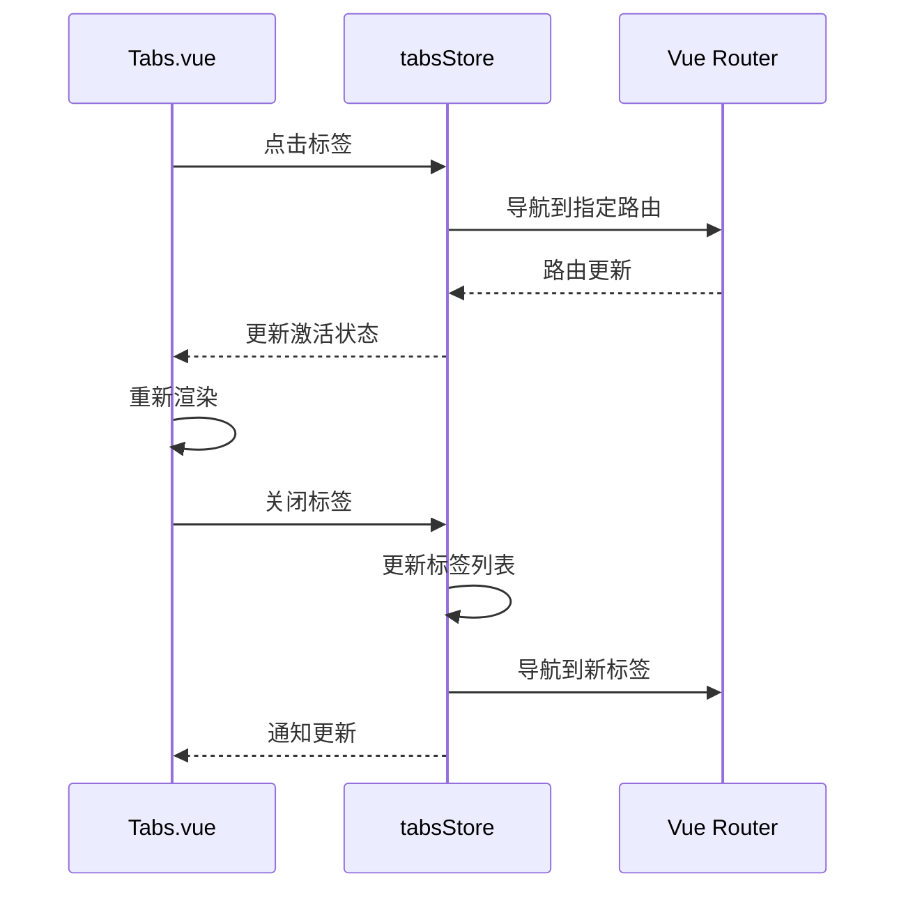
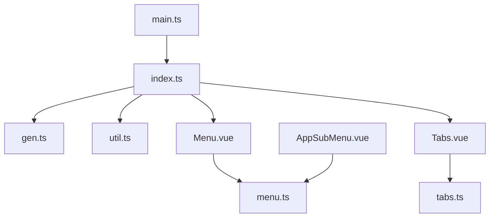

# 路由与菜单系统

**本文档引用的文件**  
- [index.ts](https://github.com/sail-sail/nest/blob/main/pc/src/router/index.ts)
- [gen.ts](https://github.com/sail-sail/nest/blob/main/pc/src/router/gen.ts)
- [Menu.vue](https://github.com/sail-sail/nest/blob/main/pc/src/layout/layout1/Menu.vue)
- [Tabs.vue](https://github.com/sail-sail/nest/blob/main/pc/src/layout/layout1/Tabs.vue)
- [menu.ts](https://github.com/sail-sail/nest/blob/main/pc/src/store/menu.ts)
- [tabs.ts](https://github.com/sail-sail/nest/blob/main/pc/src/store/tabs.ts)
- [Api.ts](https://github.com/sail-sail/nest/blob/main/pc/src/layout/layout1/Api.ts)
- [AppSubMenu.vue](https://github.com/sail-sail/nest/blob/main/pc/src/components/AppSubMenu.vue)
- [util.ts](https://github.com/sail-sail/nest/blob/main/pc/src/router/util.ts)
- [codegen.ts](https://github.com/sail-sail/nest/blob/main/codegen/src/lib/codegen.ts)

## 目录
1. [简介](#简介)
2. [项目结构](#项目结构)
3. [核心组件](#核心组件)
4. [架构概述](#架构概述)
5. [详细组件分析](#详细组件分析)
6. [依赖分析](#依赖分析)
7. [性能考虑](#性能考虑)
8. [故障排除指南](#故障排除指南)
9. [结论](#结论)

## 简介
本系统基于Vue Router实现动态路由与菜单管理，通过代码生成机制自动同步后端模块。系统包含动态路由配置、权限控制、多标签页管理等核心功能，支持基于用户权限的菜单渲染和灵活的路由扩展机制。

## 项目结构
系统主要由路由配置、布局组件、状态管理三大部分构成，通过代码生成工具实现前后端模块的自动同步。

**图示来源**  
- [index.ts](https://github.com/sail-sail/nest/blob/main/pc/src/router/index.ts)
- [gen.ts](https://github.com/sail-sail/nest/blob/main/pc/src/router/gen.ts)
- [Menu.vue](https://github.com/sail-sail/nest/blob/main/pc/src/layout/layout1/Menu.vue)
- [Tabs.vue](https://github.com/sail-sail/nest/blob/main/pc/src/layout/layout1/Tabs.vue)
- [menu.ts](https://github.com/sail-sail/nest/blob/main/pc/src/store/menu.ts)
- [tabs.ts](https://github.com/sail-sail/nest/blob/main/pc/src/store/tabs.ts)

**本节来源**  
- [index.ts](https://github.com/sail-sail/nest/blob/main/pc/src/router/index.ts)
- [gen.ts](https://github.com/sail-sail/nest/blob/main/pc/src/router/gen.ts)
- [Menu.vue](https://github.com/sail-sail/nest/blob/main/pc/src/layout/layout1/Menu.vue)
- [Tabs.vue](https://github.com/sail-sail/nest/blob/main/pc/src/layout/layout1/Tabs.vue)

## 核心组件
系统核心组件包括动态路由生成器、菜单渲染引擎、标签页管理器和权限控制系统，共同实现完整的导航功能。

**本节来源**  
- [gen.ts](https://github.com/sail-sail/nest/blob/main/pc/src/router/gen.ts)
- [Menu.vue](https://github.com/sail-sail/nest/blob/main/pc/src/layout/layout1/Menu.vue)
- [Tabs.vue](https://github.com/sail-sail/nest/blob/main/pc/src/layout/layout1/Tabs.vue)
- [menu.ts](https://github.com/sail-sail/nest/blob/main/pc/src/store/menu.ts)

## 架构概述
系统采用分层架构设计，前端路由与后端模块通过代码生成机制保持同步，状态管理驱动UI组件更新。

**图示来源**  
- [gen.ts](https://github.com/sail-sail/nest/blob/main/pc/src/router/gen.ts)
- [index.ts](https://github.com/sail-sail/nest/blob/main/pc/src/router/index.ts)
- [Menu.vue](https://github.com/sail-sail/nest/blob/main/pc/src/layout/layout1/Menu.vue)
- [Tabs.vue](https://github.com/sail-sail/nest/blob/main/pc/src/layout/layout1/Tabs.vue)
- [codegen.ts](https://github.com/sail-sail/nest/blob/main/codegen/src/lib/codegen.ts)

## 详细组件分析

### 动态路由生成机制
系统通过代码生成工具自动创建路由配置，实现前后端模块的同步更新。

#### 路由配置结构

**图示来源**  
- [index.ts](https://github.com/sail-sail/nest/blob/main/pc/src/router/index.ts)
- [gen.ts](https://github.com/sail-sail/nest/blob/main/pc/src/router/gen.ts)

#### 懒加载实现

**图示来源**  
- [index.ts](https://github.com/sail-sail/nest/blob/main/pc/src/router/index.ts)
- [gen.ts](https://github.com/sail-sail/nest/blob/main/pc/src/router/gen.ts)

#### 自动生成同步

**图示来源**  
- [gen.ts](https://github.com/sail-sail/nest/blob/main/pc/src/router/gen.ts)
- [codegen.ts](https://github.com/sail-sail/nest/blob/main/codegen/src/lib/codegen.ts)

**本节来源**  
- [gen.ts](https://github.com/sail-sail/nest/blob/main/pc/src/router/gen.ts)
- [codegen.ts](https://github.com/sail-sail/nest/blob/main/codegen/src/lib/codegen.ts)
- [index.ts](https://github.com/sail-sail/nest/blob/main/pc/src/router/index.ts)

### 菜单组件分析
Menu.vue组件负责根据用户权限动态渲染导航菜单，支持折叠、搜索等功能。

#### 菜单渲染逻辑

**图示来源**  
- [menu.ts](https://github.com/sail-sail/nest/blob/main/pc/src/store/menu.ts)
- [Menu.vue](https://github.com/sail-sail/nest/blob/main/pc/src/layout/layout1/Menu.vue)

#### 权限控制流程

**图示来源**  
- [Menu.vue](https://github.com/sail-sail/nest/blob/main/pc/src/layout/layout1/Menu.vue)
- [menu.ts](https://github.com/sail-sail/nest/blob/main/pc/src/store/menu.ts)
- [Api.ts](https://github.com/sail-sail/nest/blob/main/pc/src/layout/layout1/Api.ts)

**本节来源**  
- [Menu.vue](https://github.com/sail-sail/nest/blob/main/pc/src/layout/layout1/Menu.vue)
- [menu.ts](https://github.com/sail-sail/nest/blob/main/pc/src/store/menu.ts)
- [Api.ts](https://github.com/sail-sail/nest/blob/main/pc/src/layout/layout1/Api.ts)

### 标签页管理分析
Tabs.vue组件实现多标签页的管理功能，支持拖拽排序、右键菜单等交互。

#### 标签页状态管理

**图示来源**  
- [tabs.ts](https://github.com/sail-sail/nest/blob/main/pc/src/store/tabs.ts)
- [Tabs.vue](https://github.com/sail-sail/nest/blob/main/pc/src/layout/layout1/Tabs.vue)

#### 标签页交互流程

**图示来源**  
- [Tabs.vue](https://github.com/sail-sail/nest/blob/main/pc/src/layout/layout1/Tabs.vue)
- [tabs.ts](https://github.com/sail-sail/nest/blob/main/pc/src/store/tabs.ts)

**本节来源**  
- [Tabs.vue](https://github.com/sail-sail/nest/blob/main/pc/src/layout/layout1/Tabs.vue)
- [tabs.ts](https://github.com/sail-sail/nest/blob/main/pc/src/store/tabs.ts)

## 依赖分析
系统各组件之间存在明确的依赖关系，通过状态管理实现数据共享和组件通信。

**图示来源**  
- [index.ts](https://github.com/sail-sail/nest/blob/main/pc/src/router/index.ts)
- [gen.ts](https://github.com/sail-sail/nest/blob/main/pc/src/router/gen.ts)
- [Menu.vue](https://github.com/sail-sail/nest/blob/main/pc/src/layout/layout1/Menu.vue)
- [Tabs.vue](https://github.com/sail-sail/nest/blob/main/pc/src/layout/layout1/Tabs.vue)
- [menu.ts](https://github.com/sail-sail/nest/blob/main/pc/src/store/menu.ts)
- [tabs.ts](https://github.com/sail-sail/nest/blob/main/pc/src/store/tabs.ts)

**本节来源**  
- [index.ts](https://github.com/sail-sail/nest/blob/main/pc/src/router/index.ts)
- [gen.ts](https://github.com/sail-sail/nest/blob/main/pc/src/router/gen.ts)
- [Menu.vue](https://github.com/sail-sail/nest/blob/main/pc/src/layout/layout1/Menu.vue)
- [Tabs.vue](https://github.com/sail-sail/nest/blob/main/pc/src/layout/layout1/Tabs.vue)
- [menu.ts](https://github.com/sail-sail/nest/blob/main/pc/src/store/menu.ts)
- [tabs.ts](https://github.com/sail-sail/nest/blob/main/pc/src/store/tabs.ts)

## 性能考虑
系统在路由加载、菜单渲染等方面进行了优化，确保大规模菜单下的流畅体验。

- 路由懒加载减少初始加载时间
- 菜单搜索使用防抖优化性能
- 标签页支持拖拽排序的平滑动画
- 状态持久化避免页面刷新丢失状态

## 故障排除指南
常见问题及解决方案：

- **菜单不显示**：检查用户权限和后端菜单数据
- **路由无法访问**：确认路由配置是否正确生成
- **标签页异常**：检查tabsStore状态是否正常
- **搜索功能失效**：验证search状态更新逻辑

**本节来源**  
- [menu.ts](https://github.com/sail-sail/nest/blob/main/pc/src/store/menu.ts)
- [tabs.ts](https://github.com/sail-sail/nest/blob/main/pc/src/store/tabs.ts)
- [Menu.vue](https://github.com/sail-sail/nest/blob/main/pc/src/layout/layout1/Menu.vue)
- [Tabs.vue](https://github.com/sail-sail/nest/blob/main/pc/src/layout/layout1/Tabs.vue)

## 结论
本路由与菜单系统通过代码生成、状态管理、组件化设计实现了高效、灵活的导航功能，为开发者提供了清晰的扩展接口和良好的用户体验。