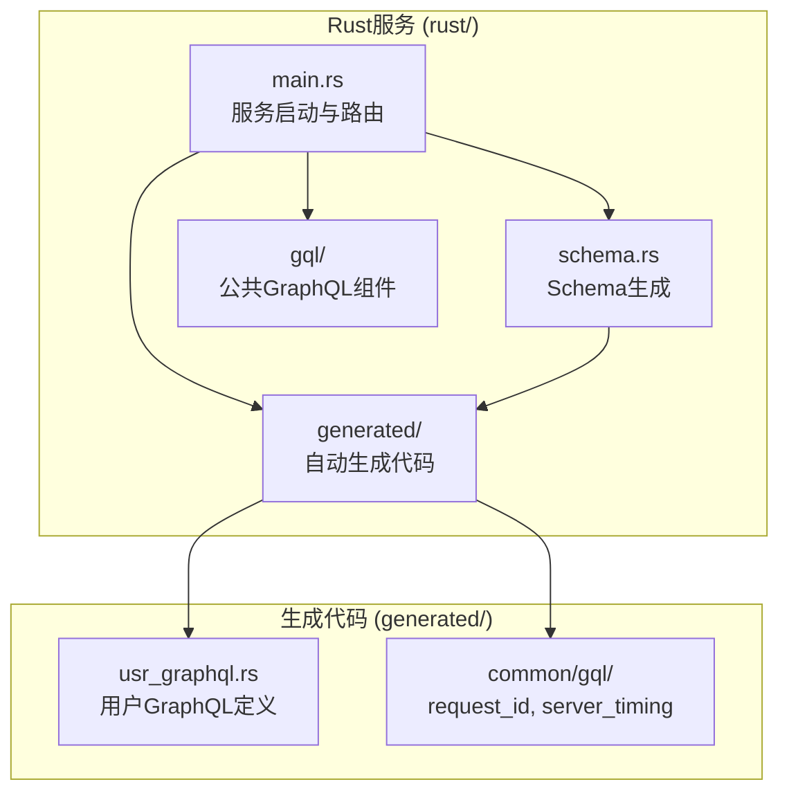
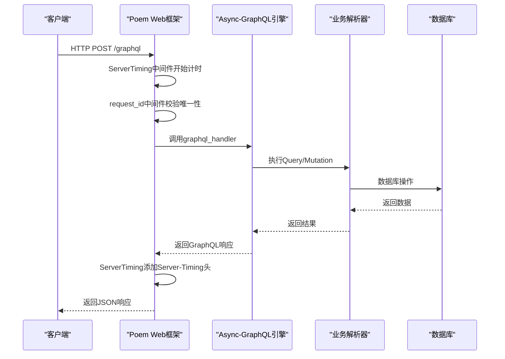
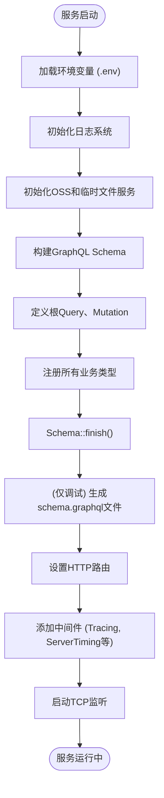
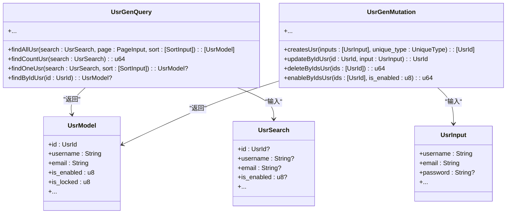

# GraphQL模式构建


**本文档中引用的文件**  
- [main.rs](https://github.com/sail-sail/nest/blob/main/main.rs)
- [schema.rs](https://github.com/sail-sail/nest/blob/main/schema.rs)
- [usr_graphql.rs](https://github.com/sail-sail/nest/blob/main/generated/base/usr/usr_graphql.rs)
- [request_id.rs](https://github.com/sail-sail/nest/blob/main/generated/common/gql/request_id.rs)
- [server_timing.rs](https://github.com/sail-sail/nest/blob/main/generated/common/gql/server_timing.rs)


## 目录
1. [简介](#简介)
2. [项目结构](#项目结构)
3. [核心组件](#核心组件)
4. [架构概述](#架构概述)
5. [详细组件分析](#详细组件分析)
6. [依赖分析](#依赖分析)
7. [性能考虑](#性能考虑)
8. [故障排除指南](#故障排除指南)
9. [结论](#结论)

## 简介
本文档详细说明了基于Rust的GraphQL服务中Schema的设计与构建过程。从`main.rs`中的服务启动流程开始，逐步解析GraphQL服务器的初始化、Schema加载机制，以及如何通过`schema.rs`构建全局Schema。文档深入分析了由代码生成工具生成的`usr_graphql.rs`文件如何定义类型系统，并探讨了`gql`目录下的公共组件（如`request_id`、`server_timing`）如何增强API的功能性与可观测性。最终，文档阐述了Schema设计如何满足前端需求并保障类型安全。

## 项目结构
项目采用模块化设计，核心Rust服务位于`rust/`目录下。GraphQL相关的Schema定义和处理逻辑主要分布在`main.rs`（服务入口）、`schema.rs`（Schema构建脚本）以及`generated/`目录下的自动生成代码中。`generated/common/gql/`包含通用的GraphQL中间件和模型，而`generated/base/usr/`等子目录则包含针对具体业务实体（如用户）的查询、变更和类型定义。



**Diagram sources**
- [main.rs](https://github.com/sail-sail/nest/blob/main/main.rs#L1-L50)
- [schema.rs](https://github.com/sail-sail/nest/blob/main/schema.rs#L1-L10)

**Section sources**
- [main.rs](https://github.com/sail-sail/nest/blob/main/main.rs#L1-L50)
- [schema.rs](https://github.com/sail-sail/nest/blob/main/schema.rs#L1-L10)

## 核心组件
本系统的核心组件包括GraphQL Schema的构建与初始化、基于`async-graphql`和`poem`框架的HTTP服务、以及由代码生成器驱动的业务实体Schema定义。`main.rs`负责服务的启动和配置，`schema.rs`用于生成和同步GraphQL SDL文件，而`generated/`目录下的`*_graphql.rs`文件则实现了具体的查询、变更和类型。

**Section sources**
- [main.rs](https://github.com/sail-sail/nest/blob/main/main.rs#L25-L100)
- [schema.rs](https://github.com/sail-sail/nest/blob/main/schema.rs#L15-L30)
- [usr_graphql.rs](https://github.com/sail-sail/nest/blob/main/generated/base/usr/usr_graphql.rs#L1-L20)

## 架构概述
系统采用典型的GraphQL服务器架构，客户端通过HTTP请求与服务器交互。服务器使用`poem`作为Web框架，`async-graphql`作为GraphQL引擎。`main.rs`中构建的`Schema`实例包含了所有查询（Query）、变更（Mutation）和订阅（Subscription）的根对象。请求经过中间件（如`ServerTiming`和`request_id`处理）后，由`graphql_handler`处理，最终执行对应的解析器（resolver）并返回结果。



**Diagram sources**
- [main.rs](https://github.com/sail-sail/nest/blob/main/main.rs#L100-L200)
- [server_timing.rs](https://github.com/sail-sail/nest/blob/main/generated/common/gql/server_timing.rs#L1-L48)
- [request_id.rs](https://github.com/sail-sail/nest/blob/main/generated/common/gql/request_id.rs#L1-L121)

## 详细组件分析

### GraphQL Schema初始化分析
`main.rs`是服务的入口点，其`main`函数负责初始化整个GraphQL服务器。它首先加载环境变量，配置日志，然后通过`Schema::build`方法创建`QuerySchema`实例。该实例的构建参数`app::Query::default()`和`app::Mutation::default()`指向了应用层定义的查询和变更根对象，这些对象最终会聚合所有业务模块（如用户、部门等）的GraphQL定义。



**Diagram sources**
- [main.rs](https://github.com/sail-sail/nest/blob/main/main.rs#L150-L250)
- [schema.rs](https://github.com/sail-sail/nest/blob/main/schema.rs#L10-L20)

**Section sources**
- [main.rs](https://github.com/sail-sail/nest/blob/main/main.rs#L150-L250)
- [schema.rs](https://github.com/sail-sail/nest/blob/main/schema.rs#L10-L37)

### 全局Schema构建机制分析
`schema.rs`文件是一个独立的可执行程序，其主要作用是在开发或构建时生成最新的GraphQL Schema定义文件（SDL）。它通过与`main.rs`相同的`Schema::build`流程创建一个Schema实例，然后调用`.sdl()`方法将其序列化为标准的GraphQL Schema语言文本。该文本随后被写入`generated/common/gql/schema.graphql`文件。这个机制确保了代码中的Schema定义与供前端开发使用的SDL文件始终保持同步，是前后端类型安全协作的基础。

**Section sources**
- [schema.rs](https://github.com/sail-sail/nest/blob/main/schema.rs#L1-L37)

### usr_graphql.rs类型系统分析
`usr_graphql.rs`文件是代码生成器为“用户”（usr）实体生成的GraphQL定义。它定义了`UsrGenQuery`和`UsrGenMutation`两个结构体，并通过`#[Object]`宏将它们标记为GraphQL对象。每个`async fn`方法都通过`#[graphql(name = "...")]`属性暴露为一个具体的GraphQL字段。例如，`find_all_usr`方法生成了`findAllUsr`查询，接收`search`、`page`、`sort`等参数，并返回`[UsrModel]`类型的列表。`UsrModel`和`UsrInput`等类型也在同一模块中定义，共同构成了完整的用户类型系统。



**Diagram sources**
- [usr_graphql.rs](https://github.com/sail-sail/nest/blob/main/generated/base/usr/usr_graphql.rs#L15-L50)

**Section sources**
- [usr_graphql.rs](https://github.com/sail-sail/nest/blob/main/generated/base/usr/usr_graphql.rs#L1-L429)

### 公共GraphQL组件分析

#### request_id中间件分析
`request_id.rs`实现了一个防止重复请求的中间件。它通过检查HTTP请求头中的`x-request-id`来确保每个请求的唯一性。该中间件首先在内存中的`HashMap`里检查`request_id`，如果存在则拒绝请求。为了在分布式环境下也能生效，它还会查询Redis（通过`cache_dao`）来检查`request_id`是否已存在。如果不存在，则将其同时存入内存和Redis，并设置一个过期时间（60秒），从而有效防止了重复提交或重放攻击。

**Section sources**
- [request_id.rs](https://github.com/sail-sail/nest/blob/main/generated/common/gql/request_id.rs#L1-L121)

#### server_timing中间件分析
`server_timing.rs`实现了一个`ServerTiming`中间件，用于监控每个GraphQL请求的处理时长。它在请求开始时记录时间戳，在请求处理完毕后计算总耗时，并将这个耗时信息以`Server-Timing` HTTP头的形式返回给客户端。例如，`Server-Timing: app;dur=123`表示服务器处理该请求耗时123毫秒。这对于前端性能分析和后端性能调优非常有价值。

```mermaid
flowchart TD
A[请求进入] --> B["now0 = Instant::now()"]
B --> C[执行下游处理]
C --> D["now1 = Instant::now()"]
D --> E["duration = now1 - now0"]
E --> F["response_time = format!(\"app;dur={}\", duration)"]
F --> G["response.headers.insert(\"Server-Timing\", response_time)"]
G --> H[返回响应]
```

**Diagram sources**
- [server_timing.rs](https://github.com/sail-sail/nest/blob/main/generated/common/gql/server_timing.rs#L1-L48)

**Section sources**
- [server_timing.rs](https://github.com/sail-sail/nest/blob/main/generated/common/gql/server_timing.rs#L1-L48)

## 依赖分析
系统依赖关系清晰，上层组件依赖下层服务。`main.rs`直接依赖`generated`模块中的`gql`公共组件和各个业务实体的`graphql`定义。`usr_graphql.rs`等生成文件依赖`context.rs`来管理请求上下文，并依赖`resolver`来执行业务逻辑。`request_id.rs`和`server_timing.rs`作为中间件，被`main.rs`集成到HTTP处理管道中。`cache_dao`作为数据访问层，被`request_id.rs`用于分布式去重。

```mermaid
graph TD
main_rs[main.rs] --> gql[generated::common::gql]
main_rs --> usr_graphql[generated::base::usr::usr_graphql]
main_rs --> oss_router[generated::common::oss::oss_router]
usr_graphql --> context[crate::common::context::Ctx]
usr_graphql --> usr_resolver[super::usr_resolver]
request_id --> cache_dao[generated::common::cache::cache_dao]
server_timing --> poem[poem::http::header]
schema_rs[schema.rs] --> app[app::{Query, Mutation}]
```

**Diagram sources**
- [main.rs](https://github.com/sail-sail/nest/blob/main/main.rs#L10-L30)
- [usr_graphql.rs](https://github.com/sail-sail/nest/blob/main/generated/base/usr/usr_graphql.rs#L10-L20)
- [request_id.rs](https://github.com/sail-sail/nest/blob/main/generated/common/gql/request_id.rs#L10-L20)

**Section sources**
- [main.rs](https://github.com/sail-sail/nest/blob/main/main.rs#L10-L30)
- [usr_graphql.rs](https://github.com/sail-sail/nest/blob/main/generated/base/usr/usr_graphql.rs#L10-L20)
- [request_id.rs](https://github.com/sail-sail/nest/blob/main/generated/common/gql/request_id.rs#L10-L20)

## 性能考虑
系统在性能方面进行了多项优化。`ServerTiming`中间件提供了精确的请求耗时监控，有助于识别性能瓶颈。`request_id`中间件通过内存和Redis的双重检查，高效地防止了重复请求，避免了不必要的计算和数据库压力。使用`poem`和`async-graphql`的异步非阻塞模型，能够高效处理大量并发请求。此外，将Schema生成过程独立到`schema.rs`，避免了运行时的重复构建开销。

## 故障排除指南
- **GraphQL Playground无法访问**：检查编译时是否启用了`debug_assertions`特性，因为`graphql_playground`路由仅在调试模式下注册。
- **请求被拒绝并返回“x-request-id is duplicated”**：这表示客户端发送了重复的`x-request-id`。请确保客户端为每个新请求生成唯一的ID。
- **Schema文件未更新**：如果修改了查询或变更但`schema.graphql`文件未变化，请检查`main.rs`中`#[cfg(debug_assertions)]`块内的代码生成逻辑是否执行，或手动运行`schema.rs`。
- **Server-Timing头缺失**：确认`main.rs`中是否已将`ServerTiming`中间件通过`.with(ServerTiming)`添加到应用路由中。

**Section sources**
- [main.rs](https://github.com/sail-sail/nest/blob/main/main.rs#L300-L350)
- [request_id.rs](https://github.com/sail-sail/nest/blob/main/generated/common/gql/request_id.rs#L100-L120)
- [server_timing.rs](https://github.com/sail-sail/nest/blob/main/generated/common/gql/server_timing.rs#L40-L48)

## 结论
本文档详细阐述了该Rust项目中GraphQL Schema的构建与运行机制。通过`main.rs`的初始化流程、`schema.rs`的同步机制、以及代码生成的`*_graphql.rs`文件，系统实现了高效、类型安全的API。公共组件`request_id`和`server_timing`增强了API的健壮性和可观测性。这种设计模式确保了前后端在类型定义上的一致性，为构建大型、复杂的GraphQL应用提供了坚实的基础。