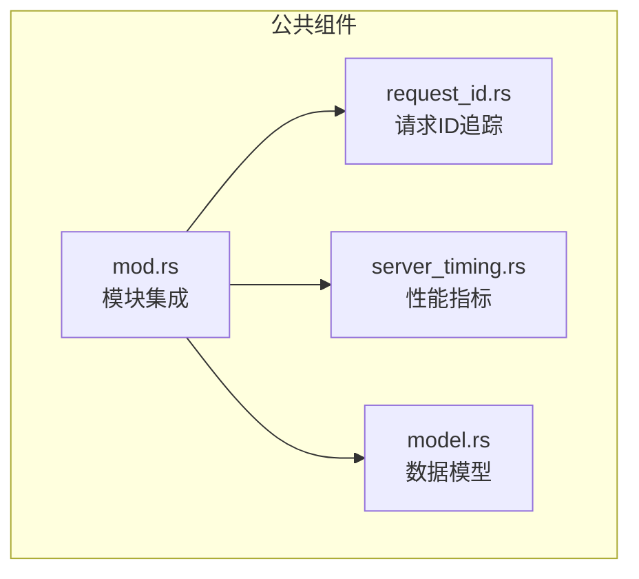
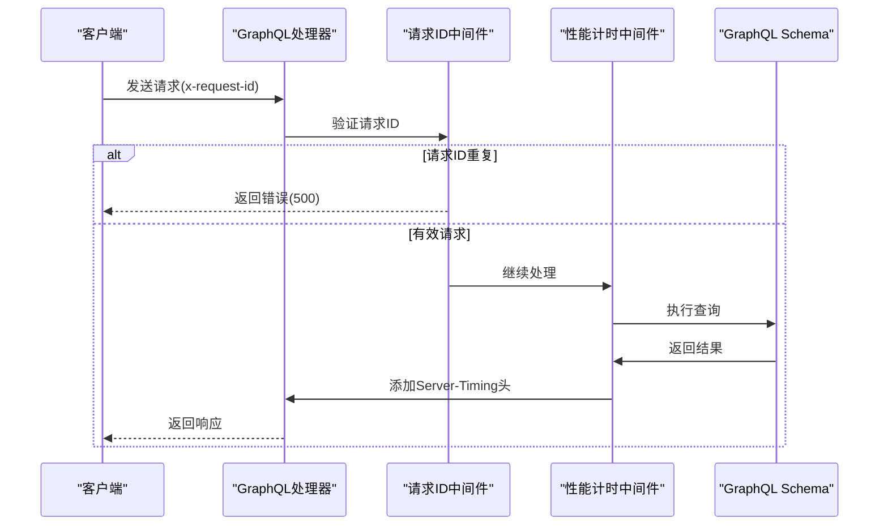
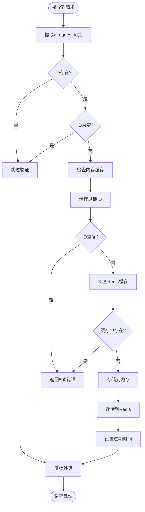
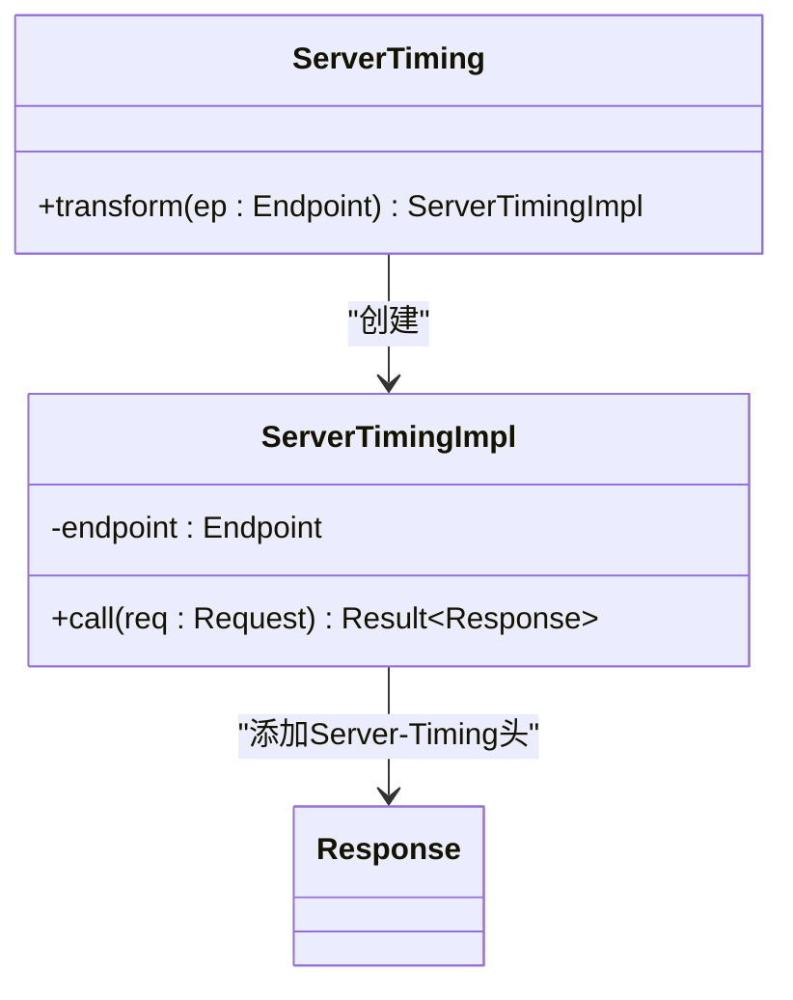
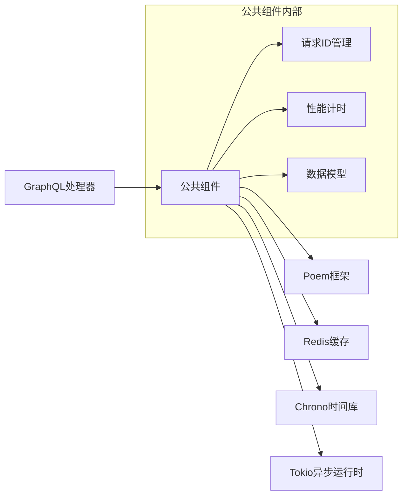

# 公共组件与扩展

**本文档中引用的文件**  
- [request_id.rs](https://github.com/sail-sail/nest/blob/main/rust/generated/common/gql/request_id.rs)
- [server_timing.rs](https://github.com/sail-sail/nest/blob/main/rust/generated/common/gql/server_timing.rs)
- [mod.rs](https://github.com/sail-sail/nest/blob/main/rust/generated/common/gql/mod.rs)
- [main.rs](https://github.com/sail-sail/nest/blob/main/rust/main.rs)

## 目录
1. [介绍](#介绍)
2. [项目结构](#项目结构)
3. [核心组件](#核心组件)
4. [架构概述](#架构概述)
5. [详细组件分析](#详细组件分析)
6. [依赖分析](#依赖分析)
7. [性能考虑](#性能考虑)
8. [故障排除指南](#故障排除指南)
9. [结论](#结论)

## 介绍
本文档详细描述了GraphQL服务器中公共功能模块的设计与作用，重点介绍`request_id`请求追踪机制、`server_timing`性能指标中间件以及其他增强API可观测性的组件。这些组件通过`mod.rs`集成到GraphQL服务中，为系统提供请求去重、性能监控和调试支持能力。

## 项目结构
GraphQL公共组件位于`rust/generated/common/gql`目录下，采用Rust模块化设计，包含请求ID管理、性能计时和数据模型等核心功能。

**图示来源**
- [mod.rs](https://github.com/sail-sail/nest/blob/main/rust/generated/common/gql/mod.rs)
- [request_id.rs](https://github.com/sail-sail/nest/blob/main/rust/generated/common/gql/request_id.rs)
- [server_timing.rs](https://github.com/sail-sail/nest/blob/main/rust/generated/common/gql/server_timing.rs)

**本节来源**
- [mod.rs](https://github.com/sail-sail/nest/blob/main/rust/generated/common/gql/mod.rs)

## 核心组件
公共组件模块包含请求追踪、性能监控和数据模型三大核心功能，通过统一的模块接口为GraphQL服务器提供增强的可观测性支持。

**本节来源**
- [request_id.rs](https://github.com/sail-sail/nest/blob/main/rust/generated/common/gql/request_id.rs#L1-L120)
- [server_timing.rs](https://github.com/sail-sail/nest/blob/main/rust/generated/common/gql/server_timing.rs#L1-L47)

## 架构概述
公共组件采用中间件模式集成到GraphQL请求处理流程中，通过`mod.rs`统一导出接口，在请求入口处进行功能注入。

**图示来源**
- [main.rs](https://github.com/sail-sail/nest/blob/main/rust/main.rs#L57-L98)
- [request_id.rs](https://github.com/sail-sail/nest/blob/main/rust/generated/common/gql/request_id.rs#L1-L120)
- [server_timing.rs](https://github.com/sail-sail/nest/blob/main/rust/generated/common/gql/server_timing.rs#L1-L47)

## 详细组件分析

### 请求ID追踪组件分析
`request_id`组件实现分布式请求追踪和去重机制，确保每个请求ID在系统中唯一。

**图示来源**
- [request_id.rs](https://github.com/sail-sail/nest/blob/main/rust/generated/common/gql/request_id.rs#L1-L120)

**本节来源**
- [request_id.rs](https://github.com/sail-sail/nest/blob/main/rust/generated/common/gql/request_id.rs#L1-L120)

### 性能指标组件分析
`server_timing`中间件实现服务器性能监控，通过HTTP头返回处理耗时。

**图示来源**
- [server_timing.rs](https://github.com/sail-sail/nest/blob/main/rust/generated/common/gql/server_timing.rs#L1-L47)

**本节来源**
- [server_timing.rs](https://github.com/sail-sail/nest/blob/main/rust/generated/common/gql/server_timing.rs#L1-L47)

## 依赖分析
公共组件依赖Poem Web框架和Redis缓存系统，通过静态单例管理共享状态。

**图示来源**
- [request_id.rs](https://github.com/sail-sail/nest/blob/main/rust/generated/common/gql/request_id.rs#L1-L120)
- [server_timing.rs](https://github.com/sail-sail/nest/blob/main/rust/generated/common/gql/server_timing.rs#L1-L47)
- [main.rs](https://github.com/sail-sail/nest/blob/main/rust/main.rs#L57-L98)

**本节来源**
- [request_id.rs](https://github.com/sail-sail/nest/blob/main/rust/generated/common/gql/request_id.rs#L1-L120)
- [server_timing.rs](https://github.com/sail-sail/nest/blob/main/rust/generated/common/gql/server_timing.rs#L1-L47)

## 性能考虑
- **内存使用**：使用`OnceLock`和`Mutex<HashMap>`管理请求ID，避免重复创建
- **缓存策略**：双重验证机制（内存+Redis）确保高并发下的ID唯一性
- **超时设置**：60秒的请求超时避免内存泄漏
- **性能开销**：`ServerTiming`中间件增加毫秒级计时开销，但提供宝贵的性能数据

**本节来源**
- [request_id.rs](https://github.com/sail-sail/nest/blob/main/rust/generated/common/gql/request_id.rs#L1-L120)
- [server_timing.rs](https://github.com/sail-sail/nest/blob/main/rust/generated/common/gql/server_timing.rs#L1-L47)

## 故障排除指南
### 常见问题
1. **重复请求ID错误**：检查客户端是否重复使用相同ID，或调整`REQUEST_TIMEOUT`值
2. **缓存连接失败**：验证`cache_x_request_id`环境变量配置和Redis连接状态
3. **性能数据缺失**：确认`Server-Timing`头是否被代理服务器移除

### 调试建议
- 启用日志记录请求ID处理过程
- 监控Redis中`cache_x_request_id`前缀的键数量
- 使用GraphQL Playground测试请求追踪功能

**本节来源**
- [request_id.rs](https://github.com/sail-sail/nest/blob/main/rust/generated/common/gql/request_id.rs#L1-L120)
- [main.rs](https://github.com/sail-sail/nest/blob/main/rust/main.rs#L57-L98)

## 结论
公共组件通过`request_id`和`server_timing`等中间件显著提升了GraphQL API的可观测性和可靠性。请求ID追踪机制有效防止重复提交，性能计时功能为系统优化提供数据支持。建议在生产环境中启用这些组件，并配合监控系统实现全面的API治理。