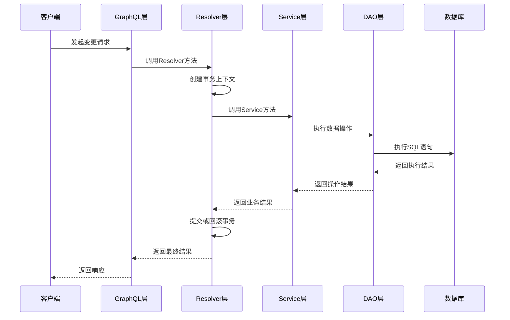
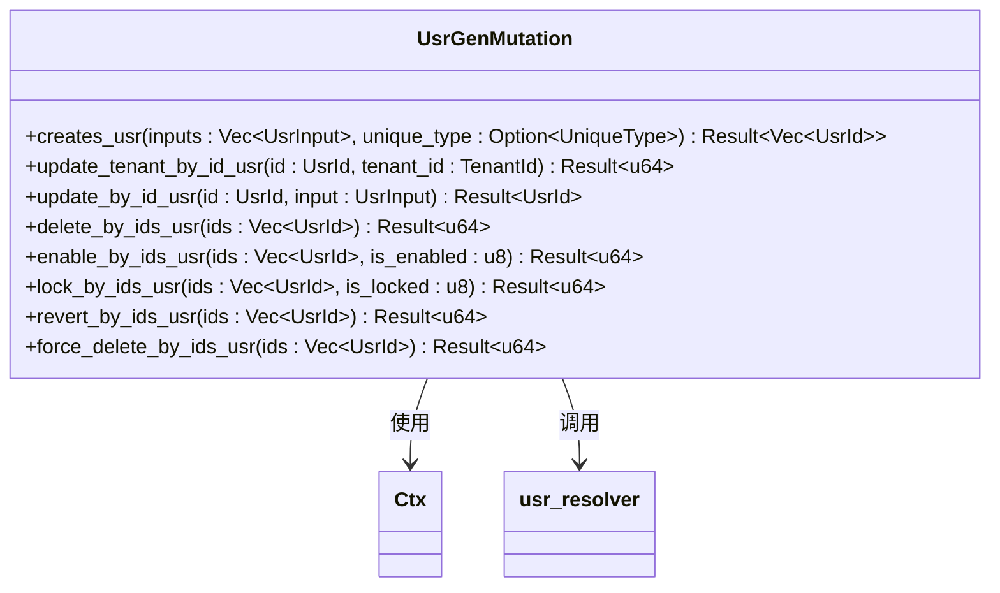
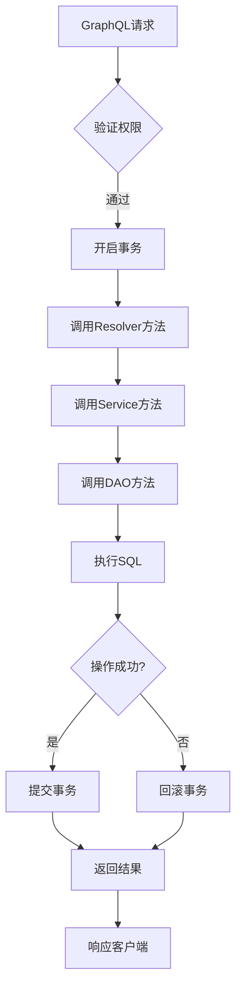
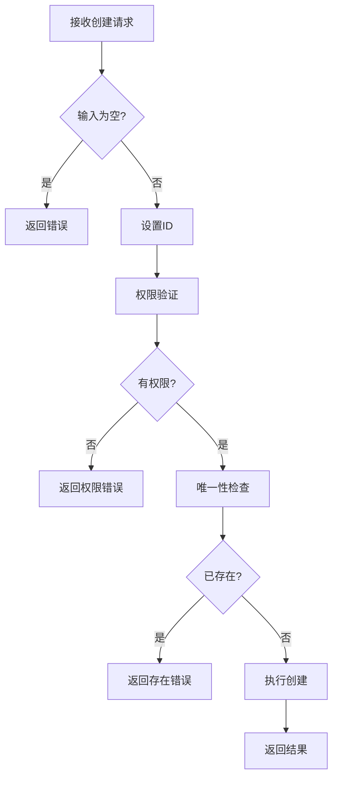
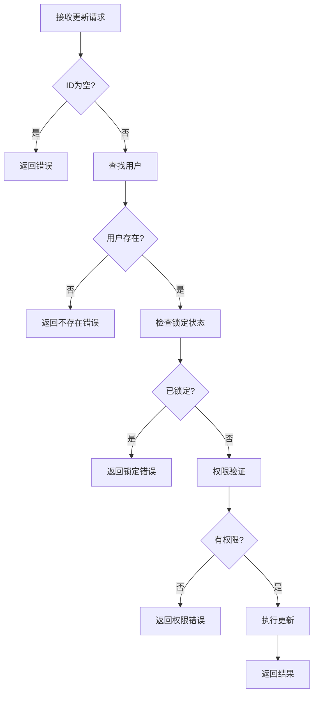
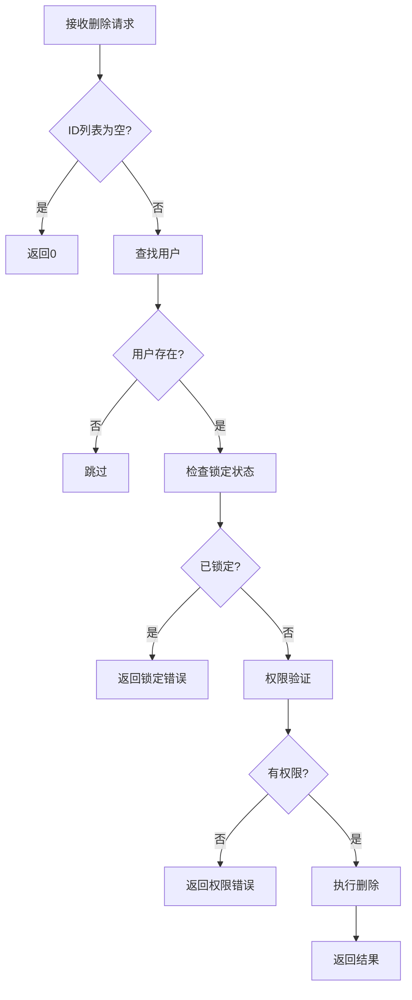
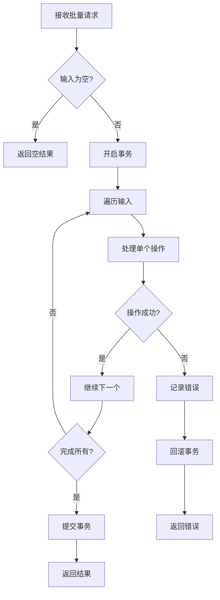
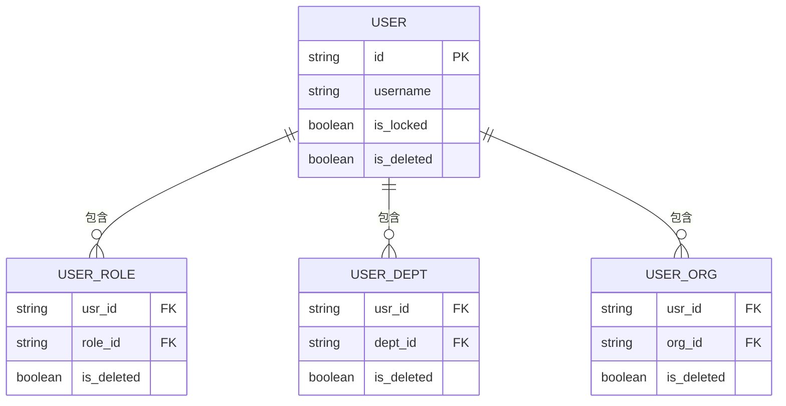
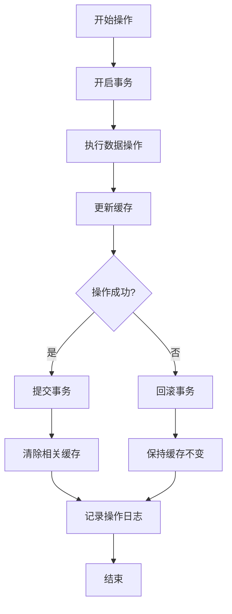

# 变更操作


**本文档引用的文件**  
- [usr_resolver.rs](https://github.com/sail-sail/nest/blob/main/rust\generated\base\usr\usr_resolver.rs)
- [usr_graphql.rs](https://github.com/sail-sail/nest/blob/main/rust\generated\base\usr\usr_graphql.rs)
- [usr_service.rs](https://github.com/sail-sail/nest/blob/main/rust\generated\base\usr\usr_service.rs)
- [usr_dao.rs](https://github.com/sail-sail/nest/blob/main/rust\generated\base\usr\usr_dao.rs)
- [context.rs](https://github.com/sail-sail/nest/blob/main/rust\generated\common\context.rs)
- [model.rs](https://github.com/sail-sail/nest/blob/main/rust\generated\common\gql\model.rs)


## 目录
1. [变更操作概述](#变更操作概述)
2. [事务处理机制](#事务处理机制)
3. [Mutation类型实现](#mutation类型实现)
4. [数据验证流程](#数据验证流程)
5. [复杂变更场景](#复杂变更场景)
6. [错误回滚与一致性保障](#错误回滚与一致性保障)

## 变更操作概述

本节介绍用户模块中变更操作的整体架构和实现原理。系统通过GraphQL Mutation实现创建、更新、删除等变更操作，采用分层架构设计，包括GraphQL层、Resolver层、Service层和DAO层。各层职责分明，GraphQL层负责接口定义和请求处理，Resolver层负责权限验证和上下文管理，Service层负责业务逻辑处理，DAO层负责数据访问。

**Section sources**
- [usr_resolver.rs](https://github.com/sail-sail/nest/blob/main/rust\generated\base\usr\usr_resolver.rs#L1-L602)
- [usr_graphql.rs](https://github.com/sail-sail/nest/blob/main/rust\generated\base\usr\usr_graphql.rs#L1-L429)

## 事务处理机制

### 事务管理实现

系统在`usr_resolver.rs`中实现了完整的事务处理机制。所有变更操作都通过`Ctx::builder(ctx).with_tran()`启用事务支持，确保操作的原子性。事务管理由`context.rs`中的`Ctx`结构体实现，通过`begin()`方法开启事务，`ok()`方法根据操作结果决定提交或回滚。



**Diagram sources**
- [usr_resolver.rs](https://github.com/sail-sail/nest/blob/main/rust\generated\base\usr\usr_resolver.rs#L258-L300)
- [context.rs](https://github.com/sail-sail/nest/blob/main/rust\generated\common\context.rs#L500-L600)

### 事务生命周期

事务的生命周期由`Ctx`结构体管理，具体流程如下：
1. 请求到达时，通过`Ctx::builder()`创建上下文
2. 调用`with_tran()`方法标记需要事务支持
3. 在`scope()`执行期间，自动调用`begin()`开启事务
4. 操作完成后，根据结果调用`commit`提交或`rollback`回滚
5. 异常情况下自动回滚，确保数据一致性

**Section sources**
- [context.rs](https://github.com/sail-sail/nest/blob/main/rust\generated\common\context.rs#L500-L700)
- [usr_resolver.rs](https://github.com/sail-sail/nest/blob/main/rust\generated\base\usr\usr_resolver.rs#L258-L300)

## Mutation类型实现

### GraphQL Mutation定义

在`usr_graphql.rs`中，`UsrGenMutation`结构体定义了所有变更操作的GraphQL接口。每个方法都使用`#[graphql(name = "...")]`属性指定GraphQL字段名称，通过`async fn`定义异步方法处理请求。



**Diagram sources**
- [usr_graphql.rs](https://github.com/sail-sail/nest/blob/main/rust\generated\base\usr\usr_graphql.rs#L258-L427)
- [usr_resolver.rs](https://github.com/sail-sail/nest/blob/main/rust\generated\base\usr\usr_resolver.rs#L1-L602)

### 方法调用链

GraphQL Mutation方法的调用链遵循统一模式：GraphQL层接收请求，创建带事务的上下文，调用Resolver层方法，最终由DAO层执行数据库操作。



**Diagram sources**
- [usr_graphql.rs](https://github.com/sail-sail/nest/blob/main/rust\generated\base\usr\usr_graphql.rs#L258-L427)
- [context.rs](https://github.com/sail-sail/nest/blob/main/rust\generated\common\context.rs#L500-L700)

**Section sources**
- [usr_graphql.rs](https://github.com/sail-sail/nest/blob/main/rust\generated\base\usr\usr_graphql.rs#L258-L427)
- [usr_resolver.rs](https://github.com/sail-sail/nest/blob/main/rust\generated\base\usr\usr_resolver.rs#L258-L300)

## 数据验证流程

### 创建操作验证

创建用户时，系统执行多层验证：
1. 空值检查：确保输入不为空
2. 唯一性检查：通过`find_by_unique_usr`验证用户名等字段的唯一性
3. 权限验证：检查当前用户是否有创建权限
4. 数据格式验证：验证邮箱、手机号等字段格式



**Diagram sources**
- [usr_resolver.rs](https://github.com/sail-sail/nest/blob/main/rust\generated\base\usr\usr_resolver.rs#L258-L300)
- [usr_service.rs](https://github.com/sail-sail/nest/blob/main/rust\generated\base\usr\usr_service.rs#L258-L300)

### 更新操作验证

更新用户时，系统执行以下验证流程：
1. 存在性检查：通过`find_by_id_usr`验证用户是否存在
2. 锁定状态检查：通过`get_is_locked_by_id_usr`验证用户是否被锁定
3. 权限验证：检查当前用户是否有编辑权限
4. 数据一致性检查：确保更新后的数据满足业务规则



**Diagram sources**
- [usr_service.rs](https://github.com/sail-sail/nest/blob/main/rust\generated\base\usr\usr_service.rs#L258-L300)
- [usr_dao.rs](https://github.com/sail-sail/nest/blob/main/rust\generated\base\usr\usr_dao.rs#L258-L300)

### 删除操作验证

删除用户时，系统执行严格的验证流程：
1. 存在性检查：验证用户是否存在
2. 锁定状态检查：已锁定的用户不能删除
3. 权限验证：检查当前用户是否有删除权限
4. 关联数据检查：确保删除操作不会破坏数据完整性



**Diagram sources**
- [usr_service.rs](https://github.com/sail-sail/nest/blob/main/rust\generated\base\usr\usr_service.rs#L258-L300)
- [usr_dao.rs](https://github.com/sail-sail/nest/blob/main/rust\generated\base\usr\usr_dao.rs#L258-L300)

**Section sources**
- [usr_resolver.rs](https://github.com/sail-sail/nest/blob/main/rust\generated\base\usr\usr_resolver.rs#L258-L300)
- [usr_service.rs](https://github.com/sail-sail/nest/blob/main/rust\generated\base\usr\usr_service.rs#L258-L300)
- [usr_dao.rs](https://github.com/sail-sail/nest/blob/main/rust\generated\base\usr\usr_dao.rs#L258-L300)

## 复杂变更场景

### 批量操作实现

系统支持批量创建、更新、删除等操作，通过批量处理提高性能。批量操作在单个事务中执行，确保原子性。



**Diagram sources**
- [usr_resolver.rs](https://github.com/sail-sail/nest/blob/main/rust\generated\base\usr\usr_resolver.rs#L258-L300)
- [usr_service.rs](https://github.com/sail-sail/nest/blob/main/rust\generated\base\usr\usr_service.rs#L258-L300)

### 级联更新处理

系统在删除或更新用户时，自动处理关联数据的级联操作。例如删除用户时，同时删除其角色、部门等关联关系。



**Diagram sources**
- [usr_dao.rs](https://github.com/sail-sail/nest/blob/main/rust\generated\base\usr\usr_dao.rs#L3380-L3429)
- [usr_service.rs](https://github.com/sail-sail/nest/blob/main/rust\generated\base\usr\usr_service.rs#L258-L300)

**Section sources**
- [usr_resolver.rs](https://github.com/sail-sail/nest/blob/main/rust\generated\base\usr\usr_resolver.rs#L258-L300)
- [usr_service.rs](https://github.com/sail-sail/nest/blob/main/rust\generated\base\usr\usr_service.rs#L258-L300)
- [usr_dao.rs](https://github.com/sail-sail/nest/blob/main/rust\generated\base\usr\usr_dao.rs#L3380-L3429)

## 错误回滚与一致性保障

### 错误处理机制

系统采用统一的错误处理机制，所有异常都通过`Result<T, E>`类型返回。在`context.rs`的`ok()`方法中，根据错误类型决定是否回滚事务。

```mermaid
stateDiagram-v2
[*] --> 开始
开始 --> 执行操作
执行操作 --> {成功?}
{成功?} --> |是| 提交事务
{成功?} --> |否| 处理错误
处理错误 --> {ServiceException?}
{ServiceException?} --> |是| 检查回滚标志
{ServiceException?} --> |否| 记录错误
检查回滚标志 --> {需回滚?}
{需回滚?} --> |是| 回滚事务
{需回滚?} --> |否| 提交事务
回滚事务 --> 返回错误
提交事务 --> 返回结果
返回结果 --> 结束
返回错误 --> 结束
```

**Diagram sources**
- [context.rs](https://github.com/sail-sail/nest/blob/main/rust\generated\common\context.rs#L500-L700)
- [usr_resolver.rs](https://github.com/sail-sail/nest/blob/main/rust\generated\base\usr\usr_resolver.rs#L258-L300)

### 数据一致性保障

系统通过多种机制保障数据一致性：
1. 事务机制：确保操作的原子性
2. 锁定机制：防止并发修改
3. 缓存一致性：操作后自动清除相关缓存
4. 日志记录：详细记录操作过程，便于追踪



**Diagram sources**
- [context.rs](https://github.com/sail-sail/nest/blob/main/rust\generated\common\context.rs#L500-L700)
- [usr_dao.rs](https://github.com/sail-sail/nest/blob/main/rust\generated\base\usr\usr_dao.rs#L3689-L3800)

**Section sources**
- [context.rs](https://github.com/sail-sail/nest/blob/main/rust\generated\common\context.rs#L500-L700)
- [usr_dao.rs](https://github.com/sail-sail/nest/blob/main/rust\generated\base\usr\usr_dao.rs#L3689-L3800)