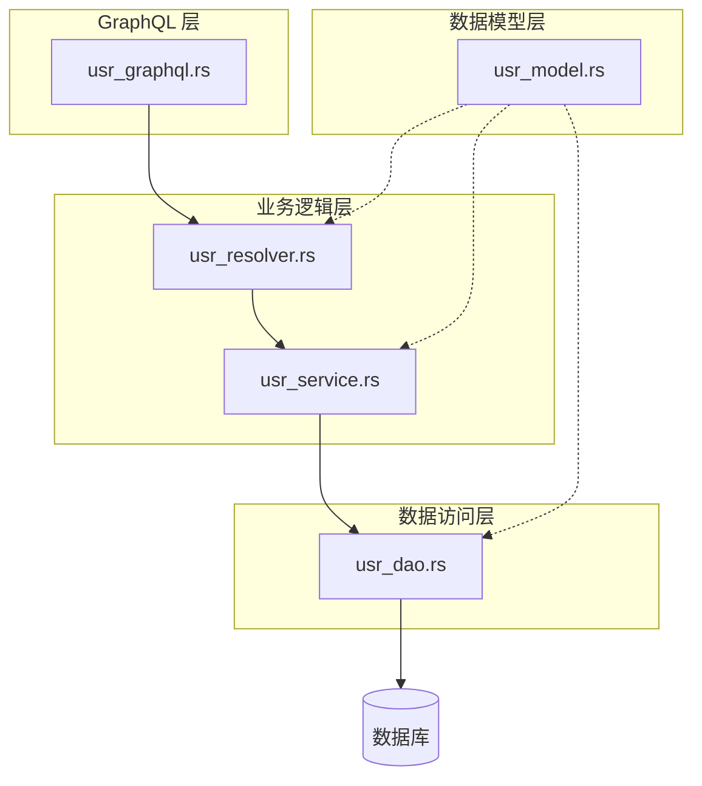
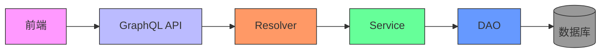
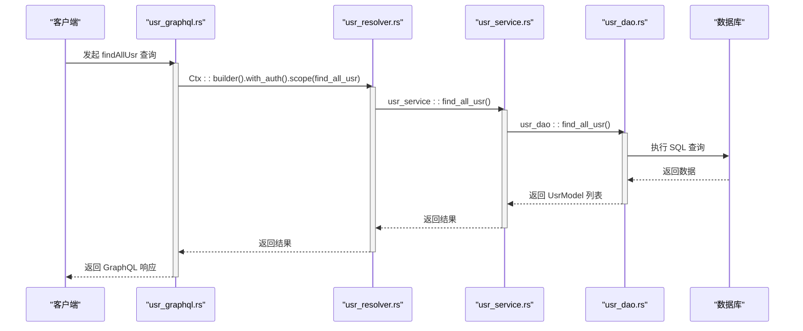
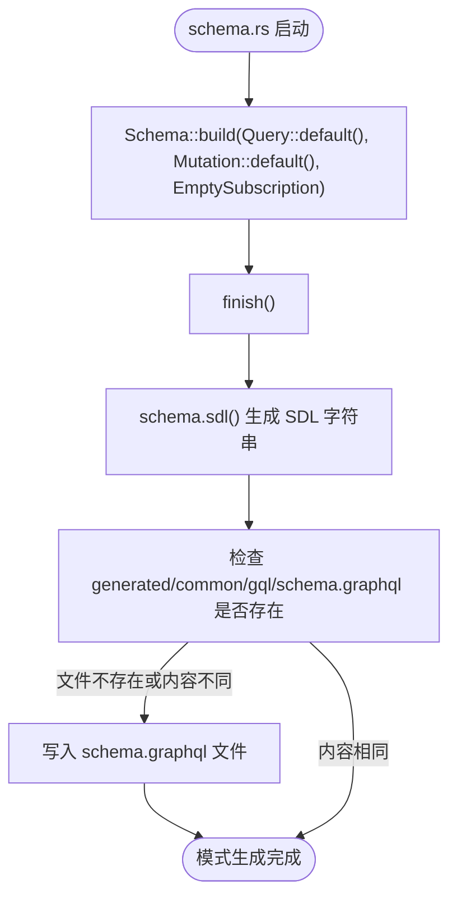
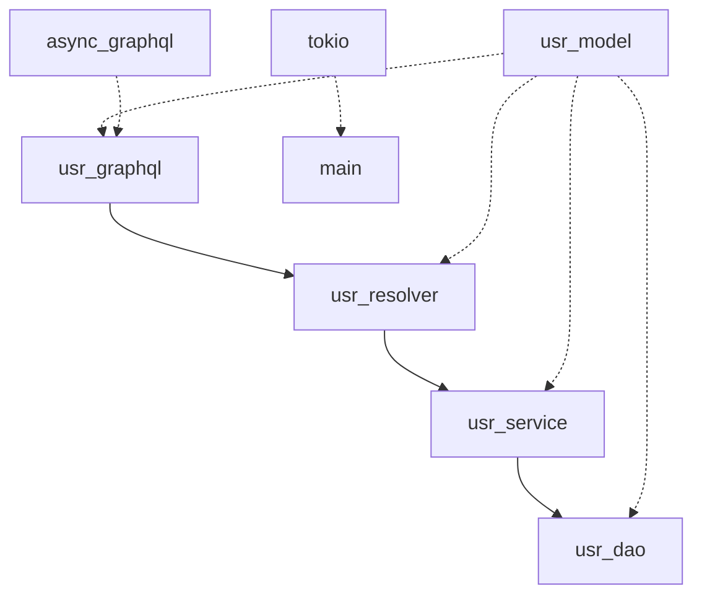

# 查询与变更

**本文档中引用的文件**  
- [usr_resolver.rs](https://github.com/sail-sail/nest/blob/main/rust/generated/base/usr/usr_resolver.rs)
- [usr_graphql.rs](https://github.com/sail-sail/nest/blob/main/rust/generated/base/usr/usr_graphql.rs)
- [schema.rs](https://github.com/sail-sail/nest/blob/main/rust/schema.rs)
- [usr_service.rs](https://github.com/sail-sail/nest/blob/main/rust/generated/base/usr/usr_service.rs)
- [usr_dao.rs](https://github.com/sail-sail/nest/blob/main/rust/generated/base/usr/usr_dao.rs)
- [main.rs](https://github.com/sail-sail/nest/blob/main/rust/main.rs)

## 目录
1. [简介](#简介)
2. [项目结构](#项目结构)
3. [核心组件](#核心组件)
4. [架构概述](#架构概述)
5. [详细组件分析](#详细组件分析)
6. [依赖分析](#依赖分析)
7. [性能考虑](#性能考虑)
8. [故障排除指南](#故障排除指南)
9. [结论](#结论)

## 简介
本文档深入解析基于 Rust 的 GraphQL 查询与变更机制实现原理，重点阐述 `usr_resolver.rs` 与 `usr_graphql.rs` 之间的调用关系，以及 `schema.rs` 中 Query 和 Mutation 类型的注册流程。通过分析典型查询与变更操作的实现路径，说明参数传递、数据验证、错误处理机制，以及如何支持前端复杂查询需求。

## 项目结构
项目采用分层架构设计，核心 GraphQL 功能位于 `rust/generated/base/usr/` 目录下，包含模型（model）、解析器（resolver）、服务（service）、数据访问对象（dao）和 GraphQL 接口定义（graphql）五个关键模块。GraphQL 模式由 `schema.rs` 文件生成并持久化。

**Diagram sources**
- [usr_graphql.rs](https://github.com/sail-sail/nest/blob/main/rust/generated/base/usr/usr_graphql.rs)
- [usr_resolver.rs](https://github.com/sail-sail/nest/blob/main/rust/generated/base/usr/usr_resolver.rs)
- [usr_service.rs](https://github.com/sail-sail/nest/blob/main/rust/generated/base/usr/usr_service.rs)
- [usr_dao.rs](https://github.com/sail-sail/nest/blob/main/rust/generated/base/usr/usr_dao.rs)
- [usr_model.rs](https://github.com/sail-sail/nest/blob/main/rust/generated/base/usr/usr_model.rs)

**Section sources**
- [usr_graphql.rs](https://github.com/sail-sail/nest/blob/main/rust/generated/base/usr/usr_graphql.rs)
- [usr_resolver.rs](https://github.com/sail-sail/nest/blob/main/rust/generated/base/usr/usr_resolver.rs)
- [usr_service.rs](https://github.com/sail-sail/nest/blob/main/rust/generated/base/usr/usr_service.rs)
- [usr_dao.rs](https://github.com/sail-sail/nest/blob/main/rust/generated/base/usr/usr_dao.rs)

## 核心组件
核心组件包括 `usr_graphql.rs`（GraphQL 接口定义）、`usr_resolver.rs`（业务逻辑协调）、`usr_service.rs`（核心服务实现）和 `usr_dao.rs`（数据库操作）。`usr_graphql.rs` 定义了 GraphQL 查询和变更的入口点，`usr_resolver.rs` 负责调用 `usr_service.rs` 执行业务逻辑，并通过 `usr_dao.rs` 与数据库交互。

**Section sources**
- [usr_graphql.rs](https://github.com/sail-sail/nest/blob/main/rust/generated/base/usr/usr_graphql.rs)
- [usr_resolver.rs](https://github.com/sail-sail/nest/blob/main/rust/generated/base/usr/usr_resolver.rs)
- [usr_service.rs](https://github.com/sail-sail/nest/blob/main/rust/generated/base/usr/usr_service.rs)
- [usr_dao.rs](https://github.com/sail-sail/nest/blob/main/rust/generated/base/usr/usr_dao.rs)

## 架构概述
系统采用典型的分层架构，GraphQL 层接收前端请求，解析器层处理业务逻辑，服务层封装核心功能，DAO 层负责数据持久化。`schema.rs` 在应用启动时构建完整的 GraphQL 模式，并将其写入文件系统以供开发工具使用。

**Diagram sources**
- [schema.rs](https://github.com/sail-sail/nest/blob/main/rust/schema.rs)
- [main.rs](https://github.com/sail-sail/nest/blob/main/rust/main.rs)
- [usr_graphql.rs](https://github.com/sail-sail/nest/blob/main/rust/generated/base/usr/usr_graphql.rs)

## 详细组件分析

### 解析器与 GraphQL 接口调用关系分析
`usr_graphql.rs` 中的每个 GraphQL 查询或变更方法都通过 `Ctx::builder` 构建上下文，并调用 `usr_resolver.rs` 中对应的异步函数。上下文构建器负责处理认证、事务和权限检查。

#### 调用流程图

**Diagram sources**
- [usr_graphql.rs](https://github.com/sail-sail/nest/blob/main/rust/generated/base/usr/usr_graphql.rs#L10-L50)
- [usr_resolver.rs](https://github.com/sail-sail/nest/blob/main/rust/generated/base/usr/usr_resolver.rs#L10-L50)

### Query 和 Mutation 类型注册流程分析
`schema.rs` 文件通过 `async-graphql` 库的 `Schema::build` 方法，将 `app::Query` 和 `app::Mutation` 的默认实例注册为 GraphQL 模式的核心类型。`usr_graphql.rs` 中定义的 `UsrGenQuery` 和 `UsrGenMutation` 结构体通过模块导入被集成到 `app::Query` 和 `app::Mutation` 中。

#### 类型注册流程

**Diagram sources**
- [schema.rs](https://github.com/sail-sail/nest/blob/main/rust/schema.rs#L10-L30)
- [main.rs](https://github.com/sail-sail/nest/blob/main/rust/main.rs#L298-L353)

**Section sources**
- [schema.rs](https://github.com/sail-sail/nest/blob/main/rust/schema.rs#L1-L36)
- [main.rs](https://github.com/sail-sail/nest/blob/main/rust/main.rs#L298-L353)

## 依赖分析
各组件之间存在清晰的依赖关系：`usr_graphql.rs` 依赖 `usr_resolver.rs`，`usr_resolver.rs` 依赖 `usr_service.rs`，`usr_service.rs` 依赖 `usr_dao.rs`。`usr_model.rs` 被所有上层组件依赖以定义数据结构。`async-graphql` 和 `tokio` 是核心外部依赖。

**Diagram sources**
- [Cargo.toml](https://github.com/sail-sail/nest/blob/main/rust/Cargo.toml)
- [usr_graphql.rs](https://github.com/sail-sail/nest/blob/main/rust/generated/base/usr/usr_graphql.rs)
- [usr_resolver.rs](https://github.com/sail-sail/nest/blob/main/rust/generated/base/usr/usr_resolver.rs)

**Section sources**
- [usr_graphql.rs](https://github.com/sail-sail/nest/blob/main/rust/generated/base/usr/usr_graphql.rs)
- [usr_resolver.rs](https://github.com/sail-sail/nest/blob/main/rust/generated/base/usr/usr_resolver.rs)
- [usr_service.rs](https://github.com/sail-sail/nest/blob/main/rust/generated/base/usr/usr_service.rs)
- [usr_dao.rs](https://github.com/sail-sail/nest/blob/main/rust/generated/base/usr/usr_dao.rs)

## 性能考虑
系统通过异步非阻塞 I/O 提升并发性能。`usr_resolver.rs` 在返回用户数据前会清空密码字段，避免敏感信息泄露。`usr_service.rs` 中的 `delete_by_ids_usr` 方法在删除前会检查记录是否被锁定，确保数据一致性。建议对高频查询如 `findByIdUsr` 添加缓存层以进一步提升性能。

## 故障排除指南
常见问题包括权限不足、记录被锁定、输入参数验证失败等。错误信息通过 `color-eyre` 库进行结构化处理并返回给客户端。例如，尝试修改已锁定的用户会返回 "不能修改已经锁定的 用户" 错误。开发时应检查 `schema.graphql` 文件是否已正确生成，以确保前端工具能正确识别 API。

**Section sources**
- [usr_resolver.rs](https://github.com/sail-sail/nest/blob/main/rust/generated/base/usr/usr_resolver.rs#L200-L220)
- [usr_service.rs](https://github.com/sail-sail/nest/blob/main/rust/generated/base/usr/usr_service.rs#L300-L320)

## 结论
本系统通过清晰的分层架构实现了健壮的 GraphQL 查询与变更机制。`usr_graphql.rs` 作为入口点，`usr_resolver.rs` 作为协调者，`usr_service.rs` 实现核心业务逻辑，`usr_dao.rs` 负责数据持久化，共同构成了一个可维护、可扩展的后端服务。`schema.rs` 的自动化模式生成确保了 API 定义的准确性和一致性。