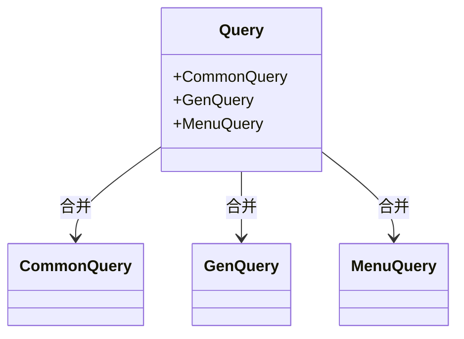

# 查询处理


**本文档中引用的文件**  
- [usr_resolver.rs](https://github.com/sail-sail/nest/blob/main/rust/generated/base/usr/usr_resolver.rs)
- [usr_graphql.rs](https://github.com/sail-sail/nest/blob/main/rust/generated/base/usr/usr_graphql.rs)
- [schema.rs](https://github.com/sail-sail/nest/blob/main/rust/schema.rs)
- [lib.rs](https://github.com/sail-sail/nest/blob/main/rust/app/lib.rs)
- [menu_graphql.rs](https://github.com/sail-sail/nest/blob/main/rust/app/base/menu/menu_graphql.rs)


## 目录
1. [简介](#简介)
2. [查询方法定义与调用流程](#查询方法定义与调用流程)
3. [Query类型实现分析](#query类型实现分析)
4. [查询接口注册机制](#查询接口注册机制)
5. [典型查询场景示例](#典型查询场景示例)
6. [数据加载与性能优化](#数据加载与性能优化)
7. [嵌套查询处理](#嵌套查询处理)

## 简介
本文档详细说明GraphQL查询在Rust后端系统中的实现机制，重点分析用户模块（usr）的查询处理流程。涵盖从查询方法定义、GraphQL类型实现到接口注册的完整链路，并提供分页、过滤、关联等典型场景的应用示例。

## 查询方法定义与调用流程

`usr_resolver.rs` 文件中定义了用户模块的所有查询方法，这些方法封装了业务逻辑与数据访问层的交互。每个查询函数均采用异步模式，接收搜索条件、分页参数和排序规则等输入，并返回相应的用户数据或统计结果。

所有查询方法均遵循统一的调用流程：
1. 记录请求日志，包含请求ID和函数名
2. 对输入参数进行预处理（如自动过滤已隐藏记录）
3. 调用服务层方法执行实际的数据操作
4. 对敏感字段（如密码）进行脱敏处理
5. 返回结果

例如 `find_all_usr` 方法用于根据搜索条件和分页参数查找用户列表，其内部会自动排除 `is_hidden=1` 的记录，并在返回前清空密码字段。

**Section sources**
- [usr_resolver.rs](https://github.com/sail-sail/nest/blob/main/rust/generated/base/usr/usr_resolver.rs#L15-L602)

## Query类型实现分析

`usr_graphql.rs` 文件中通过 `async-graphql` 框架实现了GraphQL的Query类型。`UsrGenQuery` 结构体使用 `#[Object]` 宏标记为GraphQL对象，并为其每个方法添加 `#[graphql]` 属性以映射到具体的解析器函数。

关键实现特征包括：
- 所有查询方法均接收 `&self` 和 `ctx: &Context<'_>` 参数
- 使用 `Ctx::builder(ctx).with_auth()?.build().scope({ ... })` 构造执行上下文，确保认证检查
- 将GraphQL层的参数直接传递给resolver层对应函数
- 自动处理异步调用和错误传播

例如 `find_all_usr` GraphQL查询方法通过调用 `usr_resolver::find_all_usr` 实现数据获取，并在执行前强制进行身份验证。

**Section sources**
- [usr_graphql.rs](https://github.com/sail-sail/nest/blob/main/rust/generated/base/usr/usr_graphql.rs#L15-L429)

## 查询接口注册机制

GraphQL查询接口通过合并机制注册到全局Schema中。在 `app/lib.rs` 文件中，`Query` 结构体被定义为 `MergedObject`，包含多个子查询对象：



**Diagram sources**
- [lib.rs](https://github.com/sail-sail/nest/blob/main/rust/app/lib.rs#L10-L20)

`MenuQuery` 来自 `menu_graphql.rs`，展示了如何将特定模块的查询合并到主查询中。最终的 `QuerySchema` 在 `schema.rs` 中通过 `Schema::build()` 方法构建，并生成SDL（Schema Definition Language）文件。

此机制支持模块化开发，各业务模块可独立定义其GraphQL接口，最终由系统自动合并。

**Section sources**
- [lib.rs](https://github.com/sail-sail/nest/blob/main/rust/app/lib.rs#L1-L25)
- [schema.rs](https://github.com/sail-sail/nest/blob/main/rust/schema.rs#L1-L37)
- [menu_graphql.rs](https://github.com/sail-sail/nest/blob/main/rust/app/base/menu/menu_graphql.rs#L1-L29)

## 典型查询场景示例

### 分页查询
使用 `findAllUsr` 查询配合 `page` 参数实现分页：
```graphql
query {
  findAllUsr(page: {offset: 0, limit: 10}, sort: [{field: "created_at", order: DESC}]) {
    id
    name
    email
  }
}
```

### 条件过滤
通过 `search` 参数实现多条件过滤：
```graphql
query {
  findAllUsr(search: {name: "张三", is_enabled: 1}) {
    id
    name
    status
  }
}
```

### 关联查询
系统支持通过嵌套字段实现关联数据查询。虽然用户模块本身未展示复杂关联，但架构支持通过resolver链式调用获取关联数据，如查询用户及其所属部门信息。

### 统计查询
使用 `findCountUsr` 获取满足条件的用户总数：
```graphql
query {
  findCountUsr(search: {is_enabled: 1})
}
```

**Section sources**
- [usr_graphql.rs](https://github.com/sail-sail/nest/blob/main/rust/generated/base/usr/usr_graphql.rs#L15-L429)
- [usr_resolver.rs](https://github.com/sail-sail/nest/blob/main/rust/generated/base/usr/usr_resolver.rs#L15-L602)

## 数据加载与性能优化

系统采用以下策略优化查询性能：

1. **惰性加载**：仅在需要时加载关联数据，避免N+1查询问题
2. **批量查询**：提供 `find_by_ids_usr` 等批量接口，减少数据库往返次数
3. **缓存机制**：通过上下文管理器（Ctx）支持数据缓存层集成
4. **字段脱敏**：在resolver层自动清除敏感字段（如密码），避免在GraphQL层处理
5. **参数验证**：在进入服务层前完成参数合法性检查

此外，所有查询均支持排序（SortInput）和分页（PageInput）参数，便于前端控制数据量和展示顺序。

**Section sources**
- [usr_resolver.rs](https://github.com/sail-sail/nest/blob/main/rust/generated/base/usr/usr_resolver.rs#L15-L602)
- [usr_graphql.rs](https://github.com/sail-sail/nest/blob/main/rust/generated/base/usr/usr_graphql.rs#L15-L429)

## 嵌套查询处理

系统通过GraphQL的自然嵌套语法支持复杂查询。当客户端请求嵌套字段时，框架会自动调用相应的resolver方法。执行流程如下：

1. GraphQL解析器接收到嵌套查询请求
2. 按字段层级依次调用对应的resolver函数
3. 每个resolver返回其负责的数据片段
4. 框架自动合并结果形成最终响应

虽然当前用户模块的示例较为简单，但整个架构设计支持深度嵌套查询。通过 `Options` 参数可在resolver间传递上下文信息，确保关联查询的一致性和性能。

**Section sources**
- [usr_graphql.rs](https://github.com/sail-sail/nest/blob/main/rust/generated/base/usr/usr_graphql.rs#L15-L429)
- [usr_resolver.rs](https://github.com/sail-sail/nest/blob/main/rust/generated/base/usr/usr_resolver.rs#L15-L602)