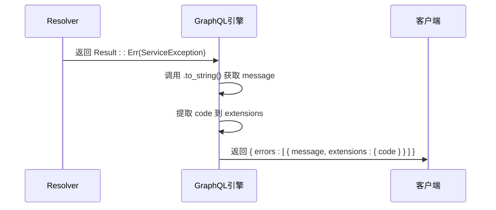

# 错误处理


**本文档引用的文件**  
- [service_exception.rs](https://github.com/sail-sail/nest/blob/main/rust/generated/common/exceptions/service_exception.rs)
- [mod.rs](https://github.com/sail-sail/nest/blob/main/rust/generated/common/exceptions/mod.rs)
- [model.rs](https://github.com/sail-sail/nest/blob/main/rust/generated/common/gql/model.rs)


## 目录
1. [引言](#引言)
2. [自定义异常结构](#自定义异常结构)
3. [异常分类与使用规范](#异常分类与使用规范)
4. [错误传递机制](#错误传递机制)
5. [Result类型到GraphQL错误的转换](#result类型到graphql错误的转换)
6. [常见错误场景处理示例](#常见错误场景处理示例)
7. [前端错误提示集成方案](#前端错误提示集成方案)
8. [结论](#结论)

## 引言
本文档系统阐述了基于Rust的GraphQL接口异常处理机制，重点分析`service_exception.rs`中定义的自定义异常类型，解析resolver与服务层之间的错误传递流程，并说明如何将Rust的`Result`类型安全、友好地转换为GraphQL标准错误响应。通过本指南，开发者可统一错误处理逻辑，提升系统健壮性与用户体验。

## 自定义异常结构

`ServiceException`是本系统核心的自定义异常类型，采用Builder模式构建，具备良好的可扩展性与可读性。其主要字段包括：

- **code**: 错误码，用于标识特定错误类型
- **message**: 用户可读的错误信息
- **rollback**: 是否触发事务回滚，默认为`true`
- **trace**: 是否打印堆栈信息，默认为`false`

该类型实现了`Display`和`Error` trait，使其可作为标准错误类型在Rust生态中无缝使用。

**Section sources**
- [service_exception.rs](https://github.com/sail-sail/nest/blob/main/rust/generated/common/exceptions/service_exception.rs#L1-L37)

## 异常分类与使用规范

根据业务场景，`ServiceException`可通过不同`code`值实现错误分类管理：

- **验证错误**：如`VALIDATION_ERROR`，用于输入校验失败
- **权限错误**：如`PERMISSION_DENIED`，用于访问控制拒绝
- **数据冲突**：如`DATA_CONFLICT`，用于唯一性约束冲突
- **资源未找到**：如`NOT_FOUND`，用于查询不存在的资源
- **内部服务错误**：默认`500`，表示未预期的系统异常

使用时应通过`ServiceExceptionBuilder`构造实例，确保字段完整性与一致性。

**Section sources**
- [service_exception.rs](https://github.com/sail-sail/nest/blob/main/rust/generated/common/exceptions/service_exception.rs#L5-L20)

## 错误传递机制

系统采用分层架构，错误从服务层向上传递至resolver层，最终由GraphQL框架统一捕获并格式化输出。传递路径如下：

1. **DAO层**：数据库操作失败抛出`ServiceException`
2. **Service层**：业务逻辑校验失败创建并返回`ServiceException`
3. **Resolver层**：调用服务方法，`Result`类型自动传播错误
4. **GraphQL执行层**：框架将`ServiceException`序列化为标准错误响应

此机制确保错误上下文完整保留，同时避免底层实现细节暴露给客户端。

```mermaid
flowchart TD
A[DAO层] --> |返回 Err(ServiceException)| B[Service层]
B --> |传播 Result<T, ServiceException>| C[Resolver层]
C --> |自动处理| D[GraphQL执行引擎]
D --> |格式化输出| E[客户端响应]
```

**Diagram sources**
- [service_exception.rs](https://github.com/sail-sail/nest/blob/main/rust/generated/common/exceptions/service_exception.rs#L1-L37)
- [model.rs](https://github.com/sail-sail/nest/blob/main/rust/generated/common/gql/model.rs#L1-L71)

**Section sources**
- [service_exception.rs](https://github.com/sail-sail/nest/blob/main/rust/generated/common/exceptions/service_exception.rs#L1-L37)

## Result类型到GraphQL错误的转换

Rust的`Result<T, E>`类型在GraphQL resolver中被自动处理。当返回`Err(e)`时，`async-graphql`框架会调用`e.to_string()`获取消息，并将其封装为标准的GraphQL错误响应体。`ServiceException`实现了`Display` trait，确保错误消息正确输出。

此外，可通过自定义`ErrorExtension`机制将`code`等字段注入到GraphQL错误的`extensions`中，便于前端进行精细化错误处理。



**Diagram sources**
- [service_exception.rs](https://github.com/sail-sail/nest/blob/main/rust/generated/common/exceptions/service_exception.rs#L22-L35)
- [model.rs](https://github.com/sail-sail/nest/blob/main/rust/generated/common/gql/model.rs#L1-L71)

**Section sources**
- [service_exception.rs](https://github.com/sail-sail/nest/blob/main/rust/generated/common/exceptions/service_exception.rs#L22-L35)

## 常见错误场景处理示例

### 验证错误
当用户输入不符合规则时，服务层应创建验证错误：

```rust
// 示例伪代码路径
[SPEC SYMBOL](https://github.com/sail-sail/nest/blob/main/rust/generated/common/exceptions/service_exception.rs#L10-L15)
```

### 权限错误
在访问控制检查失败时抛出权限异常：

```rust
// 示例伪代码路径
[SPEC SYMBOL](https://github.com/sail-sail/nest/blob/main/rust/generated/common/exceptions/service_exception.rs#L10-L15)
```

### 数据冲突
处理唯一键冲突时使用特定错误码：

```rust
// 示例伪代码路径
[SPEC SYMBOL](https://github.com/sail-sail/nest/blob/main/rust/generated/common/exceptions/service_exception.rs#L10-L15)
```

**Section sources**
- [service_exception.rs](https://github.com/sail-sail/nest/blob/main/rust/generated/common/exceptions/service_exception.rs#L1-L37)

## 前端错误提示集成方案

前端应解析GraphQL响应中的`errors`数组，并根据`extensions.code`字段进行分类处理：

- 显示用户友好的`message`
- 根据`code`触发特定UI反馈（如高亮表单字段）
- 记录日志时保留完整错误上下文
- 对`trace: true`的错误进行上报

建议封装统一的错误处理钩子，集中管理不同错误码的响应逻辑，提升维护性。

**Section sources**
- [service_exception.rs](https://github.com/sail-sail/nest/blob/main/rust/generated/common/exceptions/service_exception.rs#L1-L37)
- [model.rs](https://github.com/sail-sail/nest/blob/main/rust/generated/common/gql/model.rs#L1-L71)

## 结论

通过`ServiceException`的结构化设计与分层错误传递机制，系统实现了统一、可维护的错误处理流程。结合GraphQL的错误扩展能力，前后端可高效协作，提供精准的用户反馈与可靠的系统监控。建议所有服务方法均返回`Result<T, ServiceException>`，确保错误处理的一致性与完整性。