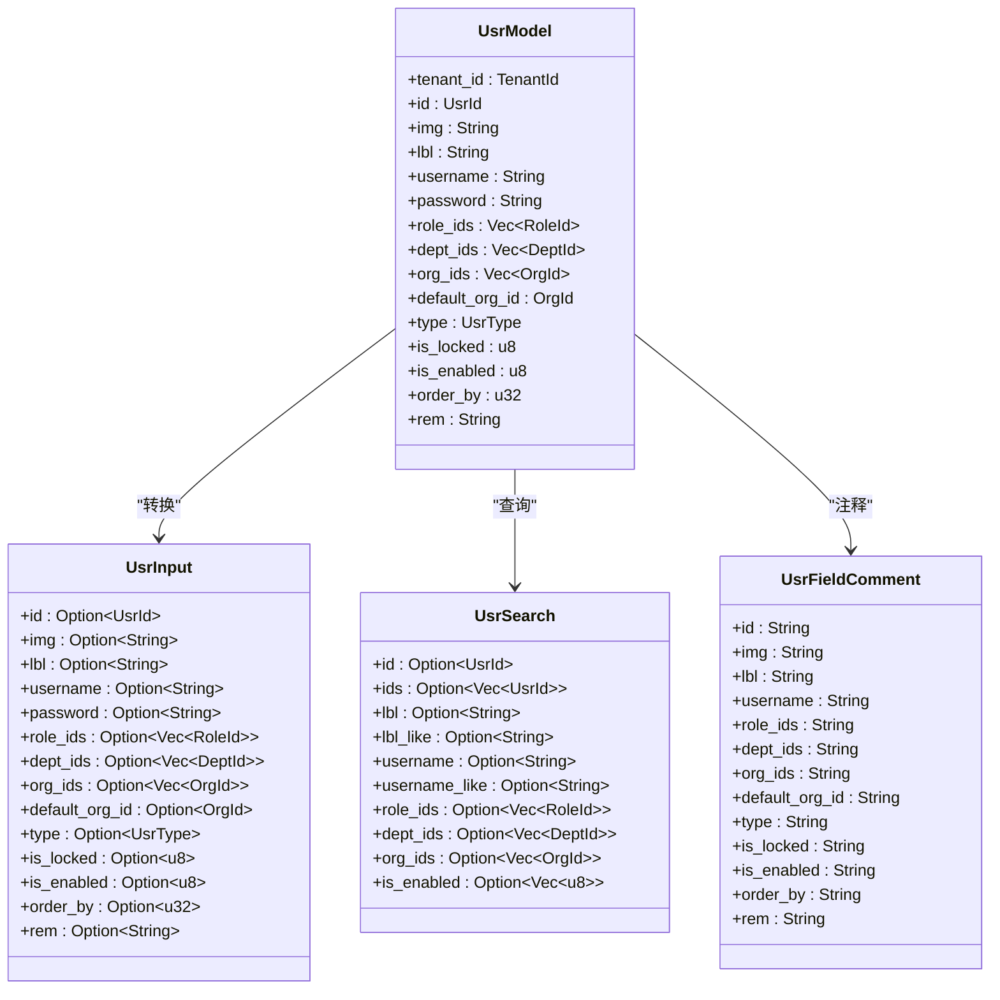
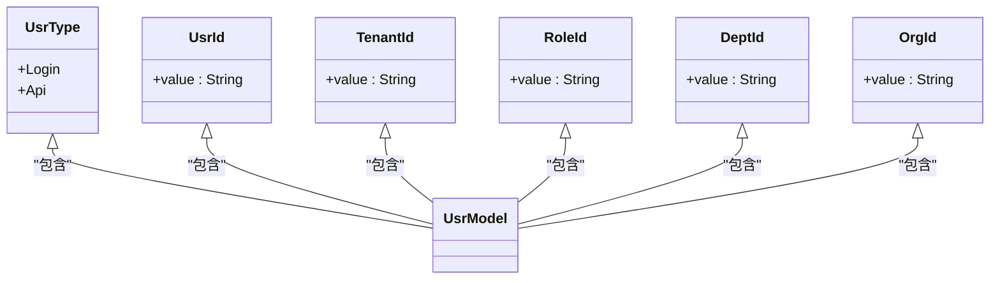
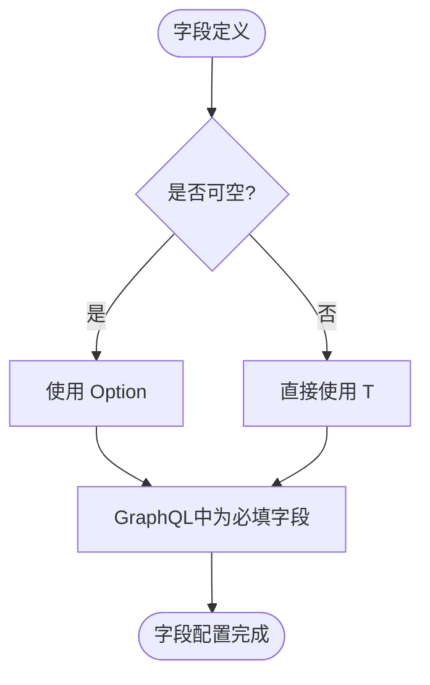
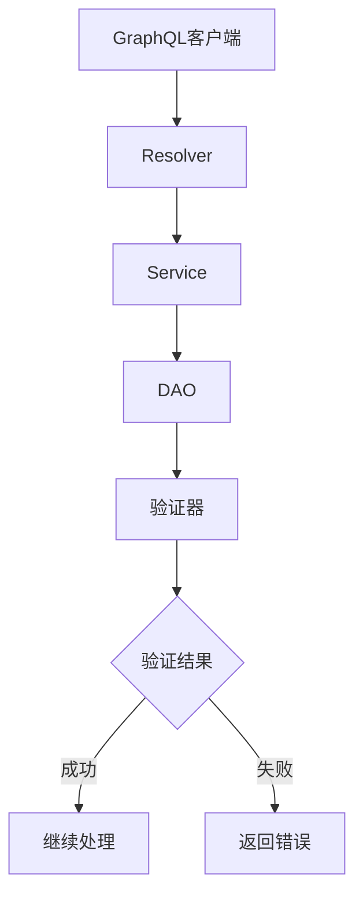
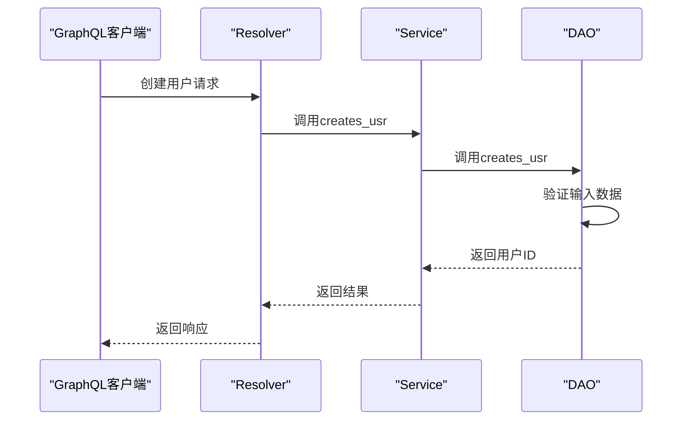
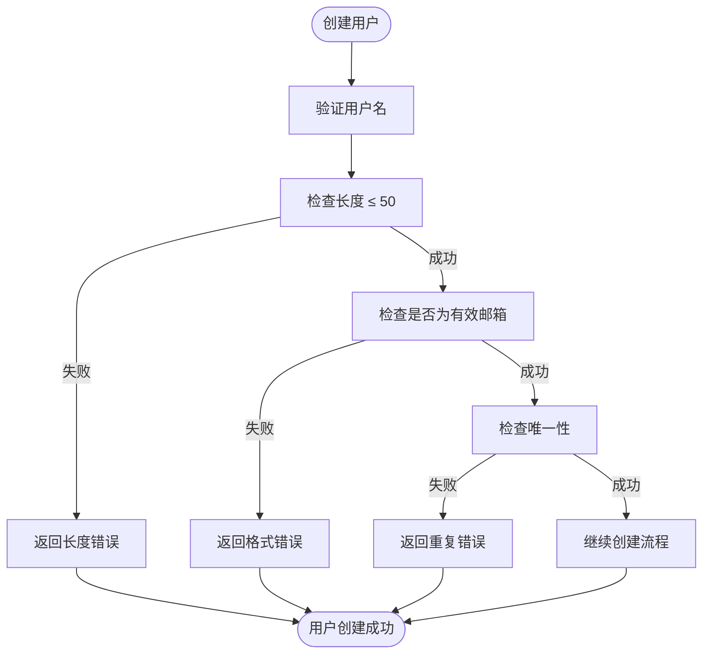

# GraphQL字段类型与约束定义


**本文档引用的文件**  
- [usr_graphql.rs](https://github.com/sail-sail/nest/blob/main/rust/generated/base/usr/usr_graphql.rs)
- [usr_model.rs](https://github.com/sail-sail/nest/blob/main/rust/generated/base/usr/usr_model.rs)
- [usr_resolver.rs](https://github.com/sail-sail/nest/blob/main/rust/generated/base/usr/usr_resolver.rs)
- [usr_service.rs](https://github.com/sail-sail/nest/blob/main/rust/generated/base/usr/usr_service.rs)
- [chars_max_length.rs](https://github.com/sail-sail/nest/blob/main/rust/generated/common/validators/chars_max_length.rs)
- [email.rs](https://github.com/sail-sail/nest/blob/main/rust/generated/common/validators/email.rs)


## 目录
1. [引言](#引言)
2. [GraphQL字段类型系统](#graphql字段类型系统)
3. [标量类型与自定义类型](#标量类型与自定义类型)
4. [字段属性配置](#字段属性配置)
5. [验证器集成机制](#验证器集成机制)
6. [业务规则强制执行](#业务规则强制执行)
7. [带验证逻辑的字段定义示例](#带验证逻辑的字段定义示例)
8. [结论](#结论)

## 引言
本文档深入探讨了在Rust后端系统中GraphQL字段的定义方式，重点分析了`usr_graphql.rs`文件中用户模块的字段声明。文档详细说明了如何通过类型系统设置字段描述、默认值和可空性，并阐述了验证器在字段约束中的集成方式，展示了业务规则如何通过类型系统强制执行。

## GraphQL字段类型系统

GraphQL字段类型系统在本项目中通过`async-graphql`库实现，提供了完整的类型安全和验证机制。系统支持标量类型（如String、Int、Boolean）和自定义复合类型，通过Rust的宏系统和类型注解实现。



**图表来源**  
- [usr_model.rs](https://github.com/sail-sail/nest/blob/main/rust/generated/base/usr/usr_model.rs#L0-L799)

**本节来源**  
- [usr_model.rs](https://github.com/sail-sail/nest/blob/main/rust/generated/base/usr/usr_model.rs#L0-L799)
- [usr_graphql.rs](https://github.com/sail-sail/nest/blob/main/rust/generated/base/usr/usr_graphql.rs#L0-L428)

## 标量类型与自定义类型

### 标量类型使用
在GraphQL字段定义中，系统广泛使用了Rust内置的标量类型：

- **String**: 用于文本字段如用户名、名称、备注等
- **Int**: 使用`u32`表示排序字段，`u8`表示布尔标志
- **Boolean**: 通过`u8`值（0或1）表示启用/锁定状态
- **ID**: 通过`UsrId`类型表示用户ID

### 自定义类型定义
系统定义了多种自定义类型来满足业务需求：



**图表来源**  
- [usr_model.rs](https://github.com/sail-sail/nest/blob/main/rust/generated/base/usr/usr_model.rs#L931-L997)
- [usr_model.rs](https://github.com/sail-sail/nest/blob/main/rust/generated/base/usr/usr_model.rs#L0-L799)

**本节来源**  
- [usr_model.rs](https://github.com/sail-sail/nest/blob/main/rust/generated/base/usr/usr_model.rs#L931-L997)
- [usr_model.rs](https://github.com/sail-sail/nest/blob/main/rust/generated/base/usr/usr_model.rs#L0-L799)

## 字段属性配置

### 字段描述设置
通过Rust文档注释和GraphQL属性宏设置字段描述：

```rust
/// 用户名
#[graphql(name = "username")]
pub username: String,
```

### 默认值配置
系统通过`Default` trait和`#[default]`属性设置默认值：

```rust
#[derive(SimpleObject, Default, Serialize, Deserialize, Clone, Debug)]
#[graphql(rename_fields = "snake_case", name = "UsrModel")]
pub struct UsrModel {
    /// 类型
    #[graphql(name = "type")]
    pub r#type: UsrType, // 默认为Login
}
```

### 可空性管理
通过`Option<T>`类型精确控制字段的可空性：



**图表来源**  
- [usr_model.rs](https://github.com/sail-sail/nest/blob/main/rust/generated/base/usr/usr_model.rs#L0-L799)

**本节来源**  
- [usr_model.rs](https://github.com/sail-sail/nest/blob/main/rust/generated/base/usr/usr_model.rs#L0-L799)
- [usr_graphql.rs](https://github.com/sail-sail/nest/blob/main/rust/generated/base/usr/usr_graphql.rs#L0-L428)

## 验证器集成机制

### 验证器架构
系统采用模块化验证器设计，将验证逻辑与业务逻辑分离：



**图表来源**  
- [usr_resolver.rs](https://github.com/sail-sail/nest/blob/main/rust/generated/base/usr/usr_resolver.rs#L0-L601)
- [usr_service.rs](https://github.com/sail-sail/nest/blob/main/rust/generated/base/usr/usr_service.rs#L0-L414)

### 字符串长度验证
`chars_max_length.rs`验证器实现字符串长度约束：

```rust
pub fn chars_max_length(
  value: Option<String>,
  len: usize,
  label: &str,
) -> Result<()> {
  if value.is_none() {
    return Ok(());
  }
  let value = value.unwrap();
  let value_len = value.chars().count();
  if value_len <= len {
    return Ok(());
  }
  let err_msg = format!("The {label} length cannot greater than {len}");
  Err(eyre!(err_msg))
}
```

### 邮件格式验证
`email.rs`验证器实现邮件格式验证：

```rust
pub async fn email(
  value: Option<String>,
  label: &str,
) -> Result<()> {
  if value.is_none() {
    return Ok(());
  }
  let value = value.unwrap();
  if is_valid_email(&value) {
    return Ok(());
  }
  let msg = ns("邮件格式不正确".to_owned(), None).await?;
  let mut err_msg = String::new();
  err_msg.push_str(label);
  err_msg.push(' ');
  err_msg.push_str(&msg);
  Err(eyre!(err_msg))
}
```

**本节来源**  
- [chars_max_length.rs](https://github.com/sail-sail/nest/blob/main/rust/generated/common/validators/chars_max_length.rs#L0-L26)
- [email.rs](https://github.com/sail-sail/nest/blob/main/rust/generated/common/validators/email.rs#L0-L33)
- [usr_service.rs](https://github.com/sail-sail/nest/blob/main/rust/generated/base/usr/usr_service.rs#L0-L414)

## 业务规则强制执行

### 类型安全执行
通过Rust的类型系统确保业务规则：



**图表来源**  
- [usr_resolver.rs](https://github.com/sail-sail/nest/blob/main/rust/generated/base/usr/usr_resolver.rs#L0-L601)
- [usr_service.rs](https://github.com/sail-sail/nest/blob/main/rust/generated/base/usr/usr_service.rs#L0-L414)
- [usr_dao.rs](https://github.com/sail-sail/nest/blob/main/rust/generated/base/usr/usr_dao.rs#L4113-L4148)

### 锁定状态验证
系统通过验证器强制执行锁定状态规则：

```rust
pub async fn update_by_id_usr(
  usr_id: UsrId,
  mut usr_input: UsrInput,
  options: Option<Options>,
) -> Result<UsrId> {
  let is_locked = usr_dao::get_is_locked_by_id_usr(
    usr_id,
    None,
  ).await?;
  
  if is_locked {
    let err_msg = "不能修改已经锁定的 用户";
    return Err(eyre!(err_msg));
  }
  // 继续处理...
}
```

**本节来源**  
- [usr_service.rs](https://github.com/sail-sail/nest/blob/main/rust/generated/base/usr/usr_service.rs#L0-L414)
- [usr_dao.rs](https://github.com/sail-sail/nest/blob/main/rust/generated/base/usr/usr_dao.rs#L4113-L4148)

## 带验证逻辑的字段定义示例

### 用户名字段验证
结合长度和格式验证的用户名字段：



**图表来源**  
- [usr_model.rs](https://github.com/sail-sail/nest/blob/main/rust/generated/base/usr/usr_model.rs#L0-L799)
- [chars_max_length.rs](https://github.com/sail-sail/nest/blob/main/rust/generated/common/validators/chars_max_length.rs#L0-L26)
- [email.rs](https://github.com/sail-sail/nest/blob/main/rust/generated/common/validators/email.rs#L0-L33)

**本节来源**  
- [usr_model.rs](https://github.com/sail-sail/nest/blob/main/rust/generated/base/usr/usr_model.rs#L0-L799)
- [chars_max_length.rs](https://github.com/sail-sail/nest/blob/main/rust/generated/common/validators/chars_max_length.rs#L0-L26)
- [email.rs](https://github.com/sail-sail/nest/blob/main/rust/generated/common/validators/email.rs#L0-L33)

## 结论
本系统通过GraphQL与Rust类型系统的深度集成，实现了强大的字段定义和验证机制。标量类型和自定义类型的灵活使用，结合验证器模块的集成，确保了业务规则在类型层面得到强制执行。这种设计不仅提高了代码的类型安全性，还增强了系统的可维护性和可扩展性。