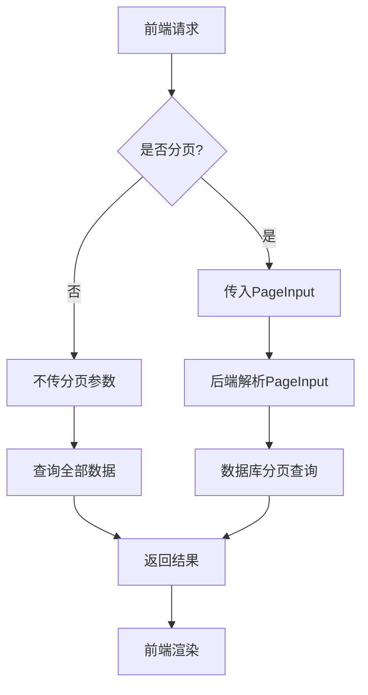
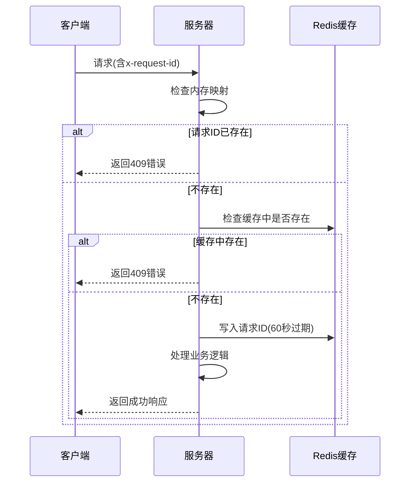

# 公共类型模型与复用机制


**本文档引用文件**  
- [model.rs](https://github.com/sail-sail/nest/blob/main/rust/generated/common/gql/model.rs)
- [request_id.rs](https://github.com/sail-sail/nest/blob/main/rust/generated/common/gql/request_id.rs)
- [usr_graphql.rs](https://github.com/sail-sail/nest/blob/main/rust/generated/base/usr/usr_graphql.rs)
- [usr_model.rs](https://github.com/sail-sail/nest/blob/main/rust/generated/base/menu/usr_model.rs)
- [Api.ts](https://github.com/sail-sail/nest/blob/main/pc/src/views/base/usr/Api.ts)
- [List.vue](https://github.com/sail-sail/nest/blob/main/pc/src/views/base/usr/List.vue)


## 目录
1. [简介](#简介)
2. [核心公共类型定义](#核心公共类型定义)
3. [分页与排序支持](#分页与排序支持)
4. [全局请求ID追踪机制](#全局请求id追踪机制)
5. [类型复用与跨模块集成](#类型复用与跨模块集成)
6. [设计原则与可扩展性](#设计原则与可扩展性)
7. [用户模块中的实际应用示例](#用户模块中的实际应用示例)
8. [结论](#结论)

## 简介
本系统通过在 `gql/model.rs` 中定义一系列通用类型，实现了跨业务模块的类型共享与功能复用。这些公共类型不仅支持分页查询、排序等基础功能，还通过 `request_id.rs` 实现了全局请求ID的去重与追踪，保障了系统的稳定性与可维护性。本文档详细分析这些公共类型的结构、复用模式及其在用户模块中的实际应用。

## 核心公共类型定义

在 `gql/model.rs` 文件中定义了多个可跨模块复用的公共类型，主要包括：

- **PageInput**：用于分页查询的输入参数
- **SortInput**：用于排序的输入参数
- **SortOrderEnum**：排序方向枚举类型
- **UniqueType**：唯一性处理策略枚举
- **Ip**：IP地址封装类型

这些类型通过 `async-graphql` 框架的宏（如 `SimpleObject`、`InputObject`、`Enum`）进行声明，确保其在GraphQL API中的可用性。

**Section sources**
- [model.rs](https://github.com/sail-sail/nest/blob/main/rust/generated/common/gql/model.rs#L1-L71)

## 分页与排序支持

### 分页类型 PageInput
```rust
#[derive(SimpleObject, InputObject, Copy, Clone)]
pub struct PageInput {
  pub pg_offset: Option<i64>,
  pub pg_size: Option<i64>,
}
```
`PageInput` 结构体封装了分页所需的偏移量（`pg_offset`）和页大小（`pg_size`），允许客户端在查询时指定分页参数。

### 排序类型 SortInput 与 SortOrderEnum
```rust
#[derive(SimpleObject, InputObject, Clone, Debug, Serialize, Deserialize)]
pub struct SortInput {
  #[graphql(default)]
  pub prop: String,
  #[graphql(default)]
  pub order: SortOrderEnum,
}

#[derive(Enum, Default, Copy, Clone, Eq, PartialEq, Debug, Serialize, Deserialize)]
pub enum SortOrderEnum {
  #[graphql(name = "asc")]
  #[default]
  Asc,
  #[graphql(name = "ascending")]
  Ascending,
  #[graphql(name = "desc")]
  Desc,
  #[graphql(name = "descending")]
  Descending,
}
```
`SortInput` 定义了排序属性（`prop`）和排序方向（`order`），其中 `SortOrderEnum` 支持多种等价的排序方向表示（如 "asc" 和 "ascending"），增强了API的灵活性。

### 在用户模块中的分页查询应用
在用户模块的GraphQL查询中，`findAllUsr` 方法直接使用了 `PageInput` 和 `SortInput` 类型：
```rust
async fn find_all_usr(
  &self,
  ctx: &Context<'_>,
  search: Option<UsrSearch>,
  page: Option<PageInput>,
  sort: Option<Vec<SortInput>>,
) -> Result<Vec<UsrModel>>
```
前端通过GraphQL查询传递分页和排序参数：
```typescript
query($search: UsrSearch, $page: PageInput, $sort: [SortInput!]) {
  findAllUsr(search: $search, page: $page, sort: $sort) {
    ${ usrQueryField }
  }
}
```



**Diagram sources**
- [model.rs](https://github.com/sail-sail/nest/blob/main/rust/generated/common/gql/model.rs#L10-L25)
- [usr_graphql.rs](https://github.com/sail-sail/nest/blob/main/rust/generated/base/usr/usr_graphql.rs#L30-L45)
- [Api.ts](https://github.com/sail-sail/nest/blob/main/pc/src/views/base/usr/Api.ts#L83-L95)

**Section sources**
- [model.rs](https://github.com/sail-sail/nest/blob/main/rust/generated/common/gql/model.rs#L10-L71)
- [usr_graphql.rs](https://github.com/sail-sail/nest/blob/main/rust/generated/base/usr/usr_graphql.rs#L30-L50)
- [Api.ts](https://github.com/sail-sail/nest/blob/main/pc/src/views/base/usr/Api.ts#L83-L100)

## 全局请求ID追踪机制

### request_id.rs 的核心功能
`request_id.rs` 文件实现了基于 `x-request-id` 的请求去重机制，防止重复请求造成数据异常。其核心逻辑包括：

1. 使用 `OnceLock` 和 `Mutex<HashMap>` 维护内存中的请求ID映射
2. 通过Redis缓存（`cache_x_request_id`）实现分布式环境下的请求ID共享
3. 设置60秒的请求超时时间，自动清理过期请求ID

### 请求处理流程


**Diagram sources**
- [request_id.rs](https://github.com/sail-sail/nest/blob/main/rust/generated/common/gql/request_id.rs#L1-L120)

**Section sources**
- [request_id.rs](https://github.com/sail-sail/nest/blob/main/rust/generated/common/gql/request_id.rs#L1-L120)

## 类型复用与跨模块集成

### UniqueType 枚举的复用
`UniqueType` 枚举定义了三种唯一性处理策略：
```rust
#[derive(Enum, Default, Copy, Clone, Eq, PartialEq, Debug)]
pub enum UniqueType {
  #[graphql(name = "throw")]
  #[default]
  Throw,
  #[graphql(name = "update")]
  Update,
  #[graphql(name = "ignore")]
  Ignore,
}
```
该类型在创建用户等操作中被复用，用于指定当数据已存在时的处理策略。

### 跨模块类型引用
各业务模块通过以下方式引用公共类型：
```rust
use crate::common::gql::model::{
  PageInput,
  SortInput,
};
```
这种集中式管理确保了所有模块使用统一的分页、排序接口，降低了维护成本。

**Section sources**
- [model.rs](https://github.com/sail-sail/nest/blob/main/rust/generated/common/gql/model.rs#L50-L71)
- [usr_graphql.rs](https://github.com/sail-sail/nest/blob/main/rust/generated/base/usr/usr_graphql.rs#L15-L20)

## 设计原则与可扩展性

### 可扩展性设计
- **泛型支持**：`SortInput` 中的 `prop` 字段为 `String` 类型，可适配任意属性排序
- **枚举别名**：`SortOrderEnum` 支持多个等价名称，便于前端灵活使用
- **Option包装**：所有字段均使用 `Option`，保证向后兼容性

### 向后兼容性保障
- 使用 `#[graphql(default)]` 属性确保新增字段不影响旧客户端
- 通过 `serde` 的 `Serialize` 和 `Deserialize` 特征支持JSON序列化兼容
- 所有公共类型实现 `Clone` 和 `Debug`，便于调试和日志记录

### 类型共享机制
通过将公共类型集中定义在 `common/gql/model.rs` 中，并通过Rust的模块系统（`crate::common::gql::model`）导出，实现了高效的类型共享，避免了代码重复。

**Section sources**
- [model.rs](https://github.com/sail-sail/nest/blob/main/rust/generated/common/gql/model.rs#L1-L71)

## 用户模块中的实际应用示例

### 前端分页查询实现
在 `List.vue` 中，通过计算属性生成分页参数：
```typescript
const pgSize = page.size;
const pgOffset = (page.current - 1) * page.size;
tableData = await findAllUsr(
  search,
  {
    pgSize,
    pgOffset,
  },
  [sort]
);
```

### 排序功能实现
默认排序配置：
```typescript
const defaultSort: Sort = $computed(() => {
  return {
    prop: "order_by",
    order: "ascending",
  };
});
```

### 唯一性创建处理
创建用户时可指定唯一性策略：
```typescript
export async function createUsr(
  input: UsrInput,
  unique_type?: UniqueType,
  opt?: GqlOpt,
): Promise<UsrId>
```

**Section sources**
- [List.vue](https://github.com/sail-sail/nest/blob/main/pc/src/views/base/usr/List.vue#L1396-L1458)
- [Api.ts](https://github.com/sail-sail/nest/blob/main/pc/src/views/base/usr/Api.ts#L215-L218)

## 结论
系统通过在 `gql/model.rs` 中定义 `PageInput`、`SortInput` 等公共类型，实现了跨模块的功能复用。这些类型不仅支持分页、排序等基础查询功能，还通过 `request_id.rs` 实现了全局请求ID的追踪与去重。设计上注重可扩展性和向后兼容性，采用集中式类型管理，确保了系统的一致性和可维护性。在用户模块等实际应用中，这些公共类型被广泛使用，显著提升了开发效率和系统稳定性。