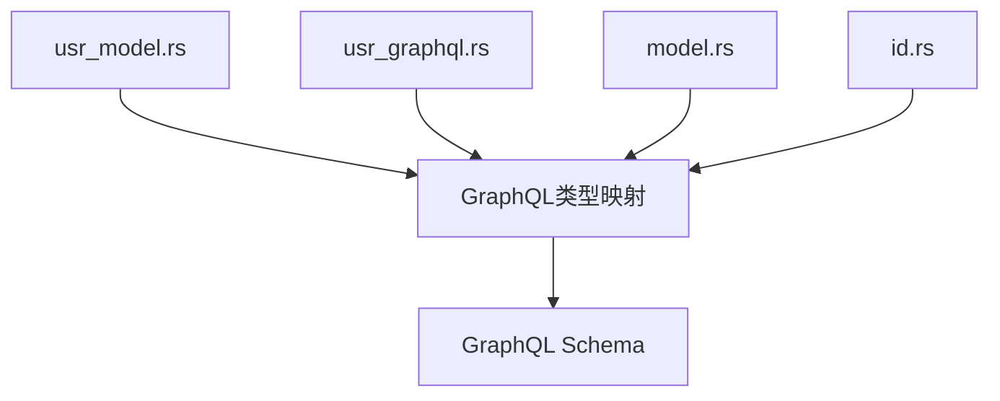
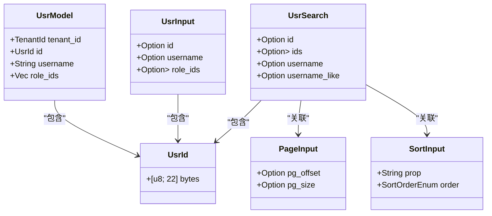
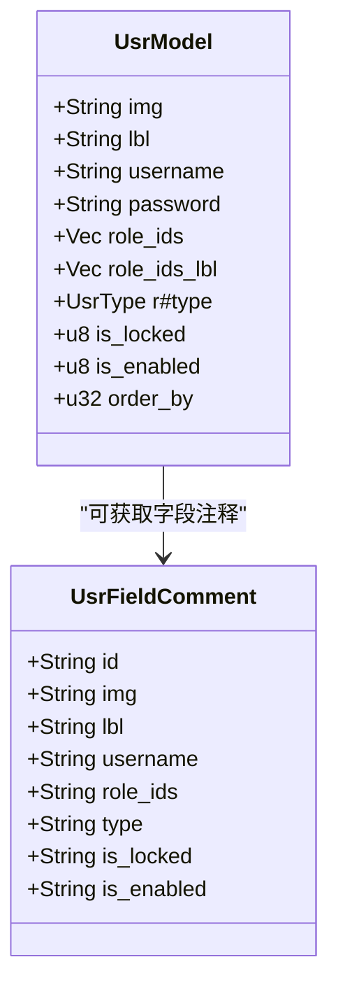
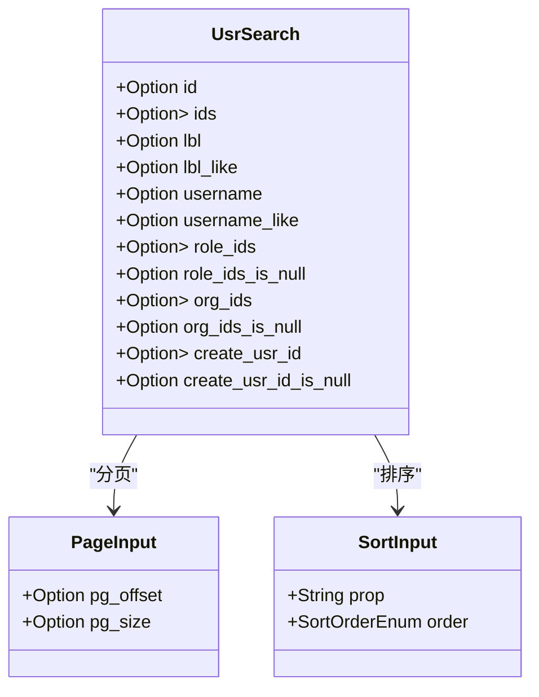
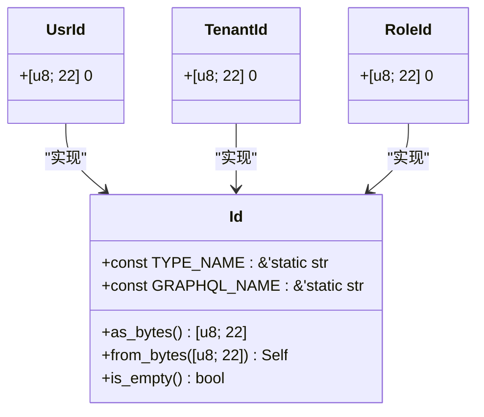
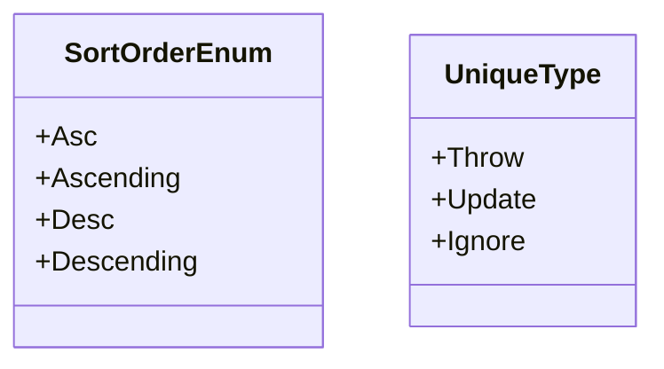
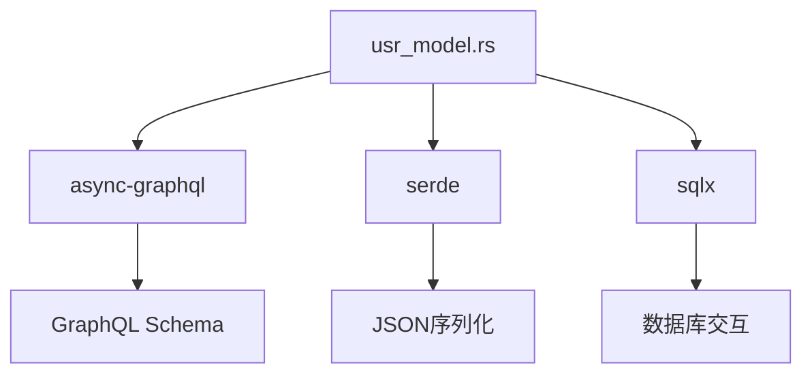

# 类型系统

**本文档引用的文件**   
- [usr_model.rs](https://github.com/sail-sail/nest/blob/main/rust/generated/base/usr/usr_model.rs)
- [usr_graphql.rs](https://github.com/sail-sail/nest/blob/main/rust/generated/base/usr/usr_graphql.rs)
- [model.rs](https://github.com/sail-sail/nest/blob/main/rust/generated/common/gql/model.rs)
- [id.rs](https://github.com/sail-sail/nest/blob/main/rust/generated/common/id.rs)
- [schema.rs](https://github.com/sail-sail/nest/blob/main/rust/schema.rs)

## 目录
1. [简介](#简介)
2. [项目结构](#项目结构)
3. [核心组件](#核心组件)
4. [架构概述](#架构概述)
5. [详细组件分析](#详细组件分析)
6. [依赖分析](#依赖分析)
7. [性能考虑](#性能考虑)
8. [故障排除指南](#故障排除指南)
9. [结论](#结论)

## 简介
本文档详细说明了GraphQL类型系统的设计与实现。重点阐述如何从Rust结构体（如usr_model.rs）映射到GraphQL类型，描述标量类型、对象类型、输入类型和枚举类型的定义方式。通过usr_graphql.rs中的具体实现展示类型注册过程，并说明gql/model.rs中公共类型模型的作用。提供类型定义的代码示例，阐述类型安全机制和前后端类型一致性保障策略。

## 项目结构
项目采用分层架构设计，将GraphQL类型系统与数据模型分离。核心类型定义位于`rust/generated/base/usr/`目录下，其中`usr_model.rs`定义了用户相关的数据结构，`usr_graphql.rs`负责GraphQL查询和变更的接口定义。公共类型模型位于`rust/generated/common/gql/`目录下，为整个系统提供统一的类型基础。

**图示来源**
- [usr_model.rs](https://github.com/sail-sail/nest/blob/main/rust/generated/base/usr/usr_model.rs)
- [usr_graphql.rs](https://github.com/sail-sail/nest/blob/main/rust/generated/base/usr/usr_graphql.rs)
- [model.rs](https://github.com/sail-sail/nest/blob/main/rust/generated/common/gql/model.rs)
- [id.rs](https://github.com/sail-sail/nest/blob/main/rust/generated/common/id.rs)

## 核心组件
核心组件包括用户模型定义、GraphQL查询/变更接口、分页和排序输入类型以及ID类型系统。这些组件共同构成了完整的类型系统，确保前后端数据交互的类型安全性和一致性。

**组件来源**
- [usr_model.rs](https://github.com/sail-sail/nest/blob/main/rust/generated/base/usr/usr_model.rs#L0-L799)
- [usr_graphql.rs](https://github.com/sail-sail/nest/blob/main/rust/generated/base/usr/usr_graphql.rs#L0-L428)
- [model.rs](https://github.com/sail-sail/nest/blob/main/rust/generated/common/gql/model.rs#L0-L71)

## 架构概述
系统采用基于async-graphql库的类型驱动设计，通过Rust的derive宏自动生成GraphQL类型。类型系统分为三层：基础标量类型、复合对象类型和操作接口类型。所有类型都遵循严格的命名规范和序列化规则，确保跨语言兼容性。

**图示来源**
- [usr_model.rs](https://github.com/sail-sail/nest/blob/main/rust/generated/base/usr/usr_model.rs#L0-L799)
- [model.rs](https://github.com/sail-sail/nest/blob/main/rust/generated/common/gql/model.rs#L0-L71)
- [id.rs](https://github.com/sail-sail/nest/blob/main/rust/generated/common/id.rs#L0-L332)

## 详细组件分析
### 用户模型分析
用户模型定义了系统中用户实体的完整数据结构，包括基本信息、权限配置和审计字段。通过GraphQL属性宏控制字段的序列化行为和API暴露策略。

#### 对象类型定义

**图示来源**
- [usr_model.rs](https://github.com/sail-sail/nest/blob/main/rust/generated/base/usr/usr_model.rs#L0-L799)

**组件来源**
- [usr_model.rs](https://github.com/sail-sail/nest/blob/main/rust/generated/base/usr/usr_model.rs#L0-L799)

### 输入类型分析
输入类型系统支持灵活的查询条件和分页排序功能，确保API的可用性和性能。

#### 查询输入类型

**图示来源**
- [usr_model.rs](https://github.com/sail-sail/nest/blob/main/rust/generated/base/usr/usr_model.rs#L0-L799)
- [model.rs](https://github.com/sail-sail/nest/blob/main/rust/generated/common/gql/model.rs#L0-L71)

**组件来源**
- [usr_model.rs](https://github.com/sail-sail/nest/blob/main/rust/generated/base/usr/usr_model.rs#L0-L799)
- [model.rs](https://github.com/sail-sail/nest/blob/main/rust/generated/common/gql/model.rs#L0-L71)

### 标量类型分析
ID类型系统实现了统一的22字节标识符处理，确保全局唯一性和类型安全。

#### ID类型实现

**图示来源**
- [id.rs](https://github.com/sail-sail/nest/blob/main/rust/generated/common/id.rs#L0-L332)

**组件来源**
- [id.rs](https://github.com/sail-sail/nest/blob/main/rust/generated/common/id.rs#L0-L332)

### 枚举类型分析
排序顺序枚举提供了标准化的排序方向定义，确保API一致性。

#### 排序枚举定义

**图示来源**
- [model.rs](https://github.com/sail-sail/nest/blob/main/rust/generated/common/gql/model.rs#L0-L71)

**组件来源**
- [model.rs](https://github.com/sail-sail/nest/blob/main/rust/generated/common/gql/model.rs#L0-L71)

## 依赖分析
类型系统依赖于多个关键组件，包括async-graphql库、serde序列化框架和sqlx数据库驱动。这些依赖共同确保了类型在不同层之间的正确转换和验证。

**图示来源**
- [usr_model.rs](https://github.com/sail-sail/nest/blob/main/rust/generated/base/usr/usr_model.rs)
- [id.rs](https://github.com/sail-sail/nest/blob/main/rust/generated/common/id.rs)

**组件来源**
- [usr_model.rs](https://github.com/sail-sail/nest/blob/main/rust/generated/base/usr/usr_model.rs#L0-L799)
- [id.rs](https://github.com/sail-sail/nest/blob/main/rust/generated/common/id.rs#L0-L332)

## 性能考虑
类型系统设计考虑了序列化性能和内存使用效率。通过零拷贝字符串处理和预分配缓冲区优化关键路径的性能表现。ID类型的22字节固定长度设计既保证了唯一性，又避免了可变长度字符串的性能开销。

## 故障排除指南
常见问题包括类型映射错误、序列化失败和GraphQL查询验证错误。建议检查字段命名一致性、确保所有必需的derive宏已正确应用，并验证ID格式是否符合22字节要求。

**组件来源**
- [usr_model.rs](https://github.com/sail-sail/nest/blob/main/rust/generated/base/usr/usr_model.rs#L0-L799)
- [id.rs](https://github.com/sail-sail/nest/blob/main/rust/generated/common/id.rs#L0-L332)

## 结论
本文档详细阐述了GraphQL类型系统的设计与实现，展示了从Rust结构体到GraphQL类型的完整映射过程。通过统一的类型定义和严格的验证机制，确保了系统的类型安全性和前后端一致性。建议在扩展系统时遵循现有模式，保持类型定义的一致性和可维护性。