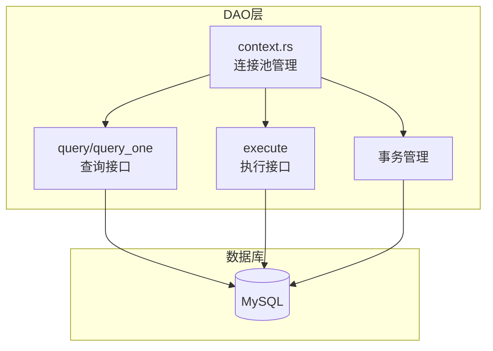
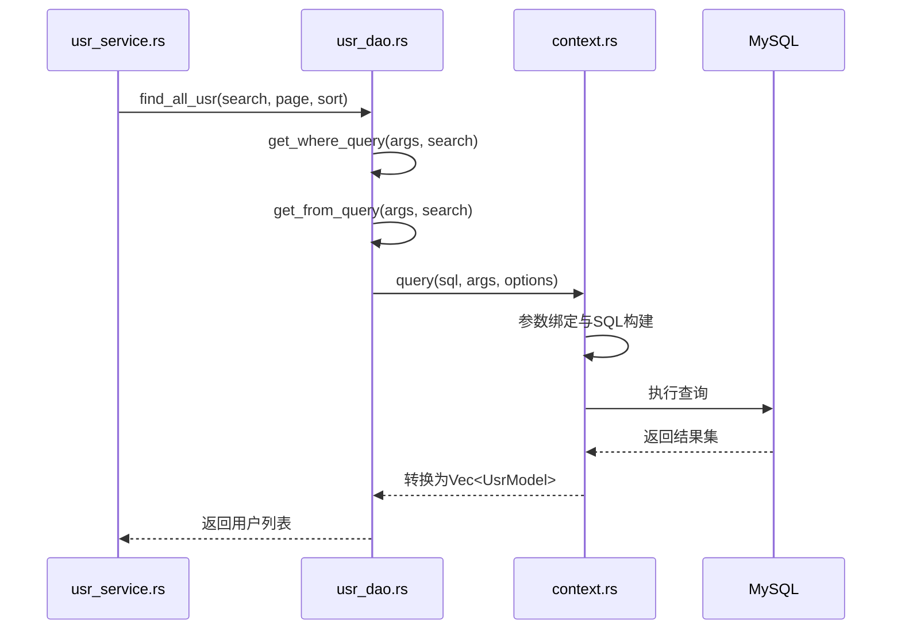
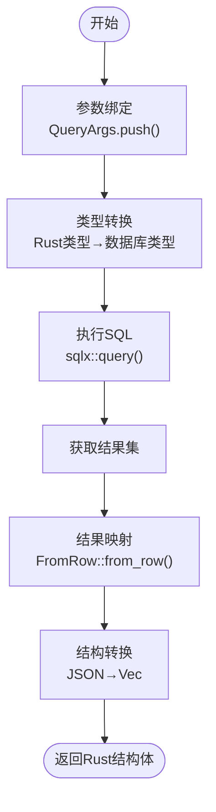
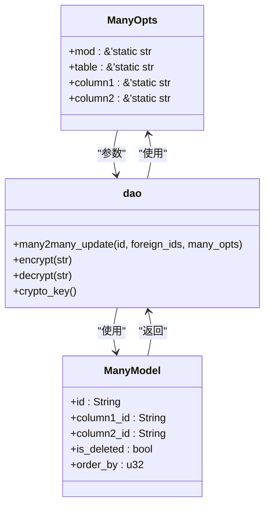

# DAO层设计与实现

**本文档引用的文件**  
- [usr_dao.rs](https://github.com/sail-sail/nest/blob/main/rust\generated\base\usr\usr_dao.rs)
- [dao.rs](https://github.com/sail-sail/nest/blob/main/rust\generated\common\util\dao.rs)
- [context.rs](https://github.com/sail-sail/nest/blob/main/rust\generated\common\context.rs)
- [usr_model.rs](https://github.com/sail-sail/nest/blob/main/rust\generated\base\usr\usr_model.rs)
- [usr_service.rs](https://github.com/sail-sail/nest/blob/main/rust\generated\base\usr\usr_service.rs)
- [string.rs](https://github.com/sail-sail/nest/blob/main/rust\generated\common\util\string.rs)

## 目录
1. [DAO层概述](#dao层概述)
2. [核心职责与架构](#核心职责与架构)
3. [CRUD操作实现](#crud操作实现)
4. [usr_dao.rs查询方法分析](#usr_dao.rs查询方法分析)
5. [参数绑定与结果映射](#参数绑定与结果映射)
6. [异步运行时集成](#异步运行时集成)
7. [通用DAO工具函数](#通用dao工具函数)
8. [调用模式与错误处理](#调用模式与错误处理)

## DAO层概述

DAO（Data Access Object）层是本系统中负责数据持久化的核心组件，封装了所有与数据库交互的逻辑。该层通过Rust的异步特性与SQLx库实现高效的数据访问，为上层业务逻辑提供统一的数据操作接口。DAO层的设计遵循单一职责原则，每个数据表对应一个DAO模块，如`usr_dao.rs`专门处理用户表的数据库操作。

**本节来源**
- [usr_dao.rs](https://github.com/sail-sail/nest/blob/main/rust\generated\base\usr\usr_dao.rs)
- [context.rs](https://github.com/sail-sail/nest/blob/main/rust\generated\common\context.rs)

## 核心职责与架构

DAO层的核心职责包括数据库连接管理、SQL执行、事务处理和结果映射。系统通过`context.rs`中的全局连接池实现数据库连接管理，使用`sqlx::Pool<MySql>`维护连接池，确保高并发下的连接复用。事务处理通过`Ctx`结构体的事务锁实现，支持嵌套事务和自动提交/回滚。整个DAO层采用模块化设计，每个业务模块（如用户、角色、部门）都有独立的DAO实现，通过`mod.rs`文件统一导出。

**图示来源**
- [context.rs](https://github.com/sail-sail/nest/blob/main/rust\generated\common\context.rs)

**本节来源**
- [context.rs](https://github.com/sail-sail/nest/blob/main/rust\generated\common\context.rs)

## CRUD操作实现

DAO层完整实现了标准的CRUD操作。创建操作通过`insert`语句实现，支持批量插入；读取操作包括`find_by_id`、`find_all`等方法，支持复杂查询条件；更新操作采用`update`语句，支持条件更新；删除操作实现软删除，通过设置`is_deleted`标志位而非物理删除。所有操作都通过参数化查询防止SQL注入，使用`QueryArgs`结构体管理查询参数。

**本节来源**
- [usr_dao.rs](https://github.com/sail-sail/nest/blob/main/rust\generated\base\usr\usr_dao.rs)
- [context.rs](https://github.com/sail-sail/nest/blob/main/rust\generated\common\context.rs)

## usr_dao.rs查询方法分析

`usr_dao.rs`中的查询方法体现了DAO层的设计精髓。以`find_all_usr`为例，该方法接收搜索条件、分页参数和排序参数，构建复杂的SQL查询。查询条件通过`get_where_query`函数生成，支持字段精确匹配、模糊匹配、范围查询等多种条件。分页通过`get_page_query`实现，排序通过`get_order_by_query`处理。该方法还包含输入验证，如对`ids`长度进行限制，防止恶意查询。

**图示来源**
- [usr_dao.rs](https://github.com/sail-sail/nest/blob/main/rust\generated\base\usr\usr_dao.rs)
- [context.rs](https://github.com/sail-sail/nest/blob/main/rust\generated\common\context.rs)

**本节来源**
- [usr_dao.rs](https://github.com/sail-sail/nest/blob/main/rust\generated\base\usr\usr_dao.rs)
- [usr_service.rs](https://github.com/sail-sail/nest/blob/main/rust\generated\base\usr\usr_service.rs)

## 参数绑定与结果映射

DAO层通过`QueryArgs`结构体实现安全的参数绑定，将Rust类型转换为数据库可识别的类型。结果映射通过实现`FromRow` trait完成，`usr_model.rs`中的`UsrModel`结构体定义了从数据库行到Rust结构体的转换逻辑。对于JSON字段（如`role_ids`），DAO层实现了特殊的解析逻辑，将JSON对象转换为有序的向量。参数绑定和结果映射都通过泛型和trait实现，确保类型安全。

**图示来源**
- [usr_model.rs](https://github.com/sail-sail/nest/blob/main/rust\generated\base\usr\usr_model.rs)
- [context.rs](https://github.com/sail-sail/nest/blob/main/rust\generated\common\context.rs)

**本节来源**
- [usr_model.rs](https://github.com/sail-sail/nest/blob/main/rust\generated\base\usr\usr_model.rs)
- [context.rs](https://github.com/sail-sail/nest/blob/main/rust\generated\common\context.rs)

## 异步运行时集成

DAO层完全基于异步运行时设计，所有数据库操作都返回`Result<T>`类型的`Future`。系统使用Tokio作为异步运行时，通过`async/await`语法简化异步编程。连接池操作、查询执行、结果处理都在异步上下文中完成，确保高并发性能。`context.rs`中的`CTX` task-local变量存储了请求上下文，包括认证信息、请求ID等，支持跨异步任务的数据传递。

**本节来源**
- [context.rs](https://github.com/sail-sail/nest/blob/main/rust\generated\common\context.rs)
- [usr_dao.rs](https://github.com/sail-sail/nest/blob/main/rust\generated\base\usr\usr_dao.rs)

## 通用DAO工具函数

`common/util/dao.rs`提供了多个通用工具函数，被各模块复用。`many2many_update`函数处理多对多关系的更新，通过比较新旧ID列表，生成相应的插入、更新和删除操作。`encrypt`和`decrypt`函数提供AES-128-CBC加密解密功能，用于敏感数据保护。这些工具函数通过`OnceLock`实现单例模式，确保配置的全局一致性，提高了代码的复用性和安全性。

**图示来源**
- [dao.rs](https://github.com/sail-sail/nest/blob/main/rust\generated\common\util\dao.rs)

**本节来源**
- [dao.rs](https://github.com/sail-sail/nest/blob/main/rust\generated\common\util\dao.rs)
- [string.rs](https://github.com/sail-sail/nest/blob/main/rust\generated\common\util\string.rs)

## 调用模式与错误处理

DAO方法的调用遵循统一的模式：接收业务参数，构建查询，执行操作，处理结果。错误处理通过`color-eyre`库实现，提供详细的错误信息和调用栈。所有数据库异常都被转换为`Result<T>`类型，由上层服务决定如何处理。对于特定业务规则（如锁定用户不可修改），DAO层会抛出带有明确错误信息的异常。日志记录通过`tracing`库实现，包含请求ID，便于问题追踪。

**本节来源**
- [usr_dao.rs](https://github.com/sail-sail/nest/blob/main/rust\generated\base\usr\usr_dao.rs)
- [context.rs](https://github.com/sail-sail/nest/blob/main/rust\generated\common\context.rs)
- [usr_service.rs](https://github.com/sail-sail/nest/blob/main/rust\generated\base\usr\usr_service.rs)