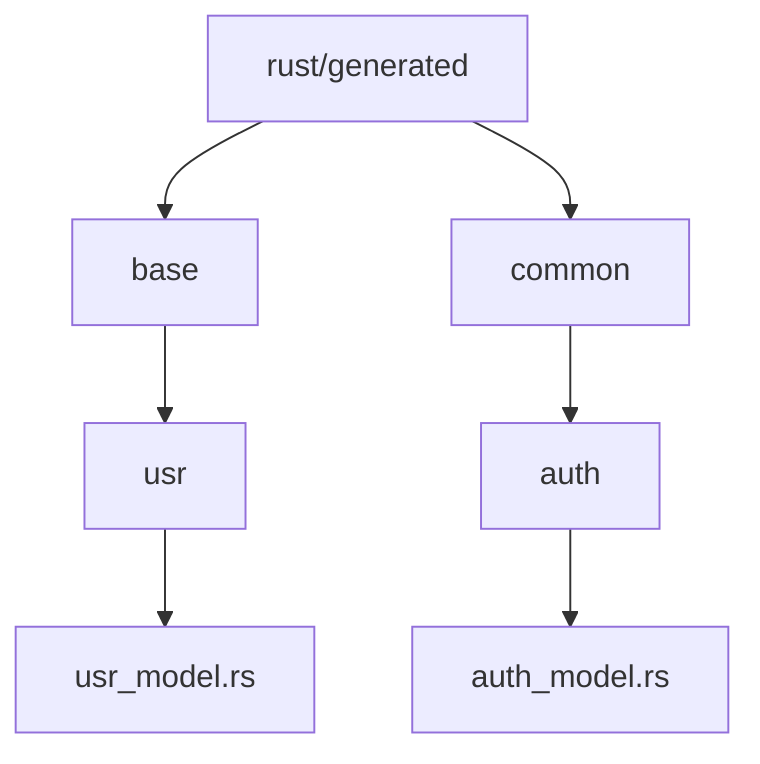
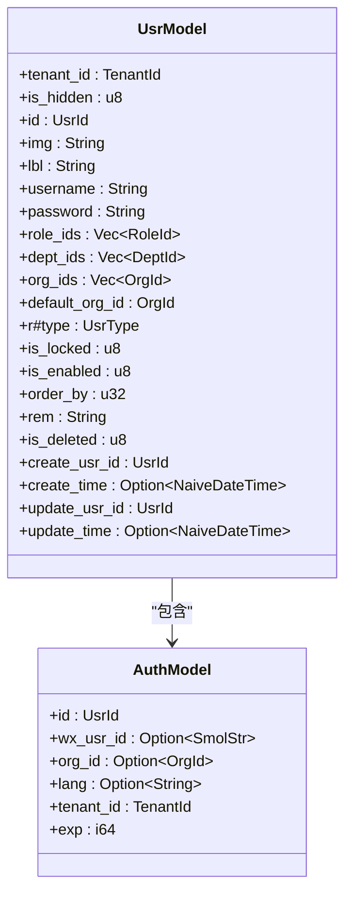
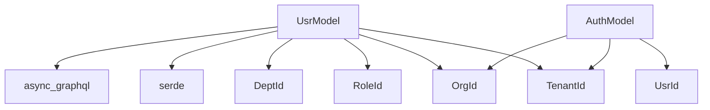

# Model层数据结构定义

**本文档引用的文件**
- [usr_model.rs](https://github.com/sail-sail/nest/blob/main/rust/generated/base/usr/usr_model.rs)
- [auth_model.rs](https://github.com/sail-sail/nest/blob/main/rust/generated/common/auth/auth_model.rs)

## 目录
1. [引言](#引言)
2. [项目结构](#项目结构)
3. [核心组件](#核心组件)
4. [架构概述](#架构概述)
5. [详细组件分析](#详细组件分析)
6. [依赖分析](#依赖分析)
7. [性能考虑](#性能考虑)
8. [故障排除指南](#故障排除指南)
9. [结论](#结论)

## 引言
本文件旨在详细阐述系统中Model层的数据结构设计，重点分析用户数据模型（User）的字段定义、属性注解和序列化配置。通过深入解析`usr_model.rs`中的`UsrModel`结构体，说明其在系统中的核心作用。同时，以`auth_model.rs`为例，展示通用模型如何被多个模块复用。文档还将涵盖数据验证规则、默认值设置、时间戳处理等关键细节，并提供UML类图直观展示核心实体及其关系。

## 项目结构
Model层主要位于`rust/generated`目录下，按功能模块组织。核心用户模型定义在`base/usr/usr_model.rs`中，而通用认证模型则位于`common/auth/auth_model.rs`。这种分层结构实现了业务模型与通用模型的分离，提高了代码的可维护性和复用性。

**图示来源**
- [usr_model.rs](https://github.com/sail-sail/nest/blob/main/rust/generated/base/usr/usr_model.rs)
- [auth_model.rs](https://github.com/sail-sail/nest/blob/main/rust/generated/common/auth/auth_model.rs)

**本节来源**
- [usr_model.rs](https://github.com/sail-sail/nest/blob/main/rust/generated/base/usr/usr_model.rs)
- [auth_model.rs](https://github.com/sail-sail/nest/blob/main/rust/generated/common/auth/auth_model.rs)

## 核心组件
Model层作为系统数据结构的基石，负责定义和管理所有核心数据实体。`UsrModel`结构体是系统中最复杂的模型之一，包含了用户的所有属性信息，从基本的用户名、密码到复杂的组织、角色关联关系。该模型通过derive宏实现了自动序列化/反序列化，简化了数据转换过程。

**本节来源**
- [usr_model.rs](https://github.com/sail-sail/nest/blob/main/rust/generated/base/usr/usr_model.rs#L1-L100)

## 架构概述
Model层采用Rust的结构体和derive宏来实现数据模型的定义和序列化。通过`serde`库实现JSON序列化，`async-graphql`库支持GraphQL接口的数据传输。模型与数据库表的映射关系通过`FromRow` trait实现，确保了数据在数据库和应用层之间的无缝转换。

**图示来源**
- [usr_model.rs](https://github.com/sail-sail/nest/blob/main/rust/generated/base/usr/usr_model.rs#L50-L200)
- [auth_model.rs](https://github.com/sail-sail/nest/blob/main/rust/generated/common/auth/auth_model.rs#L10-L20)

## 详细组件分析
### UsrModel分析
`UsrModel`结构体定义了用户实体的完整数据结构，每个字段都有明确的业务含义和数据类型选择依据。通过`#[graphql]`属性注解，实现了字段名的重命名和API级别的访问控制。

#### 字段定义与业务含义
- **id**: 用户唯一标识符，使用`UsrId`类型确保全局唯一性
- **username**: 用户名，用于系统登录和身份识别
- **password**: 密码字段，存储加密后的密码信息
- **role_ids**: 所属角色列表，支持用户多角色分配
- **dept_ids**: 所属部门列表，支持用户跨部门工作
- **org_ids**: 所属组织列表，支持用户在多个组织中任职
- **default_org_id**: 默认组织，用户登录后默认进入的组织
- **create_time/update_time**: 时间戳字段，记录数据的创建和更新时间

#### 序列化配置
通过`#[derive(Serialize, Deserialize)]`宏，`UsrModel`实现了自动的JSON序列化和反序列化。`#[serde(skip_serializing_if = "Option::is_none")]`注解确保了可选字段在值为None时不参与序列化，减少了网络传输的数据量。

**本节来源**
- [usr_model.rs](https://github.com/sail-sail/nest/blob/main/rust/generated/base/usr/usr_model.rs#L50-L500)

### AuthModel分析
`AuthModel`作为通用认证模型，被多个模块复用。该模型精简了用户认证所需的核心信息，包括用户ID、租户ID、过期时间等，适用于JWT令牌的载荷数据。

#### 复用机制
通过将认证相关的通用字段提取到`common`目录下，实现了跨模块的代码复用。`AuthModel`不仅用于用户认证，还可扩展用于第三方登录、API密钥认证等场景。

**本节来源**
- [auth_model.rs](https://github.com/sail-sail/nest/blob/main/rust/generated/common/auth/auth_model.rs#L1-L38)

## 依赖分析
Model层与其他组件存在紧密的依赖关系。`UsrModel`依赖于`TenantId`、`RoleId`、`DeptId`、`OrgId`等ID类型，这些类型定义在相应的模块中。同时，Model层依赖`serde`、`async-graphql`等外部库实现序列化和API支持。

**图示来源**
- [usr_model.rs](https://github.com/sail-sail/nest/blob/main/rust/generated/base/usr/usr_model.rs#L10-L30)
- [auth_model.rs](https://github.com/sail-sail/nest/blob/main/rust/generated/common/auth/auth_model.rs#L5-L10)

**本节来源**
- [usr_model.rs](https://github.com/sail-sail/nest/blob/main/rust/generated/base/usr/usr_model.rs#L1-L50)
- [auth_model.rs](https://github.com/sail-sail/nest/blob/main/rust/generated/common/auth/auth_model.rs#L1-L20)

## 性能考虑
Model层的设计充分考虑了性能因素。通过使用`OnceLock`缓存排序字段列表，避免了重复计算。时间戳字段采用`Option<chrono::NaiveDateTime>`类型，既保证了精度又支持空值处理。对于大型JSON字段如`role_ids`，采用`HashMap`存储并按顺序排序，确保了数据的一致性和查询效率。

## 故障排除指南
当遇到Model层相关问题时，可参考以下排查步骤：
1. 检查字段注解是否正确，特别是`#[graphql(skip)]`字段是否被意外暴露
2. 验证序列化配置，确保可选字段的`skip_serializing_if`设置正确
3. 检查`FromRow`实现，确保数据库字段与模型字段的映射关系正确
4. 确认ID类型的一致性，避免不同模块间的ID类型冲突

**本节来源**
- [usr_model.rs](https://github.com/sail-sail/nest/blob/main/rust/generated/base/usr/usr_model.rs#L200-L300)
- [auth_model.rs](https://github.com/sail-sail/nest/blob/main/rust/generated/common/auth/auth_model.rs#L20-L30)

## 结论
Model层通过精心设计的数据结构和高效的序列化机制，为系统提供了稳定可靠的数据基础。`UsrModel`的复杂字段设计满足了企业级应用的多样化需求，而`AuthModel`的通用性设计则提高了代码的复用率。未来可进一步优化大型JSON字段的存储和查询性能，提升系统的整体响应速度。