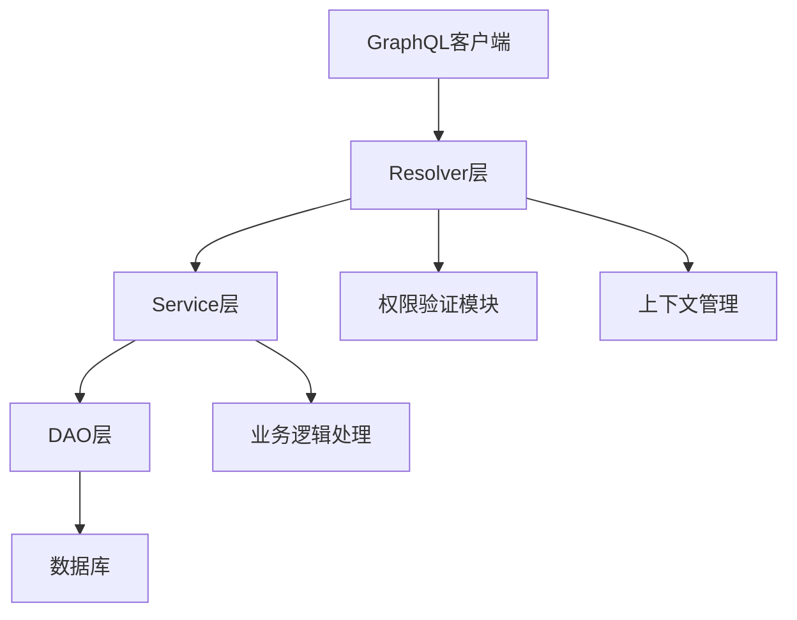
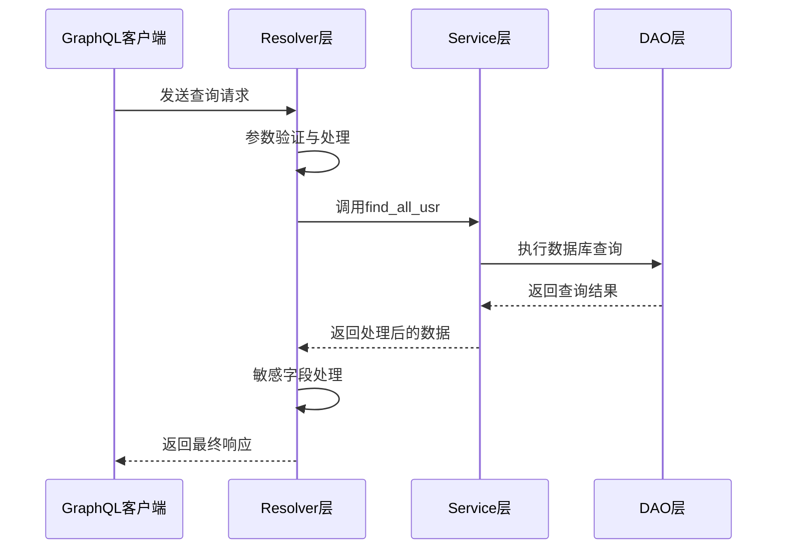
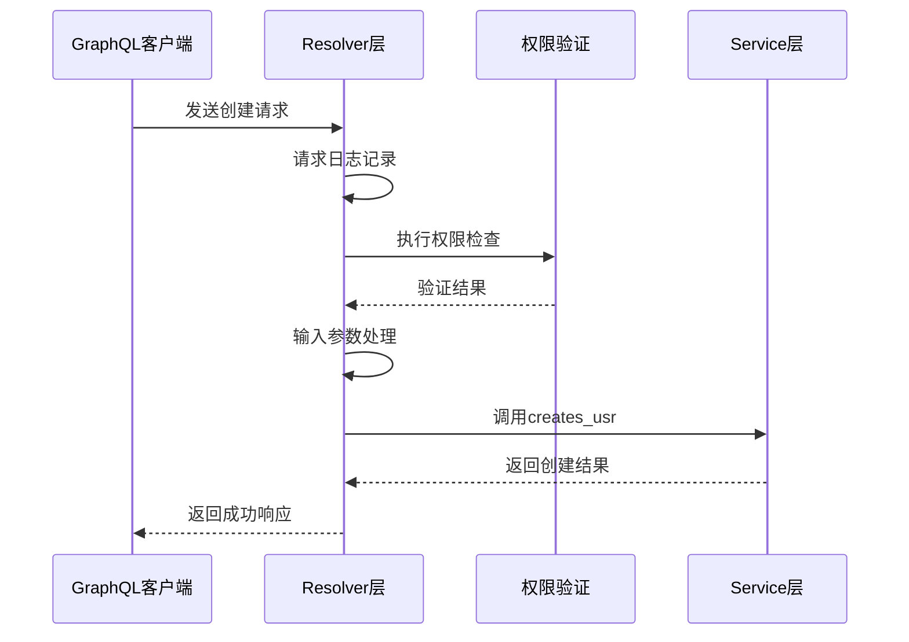
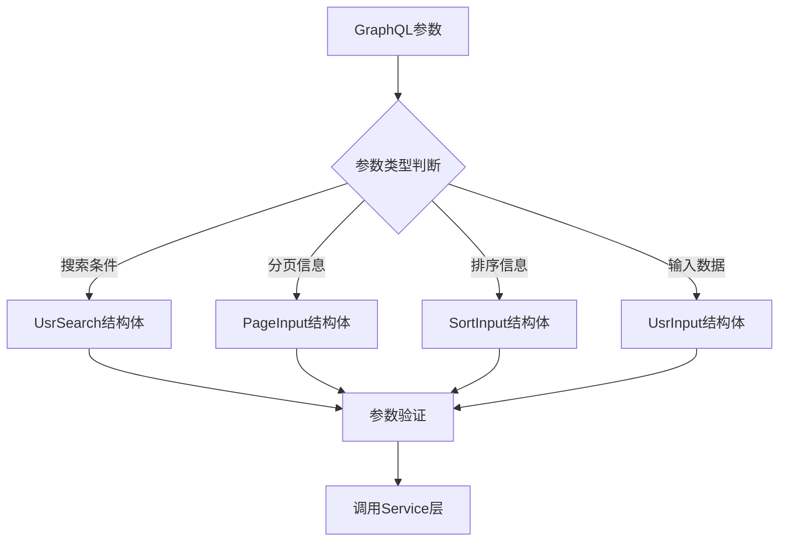
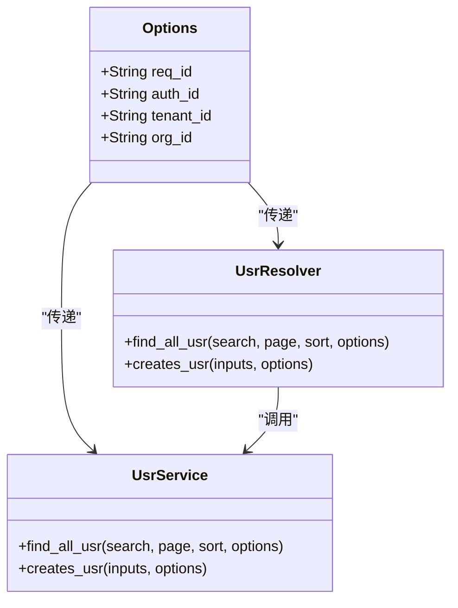
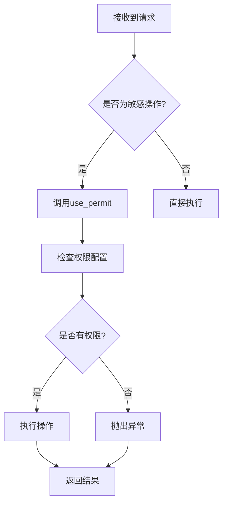
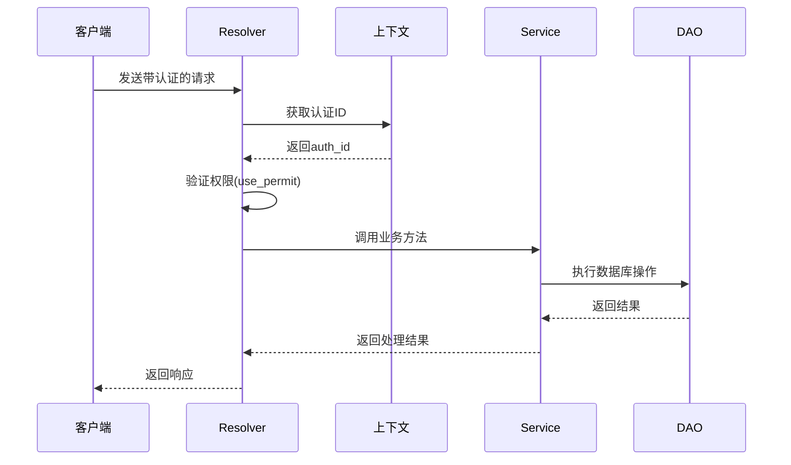
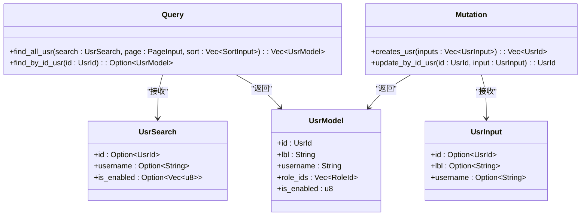

# Resolver层与GraphQL集成


**本文档引用的文件**  
- [usr_resolver.rs](https://github.com/sail-sail/nest/blob/main/rust\generated\base\usr\usr_resolver.rs)
- [usr_service.rs](https://github.com/sail-sail/nest/blob/main/rust\generated\base\usr\usr_service.rs)
- [usr_model.rs](https://github.com/sail-sail/nest/blob/main/rust\generated\base\usr\usr_model.rs)
- [schema.rs](https://github.com/sail-sail/nest/blob/main/rust\schema.rs)


## 目录
1. [简介](#简介)
2. [Resolver层架构概述](#resolver层架构概述)
3. [查询与变更操作实现分析](#查询与变更操作实现分析)
4. [参数解包与上下文传递机制](#参数解包与上下文传递机制)
5. [认证与权限验证处理](#认证与权限验证处理)
6. [GraphQL Schema与Rust代码映射关系](#graphql-schema与rust代码映射关系)
7. [实际GraphQL查询示例](#实际graphql查询示例)
8. [结论](#结论)

## 简介
Resolver层作为GraphQL接口的核心组件，负责将GraphQL查询请求转换为对后端Service层的调用。该层实现了查询解析、参数处理、权限验证和响应构建等关键功能，是前后端数据交互的桥梁。

## Resolver层架构概述



**图示来源**  
- [usr_resolver.rs](https://github.com/sail-sail/nest/blob/main/rust\generated\base\usr\usr_resolver.rs#L1-L602)
- [usr_service.rs](https://github.com/sail-sail/nest/blob/main/rust\generated\base\usr\usr_service.rs#L1-L415)

**本节来源**  
- [usr_resolver.rs](https://github.com/sail-sail/nest/blob/main/rust\generated\base\usr\usr_resolver.rs#L1-L602)

## 查询与变更操作实现分析

### 查询操作实现
`find_all_usr`函数实现了用户列表查询功能，接收搜索条件、分页和排序参数，调用Service层进行数据检索。



**图示来源**  
- [usr_resolver.rs](https://github.com/sail-sail/nest/blob/main/rust\generated\base\usr\usr_resolver.rs#L15-L45)
- [usr_service.rs](https://github.com/sail-sail/nest/blob/main/rust\generated\base\usr\usr_service.rs#L50-L70)

### 变更操作实现
`creates_usr`函数处理用户创建请求，体现了变更操作的特点：需要权限验证、输入处理和事务管理。



**图示来源**  
- [usr_resolver.rs](https://github.com/sail-sail/nest/blob/main/rust\generated\base\usr\usr_resolver.rs#L250-L280)
- [usr_service.rs](https://github.com/sail-sail/nest/blob/main/rust\generated\base\usr\usr_service.rs#L200-L220)

**本节来源**  
- [usr_resolver.rs](https://github.com/sail-sail/nest/blob/main/rust\generated\base\usr\usr_resolver.rs#L15-L300)
- [usr_service.rs](https://github.com/sail-sail/nest/blob/main/rust\generated\base\usr\usr_service.rs#L50-L250)

## 参数解包与上下文传递机制

### 参数解包流程
Resolver层接收GraphQL查询中的参数，并将其转换为Service层可处理的格式。



**图示来源**  
- [usr_resolver.rs](https://github.com/sail-sail/nest/blob/main/rust\generated\base\usr\usr_resolver.rs#L20-L50)
- [usr_model.rs](https://github.com/sail-sail/nest/blob/main/rust\generated\base\usr\usr_model.rs#L500-L600)

### 上下文传递
通过Options参数传递请求上下文信息，包括认证信息、租户ID等。



**图示来源**  
- [usr_resolver.rs](https://github.com/sail-sail/nest/blob/main/rust\generated\base\usr\usr_resolver.rs#L15-L25)
- [usr_service.rs](https://github.com/sail-sail/nest/blob/main/rust\generated\base\usr\usr_service.rs#L10-L20)
- [usr_model.rs](https://github.com/sail-sail/nest/blob/main/rust\generated\base\usr\usr_model.rs#L1-L50)

**本节来源**  
- [usr_resolver.rs](https://github.com/sail-sail/nest/blob/main/rust\generated\base\usr\usr_resolver.rs#L15-L100)
- [usr_service.rs](https://github.com/sail-sail/nest/blob/main/rust\generated\base\usr\usr_service.rs#L10-L50)
- [usr_model.rs](https://github.com/sail-sail/nest/blob/main/rust\generated\base\usr\usr_model.rs#L1-L100)

## 认证与权限验证处理

### 权限验证流程
Resolver层在执行敏感操作前进行权限验证，确保操作的合法性。



**图示来源**  
- [usr_resolver.rs](https://github.com/sail-sail/nest/blob/main/rust\generated\base\usr\usr_resolver.rs#L260-L270)
- [usr_service.rs](https://github.com/sail-sail/nest/blob/main/rust\generated\base\usr\usr_service.rs#L210-L220)

### 认证信息处理
在Resolver层处理认证相关信息，确保操作的安全性。



**图示来源**  
- [usr_resolver.rs](https://github.com/sail-sail/nest/blob/main/rust\generated\base\usr\usr_resolver.rs#L250-L280)
- [usr_service.rs](https://github.com/sail-sail/nest/blob/main/rust\generated\base\usr\usr_service.rs#L200-L230)

**本节来源**  
- [usr_resolver.rs](https://github.com/sail-sail/nest/blob/main/rust\generated\base\usr\usr_resolver.rs#L250-L300)
- [usr_service.rs](https://github.com/sail-sail/nest/blob/main/rust\generated\base\usr\usr_service.rs#L200-L250)

## GraphQL Schema与Rust代码映射关系

### 类型定义映射
GraphQL Schema中的类型与Rust结构体之间的对应关系。



**图示来源**  
- [schema.rs](https://github.com/sail-sail/nest/blob/main/rust\schema.rs#L1-L36)
- [usr_model.rs](https://github.com/sail-sail/nest/blob/main/rust\generated\base\usr\usr_model.rs#L50-L150)
- [usr_resolver.rs](https://github.com/sail-sail/nest/blob/main/rust\generated\base\usr\usr_resolver.rs#L15-L30)

### 字段映射规则
GraphQL字段与Rust字段的命名转换规则。

| GraphQL字段名 | Rust字段名 | 转换规则 |
|--------------|-----------|---------|
| img | img | 直接映射 |
| lbl | lbl | 直接映射 |
| username | username | 直接映射 |
| role_ids | role_ids | 直接映射 |
| is_locked | is_locked | 直接映射 |

**本节来源**  
- [schema.rs](https://github.com/sail-sail/nest/blob/main/rust\schema.rs#L1-L36)
- [usr_model.rs](https://github.com/sail-sail/nest/blob/main/rust\generated\base\usr\usr_model.rs#L50-L200)

## 实际GraphQL查询示例

### 查询用户列表
```graphql
query {
  find_all_usr(
    search: {
      username_like: "admin"
      is_enabled: [1]
    }
    page: {
      page: 1
      size: 10
    }
    sort: [
      {
        field: "create_time"
        order: "DESC"
      }
    ]
  ) {
    id
    lbl
    username
    create_time_lbl
    update_time_lbl
  }
}
```

### 创建用户
```graphql
mutation {
  creates_usr(
    inputs: [
      {
        lbl: "新用户"
        username: "newuser"
        password: "password123"
        role_ids: ["1"]
        dept_ids: ["1"]
      }
    ]
  )
}
```

### 更新用户
```graphql
mutation {
  update_by_id_usr(
    id: "1"
    input: {
      lbl: "更新后的名称"
      is_enabled: 1
    }
  )
}
```

**本节来源**  
- [usr_resolver.rs](https://github.com/sail-sail/nest/blob/main/rust\generated\base\usr\usr_resolver.rs#L15-L300)

## 结论
Resolver层作为GraphQL接口的入口，承担着请求解析、权限验证、参数处理和响应构建的重要职责。通过清晰的分层设计和规范的实现模式，确保了系统的安全性和可维护性。开发者在使用时应遵循既定的模式，正确处理参数、权限和上下文信息，以保证系统的稳定运行。