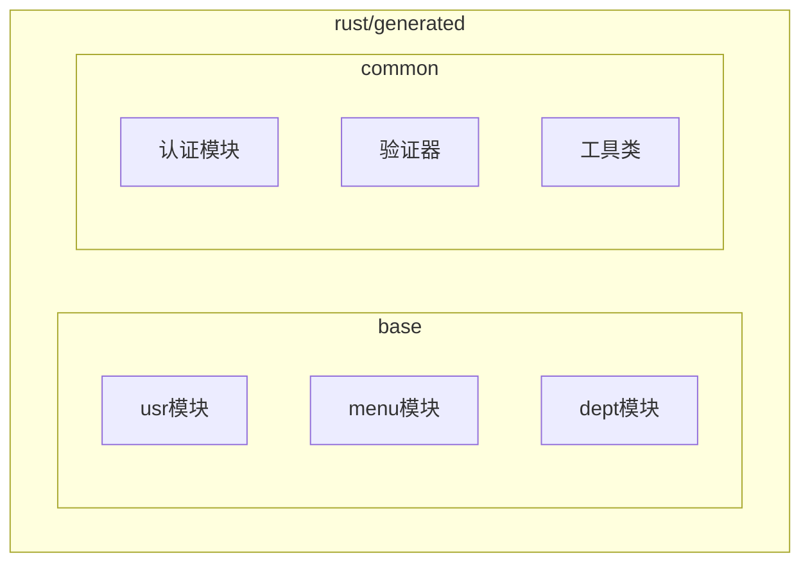
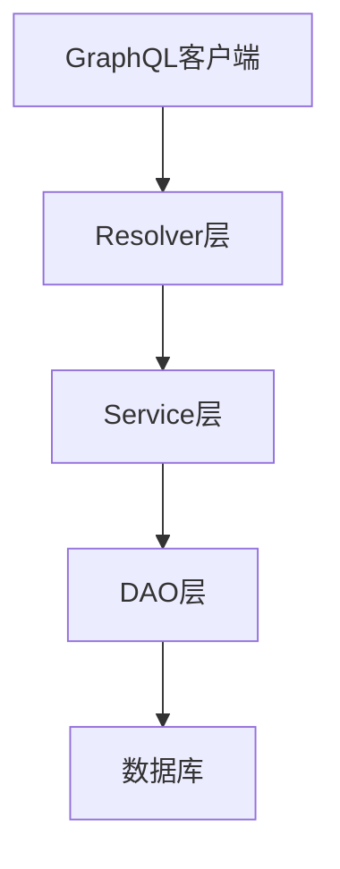
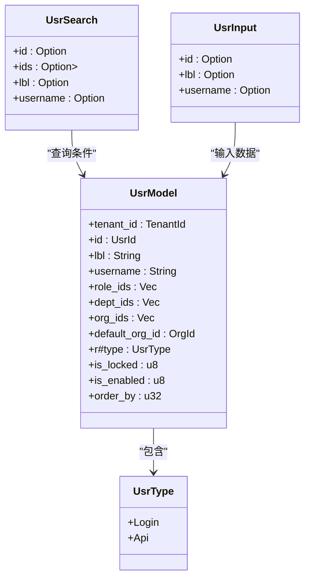
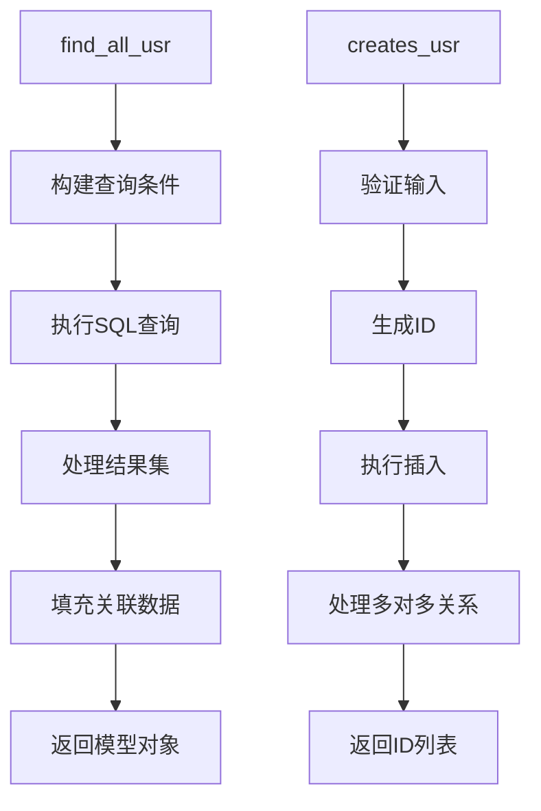
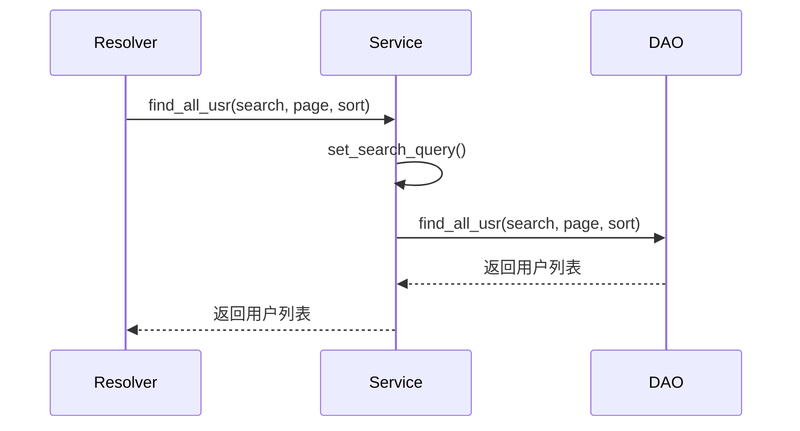
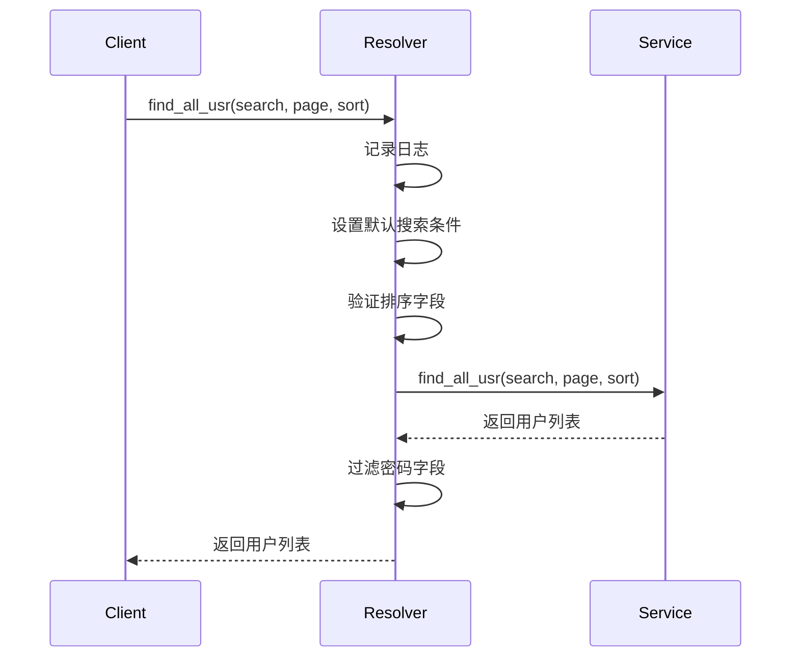
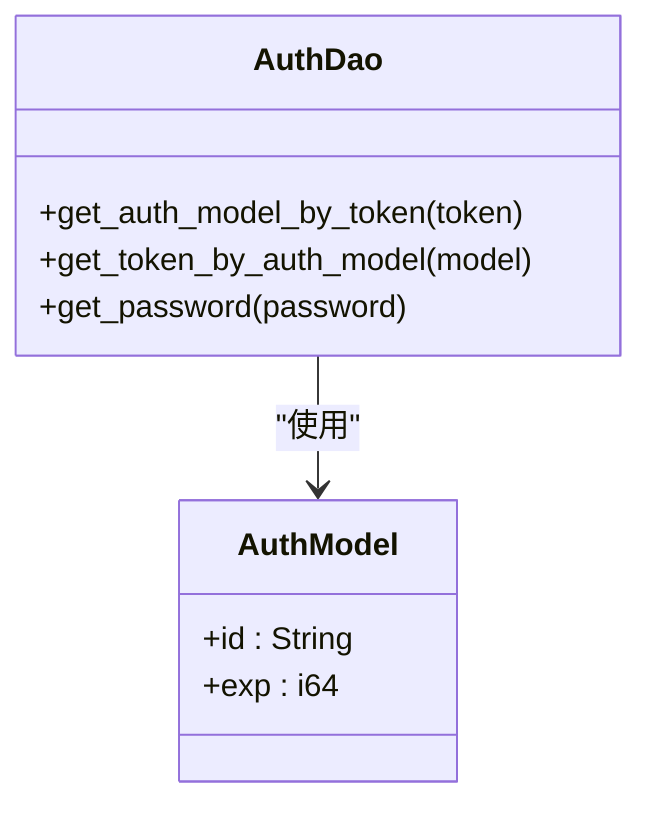
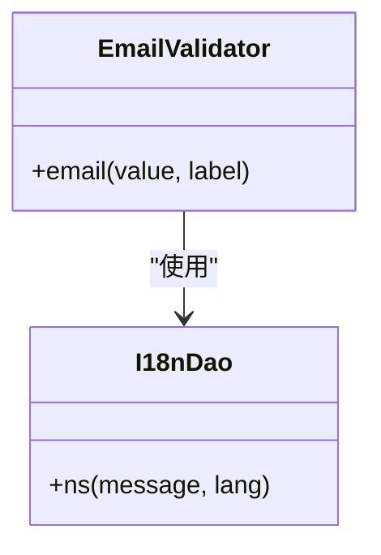
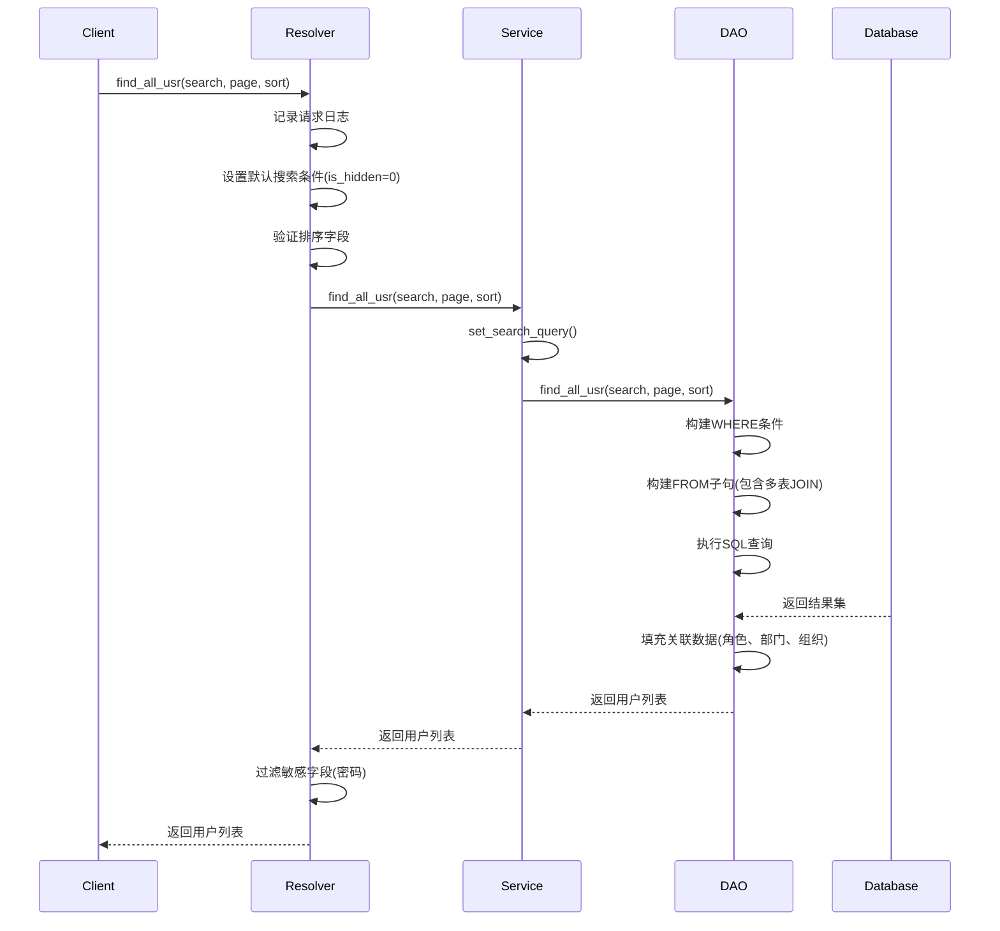

# Rust模块分层架构

**本文档引用的文件**   
- [usr_model.rs](https://github.com/sail-sail/nest/blob/main/rust\generated\base\usr\usr_model.rs)
- [usr_dao.rs](https://github.com/sail-sail/nest/blob/main/rust\generated\base\usr\usr_dao.rs)
- [usr_service.rs](https://github.com/sail-sail/nest/blob/main/rust\generated\base\usr\usr_service.rs)
- [usr_resolver.rs](https://github.com/sail-sail/nest/blob/main/rust\generated\base\usr\usr_resolver.rs)
- [email.rs](https://github.com/sail-sail/nest/blob/main/rust\generated\common\validators\email.rs)
- [auth_dao.rs](https://github.com/sail-sail/nest/blob/main/rust\generated\common\auth\auth_dao.rs)

## 目录
1. [项目结构](#项目结构)
2. [核心分层架构](#核心分层架构)
3. [Model层](#model层)
4. [DAO层](#dao层)
5. [Service层](#service层)
6. [Resolver层](#resolver层)
7. [通用模块复用](#通用模块复用)
8. [调用链分析](#调用链分析)
9. [最佳实践](#最佳实践)

## 项目结构

根据项目目录结构，Rust后端代码主要位于`rust/generated`目录下，采用模块化分层设计。核心业务模块位于`base`目录下，每个业务实体（如usr、menu、dept等）都有独立的模块。每个模块包含四个核心层次：DAO、Service、Resolver和Model。此外，`common`目录提供了跨模块复用的通用功能。

**图源**
- [usr_model.rs](https://github.com/sail-sail/nest/blob/main/rust\generated\base\usr\usr_model.rs)
- [usr_dao.rs](https://github.com/sail-sail/nest/blob/main/rust\generated\base\usr\usr_dao.rs)

**本节来源**
- [usr_model.rs](https://github.com/sail-sail/nest/blob/main/rust\generated\base\usr\usr_model.rs)
- [usr_dao.rs](https://github.com/sail-sail/nest/blob/main/rust\generated\base\usr\usr_dao.rs)

## 核心分层架构

本项目采用典型的四层架构模式，各层职责明确，层次分明：

1. **Model层**：定义数据结构和类型，负责数据的序列化和反序列化
2. **DAO层**：负责数据库的CRUD操作，直接与数据库交互
3. **Service层**：封装核心业务逻辑，协调多个DAO操作
4. **Resolver层**：处理GraphQL请求，进行参数验证和权限控制

这种分层架构实现了关注点分离，提高了代码的可维护性和可测试性。

**图源**
- [usr_resolver.rs](https://github.com/sail-sail/nest/blob/main/rust\generated\base\usr\usr_resolver.rs)
- [usr_service.rs](https://github.com/sail-sail/nest/blob/main/rust\generated\base\usr\usr_service.rs)
- [usr_dao.rs](https://github.com/sail-sail/nest/blob/main/rust\generated\base\usr\usr_dao.rs)

**本节来源**
- [usr_resolver.rs](https://github.com/sail-sail/nest/blob/main/rust\generated\base\usr\usr_resolver.rs)
- [usr_service.rs](https://github.com/sail-sail/nest/blob/main/rust\generated\base\usr\usr_service.rs)

## Model层

Model层位于`usr_model.rs`文件中，主要职责是定义数据结构和类型。该层使用Rust的结构体和枚举来表示业务实体，并通过derive宏自动实现序列化、反序列化和GraphQL相关功能。

**图源**
- [usr_model.rs](https://github.com/sail-sail/nest/blob/main/rust\generated\base\usr\usr_model.rs)

**本节来源**
- [usr_model.rs](https://github.com/sail-sail/nest/blob/main/rust\generated\base\usr\usr_model.rs)

## DAO层

DAO层位于`usr_dao.rs`文件中，负责所有数据库操作。该层直接与数据库交互，执行SQL查询和更新操作。DAO层的主要特点包括：

- 实现了完整的CRUD操作
- 处理复杂的多表关联查询
- 管理数据库事务
- 实现缓存机制
- 处理软删除逻辑

**图源**
- [usr_dao.rs](https://github.com/sail-sail/nest/blob/main/rust\generated\base\usr\usr_dao.rs)

**本节来源**
- [usr_dao.rs](https://github.com/sail-sail/nest/blob/main/rust\generated\base\usr\usr_dao.rs)

## Service层

Service层位于`usr_service.rs`文件中，封装了核心业务逻辑。该层作为DAO层和Resolver层之间的桥梁，主要职责包括：

- 调用DAO层的方法执行数据库操作
- 实现业务规则和验证逻辑
- 处理异常情况
- 协调多个数据访问操作

**图源**
- [usr_service.rs](https://github.com/sail-sail/nest/blob/main/rust\generated\base\usr\usr_service.rs)
- [usr_dao.rs](https://github.com/sail-sail/nest/blob/main/rust\generated\base\usr\usr_dao.rs)

**本节来源**
- [usr_service.rs](https://github.com/sail-sail/nest/blob/main/rust\generated\base\usr\usr_service.rs)

## Resolver层

Resolver层位于`usr_resolver.rs`文件中，负责处理GraphQL请求。该层是外部系统与后端服务的接口，主要职责包括：

- 接收GraphQL查询和变更请求
- 进行参数验证和权限检查
- 调用Service层执行业务逻辑
- 对敏感数据进行过滤
- 记录操作日志

**图源**
- [usr_resolver.rs](https://github.com/sail-sail/nest/blob/main/rust\generated\base\usr\usr_resolver.rs)
- [usr_service.rs](https://github.com/sail-sail/nest/blob/main/rust\generated\base\usr\usr_service.rs)

**本节来源**
- [usr_resolver.rs](https://github.com/sail-sail/nest/blob/main/rust\generated\base\usr\usr_resolver.rs)

## 通用模块复用

`common`目录提供了多个可复用的通用模块，确保架构的一致性和可维护性：

### 认证模块
`auth_dao.rs`提供了JWT令牌的生成和验证功能，以及密码加密处理。

**图源**
- [auth_dao.rs](https://github.com/sail-sail/nest/blob/main/rust\generated\common\auth\auth_dao.rs)

### 验证器模块
`validators`目录提供了多种数据验证功能，如邮箱格式验证。

**图源**
- [email.rs](https://github.com/sail-sail/nest/blob/main/rust\generated\common\validators\email.rs)
- [auth_dao.rs](https://github.com/sail-sail/nest/blob/main/rust\generated\common\auth\auth_dao.rs)

**本节来源**
- [email.rs](https://github.com/sail-sail/nest/blob/main/rust\generated\common\validators\email.rs)
- [auth_dao.rs](https://github.com/sail-sail/nest/blob/main/rust\generated\common\auth\auth_dao.rs)

## 调用链分析

以用户查询为例，完整的调用链从GraphQL请求到数据库访问的过程如下：

**图源**
- [usr_resolver.rs](https://github.com/sail-sail/nest/blob/main/rust\generated\base\usr\usr_resolver.rs)
- [usr_service.rs](https://github.com/sail-sail/nest/blob/main/rust\generated\base\usr\usr_service.rs)
- [usr_dao.rs](https://github.com/sail-sail/nest/blob/main/rust\generated\base\usr\usr_dao.rs)

**本节来源**
- [usr_resolver.rs](https://github.com/sail-sail/nest/blob/main/rust\generated\base\usr\usr_resolver.rs)
- [usr_service.rs](https://github.com/sail-sail/nest/blob/main/rust\generated\base\usr\usr_service.rs)
- [usr_dao.rs](https://github.com/sail-sail/nest/blob/main/rust\generated\base\usr\usr_dao.rs)

## 最佳实践

### 数据流转
各层之间的数据流转遵循严格的类型转换规则：
- GraphQL请求参数 → Resolver层 → Service层 → DAO层 → 数据库
- 数据库结果 → DAO层 → Service层 → Resolver层 → GraphQL响应

### 错误处理
采用统一的错误处理机制：
- DAO层抛出数据库相关异常
- Service层处理业务逻辑异常
- Resolver层捕获所有异常并返回标准化的错误响应

### 安全性
- Resolver层过滤敏感字段（如密码）
- 使用JWT进行身份验证
- 在DAO层实现软删除而非物理删除
- 对用户输入进行严格验证

### 性能优化
- 在DAO层实现查询缓存
- 使用批量操作减少数据库往返次数
- 在Service层实现数据预加载
- 在Resolver层支持分页查询

**本节来源**
- [usr_resolver.rs](https://github.com/sail-sail/nest/blob/main/rust\generated\base\usr\usr_resolver.rs)
- [usr_service.rs](https://github.com/sail-sail/nest/blob/main/rust\generated\base\usr\usr_service.rs)
- [usr_dao.rs](https://github.com/sail-sail/nest/blob/main/rust\generated\base\usr\usr_dao.rs)
- [auth_dao.rs](https://github.com/sail-sail/nest/blob/main/rust\generated\common\auth\auth_dao.rs)