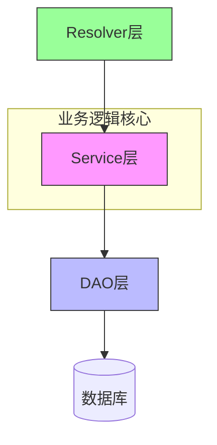
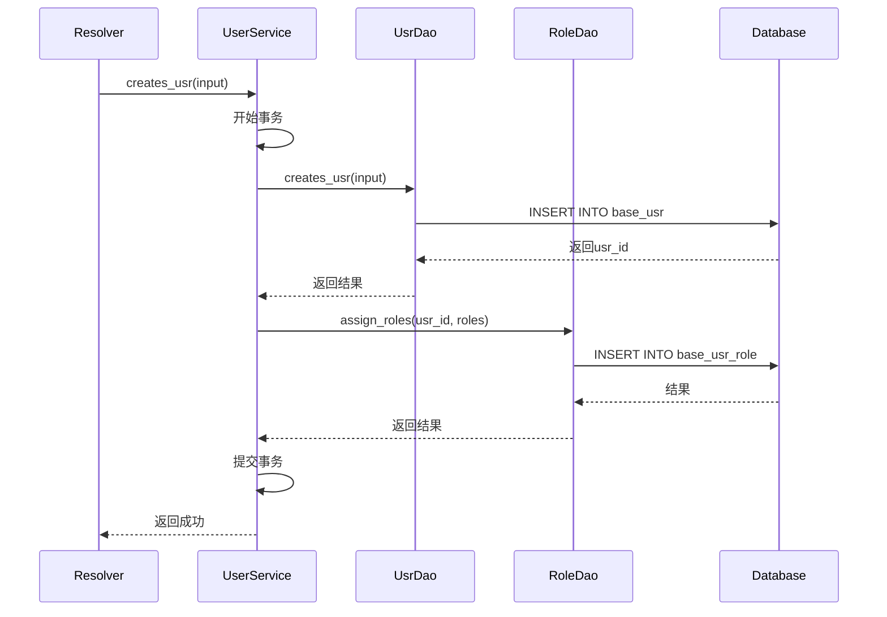
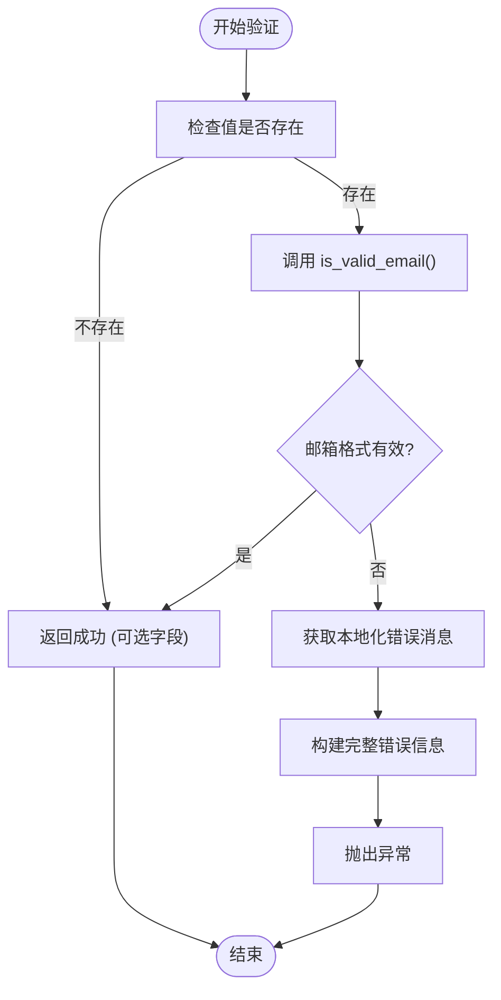

# Service层架构与业务封装

**本文档引用的文件**  
- [usr_service.rs](https://github.com/sail-sail/nest/blob/main/rust/generated/base/usr/usr_service.rs)
- [usr_dao.rs](https://github.com/sail-sail/nest/blob/main/rust/generated/base/usr/usr_dao.rs)
- [email.rs](https://github.com/sail-sail/nest/blob/main/rust/generated/common/validators/email.rs)

## 目录
1. [引言](#引言)
2. [Service层在分层架构中的角色](#service层在分层架构中的角色)
3. [核心业务方法剖析：create_user](#核心业务方法剖析create_user)
4. [事务管理与多DAO协同](#事务管理与多dao协同)
5. [业务规则验证与数据完整性](#业务规则验证与数据完整性)
6. [权限检查与安全控制](#权限检查与安全控制)
7. [错误传播机制与日志记录](#错误传播机制与日志记录)
8. [结论](#结论)

## 引言

本技术文档深入分析Rust后端项目中Service层的设计与实现，聚焦于`usr_service.rs`文件中的业务逻辑封装。文档以用户管理为核心，详细阐述Service层如何协调DAO操作、执行复杂业务规则、集成验证器并确保数据一致性。通过具体代码路径分析，揭示Service层作为业务中枢的关键作用。

## Service层在分层架构中的角色

在当前项目的分层架构中，Service层位于Resolver（或Controller）与DAO层之间，承担着核心业务逻辑的封装与协调职责。它接收来自上层的请求参数，执行复杂的业务规则验证、权限检查和事务管理，并调用一个或多个DAO组件完成数据持久化操作。这种设计实现了关注点分离，使DAO层专注于数据访问，而Service层专注于业务语义。

**图示来源**  
- [usr_service.rs](https://github.com/sail-sail/nest/blob/main/rust/generated/base/usr/usr_service.rs)
- [usr_dao.rs](https://github.com/sail-sail/nest/blob/main/rust/generated/base/usr/usr_dao.rs)

## 核心业务方法剖析create_user

尽管`usr_service.rs`中未直接提供`create_user`方法，但其`creates_usr`方法承担了用户创建的核心逻辑。该方法接收`Vec<UsrInput>`类型的输入参数和可选的上下文选项，返回创建用户的ID列表。

该方法的典型结构遵循“预处理 → 调用DAO → 返回结果”的模式。它首先对输入进行必要的处理（如设置搜索查询），然后直接委托给`usr_dao::creates_usr`完成实际的数据库插入操作。这种设计体现了Service层对DAO层的依赖和封装。

**Section sources**
- [usr_service.rs](https://github.com/sail-sail/nest/blob/main/rust/generated/base/usr/usr_service.rs#L194-L204)

## 事务管理与多dao协同

虽然`creates_usr`方法本身未显式展示跨多个实体（如usr、role、permit）的协同操作，但从项目结构和DAO设计可以推断，复杂的业务用例（如用户注册）需要Service层协调多个DAO。例如，创建用户并分配角色，需要同时操作`usr_dao`和`role_dao`。

理想的事务管理应在Service层启动，确保所有相关DAO操作在一个数据库事务中完成，要么全部成功，要么全部回滚。这保证了数据的一致性。例如，在创建用户及其关联角色时，应使用事务包裹对`usr_dao::creates_usr`和`role_dao::assign_role_to_user`的调用。

**Diagram sources**  
- [usr_service.rs](https://github.com/sail-sail/nest/blob/main/rust/generated/base/usr/usr_service.rs#L194-L204)
- [usr_dao.rs](https://github.com/sail-sail/nest/blob/main/rust/generated/base/usr/usr_dao.rs)

## 业务规则验证与数据完整性

Service层通过集成`common/validators/`模块中的验证器来确保数据完整性。以邮箱验证为例，`email.rs`文件提供了一个异步验证函数。

该验证函数接受一个可选的字符串值和字段标签，首先检查值是否存在，然后使用`fast_chemail::is_valid_email`库函数验证邮箱格式。如果验证失败，它会通过`i18n_dao::ns`获取本地化的错误消息，并构建一个包含字段标签的详细错误信息，最后以`eyre!`宏抛出异常。

这种设计将验证逻辑集中化、可复用，并支持国际化错误提示，是保障数据质量的关键环节。

**Diagram sources**  
- [email.rs](https://github.com/sail-sail/nest/blob/main/rust/generated/common/validators/email.rs#L1-L34)

**Section sources**
- [email.rs](https://github.com/sail-sail/nest/blob/main/rust/generated/common/validators/email.rs#L1-L34)

## 权限检查与安全控制

Service层在执行敏感操作前执行权限检查。例如，在`update_by_id_usr`方法中，Service层首先调用`usr_dao::get_is_locked_by_id_usr`查询目标用户是否已被锁定。如果用户处于锁定状态，则立即返回一个包含明确错误信息的`eyre!`异常，阻止后续的更新操作。

这种“先检查，后操作”的模式是实现安全控制的基础。它确保了业务规则（如“锁定的用户不能被修改”）在数据访问之前就被强制执行，防止了非法的数据变更。

**Section sources**
- [usr_service.rs](https://github.com/sail-sail/nest/blob/main/rust/generated/base/usr/usr_service.rs#L148-L163)

## 错误传播机制与日志记录

本项目采用`color_eyre::eyre::Result`作为统一的错误处理类型，实现了清晰的错误传播机制。Service层方法通常返回`Result<T, eyre::Error>`，允许使用`?`操作符将DAO层的错误向上抛出。这简化了错误处理代码，并确保错误信息能够沿着调用栈向上传递至Resolver层。

此外，DAO层（如`usr_dao.rs`）集成了`tracing`日志库。在`find_all_usr`等方法的开头，会根据`is_debug`标志记录详细的调用参数（如search、page、sort等）。这为系统调试和性能分析提供了宝贵的信息。

**Section sources**
- [usr_service.rs](https://github.com/sail-sail/nest/blob/main/rust/generated/base/usr/usr_service.rs)
- [usr_dao.rs](https://github.com/sail-sail/nest/blob/main/rust/generated/base/usr/usr_dao.rs#L1-L50)

## 结论

Service层是本项目业务逻辑的核心枢纽。它通过封装复杂的业务规则、协调多个DAO操作、集成验证器和执行权限检查，有效地隔离了业务复杂性。其清晰的错误传播机制和日志记录实践，为系统的可维护性和可观测性奠定了坚实基础。未来对于涉及usr、role、permit等多实体协同的复杂业务，应在Service层通过事务管理来确保数据的一致性和完整性。