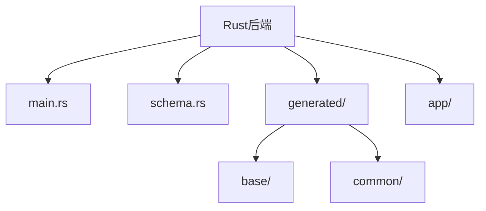
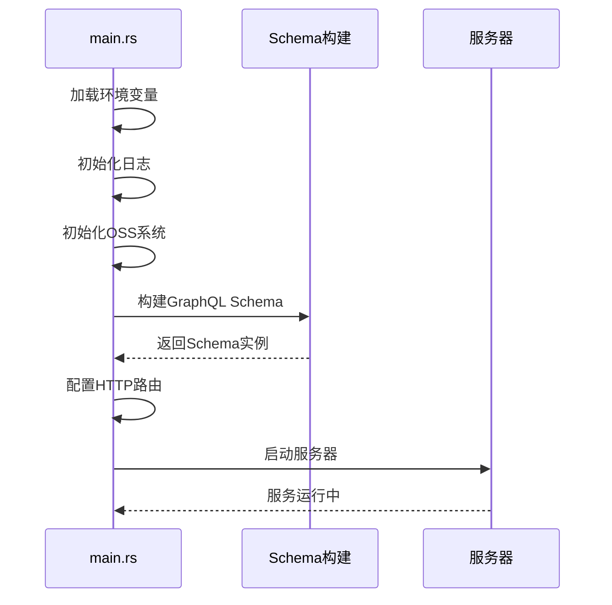
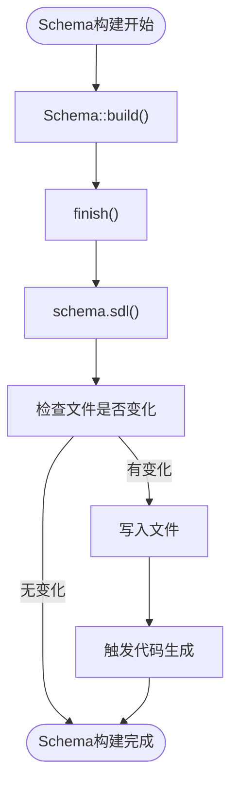
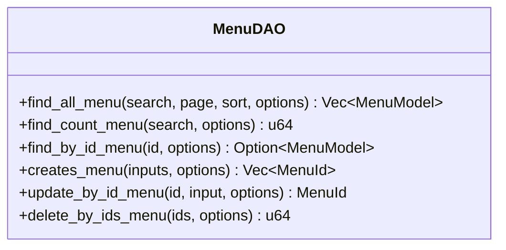
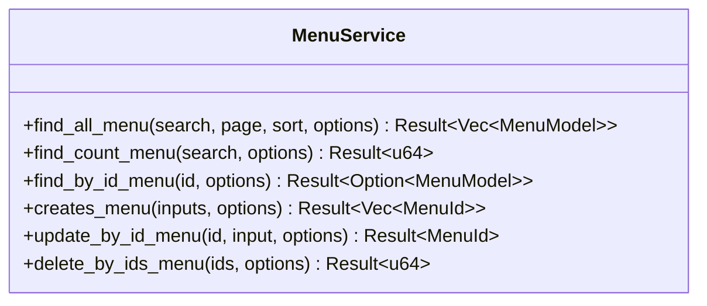
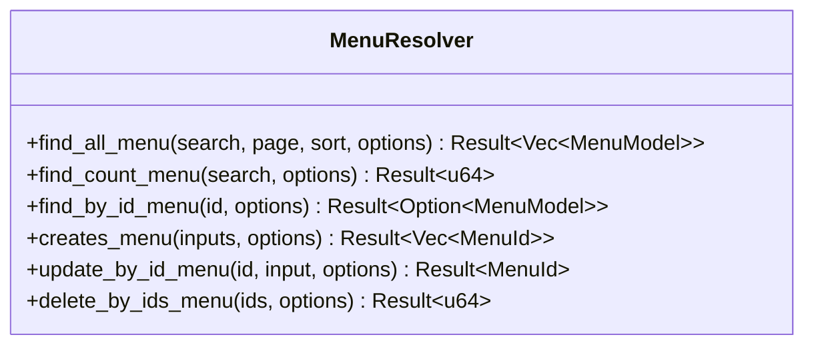
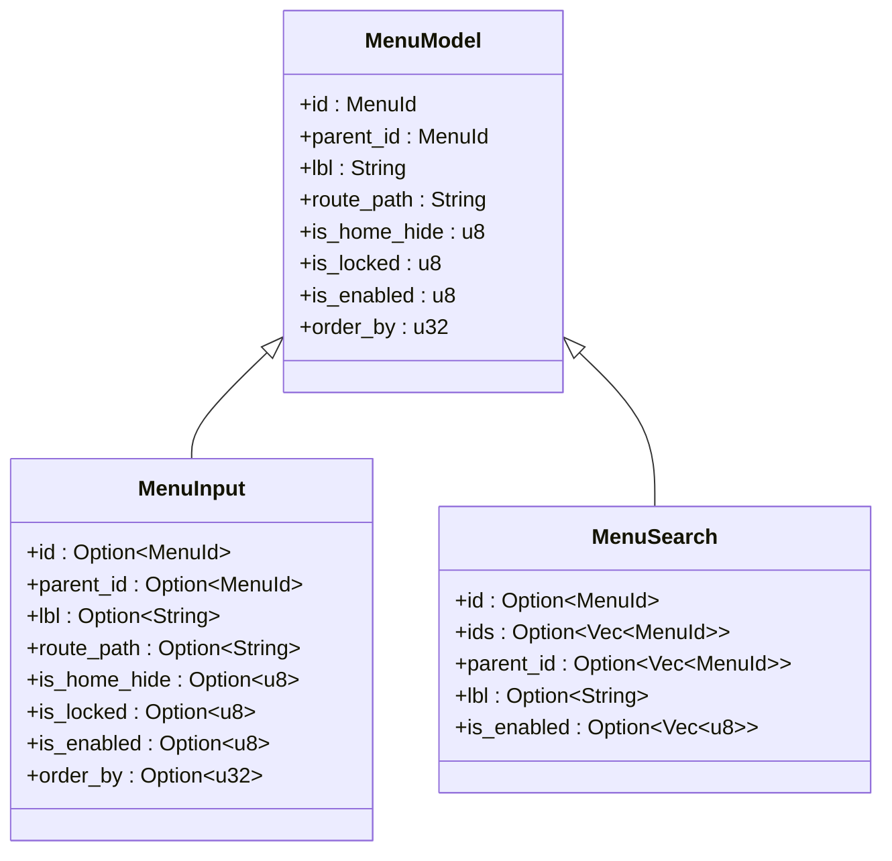
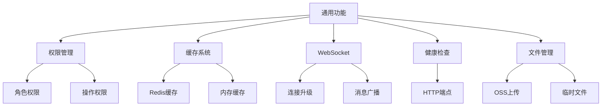
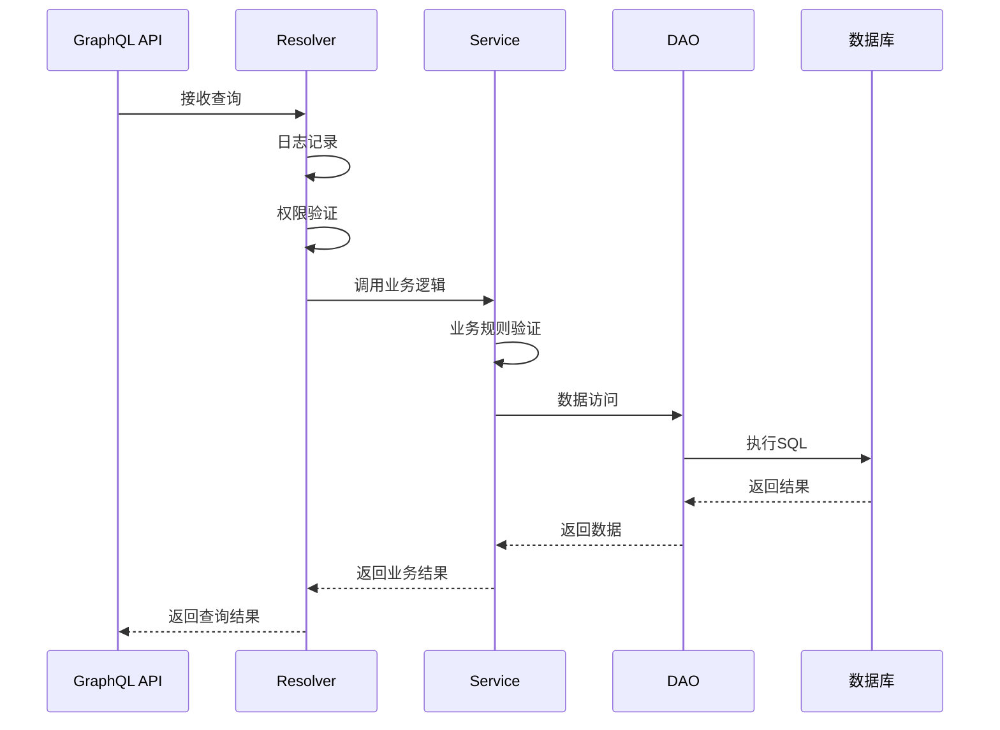
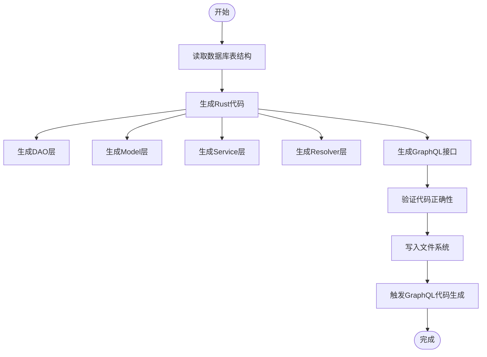

# 后端架构


**本文档引用的文件**
- [main.rs](https://github.com/sail-sail/nest/blob/main/rust\main.rs)
- [schema.rs](https://github.com/sail-sail/nest/blob/main/rust\schema.rs)
- [menu_dao.rs](https://github.com/sail-sail/nest/blob/main/rust\generated\base\menu\menu_dao.rs)
- [menu_model.rs](https://github.com/sail-sail/nest/blob/main/rust\generated\base\menu\menu_model.rs)
- [menu_service.rs](https://github.com/sail-sail/nest/blob/main/rust\generated\base\menu\menu_service.rs)
- [menu_resolver.rs](https://github.com/sail-sail/nest/blob/main/rust\generated\base\menu\menu_resolver.rs)
- [menu_graphql.rs](https://github.com/sail-sail/nest/blob/main/rust\generated\base\menu\menu_graphql.rs)
- [lib.rs](https://github.com/sail-sail/nest/blob/main/rust\generated\lib.rs)


## 目录
1. [项目结构](#项目结构)
2. [启动流程](#启动流程)
3. [GraphQL Schema构建](#graphql-schema构建)
4. [分层架构](#分层架构)
5. [DAO层](#dao层)
6. [Service层](#service层)
7. [Resolver层](#resolver层)
8. [Model层](#model层)
9. [通用功能](#通用功能)
10. [调用关系](#调用关系)
11. [代码生成](#代码生成)

## 项目结构

本项目采用分层架构设计，主要分为以下几个目录：

- `rust/`：Rust后端服务主目录
  - `main.rs`：服务启动入口
  - `schema.rs`：GraphQL Schema生成工具
  - `generated/`：代码生成目录
    - `base/`：基础模块生成代码
    - `common/`：通用功能模块
  - `app/`：应用配置



**图示来源**
- [main.rs](https://github.com/sail-sail/nest/blob/main/rust\main.rs)
- [schema.rs](https://github.com/sail-sail/nest/blob/main/rust\schema.rs)

## 启动流程

服务启动流程从`main.rs`文件开始，主要步骤如下：

1. 加载环境变量
2. 初始化日志系统
3. 初始化OSS和临时文件系统
4. 构建GraphQL Schema
5. 配置HTTP路由
6. 启动服务器



**图示来源**
- [main.rs](https://github.com/sail-sail/nest/blob/main/rust\main.rs#L1-L485)

## GraphQL Schema构建

`schema.rs`文件负责GraphQL Schema的构建和持久化：

1. 使用`Schema::build()`方法创建Schema实例
2. 指定Query、Mutation和Subscription类型
3. 生成SDL（Schema Definition Language）格式的Schema
4. 将Schema写入文件系统
5. 触发GraphQL代码生成



**图示来源**
- [schema.rs](https://github.com/sail-sail/nest/blob/main/rust\schema.rs#L1-L36)

## 分层架构

系统采用典型的分层架构设计，分为四个主要层次：

- **表现层**：GraphQL API接口
- **业务逻辑层**：Service层处理业务规则
- **数据访问层**：DAO层处理数据库操作
- **模型层**：Model层定义数据结构

```mermaid
graph TD
A[表现层] --> B[Resolver]
B --> C[Service]
C --> D[DAO]
D --> E[数据库]
F[Model] < --> B
F < --> C
F < --> D
```

**图示来源**
- [main.rs](https://github.com/sail-sail/nest/blob/main/rust\main.rs)
- [menu_graphql.rs](https://github.com/sail-sail/nest/blob/main/rust\generated\base\menu\menu_graphql.rs)

## DAO层

DAO（Data Access Object）层负责与数据库交互，主要职责包括：

- 执行SQL查询
- 处理数据库连接
- 实现CRUD操作
- 处理事务管理

以菜单模块为例，`menu_dao.rs`文件包含以下主要方法：



**图示来源**
- [menu_dao.rs](https://github.com/sail-sail/nest/blob/main/rust\generated\base\menu\menu_dao.rs#L1-L799)

## Service层

Service层负责业务逻辑处理，主要职责包括：

- 调用DAO层进行数据操作
- 实现业务规则验证
- 处理业务流程
- 协调多个DAO操作

`menu_service.rs`文件中的服务方法通常会：

1. 预处理搜索条件
2. 调用DAO层执行数据库操作
3. 处理业务逻辑
4. 返回结果



**图示来源**
- [menu_service.rs](https://github.com/sail-sail/nest/blob/main/rust\generated\base\menu\menu_service.rs#L1-L395)

## Resolver层

Resolver层是GraphQL查询的解析器，主要职责包括：

- 接收GraphQL查询
- 验证权限
- 调用Service层处理业务逻辑
- 返回查询结果

`menu_resolver.rs`文件中的解析器方法通常会：

1. 记录日志
2. 设置默认查询条件
3. 验证排序字段
4. 调用Service层
5. 返回结果



**图示来源**
- [menu_resolver.rs](https://github.com/sail-sail/nest/blob/main/rust\generated\base\menu\menu_resolver.rs#L1-L530)

## Model层

Model层定义了数据结构和类型，主要包含：

- 数据模型（Model）
- 搜索条件（Search）
- 输入参数（Input）
- 字段注释（FieldComment）

`menu_model.rs`文件定义了菜单相关的数据结构：



**图示来源**
- [menu_model.rs](https://github.com/sail-sail/nest/blob/main/rust\generated\base\menu\menu_model.rs#L1-L682)

## 通用功能

`generated/common/`目录提供了系统级的通用功能：

- **权限管理**：实现基于角色的访问控制
- **缓存系统**：提供数据缓存功能
- **WebSocket**：实现实时通信
- **健康检查**：提供服务健康状态检测
- **文件管理**：OSS和临时文件处理



**图示来源**
- [lib.rs](https://github.com/sail-sail/nest/blob/main/rust\generated\lib.rs)

## 调用关系

各层之间的调用关系遵循严格的单向依赖原则：



**图示来源**
- [menu_graphql.rs](https://github.com/sail-sail/nest/blob/main/rust\generated\base\menu\menu_graphql.rs)
- [menu_resolver.rs](https://github.com/sail-sail/nest/blob/main/rust\generated\base\menu\menu_resolver.rs)
- [menu_service.rs](https://github.com/sail-sail/nest/blob/main/rust\generated\base\menu\menu_service.rs)
- [menu_dao.rs](https://github.com/sail-sail/nest/blob/main/rust\generated\base\menu\menu_dao.rs)

## 代码生成

系统采用代码生成模式保证架构一致性，主要特点包括：

- **模板驱动**：基于模板生成代码
- **自动化**：减少手动编码错误
- **一致性**：确保各模块遵循相同的设计模式
- **可维护性**：修改模板即可批量更新代码

代码生成流程：



**图示来源**
- [main.rs](https://github.com/sail-sail/nest/blob/main/rust\main.rs#L1-L485)
- [schema.rs](https://github.com/sail-sail/nest/blob/main/rust\schema.rs#L1-L36)