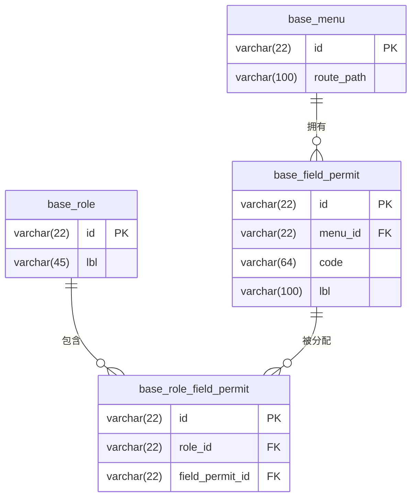
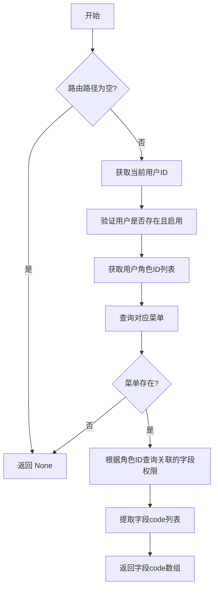

# 字段级权限控制


**本文档引用文件**  
- [field_permit_service.rs](https://github.com/sail-sail/nest/blob/main/rust/generated/common/field_permit/field_permit_service.rs)
- [field_permit.ts](https://github.com/sail-sail/nest/blob/main/pc/src/store/field_permit.ts)
- [permit_scan.js](https://github.com/sail-sail/nest/blob/main/pc/src/utils/permit_scan.js)
- [base.sql](https://github.com/sail-sail/nest/blob/main/codegen/src/tables/base/base.sql)


## 目录
1. [简介](#简介)
2. [字段权限存储结构](#字段权限存储结构)
3. [GraphQL解析器中的字段过滤机制](#graphql解析器中的字段过滤机制)
4. [权限判断逻辑：field_permit_service](#权限判断逻辑field_permit_service)
5. [前端状态同步与运行时权限获取](#前端状态同步与运行时权限获取)
6. [字段权限配置示例](#字段权限配置示例)
7. [与表单组件的集成方式](#与表单组件的集成方式)
8. [常见使用场景](#常见使用场景)
9. [性能优化建议](#性能优化建议)

## 简介
本系统实现了基于角色的字段级权限控制机制，允许对不同用户角色在特定菜单页面中访问数据表字段的读写权限进行精细化管理。该机制结合后端GraphQL服务与前端Vue 3应用，通过动态权限加载、缓存和UI组件控制，实现安全且高效的字段权限控制。

## 字段权限存储结构

字段权限信息存储于数据库表 `base_field_permit` 中，其核心字段如下：

| 字段名 | 类型 | 说明 |
|--------|------|------|
| id | varchar(22) | 主键ID |
| menu_id | varchar(22) | 关联菜单ID |
| code | varchar(64) | 权限编码（对应字段名或操作码） |
| lbl | varchar(100) | 权限名称（可多语言） |
| order_by | int unsigned | 排序字段 |
| is_sys | tinyint | 是否为系统记录 |

此外，通过中间表 `base_role_field_permit` 将字段权限与角色关联，实现基于角色的权限分配。



**Diagram sources**
- [base.sql](https://github.com/sail-sail/nest/blob/main/codegen/src/tables/base/base.sql)

**Section sources**
- [base.sql](https://github.com/sail-sail/nest/blob/main/codegen/src/tables/base/base.sql)

## GraphQL解析器中的字段过滤机制
系统通过GraphQL解析器在查询执行前拦截请求，根据当前用户的角色和访问路径动态过滤响应字段。具体流程如下：

1. 用户发起GraphQL查询请求
2. 解析器提取当前路由路径（route_path）
3. 调用 `get_field_permit` 服务获取该路径下用户可访问的字段列表
4. 在数据返回前，移除用户无权访问的字段

此过程确保了敏感字段不会被未经授权的用户获取，即使其在查询中显式请求。

## 权限判断逻辑：field_permit_service

`field_permit_service.rs` 模块实现了核心权限判断逻辑：

1. 验证用户身份有效性
2. 获取用户所属角色列表
3. 查询与当前菜单路径相关的所有字段权限
4. 根据角色关联关系筛选出用户拥有的字段权限编码（code）集合
5. 返回允许访问的字段编码数组

关键逻辑位于 `get_field_permit` 函数中，其输入为路由路径，输出为可访问字段编码列表或空值（表示无限制）。



**Diagram sources**
- [field_permit_service.rs](https://github.com/sail-sail/nest/blob/main/rust/generated/common/field_permit/field_permit_service.rs)

**Section sources**
- [field_permit_service.rs](https://github.com/sail-sail/nest/blob/main/rust/generated/common/field_permit/field_permit_service.rs)

## 前端状态同步与运行时权限获取

前端通过 `pc/src/store/field_permit.ts` 模块管理字段权限状态，并结合 `permit_scan.js` 工具实现权限同步。

### 运行时权限获取流程

1. 用户进入页面时，调用 `getFieldPermit(route_path)` 获取当前路由的字段权限
2. 权限结果缓存在 `useStorage("store.field_permit.field_permits")` 中
3. 后续访问直接从缓存读取，提升性能

### 动态UI控制机制

```typescript
const canAccess = getFieldPermit()('email');
// 返回 boolean 值，指示当前用户是否可访问 'email' 字段
```

组件可通过此函数动态决定是否显示或启用某字段输入控件。

### 权限扫描工具：permit_scan.js

该脚本在构建时扫描前端Vue文件中的 `permit('code')` 调用，自动注册权限项到数据库：

1. 遍历 `/router` 目录下的路由配置
2. 解析组件路径并递归扫描 `.vue` 文件
3. 使用正则匹配 `permit('xxx')` 语法提取权限码
4. 结合菜单信息生成权限记录并存入数据库
5. 清理已废弃的权限项

此机制实现了权限声明与配置的自动化同步，避免手动维护遗漏。

**Section sources**
- [field_permit.ts](https://github.com/sail-sail/nest/blob/main/pc/src/store/field_permit.ts)
- [permit_scan.js](https://github.com/sail-sail/nest/blob/main/pc/src/utils/permit_scan.js)

## 字段权限配置示例

假设在“用户管理”页面（菜单路由 `/usr`）需要控制以下字段权限：

```json
[
  {
    "menu_id": "usr_menu_id",
    "code": "username",
    "lbl": "用户名"
  },
  {
    "menu_id": "usr_menu_id",
    "code": "email",
    "lbl": "邮箱"
  },
  {
    "menu_id": "usr_menu_id",
    "code": "phone",
    "lbl": "手机号"
  }
]
```

管理员角色可拥有全部字段权限，而普通员工角色仅允许查看用户名。

## 与表单组件的集成方式

字段权限常用于控制表单元素的可见性与可编辑性：

```vue
<template>
  <el-form>
    <!-- 动态控制显示 -->
    <el-form-item v-if="fieldPermit('email')" label="邮箱">
      <el-input v-model="form.email" />
    </el-form-item>

    <!-- 动态控制禁用 -->
    <el-form-item label="手机号">
      <el-input 
        v-model="form.phone" 
        :disabled="!fieldPermit('phone')"
      />
    </el-form-item>
  </el-form>
</template>

<script setup>
const { getFieldPermit } = useFieldPermit();
const fieldPermit = getFieldPermit();
</script>
```

也可批量过滤表格列：

```ts
setTableColumnsFieldPermit(tableColumns, ['email', 'phone'], '/usr');
```

## 常见使用场景

| 场景 | 说明 |
|------|------|
| 敏感信息保护 | 如身份证号、薪资等字段仅限HR或管理员查看 |
| 多租户数据隔离 | 不同租户间字段可见性差异化控制 |
| 角色职责分离 | 财务人员可编辑金额字段，普通员工仅可读 |
| 审计合规要求 | 满足GDPR等法规对个人数据访问的限制 |
| 动态表单渲染 | 根据权限动态生成不同版本的表单界面 |

## 性能优化建议

1. **权限缓存**：前端使用 `useStorage` 持久化缓存权限结果，减少重复请求
2. **懒加载**：仅在首次访问页面时请求权限，后续使用缓存
3. **批量查询**：后端合并角色权限查询，减少数据库交互次数
4. **索引优化**：确保 `base_field_permit(menu_id, code)` 建立联合索引
5. **避免过度细化**：合理设计权限粒度，防止权限项爆炸式增长
6. **定期清理**：通过 `permit_scan.js` 自动清理无效权限，保持数据整洁