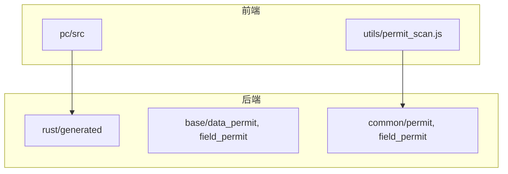
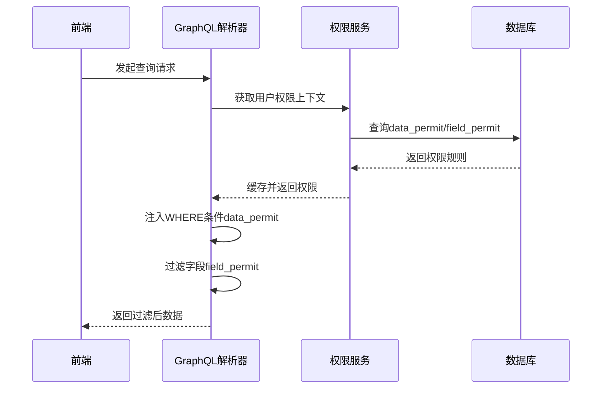
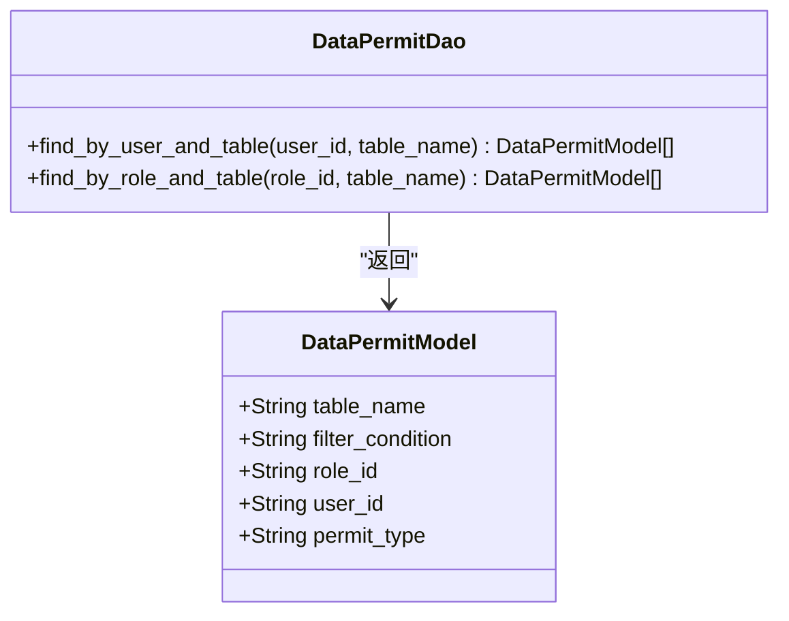
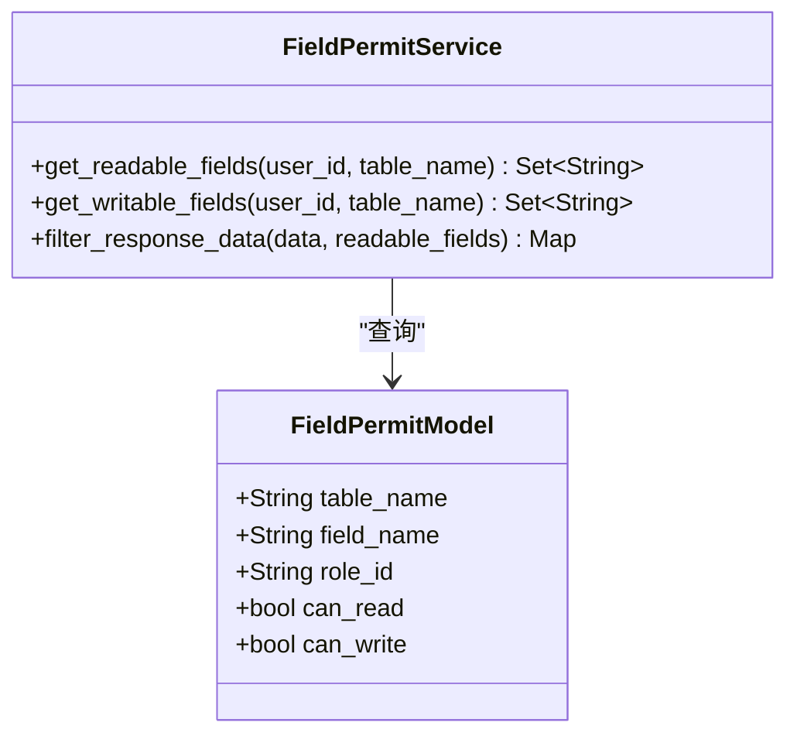
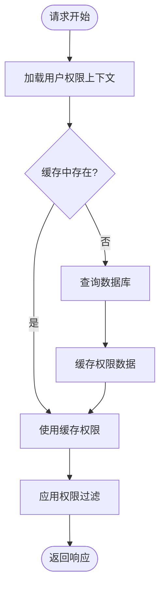
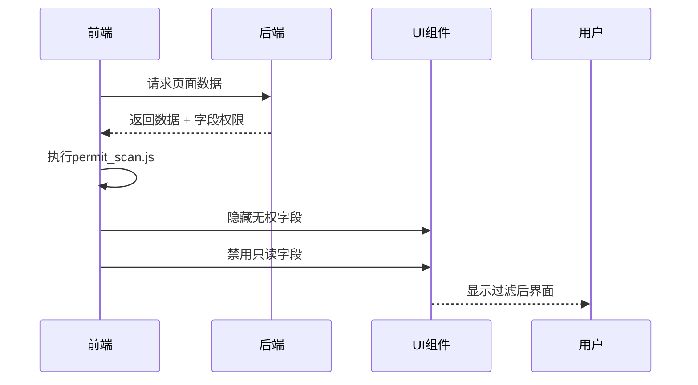
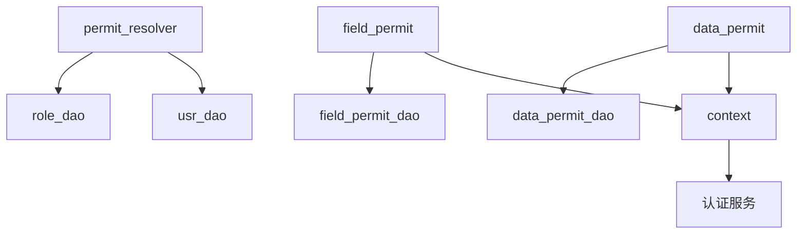

# 数据与字段权限

**本文档引用的文件**  
- [data_permit_dao.rs](https://github.com/sail-sail/nest/blob/main/rust/generated/base/data_permit/data_permit_dao.rs)
- [field_permit_service.rs](https://github.com/sail-sail/nest/blob/main/rust/generated/common/field_permit/field_permit_service.rs)
- [permit_resolver.rs](https://github.com/sail-sail/nest/blob/main/rust/generated/common/permit/permit_resolver.rs)
- [permit_scan.js](https://github.com/sail-sail/nest/blob/main/pc/src/utils/permit_scan.js)
- [data_permit_model.rs](https://github.com/sail-sail/nest/blob/main/rust/generated/base/data_permit/data_permit_model.rs)
- [field_permit_model.rs](https://github.com/sail-sail/nest/blob/main/rust/generated/base/field_permit/field_permit_model.rs)
- [context.rs](https://github.com/sail-sail/nest/blob/main/rust/generated/common/context.rs)

## 目录

1. [简介](#简介)
2. [项目结构](#项目结构)
3. [核心组件](#核心组件)
4. [架构概览](#架构概览)
5. [详细组件分析](#详细组件分析)
6. [依赖分析](#依赖分析)
7. [性能考虑](#性能考虑)
8. [故障排除指南](#故障排除指南)
9. [结论](#结论)

## 简介

本系统实现了基于角色的细粒度权限控制机制，涵盖数据行级（data_permit）和字段级（field_permit）两个维度。权限系统通过前后端协同工作，确保用户只能访问其被授权的数据和字段。权限规则存储在数据库中，并在GraphQL查询执行时动态注入过滤条件。通用权限服务模块提供权限扫描、验证和缓存功能，提升系统安全性和响应性能。

## 项目结构

系统采用分层架构，前端位于`pc`目录，后端Rust服务位于`rust`目录。权限相关模块分布在`base`和`common`两个命名空间下。`base`包含业务实体的权限定义，`common`提供通用权限服务。

**Diagram sources**  
- [permit_scan.js](https://github.com/sail-sail/nest/blob/main/pc/src/utils/permit_scan.js)
- [field_permit_service.rs](https://github.com/sail-sail/nest/blob/main/rust/generated/common/field_permit/field_permit_service.rs)

**Section sources**  
- [permit_scan.js](https://github.com/sail-sail/nest/blob/main/pc/src/utils/permit_scan.js)
- [field_permit_service.rs](https://github.com/sail-sail/nest/blob/main/rust/generated/common/field_permit/field_permit_service.rs)

## 核心组件

系统核心权限组件包括`data_permit`（数据行权限）和`field_permit`（字段级权限）。`data_permit`通过SQL查询条件动态过滤用户可访问的数据行，`field_permit`控制用户对特定字段的读写权限。`common/permit`模块提供权限上下文管理、权限验证和缓存服务。

**Section sources**  
- [data_permit_model.rs](https://github.com/sail-sail/nest/blob/main/rust/generated/base/data_permit/data_permit_model.rs)
- [field_permit_model.rs](https://github.com/sail-sail/nest/blob/main/rust/generated/base/field_permit/field_permit_model.rs)
- [context.rs](https://github.com/sail-sail/nest/blob/main/rust/generated/common/context.rs)

## 架构概览

权限系统采用分层设计，前端发起请求后，后端在GraphQL解析阶段注入权限过滤逻辑。权限服务从数据库加载用户权限规则，缓存至内存以提升性能。字段级权限在序列化阶段过滤敏感字段。

**Diagram sources**  
- [permit_resolver.rs](https://github.com/sail-sail/nest/blob/main/rust/generated/common/permit/permit_resolver.rs)
- [data_permit_dao.rs](https://github.com/sail-sail/nest/blob/main/rust/generated/base/data_permit/data_permit_dao.rs)

## 详细组件分析

### 数据行权限 (data_permit) 分析

`data_permit`模块通过在SQL查询中动态添加WHERE子句实现行级数据过滤。权限规则存储在`data_permit`表中，包含用户、角色、数据表、过滤条件等字段。查询时根据当前用户身份加载对应规则并拼接查询条件。

**Diagram sources**  
- [data_permit_model.rs](https://github.com/sail-sail/nest/blob/main/rust/generated/base/data_permit/data_permit_model.rs)
- [data_permit_dao.rs](https://github.com/sail-sail/nest/blob/main/rust/generated/base/data_permit/data_permit_dao.rs)

**Section sources**  
- [data_permit_model.rs](https://github.com/sail-sail/nest/blob/main/rust/generated/base/data_permit/data_permit_model.rs)
- [data_permit_dao.rs](https://github.com/sail-sail/nest/blob/main/rust/generated/base/data_permit/data_permit_dao.rs)

### 字段级权限 (field_permit) 分析

`field_permit`模块控制用户对特定字段的访问权限。权限规则定义在`field_permit`表中，包含表名、字段名、角色、读写权限等。在GraphQL响应序列化阶段，根据权限规则过滤掉用户无权访问的字段。

**Diagram sources**  
- [field_permit_model.rs](https://github.com/sail-sail/nest/blob/main/rust/generated/base/field_permit/field_permit_model.rs)
- [field_permit_service.rs](https://github.com/sail-sail/nest/blob/main/rust/generated/common/field_permit/field_permit_service.rs)

**Section sources**  
- [field_permit_model.rs](https://github.com/sail-sail/nest/blob/main/rust/generated/base/field_permit/field_permit_model.rs)
- [field_permit_service.rs](https://github.com/sail-sail/nest/blob/main/rust/generated/common/field_permit/field_permit_service.rs)

### 通用权限服务分析

`common/permit`模块提供权限上下文管理、权限验证和缓存服务。`PermitResolver`负责加载用户权限并构建权限上下文，`PermitService`提供权限检查API，支持权限的批量验证和缓存。

**Diagram sources**  
- [permit_resolver.rs](https://github.com/sail-sail/nest/blob/main/rust/generated/common/permit/permit_resolver.rs)
- [context.rs](https://github.com/sail-sail/nest/blob/main/rust/generated/common/context.rs)

**Section sources**  
- [permit_resolver.rs](https://github.com/sail-sail/nest/blob/main/rust/generated/common/permit/permit_resolver.rs)
- [context.rs](https://github.com/sail-sail/nest/blob/main/rust/generated/common/context.rs)

### 前后端协同分析

前端`permit_scan.js`脚本扫描页面元素，根据字段级权限动态控制UI组件的可见性和可编辑性。后端返回权限信息后，前端更新界面状态，实现一致的权限体验。

**Diagram sources**  
- [permit_scan.js](https://github.com/sail-sail/nest/blob/main/pc/src/utils/permit_scan.js)
- [field_permit_service.rs](https://github.com/sail-sail/nest/blob/main/rust/generated/common/field_permit/field_permit_service.rs)

**Section sources**  
- [permit_scan.js](https://github.com/sail-sail/nest/blob/main/pc/src/utils/permit_scan.js)

## 依赖分析

权限系统依赖用户认证、角色管理和数据访问层。`data_permit`和`field_permit`模块依赖`common/context`获取当前用户信息，通过DAO层访问权限规则数据。

**Diagram sources**  
- [context.rs](https://github.com/sail-sail/nest/blob/main/rust/generated/common/context.rs)
- [data_permit_dao.rs](https://github.com/sail-sail/nest/blob/main/rust/generated/base/data_permit/data_permit_dao.rs)
- [field_permit_dao.rs](https://github.com/sail-sail/nest/blob/main/rust/generated/base/field_permit/field_permit_dao.rs)

**Section sources**  
- [context.rs](https://github.com/sail-sail/nest/blob/main/rust/generated/common/context.rs)
- [data_permit_dao.rs](https://github.com/sail-sail/nest/blob/main/rust/generated/base/data_permit/data_permit_dao.rs)

## 性能考虑

权限系统通过多级缓存优化性能。内存缓存存储用户权限上下文，减少数据库查询。`permit_resolver`在请求开始时批量加载权限，避免多次数据库访问。建议为`data_permit`和`field_permit`表的关键字段建立索引。

## 故障排除指南

常见问题包括权限规则未生效、字段过滤异常等。检查步骤：1) 确认用户已分配正确角色；2) 验证权限规则是否正确配置；3) 检查缓存是否过期；4) 查看`permit_scan.js`是否正确执行。可通过日志查看权限加载和应用过程。

**Section sources**  
- [permit_resolver.rs](https://github.com/sail-sail/nest/blob/main/rust/generated/common/permit/permit_resolver.rs)
- [permit_scan.js](https://github.com/sail-sail/nest/blob/main/pc/src/utils/permit_scan.js)

## 结论

本权限系统实现了灵活的数据行级和字段级访问控制，通过前后端协同确保安全性和用户体验的一致性。系统设计模块化，易于扩展和维护。合理使用缓存和索引可显著提升性能，满足高并发场景下的权限验证需求。