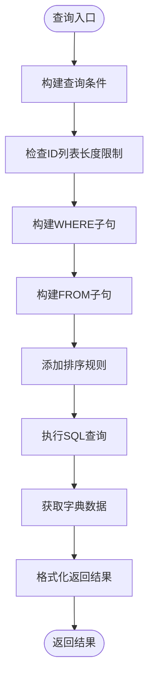
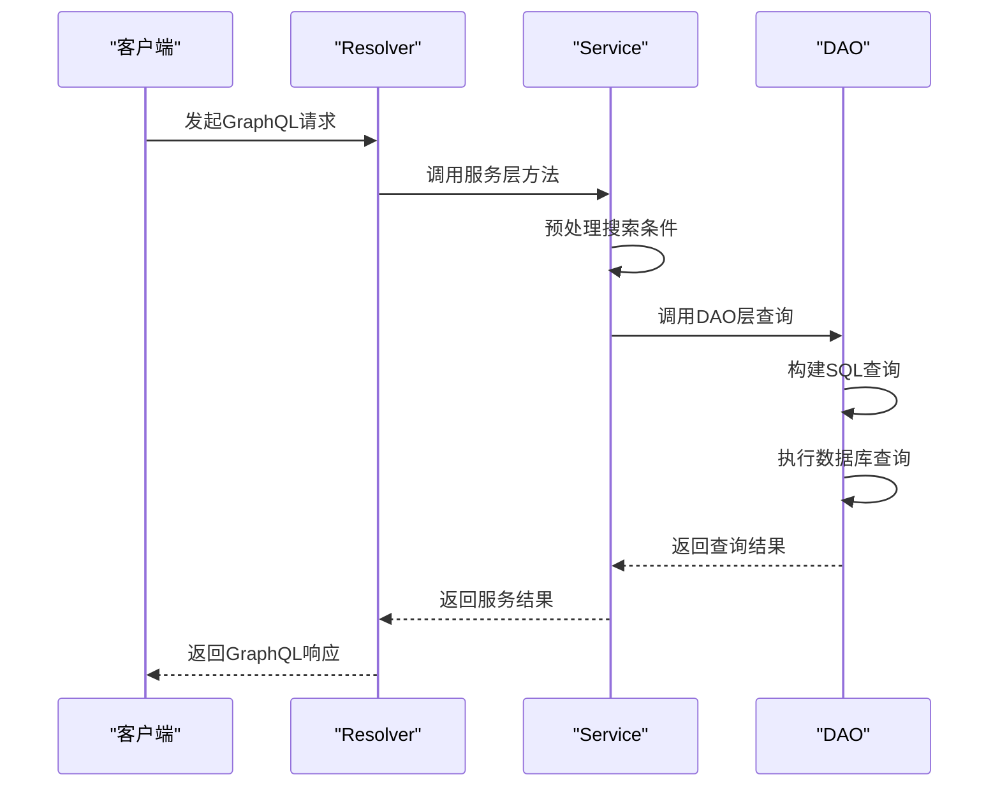
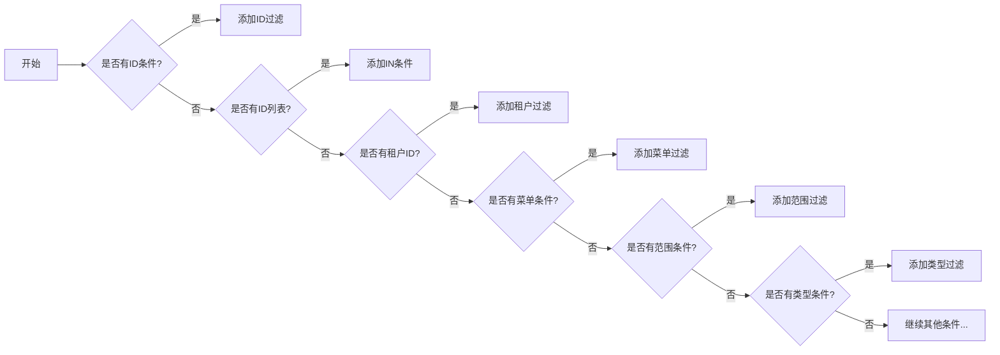
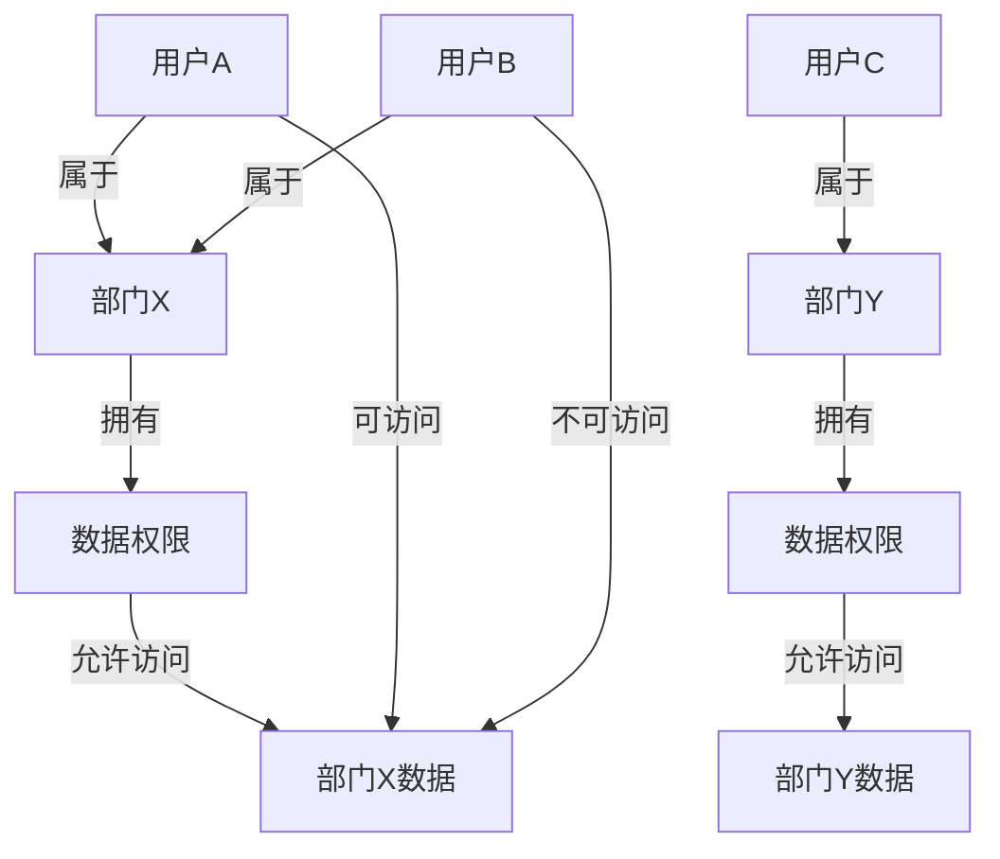
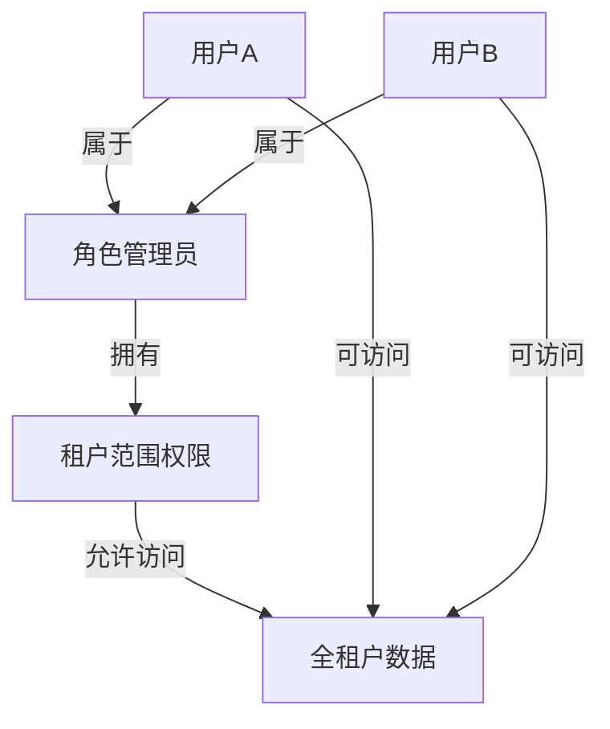
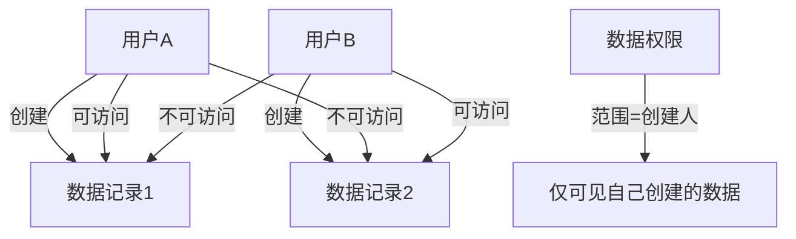

# 数据行级权限控制


**本文档引用的文件**  
- [data_permit_model.rs](https://github.com/sail-sail/nest/blob/main/rust\generated\base\data_permit\data_permit_model.rs)
- [data_permit_dao.rs](https://github.com/sail-sail/nest/blob/main/rust\generated\base\data_permit\data_permit_dao.rs)
- [data_permit_service.rs](https://github.com/sail-sail/nest/blob/main/rust\generated\base\data_permit\data_permit_service.rs)
- [data_permit_resolver.rs](https://github.com/sail-sail/nest/blob/main/rust\generated\base\data_permit\data_permit_resolver.rs)
- [base.sql](https://github.com/sail-sail/nest/blob/main/codegen\src\tables\base\base.sql)


## 目录
1. [简介](#简介)
2. [数据权限表结构设计](#数据权限表结构设计)
3. [核心组件分析](#核心组件分析)
4. [权限评估逻辑与缓存策略](#权限评估逻辑与缓存策略)
5. [GraphQL接口暴露](#graphql接口暴露)
6. [DAO层动态SQL过滤机制](#dao层动态sql过滤机制)
7. [多租户数据隔离实现](#多租户数据隔离实现)
8. [常见使用场景](#常见使用场景)
9. [性能优化建议](#性能优化建议)
10. [权限配置示例](#权限配置示例)

## 简介
本系统实现了基于用户、角色和组织的数据行级权限控制机制。通过`data_permit`模块，系统能够对不同范围（创建人、部门、租户等）和类型（只读、可编辑）的数据访问进行精细化管理。该机制与业务数据查询无缝集成，确保在多租户环境下实现安全的数据隔离。

## 数据权限表结构设计

```mermaid
erDiagram
base_data_permit {
varchar(22) id PK "ID"
varchar(22) menu_id FK "菜单"
ENUM('create', 'dept', 'dept_parent', 'role', 'tenant') scope "范围"
ENUM('readonly', 'editable') type "类型"
varchar(100) rem "备注"
tinyint is_sys "系统记录"
varchar(22) tenant_id FK "租户"
varchar(22) create_usr_id FK "创建人"
datetime create_time "创建时间"
varchar(22) update_usr_id FK "更新人"
datetime update_time "更新时间"
tinyint is_deleted "删除"
}
base_menu ||--o{ base_data_permit : "包含"
base_tenant ||--o{ base_data_permit : "包含"
base_usr ||--o{ base_data_permit : "创建"
```

**图示来源**  
- [base.sql](https://github.com/sail-sail/nest/blob/main/codegen\src\tables\base\base.sql#L650-L675)

**表结构说明**  
- **主键**：`id` 字段作为唯一标识
- **外键关联**：`menu_id` 关联菜单表，`tenant_id` 关联租户表
- **枚举字段**：
  - `scope`：定义权限作用范围（创建人、部门、本部门及上级、角色、租户）
  - `type`：定义权限类型（只读、可编辑）
- **审计字段**：包含创建人、更新人、创建时间、更新时间等审计信息
- **软删除**：`is_deleted` 字段用于标记逻辑删除状态

## 核心组件分析

### 数据模型层 (Model)
数据权限模型定义了完整的业务实体结构，包括：

- **DataPermitModel**：核心数据权限模型，包含所有持久化字段
- **DataPermitSearch**：搜索条件输入模型，支持多种查询条件组合
- **DataPermitInput**：数据输入模型，用于创建和更新操作
- **枚举类型**：
  - `DataPermitScope`：表示权限范围的枚举
  - `DataPermitType`：表示权限类型的枚举

**组件来源**  
- [data_permit_model.rs](https://github.com/sail-sail/nest/blob/main/rust\generated\base\data_permit\data_permit_model.rs#L50-L100)

### 数据访问层 (DAO)
DAO层实现了数据权限的核心CRUD操作和查询逻辑：



**关键功能**：
- 动态SQL生成：根据搜索条件动态构建WHERE子句
- 分页支持：集成分页参数处理
- 排序验证：限制前端可排序字段
- 字典转换：自动将枚举值转换为显示标签

**组件来源**  
- [data_permit_dao.rs](https://github.com/sail-sail/nest/blob/main/rust\generated\base\data_permit\data_permit_dao.rs#L1567-L1608)

## 权限评估逻辑与缓存策略

### 权限评估流程


### 缓存策略
系统在DAO层实现了智能缓存机制：

- **缓存键生成**：基于表名、SQL语句和参数生成唯一缓存键
- **自动缓存**：查询结果自动缓存，减少数据库压力
- **缓存失效**：数据变更时自动清除相关缓存
- **调试模式**：提供调试选项控制缓存行为

**代码路径**  
- [data_permit_service.rs](https://github.com/sail-sail/nest/blob/main/rust\generated\base\data_permit\data_permit_service.rs#L20-L30)
- [data_permit_dao.rs](https://github.com/sail-sail/nest/blob/main/rust\generated\base\data_permit\data_permit_dao.rs#L100-L150)

## GraphQL接口暴露

### 接口列表
| 接口名称 | 参数 | 返回类型 | 描述 |
|--------|------|--------|------|
| findAllDataPermit | search, page, sort | [DataPermitModel] | 根据条件查询数据权限列表 |
| findCountDataPermit | search | u64 | 查询数据权限总数 |
| findOneDataPermit | search, sort | Option<DataPermitModel> | 查询单个数据权限 |
| findByIdDataPermit | id | Option<DataPermitModel> | 根据ID查询数据权限 |
| createsDataPermit | inputs | [DataPermitId] | 创建数据权限 |
| updateByIdDataPermit | id, input | DataPermitId | 更新数据权限 |
| deleteByIdsDataPermit | ids | u64 | 删除数据权限 |

### 安全控制
- **权限检查**：在`createsDataPermit`和`updateByIdDataPermit`等操作前进行权限验证
- **日志记录**：所有操作都会记录详细的请求日志
- **输入验证**：对输入参数进行严格验证和清理

**接口来源**  
- [data_permit_resolver.rs](https://github.com/sail-sail/nest/blob/main/rust\generated\base\data_permit\data_permit_resolver.rs#L20-L100)

## DAO层动态SQL过滤机制

### 查询条件处理
DAO层通过`get_where_query`函数动态构建WHERE子句：



### 安全特性
- **参数化查询**：所有条件都使用参数化查询，防止SQL注入
- **长度限制**：对ID列表长度进行限制，防止恶意请求
- **空值处理**：正确处理NULL值和空字符串
- **时间范围**：支持创建时间和更新时间的范围查询

**实现来源**  
- [data_permit_dao.rs](https://github.com/sail-sail/nest/blob/main/rust\generated\base\data_permit\data_permit_dao.rs#L100-L300)

## 多租户数据隔离实现

### 租户隔离机制
系统通过以下方式实现多租户数据隔离：

1. **租户字段**：每个数据权限记录都关联到特定租户
2. **自动过滤**：查询时自动添加租户过滤条件
3. **上下文管理**：通过`get_auth_tenant_id()`获取当前租户上下文
4. **权限继承**：租户级别的权限可以被下级组织继承

### 隔离级别
- **数据隔离**：不同租户的数据完全隔离，互不可见
- **配置隔离**：每个租户可以独立配置自己的数据权限规则
- **审计隔离**：操作日志按租户进行隔离记录

**实现来源**  
- [data_permit_dao.rs](https://github.com/sail-sail/nest/blob/main/rust\generated\base\data_permit\data_permit_dao.rs#L200-L250)
- [data_permit_model.rs](https://github.com/sail-sail/nest/blob/main/rust\generated\base\data_permit\data_permit_model.rs#L50)

## 常见使用场景

### 场景一：部门数据隔离


### 场景二：角色数据共享


### 场景三：创建人数据可见


## 性能优化建议

### 查询优化
- **索引优化**：确保`menu_id`、`scope`、`tenant_id`等常用查询字段有适当索引
- **分页查询**：使用合理的分页大小，避免一次性加载过多数据
- **缓存利用**：充分利用DAO层的自动缓存机制
- **批量操作**：对于批量操作，使用批量API减少网络往返

### 代码优化
- **避免N+1查询**：使用JOIN查询替代多次单条查询
- **懒加载**：对于不常用的关联数据，采用懒加载方式
- **连接池**：合理配置数据库连接池大小
- **异步处理**：对于耗时操作，考虑使用异步处理

### 监控建议
- **查询日志**：开启SQL查询日志，监控慢查询
- **性能指标**：监控API响应时间和数据库查询时间
- **缓存命中率**：监控缓存命中率，优化缓存策略
- **错误监控**：监控权限相关的错误和异常

## 权限配置示例

### 示例1：配置部门数据权限
```json
{
  "menu_id": "menu001",
  "scope": "dept",
  "type": "editable",
  "rem": "部门数据编辑权限"
}
```

### 示例2：配置只读权限
```json
{
  "menu_id": "menu002",
  "scope": "tenant",
  "type": "readonly",
  "rem": "租户数据只读权限"
}
```

### 示例3：配置角色数据权限
```json
{
  "menu_id": "menu003",
  "scope": "role",
  "type": "editable",
  "rem": "角色数据编辑权限"
}
```

**配置来源**  
- [data_permit_input.rs](https://github.com/sail-sail/nest/blob/main/rust\generated\base\data_permit\data_permit_model.rs#L200-L250)