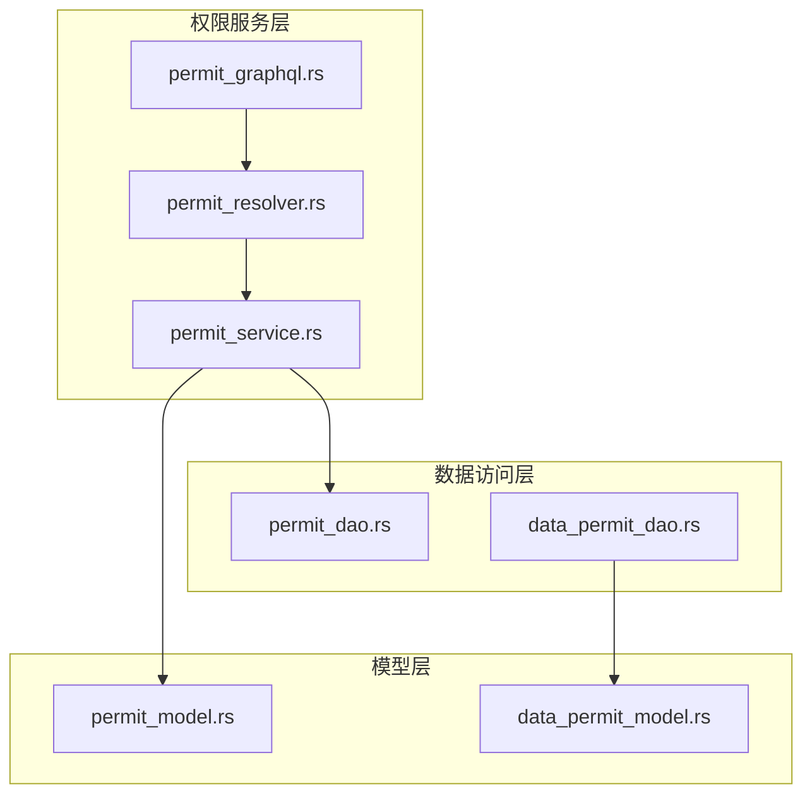
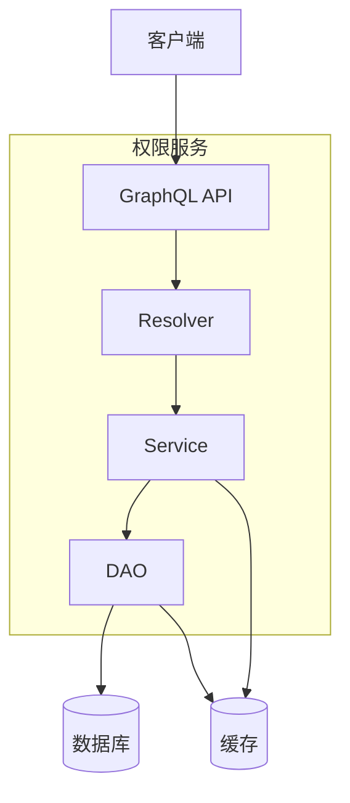
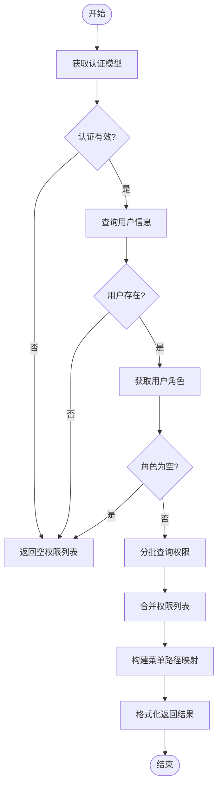
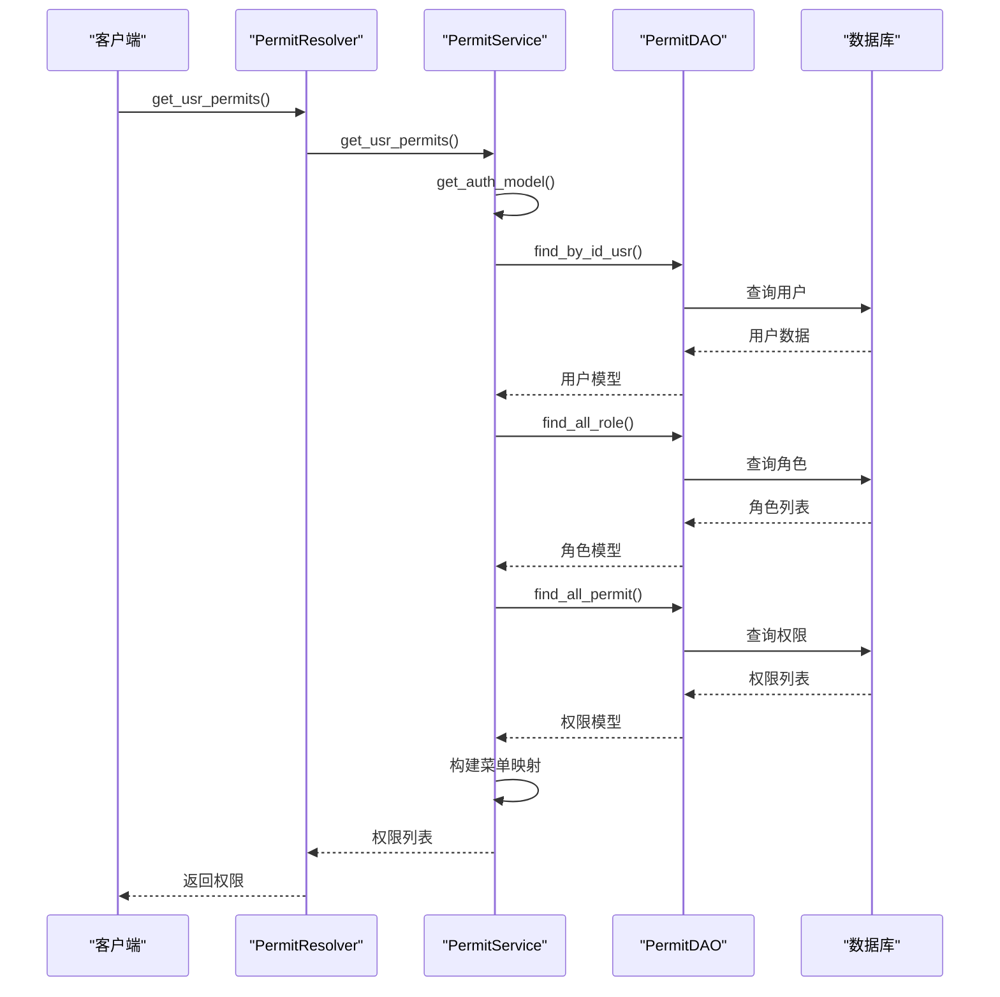
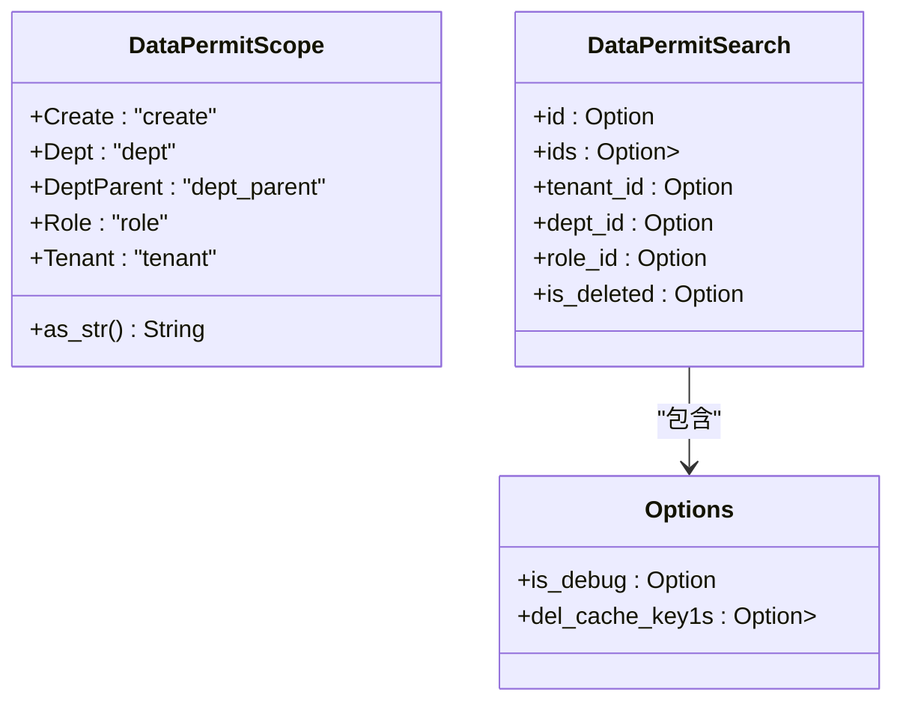
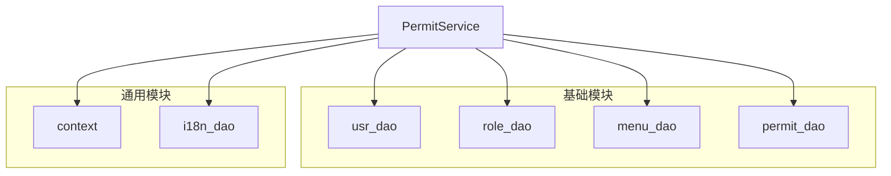

# 权限核心服务

**本文档引用的文件**  
- [permit_service.rs](https://github.com/sail-sail/nest/blob/main/rust/generated/common/permit/permit_service.rs)
- [permit_resolver.rs](https://github.com/sail-sail/nest/blob/main/rust/generated/common/permit/permit_resolver.rs)
- [permit_model.rs](https://github.com/sail-sail/nest/blob/main/rust/generated/common/permit/permit_model.rs)
- [permit_graphql.rs](https://github.com/sail-sail/nest/blob/main/rust/generated/common/permit/permit_graphql.rs)
- [permit_dao.rs](https://github.com/sail-sail/nest/blob/main/rust/generated/base/permit/permit_dao.rs)
- [data_permit_model.rs](https://github.com/sail-sail/nest/blob/main/rust/generated/base/data_permit/data_permit_model.rs)
- [data_permit_dao.rs](https://github.com/sail-sail/nest/blob/main/rust/generated/base/data_permit/data_permit_dao.rs)

## 目录
1. [简介](#简介)
2. [项目结构](#项目结构)
3. [核心组件](#核心组件)
4. [架构概览](#架构概览)
5. [详细组件分析](#详细组件分析)
6. [依赖分析](#依赖分析)
7. [性能考量](#性能考量)
8. [故障排除指南](#故障排除指南)
9. [结论](#结论)

## 简介
本文档深入解析 `common/permit` 模块提供的通用权限服务，涵盖权限验证、权限缓存、权限扫描接口等核心能力。详细说明 `permit_service` 中权限评估的通用算法，如何高效处理复杂的权限继承与覆盖关系。同时解释 `permit_dao` 对权限数据的访问模式，以及 `permit_resolver` 暴露的通用 GraphQL 查询接口。文档还涵盖权限服务的初始化流程、与认证系统的集成方式、缓存失效策略、高并发场景下的性能表现，以及如何扩展自定义权限逻辑。

## 项目结构
权限服务模块采用分层架构设计，主要分为以下几个部分：

- **base/permit**: 基础权限模型、DAO、服务和解析器
- **common/permit**: 通用权限服务逻辑、GraphQL 接口封装
- **base/data_permit**: 数据级权限控制实现
- **common/field_permit**: 字段级权限控制实现

**Diagram sources**
- [permit_service.rs](https://github.com/sail-sail/nest/blob/main/rust/generated/common/permit/permit_service.rs)
- [permit_resolver.rs](https://github.com/sail-sail/nest/blob/main/rust/generated/common/permit/permit_resolver.rs)
- [permit_dao.rs](https://github.com/sail-sail/nest/blob/main/rust/generated/base/permit/permit_dao.rs)
- [permit_model.rs](https://github.com/sail-sail/nest/blob/main/rust/generated/common/permit/permit_model.rs)

**Section sources**
- [permit_service.rs](https://github.com/sail-sail/nest/blob/main/rust/generated/common/permit/permit_service.rs)
- [permit_dao.rs](https://github.com/sail-sail/nest/blob/main/rust/generated/base/permit/permit_dao.rs)

## 核心组件

`common/permit` 模块提供了权限服务的核心功能，主要包括：

- **权限验证**: 通过 `use_permit` 函数实现后端按钮级权限校验
- **权限获取**: 通过 `get_usr_permits` 函数获取当前用户的所有权限列表
- **GraphQL 接口**: 通过 `PermitQuery` 暴露 GraphQL 查询接口
- **数据权限**: 支持基于租户、部门、角色等维度的数据级权限控制

**Section sources**
- [permit_service.rs](https://github.com/sail-sail/nest/blob/main/rust/generated/common/permit/permit_service.rs)
- [permit_resolver.rs](https://github.com/sail-sail/nest/blob/main/rust/generated/common/permit/permit_resolver.rs)
- [permit_graphql.rs](https://github.com/sail-sail/nest/blob/main/rust/generated/common/permit/permit_graphql.rs)

## 架构概览

权限服务采用典型的分层架构，从上至下分别为：

**Diagram sources**
- [permit_graphql.rs](https://github.com/sail-sail/nest/blob/main/rust/generated/common/permit/permit_graphql.rs)
- [permit_resolver.rs](https://github.com/sail-sail/nest/blob/main/rust/generated/common/permit/permit_resolver.rs)
- [permit_service.rs](https://github.com/sail-sail/nest/blob/main/rust/generated/common/permit/permit_service.rs)
- [permit_dao.rs](https://github.com/sail-sail/nest/blob/main/rust/generated/base/permit/permit_dao.rs)

## 详细组件分析

### 权限服务分析

`permit_service` 是权限服务的核心业务逻辑层，负责权限的评估和验证。

#### 权限评估算法

**Diagram sources**
- [permit_service.rs](https://github.com/sail-sail/nest/blob/main/rust/generated/common/permit/permit_service.rs#L15-L150)

#### 权限验证流程

**Diagram sources**
- [permit_service.rs](https://github.com/sail-sail/nest/blob/main/rust/generated/common/permit/permit_service.rs#L15-L150)
- [permit_resolver.rs](https://github.com/sail-sail/nest/blob/main/rust/generated/common/permit/permit_resolver.rs#L10-L20)

**Section sources**
- [permit_service.rs](https://github.com/sail-sail/nest/blob/main/rust/generated/common/permit/permit_service.rs)
- [permit_resolver.rs](https://github.com/sail-sail/nest/blob/main/rust/generated/common/permit/permit_resolver.rs)

### 权限数据访问分析

`permit_dao` 模块负责权限数据的持久化访问。

#### 数据权限范围

**Diagram sources**
- [data_permit_model.rs](https://github.com/sail-sail/nest/blob/main/rust/generated/base/data_permit/data_permit_model.rs#L570-L623)
- [data_permit_dao.rs](https://github.com/sail-sail/nest/blob/main/rust/generated/base/data_permit/data_permit_dao.rs#L60-L115)

**Section sources**
- [data_permit_model.rs](https://github.com/sail-sail/nest/blob/main/rust/generated/base/data_permit/data_permit_model.rs)
- [data_permit_dao.rs](https://github.com/sail-sail/nest/blob/main/rust/generated/base/data_permit/data_permit_dao.rs)

## 依赖分析

权限服务依赖于多个核心模块：

**Diagram sources**
- [permit_service.rs](https://github.com/sail-sail/nest/blob/main/rust/generated/common/permit/permit_service.rs#L10-L30)
- [permit_dao.rs](https://github.com/sail-sail/nest/blob/main/rust/generated/base/permit/permit_dao.rs)

**Section sources**
- [permit_service.rs](https://github.com/sail-sail/nest/blob/main/rust/generated/common/permit/permit_service.rs)
- [permit_dao.rs](https://github.com/sail-sail/nest/blob/main/rust/generated/base/permit/permit_dao.rs)

## 性能考量

权限服务在设计时充分考虑了性能因素：

1. **批量查询**: 权限查询采用分批处理机制，每批最多 100 个权限 ID，避免单次查询过大
2. **缓存机制**: 数据变更时自动清除相关缓存，确保数据一致性
3. **连接池**: 使用数据库连接池提高并发性能
4. **异步处理**: 全面采用异步编程模型，提高 I/O 效率

**Section sources**
- [permit_service.rs](https://github.com/sail-sail/nest/blob/main/rust/generated/common/permit/permit_service.rs#L100-L120)
- [data_permit_dao.rs](https://github.com/sail-sail/nest/blob/main/rust/generated/base/data_permit/data_permit_dao.rs#L2266-L2337)

## 故障排除指南

### 常见问题

1. **权限不生效**
   - 检查用户角色是否正确分配
   - 确认权限编码是否匹配
   - 验证菜单路由路径是否正确

2. **缓存未更新**
   - 检查 `get_cache_tables` 函数是否正确返回需要清除的表名
   - 确认 `del_caches` 调用是否成功

3. **性能问题**
   - 检查数据库连接池配置
   - 验证批量查询大小是否合理
   - 监控缓存命中率

**Section sources**
- [permit_service.rs](https://github.com/sail-sail/nest/blob/main/rust/generated/common/permit/permit_service.rs)
- [data_permit_dao.rs](https://github.com/sail-sail/nest/blob/main/rust/generated/base/data_permit/data_permit_dao.rs#L2266-L2337)

## 结论

权限核心服务提供了一套完整的权限管理解决方案，具有以下特点：

- **模块化设计**: 清晰的分层架构，便于维护和扩展
- **高性能**: 采用批量查询、缓存等优化手段
- **易集成**: 提供 GraphQL 接口，便于前端集成
- **可扩展**: 支持自定义权限逻辑和数据权限控制

该服务能够有效支持复杂的权限继承和覆盖关系，满足企业级应用的权限管理需求。