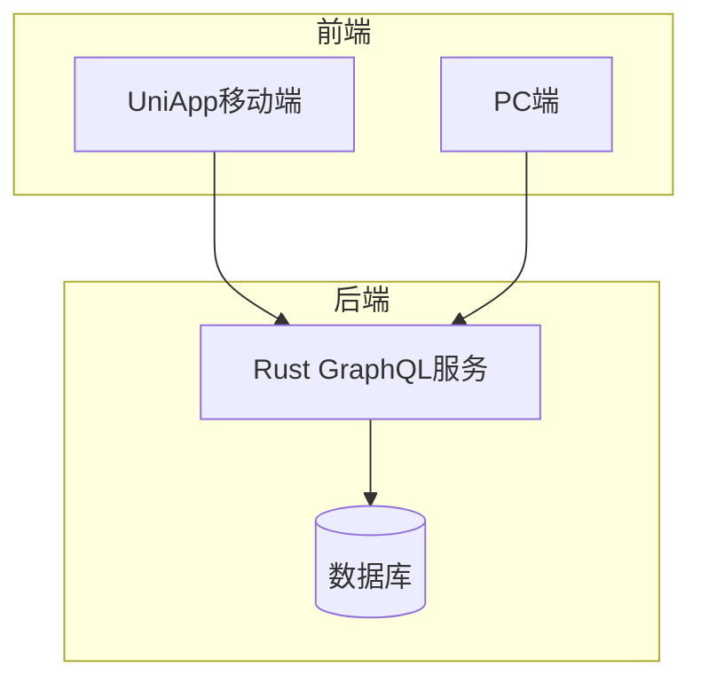
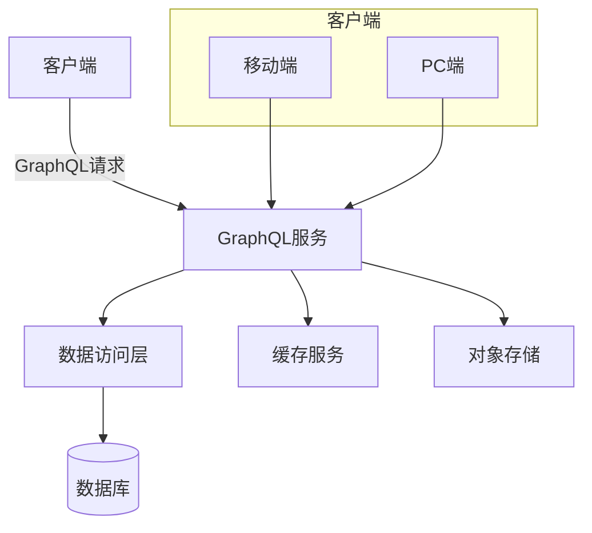
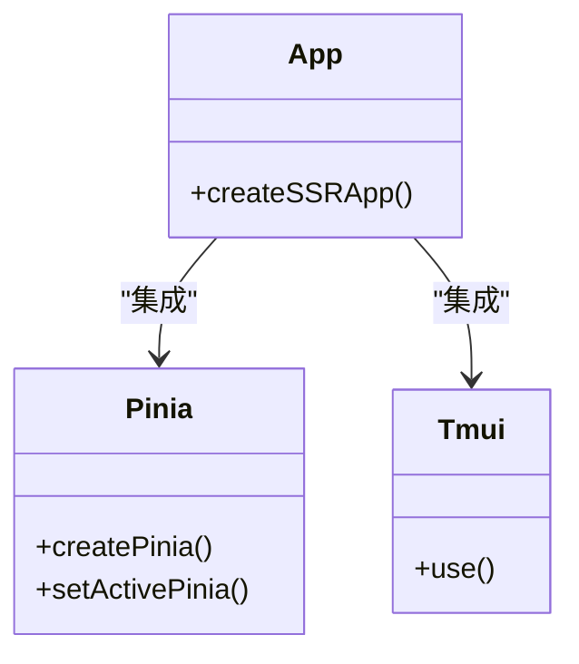
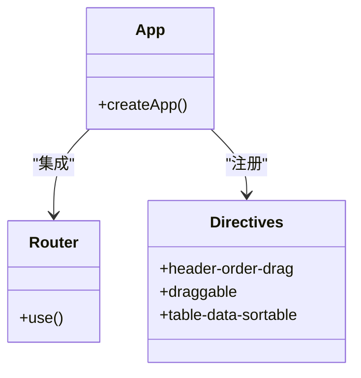
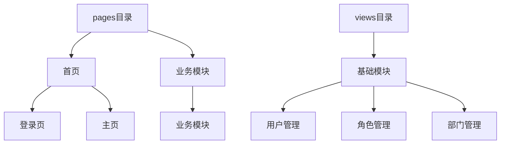
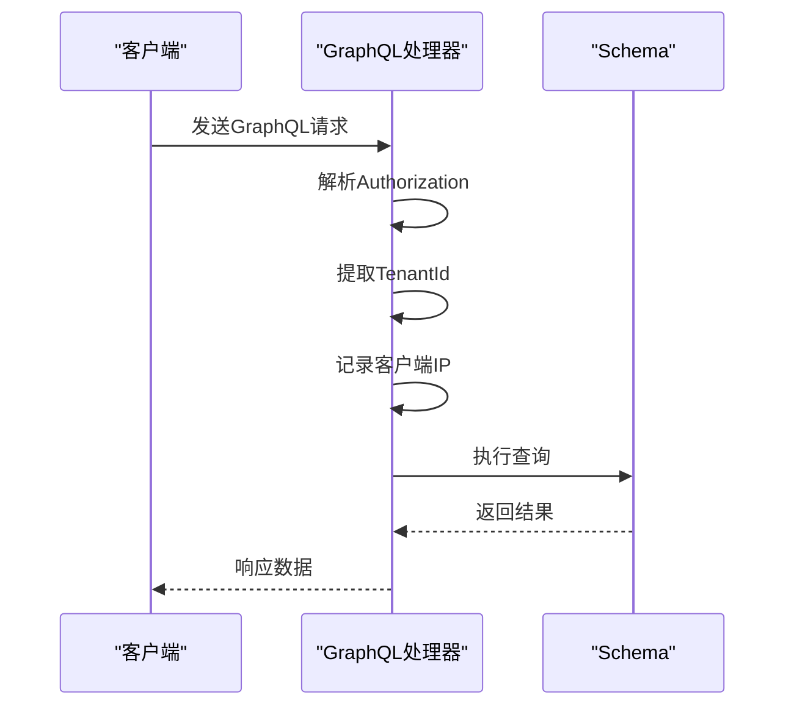
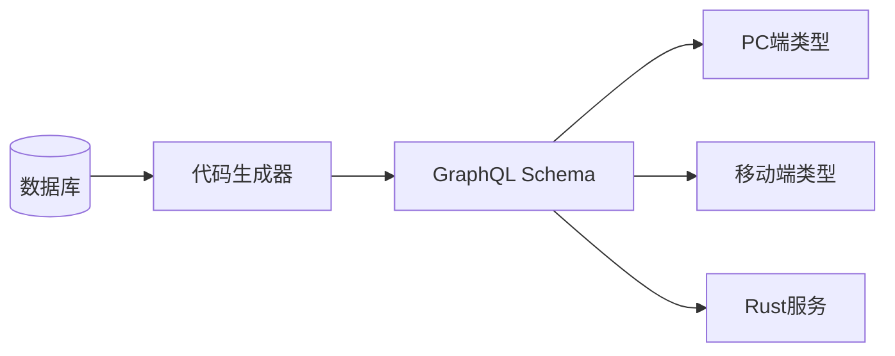

# 多端支持

**本文档引用的文件**  
- [main.ts](https://github.com/sail-sail/nest/blob/main/uni/src/main.ts)
- [main.ts](https://github.com/sail-sail/nest/blob/main/pc/src/main.ts)
- [pages/index/index.vue](https://github.com/sail-sail/nest/blob/main/uni/src/pages/index/index.vue)
- [views/Index.vue](https://github.com/sail-sail/nest/blob/main/pc/src/views/Index.vue)
- [graphql_handler_get](https://github.com/sail-sail/nest/blob/main/rust/main.rs#L57-L98)
- [graphql_handler](https://github.com/sail-sail/nest/blob/main/rust/main.rs#L124-L169)
- [common/mod.rs](https://github.com/sail-sail/nest/blob/main/rust/generated/common/mod.rs)
- [graphql_codegen_config.ts](https://github.com/sail-sail/nest/blob/main/rust/generated/common/script/graphql_codegen_config.ts)
- [pages.json](https://github.com/sail-sail/nest/blob/main/uni/src/pages.json)
- [router/index.ts](https://github.com/sail-sail/nest/blob/main/pc/src/router/index.ts)

## 目录
1. [简介](#简介)
2. [项目结构](#项目结构)
3. [核心组件](#核心组件)
4. [架构概览](#架构概览)
5. [详细组件分析](#详细组件分析)
6. [依赖分析](#依赖分析)
7. [性能考虑](#性能考虑)
8. [故障排除指南](#故障排除指南)
9. [结论](#结论)

## 简介
本系统采用多端统一架构设计，支持PC端（Vue3 + Element Plus）与移动端（UniApp）双平台部署。系统通过统一的GraphQL API服务为不同终端提供数据支持，实现业务逻辑与表现层的分离。移动端基于UniApp框架实现跨平台兼容，PC端采用现代化Vue生态构建桌面级应用体验。

## 项目结构
系统采用模块化分层结构，包含codegen代码生成器、PC端、Rust后端服务和UniApp移动端四个主要部分。各平台共享统一的数据模型和API定义，确保多端数据一致性。

**Diagram sources**
- [uni/src/main.ts](https://github.com/sail-sail/nest/blob/main/uni/src/main.ts#L1-L28)
- [pc/src/main.ts](https://github.com/sail-sail/nest/blob/main/pc/src/main.ts#L1-L37)

**Section sources**
- [uni/src/main.ts](https://github.com/sail-sail/nest/blob/main/uni/src/main.ts#L1-L28)
- [pc/src/main.ts](https://github.com/sail-sail/nest/blob/main/pc/src/main.ts#L1-L37)

## 核心组件
系统核心组件包括UniApp移动端入口、PC端主应用、GraphQL API处理器和统一数据模型。移动端通过main.ts初始化Vue SSR应用并集成tm-ui组件库，PC端通过main.ts配置路由和全局指令。后端通过GraphQL处理器统一处理来自不同终端的请求。

**Section sources**
- [main.ts](https://github.com/sail-sail/nest/blob/main/uni/src/main.ts#L1-L28)
- [main.ts](https://github.com/sail-sail/nest/blob/main/pc/src/main.ts#L1-L37)
- [graphql_handler_get](https://github.com/sail-sail/nest/blob/main/rust/main.rs#L57-L98)

## 架构概览
系统采用前后端分离架构，前端双端共享同一套GraphQL API接口。移动端使用UniApp框架实现跨平台兼容性，PC端使用Vue3生态构建丰富交互。后端使用Rust语言实现高性能GraphQL服务，通过Poem框架处理HTTP请求。

**Diagram sources**
- [main.rs](https://github.com/sail-sail/nest/blob/main/rust/main.rs#L57-L169)
- [common/mod.rs](https://github.com/sail-sail/nest/blob/main/rust/generated/common/mod.rs#L1-L55)

## 详细组件分析

### 移动端应用分析
UniApp移动端应用通过main.ts作为入口点，创建SSR应用实例并注册全局依赖。应用使用Pinia进行状态管理，并集成tm-ui组件库提供UI支持。

**Diagram sources**
- [main.ts](https://github.com/sail-sail/nest/blob/main/uni/src/main.ts#L1-L28)

**Section sources**
- [main.ts](https://github.com/sail-sail/nest/blob/main/uni/src/main.ts#L1-L28)
- [pages.json](https://github.com/sail-sail/nest/blob/main/uni/src/pages.json)

### PC端应用分析
PC端应用通过main.ts初始化Vue应用，配置路由系统和全局指令。应用集成Element Plus组件库，并注册多个自定义指令用于表格操作和拖拽功能。

**Diagram sources**
- [main.ts](https://github.com/sail-sail/nest/blob/main/pc/src/main.ts#L1-L37)

**Section sources**
- [main.ts](https://github.com/sail-sail/nest/blob/main/pc/src/main.ts#L1-L37)
- [router/index.ts](https://github.com/sail-sail/nest/blob/main/pc/src/router/index.ts)

### 页面组织结构
移动端页面组织遵循UniApp标准结构，以pages目录为核心，包含index首页和业务模块页面。PC端视图组织采用views目录，按业务模块划分，每个模块包含列表、详情等标准组件。

**Diagram sources**
- [pages/index/index.vue](https://github.com/sail-sail/nest/blob/main/uni/src/pages/index/index.vue)
- [views/Index.vue](https://github.com/sail-sail/nest/blob/main/pc/src/views/Index.vue)

**Section sources**
- [pages/index/index.vue](https://github.com/sail-sail/nest/blob/main/uni/src/pages/index/index.vue)
- [views/Index.vue](https://github.com/sail-sail/nest/blob/main/pc/src/views/Index.vue)

### GraphQL API服务
系统通过统一的GraphQL API为多端提供数据服务。后端实现两个GraphQL处理器，分别处理GET和POST请求，统一进行身份验证、租户识别和IP记录。

**Diagram sources**
- [graphql_handler_get](https://github.com/sail-sail/nest/blob/main/rust/main.rs#L57-L98)
- [graphql_handler](https://github.com/sail-sail/nest/blob/main/rust/main.rs#L124-L169)

**Section sources**
- [graphql_handler_get](https://github.com/sail-sail/nest/blob/main/rust/main.rs#L57-L98)
- [graphql_handler](https://github.com/sail-sail/nest/blob/main/rust/main.rs#L124-L169)

## 依赖分析
系统前后端通过GraphQL Schema保持契约一致性。代码生成器根据数据库结构自动生成API类型定义，确保多端共享统一的数据模型。

**Diagram sources**
- [graphql_codegen_config.ts](https://github.com/sail-sail/nest/blob/main/rust/generated/common/script/graphql_codegen_config.ts#L1-L48)

**Section sources**
- [graphql_codegen_config.ts](https://github.com/sail-sail/nest/blob/main/rust/generated/common/script/graphql_codegen_config.ts#L1-L48)

## 性能考虑
GraphQL API服务采用Rust语言实现，具有高性能和低内存占用特性。通过连接池管理和缓存机制优化数据库访问性能。前端通过代码分割和懒加载提高初始加载速度。

## 故障排除指南
常见问题包括跨域请求失败、身份验证错误和GraphQL查询语法错误。建议检查请求头中的Authorization和TenantId字段，确认GraphQL查询语句的正确性，并验证网络连接状态。

## 结论
本系统通过统一的GraphQL API实现了多端数据服务的标准化，移动端和PC端在保持各自平台特性的基础上，共享核心业务逻辑和数据模型。开发者可以基于此架构快速开发和部署跨平台应用。