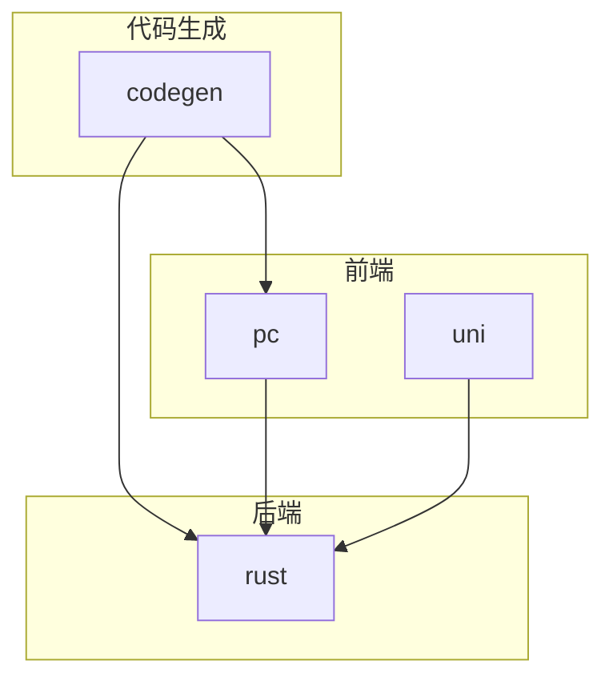
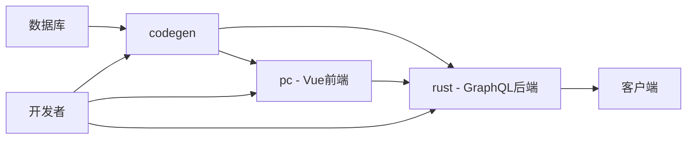
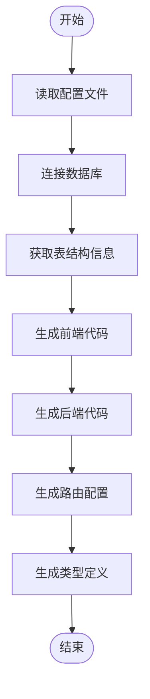
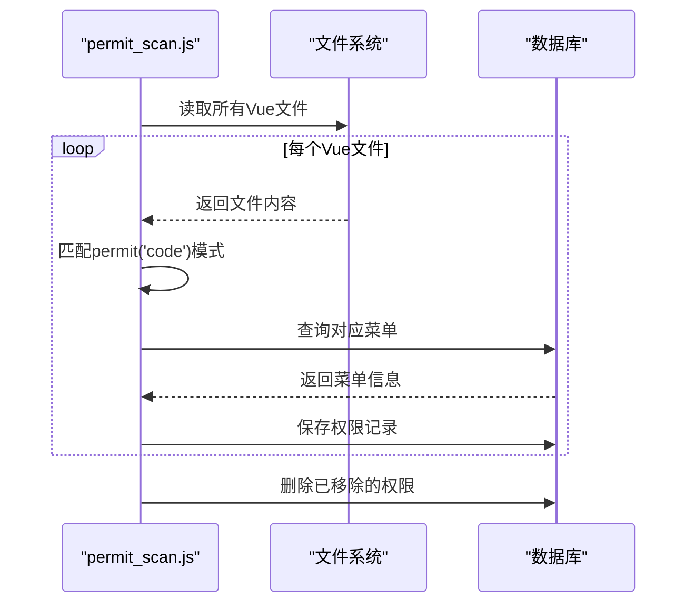
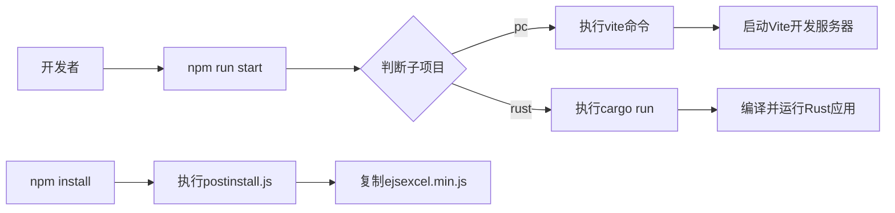

# 开发工作流


**本文档引用的文件**  
- [package.json](https://github.com/sail-sail/nest/blob/main/codegen/package.json)
- [codegen.ts](https://github.com/sail-sail/nest/blob/main/codegen/src/bin/codegen.ts)
- [postinstall.js](https://github.com/sail-sail/nest/blob/main/pc/src/utils/postinstall.js)
- [permit_scan.js](https://github.com/sail-sail/nest/blob/main/pc/src/utils/permit_scan.js)
- [main.ts](https://github.com/sail-sail/nest/blob/main/pc/src/main.ts)
- [main.rs](https://github.com/sail-sail/nest/blob/main/rust/main.rs)
- [package.json](https://github.com/sail-sail/nest/blob/main/pc/package.json)
- [package.json](https://github.com/sail-sail/nest/blob/main/rust/package.json)


## 目录
1. [简介](#简介)
2. [项目结构](#项目结构)
3. [核心组件](#核心组件)
4. [架构概述](#架构概述)
5. [详细组件分析](#详细组件分析)
6. [依赖分析](#依赖分析)
7. [性能考虑](#性能考虑)
8. [故障排除指南](#故障排除指南)
9. [结论](#结论)

## 简介
本文档旨在为开发者提供从零开始的标准开发工作流指南。文档详细说明了如何通过 `package.json` 中的脚本（如 `npm run codegen`）启动代码生成，如何手动修改生成的代码并保留 Git 历史，以及如何启动前后端服务。同时解释了 `postinstall.js` 和 `permit_scan.js` 等工具脚本的作用，为新项目提供清晰的开发指引，确保团队遵循一致的开发实践。

## 项目结构
项目采用多模块架构，包含 `codegen`、`pc`、`rust` 和 `uni` 四个主要子项目，分别负责代码生成、前端管理界面、后端服务和移动端应用。`codegen` 模块通过模板生成前端 Vue 组件、后端 Rust 模块及 GraphQL 接口，实现前后端代码的一体化生成。



**图示来源**  
- [codegen](https://github.com/sail-sail/nest/blob/main/codegen)
- [pc](https://github.com/sail-sail/nest/blob/main/pc)
- [rust](https://github.com/sail-sail/nest/blob/main/rust)
- [uni](https://github.com/sail-sail/nest/blob/main/uni)

**本节来源**  
- [project_structure](https://github.com/sail-sail/nest/blob/main/project_structure)

## 核心组件
核心组件包括代码生成器、权限扫描器、前后端服务入口及自动化构建脚本。代码生成器基于数据库表结构自动生成前后端代码；权限扫描器自动识别前端组件中的权限标识并同步到数据库；前后端服务分别通过 Vite 和 Cargo 启动。

**本节来源**  
- [codegen.ts](https://github.com/sail-sail/nest/blob/main/codegen/src/bin/codegen.ts)
- [permit_scan.js](https://github.com/sail-sail/nest/blob/main/pc/src/utils/permit_scan.js)
- [main.ts](https://github.com/sail-sail/nest/blob/main/pc/src/main.ts)
- [main.rs](https://github.com/sail-sail/nest/blob/main/rust/main.rs)

## 架构概述
系统采用前后端分离架构，前端使用 Vue 3 + Element Plus，后端使用 Rust + Poem + GraphQL。代码生成模块基于 TypeScript 实现，通过模板引擎生成 Vue 组件和 Rust 模块。权限系统通过 `permit('code')` 标记在前端组件中声明，由 `permit_scan.js` 扫描并写入数据库。



**图示来源**  
- [codegen.ts](https://github.com/sail-sail/nest/blob/main/codegen/src/bin/codegen.ts)
- [main.ts](https://github.com/sail-sail/nest/blob/main/pc/src/main.ts)
- [main.rs](https://github.com/sail-sail/nest/blob/main/rust/main.rs)

## 详细组件分析

### 代码生成流程分析
代码生成流程由 `npm run codegen` 触发，执行 `codegen.ts` 脚本。该脚本读取数据库表结构，结合模板生成前端路由、视图组件及后端 DAO、Model、Resolver 等模块。



**图示来源**  
- [codegen.ts](https://github.com/sail-sail/nest/blob/main/codegen/src/bin/codegen.ts)
- [codegen](https://github.com/sail-sail/nest/blob/main/codegen/package.json)

**本节来源**  
- [codegen.ts](https://github.com/sail-sail/nest/blob/main/codegen/src/bin/codegen.ts)

### 权限扫描机制分析
`permit_scan.js` 脚本用于扫描前端组件中通过 `permit('code')` 声明的权限点，并将其同步到数据库的 `base_permit` 表中。该机制确保前端权限声明与后端权限配置保持一致。



**图示来源**  
- [permit_scan.js](https://github.com/sail-sail/nest/blob/main/pc/src/utils/permit_scan.js)
- [package.json](https://github.com/sail-sail/nest/blob/main/pc/package.json)

**本节来源**  
- [permit_scan.js](https://github.com/sail-sail/nest/blob/main/pc/src/utils/permit_scan.js)

### 服务启动流程分析
前端服务通过 Vite 启动，后端服务通过 Cargo 运行。构建脚本 `postbuild.js` 在构建完成后执行资源复制等操作，`postinstall.js` 在依赖安装后复制必要的前端库文件。



**图示来源**  
- [main.ts](https://github.com/sail-sail/nest/blob/main/pc/src/main.ts)
- [main.rs](https://github.com/sail-sail/nest/blob/main/rust/main.rs)
- [postinstall.js](https://github.com/sail-sail/nest/blob/main/pc/src/utils/postinstall.js)
- [package.json](https://github.com/sail-sail/nest/blob/main/pc/package.json)
- [package.json](https://github.com/sail-sail/nest/blob/main/rust/package.json)

**本节来源**  
- [main.ts](https://github.com/sail-sail/nest/blob/main/pc/src/main.ts)
- [main.rs](https://github.com/sail-sail/nest/blob/main/rust/main.rs)
- [postinstall.js](https://github.com/sail-sail/nest/blob/main/pc/src/utils/postinstall.js)

## 依赖分析
项目依赖通过 pnpm 管理，各子项目独立维护 `package.json`。`codegen` 模块依赖 TypeScript、MySQL2 等用于代码生成；`pc` 前端依赖 Vue、Element Plus、GraphQL 客户端等；`rust` 后端依赖 Poem、Async-GraphQL、MySQL 异步驱动等。

```mermaid
graph TD
A[codegen] --> B[typescript]
A --> C[mysql2]
A --> D[ts-node]
E[pc] --> F[vue]
E --> G[element-plus]
E --> H[graphql]
I[rust] --> J[poem]
I --> K[async-graphql]
I --> L[mysql_async]
M[uni] --> N[@dcloudio/uni-app]
M --> O[vue]
```

**图示来源**  
- [package.json](https://github.com/sail-sail/nest/blob/main/codegen/package.json)
- [package.json](https://github.com/sail-sail/nest/blob/main/pc/package.json)
- [package.json](https://github.com/sail-sail/nest/blob/main/rust/package.json)
- [package.json](https://github.com/sail-sail/nest/blob/main/uni/package.json)

**本节来源**  
- [package.json](https://github.com/sail-sail/nest/blob/main/codegen/package.json)
- [package.json](https://github.com/sail-sail/nest/blob/main/pc/package.json)
- [package.json](https://github.com/sail-sail/nest/blob/main/rust/package.json)
- [package.json](https://github.com/sail-sail/nest/blob/main/uni/package.json)

## 性能考虑
- 代码生成过程使用 Git 暂存区保护机制，避免中间状态污染版本控制
- 前端构建时通过 `postbuild.js` 优化资源引用
- 后端使用 `tikv_jemallocator` 内存分配器优化性能
- GraphQL 查询通过 `Server-Timing` 头部提供性能监控支持
- 静态资源通过 `ejsexcel-browserify` 优化浏览器兼容性

## 故障排除指南
- **代码生成失败**：检查数据库连接配置，确保 `codegen/.env` 文件正确
- **权限扫描异常**：确认 `permit('code')` 语法正确，且对应菜单已存在
- **前端构建错误**：运行 `npm run typecheck` 检查类型错误
- **后端启动失败**：检查 `.env` 文件中的数据库连接参数
- **Git 暂存区冲突**：在运行 `npm run codegen` 前提交或暂存所有更改
- **依赖安装问题**：确保使用 pnpm 而非 npm 或 yarn，项目使用 `preinstall` 钩子强制使用 pnpm

**本节来源**  
- [codegen.ts](https://github.com/sail-sail/nest/blob/main/codegen/src/bin/codegen.ts)
- [permit_scan.js](https://github.com/sail-sail/nest/blob/main/pc/src/utils/permit_scan.js)
- [postinstall.js](https://github.com/sail-sail/nest/blob/main/pc/src/utils/postinstall.js)

## 结论
本文档提供了完整的开发工作流指南，涵盖了代码生成、权限管理、服务启动等关键环节。通过标准化的脚本和自动化工具，团队可以高效地进行全栈开发，确保代码一致性并减少人为错误。建议新项目严格遵循本文档的流程，以保证开发效率和代码质量。