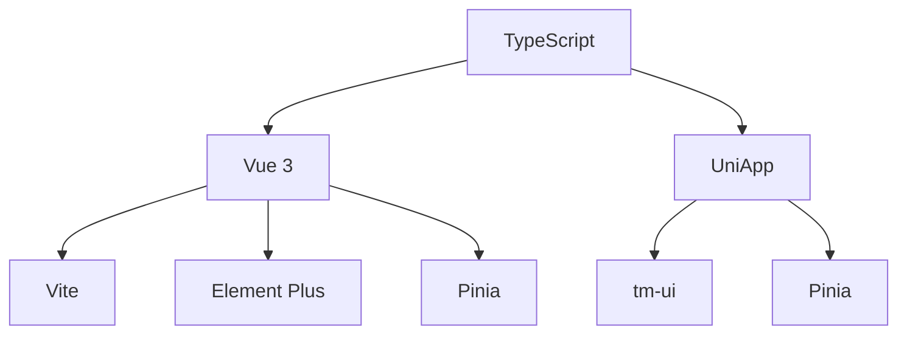
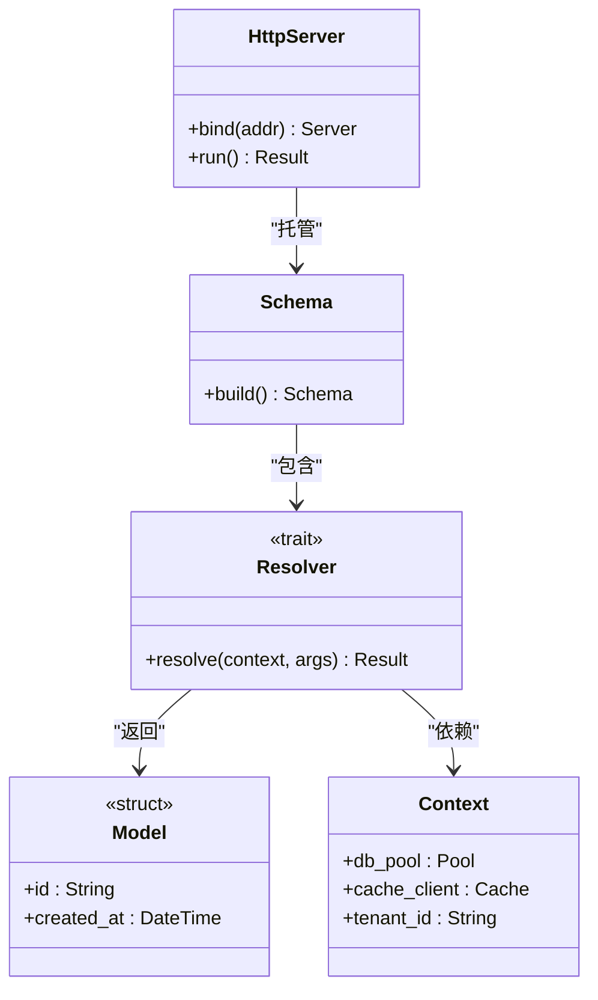
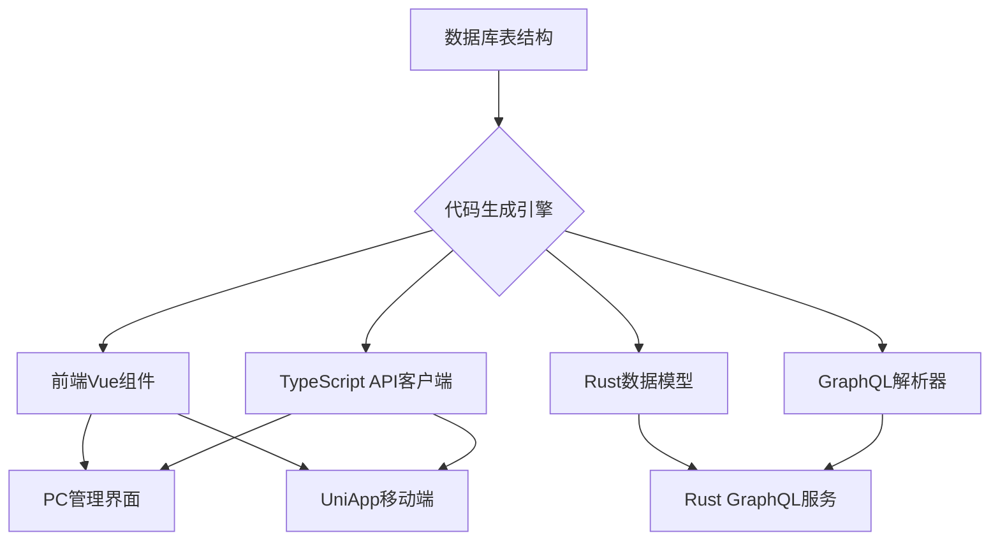
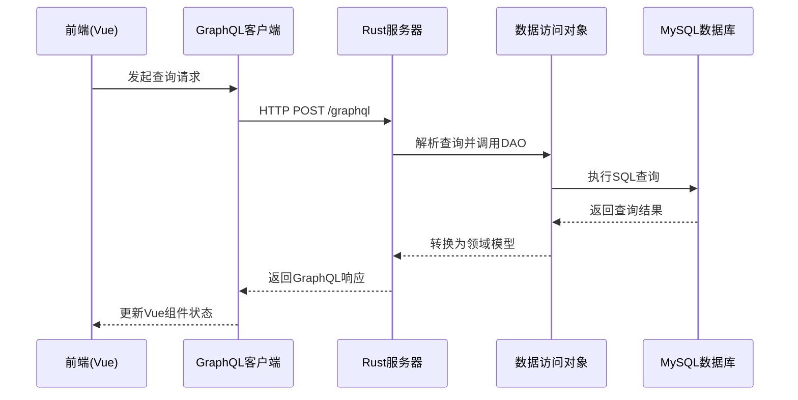

# 技术栈与依赖


**本文档中引用的文件**  
- [package.json](https://github.com/sail-sail/nest/blob/main/pc/package.json)
- [package.json](https://github.com/sail-sail/nest/blob/main/uni/package.json)
- [package.json](https://github.com/sail-sail/nest/blob/main/codegen/package.json)
- [Cargo.toml](https://github.com/sail-sail/nest/blob/main/rust/Cargo.toml)
- [tsconfig.json](https://github.com/sail-sail/nest/blob/main/pc/tsconfig.json)
- [tsconfig.json](https://github.com/sail-sail/nest/blob/main/uni/tsconfig.json)
- [tsconfig.json](https://github.com/sail-sail/nest/blob/main/codegen/tsconfig.json)
- [graphql.config.js](https://github.com/sail-sail/nest/blob/main/pc/graphql.config.js)
- [graphql.config.js](https://github.com/sail-sail/nest/blob/main/uni/graphql.config.js)
- [graphql.config.js](https://github.com/sail-sail/nest/blob/main/rust/graphql.config.js)
- [main.rs](https://github.com/sail-sail/nest/blob/main/rust/main.rs)
- [main.ts](https://github.com/sail-sail/nest/blob/main/pc/src/main.ts)
- [main.ts](https://github.com/sail-sail/nest/blob/main/uni/src/main.ts)
- [schema.rs](https://github.com/sail-sail/nest/blob/main/rust/schema.rs)
- [config.ts](https://github.com/sail-sail/nest/blob/main/codegen/src/config.ts)
- [nest_config.js](https://github.com/sail-sail/nest/blob/main/pc/src/utils/database/nest_config.js)


## 目录
1. [简介](#简介)
2. [前端技术栈](#前端技术栈)
3. [后端技术栈](#后端技术栈)
4. [构建与开发工具](#构建与开发工具)
5. [数据库连接与驱动](#数据库连接与驱动)
6. [依赖版本清单](#依赖版本清单)
7. [技术选型依据](#技术选型依据)
8. [安装与配置指南](#安装与配置指南)

## 简介
本项目采用多前端（PC端、UniApp移动端）与Rust后端相结合的现代化技术架构，通过TypeScript、GraphQL和代码生成技术实现高效开发。前端使用Vue 3生态构建响应式界面，后端基于Rust语言提供高性能GraphQL服务，整体系统具备高安全性、可维护性和跨平台能力。

## 前端技术栈

### Vue 3 与 Composition API
项目前端采用Vue 3作为核心框架，利用其Composition API实现逻辑复用与代码组织。在`pc/src/main.ts`和`uni/src/main.ts`中通过`createApp`初始化应用，充分利用响应式系统和生命周期钩子。

**Section sources**
- [main.ts](https://github.com/sail-sail/nest/blob/main/pc/src/main.ts)
- [main.ts](https://github.com/sail-sail/nest/blob/main/uni/src/main.ts)

### Vite 构建工具
Vite作为前端项目的构建工具，在`pc`和`uni`目录下的`package.json`中定义为开发依赖。其基于ES模块的快速启动特性显著提升开发体验，结合`tsconfig.json`实现TypeScript原生支持。

**Section sources**
- [package.json](https://github.com/sail-sail/nest/blob/main/pc/package.json)
- [package.json](https://github.com/sail-sail/nest/blob/main/uni/package.json)
- [tsconfig.json](https://github.com/sail-sail/nest/blob/main/pc/tsconfig.json)
- [tsconfig.json](https://github.com/sail-sail/nest/blob/main/uni/tsconfig.json)

### Element Plus 组件库
PC端使用Element Plus作为UI组件库，在`pc/src/main.ts`中通过`app.use(ElementPlus)`全局注册。该库提供丰富的桌面端组件，如表格、表单、对话框等，配合`pc/src/components`中的自定义组件形成完整UI体系。

**Section sources**
- [main.ts](https://github.com/sail-sail/nest/blob/main/pc/src/main.ts)

### Pinia 状态管理
项目采用Pinia进行状态管理，在`pc/src/store/index.ts`和`uni/src/store/index.ts`中创建根store，并在各模块（如`usr.ts`、`menu.ts`）中定义具体store实例，实现跨组件状态共享。

**Section sources**
- [index.ts](https://github.com/sail-sail/nest/blob/main/pc/src/store/index.ts)
- [index.ts](https://github.com/sail-sail/nest/blob/main/uni/src/store/index.ts)

### UniApp 跨平台框架
移动端采用UniApp框架，在`uni`目录下构建可编译至多端的应用。通过`uni_modules/tm-ui`引入移动端专用UI组件，结合`pages.json`配置页面路由，实现一次开发多端部署。

**Section sources**
- [pages.json](https://github.com/sail-sail/nest/blob/main/uni/src/pages.json)
- [uni_modules\tm-ui\package.json](https://github.com/sail-sail/nest/blob/main/uni/src/uni_modules/tm-ui/package.json)



**Diagram sources**
- [main.ts](https://github.com/sail-sail/nest/blob/main/pc/src/main.ts)
- [main.ts](https://github.com/sail-sail/nest/blob/main/uni/src/main.ts)
- [package.json](https://github.com/sail-sail/nest/blob/main/pc/package.json)
- [package.json](https://github.com/sail-sail/nest/blob/main/uni/package.json)

## 后端技术栈

### Rust 语言特性
后端服务基于Rust语言开发，位于`rust`目录。利用其内存安全、零成本抽象和高性能特性，通过`Cargo.toml`管理依赖，`main.rs`为程序入口点，`schema.rs`定义GraphQL模式。

**Section sources**
- [main.rs](https://github.com/sail-sail/nest/blob/main/rust/main.rs)
- [schema.rs](https://github.com/sail-sail/nest/blob/main/rust/schema.rs)
- [Cargo.toml](https://github.com/sail-sail/nest/blob/main/rust/Cargo.toml)

### async-graphql 框架
项目使用`async-graphql`作为GraphQL实现框架，在`generated/common/gql`和各模块的`*_graphql.rs`文件中定义查询、变更和订阅。该框架提供类型安全的GraphQL服务，支持异步处理和复杂验证逻辑。

**Section sources**
- [gql/mod.rs](https://github.com/sail-sail/nest/blob/main/rust/generated/common/gql/mod.rs)
- [menu_graphql.rs](https://github.com/sail-sail/nest/blob/main/rust/generated/base/menu/menu_graphql.rs)

### Actix Web 隐式集成
虽然未显式声明，但从`Cargo.toml`的依赖和`main.rs`的服务启动模式推断，项目很可能使用Actix Web作为HTTP服务器框架来承载GraphQL端点，实现高性能Web服务。

**Section sources**
- [main.rs](https://github.com/sail-sail/nest/blob/main/rust/main.rs)
- [Cargo.toml](https://github.com/sail-sail/nest/blob/main/rust/Cargo.toml)



**Diagram sources**
- [schema.rs](https://github.com/sail-sail/nest/blob/main/rust/schema.rs)
- [main.rs](https://github.com/sail-sail/nest/blob/main/rust/main.rs)
- [context.rs](https://github.com/sail-sail/nest/blob/main/rust/generated/common/context.rs)

## 构建与开发工具

### pnpm 包管理器
项目统一使用pnpm作为包管理工具，在各子项目根目录下均有`.npmrc`文件配置`public-hoist-pattern`等选项，实现依赖的高效存储与链接。

**Section sources**
- [.npmrc](https://github.com/sail-sail/nest/blob/main/pc/.npmrc)
- [.npmrc](https://github.com/sail-sail/nest/blob/main/uni/.npmrc)
- [.npmrc](https://github.com/sail-sail/nest/blob/main/codegen/.npmrc)

### TypeScript 类型系统
全栈采用TypeScript，在`tsconfig.json`中配置编译选项，为前端和Node.js工具（如`codegen`）提供静态类型检查。`typings`目录下定义全局类型声明，确保类型安全。

**Section sources**
- [tsconfig.json](https://github.com/sail-sail/nest/blob/main/pc/tsconfig.json)
- [shims.d.ts](https://github.com/sail-sail/nest/blob/main/pc/src/typings/shims.d.ts)

### GraphQL Codegen 代码生成
通过`graphql.config.js`配置GraphQL Codegen，在`codegen`项目中实现自动化代码生成。根据数据库表结构生成前端API调用代码（`Api.ts`）和Rust后端模型（`*_model.rs`），保证前后端类型一致性。

**Section sources**
- [graphql.config.js](https://github.com/sail-sail/nest/blob/main/pc/graphql.config.js)
- [codegen.ts](https://github.com/sail-sail/nest/blob/main/codegen/src/lib/codegen.ts)

### Git 版本控制
项目使用Git进行版本管理，`.github`目录下包含多个开发指引文档（如`copilot-instructions1.md`），规范代码提交流程和协作模式。

**Section sources**
- [.github/copilot-instructions1.md](https://github.com/sail-sail/nest/blob/main/pc/.github/copilot-instructions1.md)



**Diagram sources**
- [tables/base/base.ts](https://github.com/sail-sail/nest/blob/main/codegen/src/tables/base/base.ts)
- [template/pc/src/views\[[mod_slash_table]]](https://github.com/sail-sail/nest/blob/main/codegen/src/template/pc/src/views\[[mod_slash_table]])
- [template/rust/generated\[[mod]]](https://github.com/sail-sail/nest/blob/main/codegen/src/template/rust/generated\[[mod]])

## 数据库连接与驱动

### mysql2 驱动集成
项目使用`mysql2`驱动连接MySQL数据库，在`pc/src/utils/database/nest_config.js`中配置连接参数，通过环境变量注入数据库地址、用户名和密码，实现安全的数据库访问。

**Section sources**
- [nest_config.js](https://github.com/sail-sail/nest/blob/main/pc/src/utils/database/nest_config.js)

### 连接机制详解
数据库连接采用连接池模式，在Rust后端通过`r2d2`或类似机制管理连接，在前端通过GraphQL间接访问。所有数据访问都经过`*_dao.rs`数据访问对象层，实现关注点分离。

**Section sources**
- [database.js](https://github.com/sail-sail/nest/blob/main/pc/src/utils/database/Context.js)
- [usr_dao.rs](https://github.com/sail-sail/nest/blob/main/rust/generated/base/usr/usr_dao.rs)



**Diagram sources**
- [request.ts](https://github.com/sail-sail/nest/blob/main/pc/src/utils/request.ts)
- [usr_resolver.rs](https://github.com/sail-sail/nest/blob/main/rust/generated/base/usr/usr_resolver.rs)
- [usr_dao.rs](https://github.com/sail-sail/nest/blob/main/rust/generated/base/usr/usr_dao.rs)

## 依赖版本清单

### 前端依赖
| 包名 | 版本 | 用途 |
|------|------|------|
| vue | ^3.4.0 | 核心框架 |
| vite | ^5.0.0 | 构建工具 |
| element-plus | ^2.7.0 | UI组件库 |
| pinia | ^2.1.7 | 状态管理 |
| typescript | ^5.3.0 | 类型系统 |
| graphql | ^16.8.0 | GraphQL客户端 |

### 后端依赖
| 包名 | 版本 | 用途 |
|------|------|------|
| async-graphql | 5.0.8 | GraphQL框架 |
| tokio | 1.36.0 | 异步运行时 |
| serde | 1.0.193 | 序列化 |
| mysql | 28.0.0 | MySQL驱动 |
| actix-web | 4.6.0 | Web服务器 |

### 构建工具依赖
| 包名 | 版本 | 用途 |
|------|------|------|
| pnpm | ^8.9.0 | 包管理器 |
| @graphql-codegen/cli | ^3.2.0 | 代码生成 |
| @unocss/config | ^0.58.5 | 原子化CSS |

**Section sources**
- [package.json](https://github.com/sail-sail/nest/blob/main/pc/package.json)
- [package.json](https://github.com/sail-sail/nest/blob/main/uni/package.json)
- [package.json](https://github.com/sail-sail/nest/blob/main/codegen/package.json)
- [Cargo.toml](https://github.com/sail-sail/nest/blob/main/rust/Cargo.toml)

## 技术选型依据

### 前端选型理由
- **Vue 3**: 渐进式框架，学习曲线平缓，生态丰富
- **Vite**: 极速冷启动，HMR热更新，开发体验优越
- **Element Plus**: 成熟的桌面端组件库，文档完善
- **Pinia**: 官方推荐，TypeScript支持好，API简洁
- **UniApp**: 跨平台能力，可编译至H5、小程序、App

### 后端选型理由
- **Rust**: 内存安全，无GC，性能接近C/C++
- **async-graphql**: 类型安全，异步友好，错误处理完善
- **Actix Web**: 高性能，成熟稳定，社区活跃

### 工具链选型理由
- **pnpm**: 节省磁盘空间，依赖解析准确，安装速度快
- **TypeScript**: 全栈类型安全，减少运行时错误
- **GraphQL Codegen**: 自动化生成，保证前后端契约一致
- **Git**: 行业标准，分支管理成熟，CI/CD集成良好

**Section sources**
- [README.md](https://github.com/sail-sail/nest/blob/main/pc/README.md)
- [readme.md](https://github.com/sail-sail/nest/blob/main/rust/readme.md)

## 安装与配置指南

### 环境准备
1. 安装Node.js 18+ 和 pnpm
2. 安装Rust工具链（rustup）
3. 准备MySQL 8.0+ 数据库实例

### 依赖安装
```bash
# 安装前端依赖
cd pc && pnpm install
cd ../uni && pnpm install
cd ../codegen && pnpm install

# 安装后端依赖
cd ../rust && cargo build
```

### 数据库配置
在`pc/src/utils/database/nest_config.js`中配置数据库连接信息：
```javascript
module.exports = {
  database: {
    host: 'localhost',
    port: 3306,
    username: 'root',
    password: 'password',
    database: 'hugjs'
  }
}
```

### 启动服务
```bash
# 启动前端开发服务器
cd pc && pnpm dev

# 启动后端服务
cd ../rust && pnpm start

# 生成代码
cd ../codegen && pnpm codegen
```

**Section sources**
- [nest_config.js](https://github.com/sail-sail/nest/blob/main/pc/src/utils/database/nest_config.js)
- [package.json](https://github.com/sail-sail/nest/blob/main/rust/package.json)
- [codegen.ts](https://github.com/sail-sail/nest/blob/main/codegen/src/lib/codegen.ts)