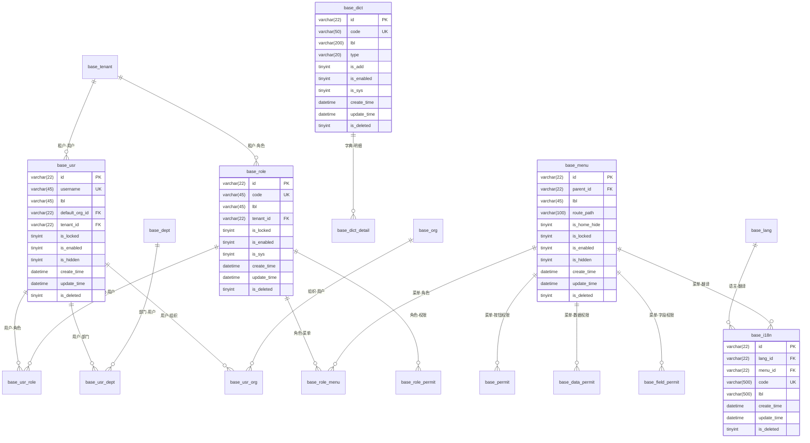

# 数据模型与数据库设计


**本文档引用的文件**   
- [base.sql](https://github.com/sail-sail/nest/blob/main/codegen/src/tables/base/base.sql)
- [base.i18n.sql](https://github.com/sail-sail/nest/blob/main/codegen/src/tables/base/base.i18n.sql)


## 目录
1. [核心实体表结构](#核心实体表结构)
2. [字典与多语言设计模式](#字典与多语言设计模式)
3. [外键关联与数据完整性](#外键关联与数据完整性)
4. [系统通用字段规范](#系统通用字段规范)
5. [数据模型关系图](#数据模型关系图)

## 核心实体表结构

### 用户表 (base_usr)
用户表存储系统用户的基本信息，是权限管理的核心实体。该表通过外键与角色、部门、组织等实体建立关联。

**字段定义**:
- `id`: 主键，22位字符串，存储Base64编码的UUID
- `username`: 用户名，45位字符串，用于登录认证
- `password`: 密码，43位字符串，存储加密后的密码
- `default_org_id`: 默认组织ID，关联组织表
- `tenant_id`: 租户ID，支持多租户架构
- `is_locked`: 锁定状态，0表示未锁定，1表示锁定
- `is_enabled`: 启用状态，0表示禁用，1表示启用
- `is_hidden`: 隐藏状态，控制用户在列表中的可见性

**索引设计**:
- `username`与`tenant_id`的复合索引，支持按租户快速查找用户
- `lbl`与`tenant_id`的复合索引，支持按用户名称搜索
- 包含`password`的复合索引，支持登录验证的快速查询

### 角色表 (base_role)
角色表定义了系统的权限角色，通过角色-用户关联实现权限的批量分配。

**字段定义**:
- `id`: 主键，22位字符串
- `code`: 角色编码，45位字符串，用于程序识别
- `lbl`: 角色名称，45位字符串，用于界面显示
- `home_url`: 首页URL，200位字符串，定义角色登录后的默认页面
- `tenant_id`: 租户ID，实现租户间角色隔离
- `is_sys`: 系统记录标识，0表示自定义角色，1表示系统预设角色

**索引设计**:
- `code`与`tenant_id`的复合索引，支持按编码快速查找角色
- `lbl`与`tenant_id`的复合索引，支持按名称搜索角色

### 菜单表 (base_menu)
菜单表定义了系统的导航结构，支持多级菜单的树形组织。

**字段定义**:
- `id`: 主键，22位字符串
- `parent_id`: 父菜单ID，实现菜单的层级结构
- `lbl`: 菜单名称，45位字符串
- `route_path`: 路由路径，100位字符串，对应前端路由
- `route_query`: 路由参数，200位字符串，传递给路由的查询参数
- `is_home_hide`: 首页隐藏标识，控制菜单在首页的显示

**索引设计**:
- `parent_id`、`lbl`和`is_deleted`的复合索引，支持按父级快速加载菜单树

**Section sources**
- [base.sql](https://github.com/sail-sail/nest/blob/main/codegen/src/tables/base/base.sql#L86-L118)

## 字典与多语言设计模式

### 系统字典设计 (base_dict 和 base_dict_detail)
系统字典采用主-明细的两层结构设计，实现了灵活的枚举值管理。

**主表 (base_dict)**:
- `code`: 字典编码，50位字符串，作为字典的唯一标识
- `type`: 数据类型，枚举值包括'string'、'boolean'、'number'等，定义字典项的值类型
- `is_add`: 可新增标识，控制是否允许用户添加新的字典项

**明细表 (base_dict_detail)**:
- `dict_id`: 外键，关联系统字典主表
- `lbl`: 显示名称，100位字符串
- `val`: 实际值，100位字符串，存储程序使用的值
- `order_by`: 排序字段，控制字典项在界面的显示顺序

这种设计模式的优势在于：
1. **类型安全**：通过`type`字段确保字典值的数据类型一致性
2. **灵活扩展**：支持不同数据类型的字典项
3. **界面友好**：分离显示名称和实际值，便于国际化和用户理解

### 多语言设计 (base_i18n)
多语言表采用键值对的设计模式，支持系统的国际化功能。

**字段定义**:
- `lang_id`: 语言ID，关联语言表(base_lang)
- `menu_id`: 菜单ID，标识翻译内容所属的菜单
- `code`: 编码，500位字符串，作为翻译的唯一标识
- `lbl`: 翻译文本，500位字符串，存储特定语言的显示文本

**索引设计**:
- `lang_id`、`menu_id`、`code`和`is_deleted`的复合索引，支持按语言、菜单和编码快速查找翻译

**设计特点**:
- **高灵活性**：支持任意长度的翻译文本
- **高效查询**：复合索引确保翻译查找的高性能
- **租户隔离**：虽然没有`tenant_id`字段，但通过`menu_id`间接实现租户级别的翻译管理

**Section sources**
- [base.sql](https://github.com/sail-sail/nest/blob/main/codegen/src/tables/base/base.sql#L276-L301)
- [base.i18n.sql](https://github.com/sail-sail/nest/blob/main/codegen/src/tables/base/base.i18n.sql#L1-L12)

## 外键关联与数据完整性

### 多对多关联模式
系统采用中间表模式实现多对多关联，遵循统一的命名和结构规范。

**典型示例 - 用户角色关联 (base_usr_role)**:
- **表名**: `base_usr_role`，遵循`[模块]_[表1]_[表2]`的命名规则
- **字段**: 
  - `usr_id`: 用户ID，外键关联用户表
  - `role_id`: 角色ID，外键关联角色表
  - `tenant_id`: 租户ID，确保关联数据的租户隔离
- **索引**: (`usr_id`, `role_id`, `tenant_id`, `is_deleted`)复合索引，支持高效查询

**其他多对多关联**:
- 用户-部门 (base_usr_dept)
- 用户-组织 (base_usr_org)
- 角色-菜单 (base_role_menu)
- 角色-按钮权限 (base_role_permit)

### 外键约束与数据完整性
系统通过以下机制确保数据完整性：

**引用完整性**:
- 所有外键字段都建立在`id`主键上，确保引用的有效性
- 外键字段命名遵循`[表名]_id`的规范，如`usr_id`、`role_id`
- 外键字段与主表的`id`字段具有相同的数据类型(varchar(22))

**级联操作**:
- 虽然SQL定义中没有显式声明ON DELETE CASCADE，但系统通过业务逻辑实现软删除
- `is_deleted`字段统一控制记录的逻辑删除状态
- 相关DAO层代码在删除主记录时会自动处理关联记录

**租户数据隔离**:
- 大多数业务表都包含`tenant_id`字段
- 外键关联表如`base_usr_role`也包含`tenant_id`
- 查询时通过`tenant_id`和`is_deleted`的复合索引确保租户间数据隔离

**Section sources**
- [base.sql](https://github.com/sail-sail/nest/blob/main/codegen/src/tables/base/base.sql#L170-L252)

## 系统通用字段规范

### 基础字段
所有业务表都遵循统一的基础字段规范：

**主键字段**:
```sql
`id` varchar(22) NOT NULL COMMENT 'ID'
```
- 使用22位varchar存储Base64编码的UUID
- 确保全局唯一性和分布式系统的兼容性

**显示标签**:
```sql
`lbl` varchar(45) NOT NULL DEFAULT '' COMMENT '名称'
```
- `lbl`作为主要显示字段，用于界面展示
- 统一长度限制为45字符，确保界面布局一致性

### 状态控制字段
**启用/禁用**:
```sql
`is_enabled` tinyint unsigned NOT NULL DEFAULT 1 COMMENT '启用,dict:is_enabled'
```
- 1表示启用，0表示禁用
- 与字典表关联，支持扩展状态描述

**锁定状态**:
```sql
`is_locked` tinyint unsigned NOT NULL DEFAULT 0 COMMENT '锁定,dict:is_locked'
```
- 1表示锁定，0表示未锁定
- 用于防止重要记录被意外修改

### 审计字段
系统实现了完整的操作审计功能：

**创建信息**:
- `create_usr_id`: 创建人ID
- `create_usr_id_lbl`: 创建人名称（冗余字段，避免关联查询）
- `create_time`: 创建时间

**更新信息**:
- `update_usr_id`: 更新人ID
- `update_usr_id_lbl`: 更新人名称
- `update_time`: 更新时间

**删除信息**:
- `is_deleted`: 逻辑删除标识，0表示存在，1表示已删除
- `delete_usr_id`: 删除人ID
- `delete_usr_id_lbl`: 删除人名称
- `delete_time`: 删除时间

这些审计字段确保了所有数据变更的可追溯性，支持操作记录的生成和审计需求。

**Section sources**
- [base.sql](https://github.com/sail-sail/nest/blob/main/codegen/src/tables/base/base.sql#L1-L738)

## 数据模型关系图



**Diagram sources**
- [base.sql](https://github.com/sail-sail/nest/blob/main/codegen/src/tables/base/base.sql)
- [base.i18n.sql](https://github.com/sail-sail/nest/blob/main/codegen/src/tables/base/base.i18n.sql)