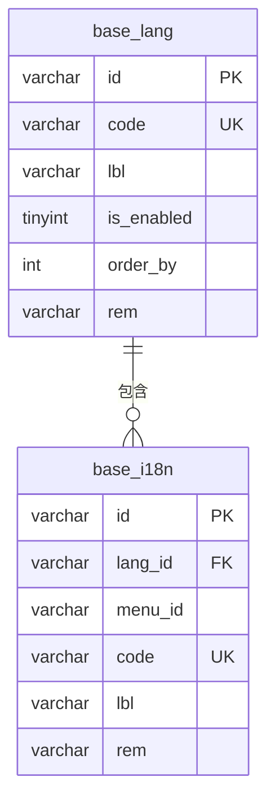
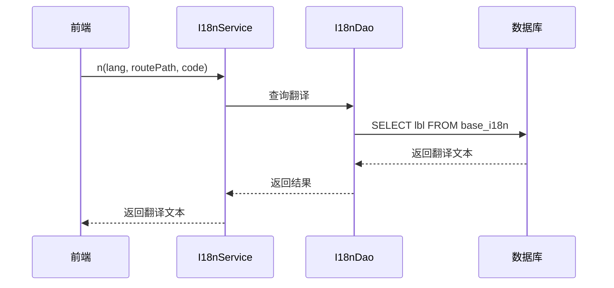
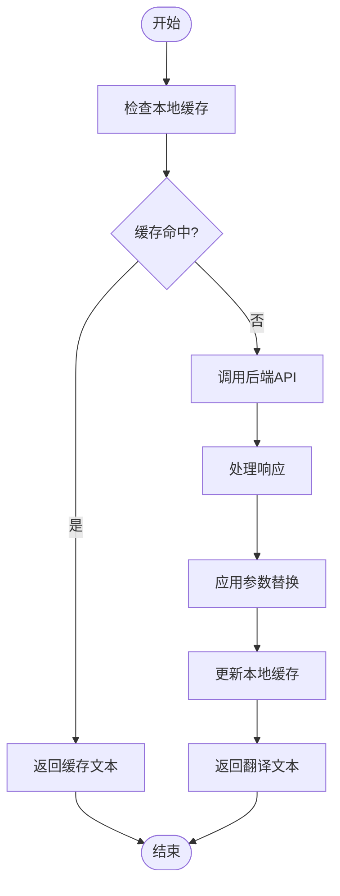
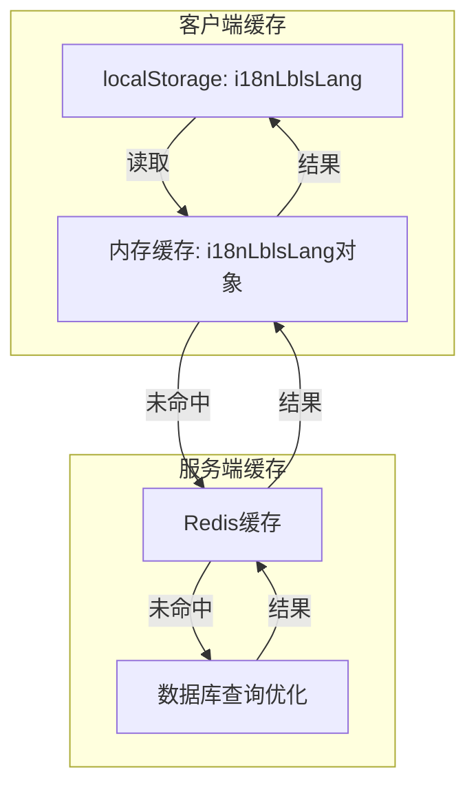

# 多语言支持


**本文档引用的文件**
- [base.sql](https://github.com/sail-sail/nest/blob/main/codegen/src/tables/base/base.sql)
- [base.i18n.sql](https://github.com/sail-sail/nest/blob/main/codegen/src/tables/base/base.i18n.sql)
- [i18n.ts](https://github.com/sail-sail/nest/blob/main/pc/src/locales/i18n.ts)
- [i18n_service.rs](https://github.com/sail-sail/nest/blob/main/rust/generated/common/i18n/i18n_service.rs)
- [lang_service.rs](https://github.com/sail-sail/nest/blob/main/rust/generated/common/lang/lang_service.rs)


## 目录
1. [简介](#简介)
2. [数据模型设计](#数据模型设计)
3. [后端多语言服务实现](#后端多语言服务实现)
4. [前端i18n集成与运行时切换](#前端i18n集成与运行时切换)
5. [多语言文本检索流程](#多语言文本检索流程)
6. [多语言资源管理最佳实践](#多语言资源管理最佳实践)
7. [缓存优化策略](#缓存优化策略)
8. [结论](#结论)

## 简介
本系统实现了完整的多语言支持功能，通过`lang`表定义支持的语言种类，`i18n`表存储各语言的翻译文本。系统采用前后端分离架构，Rust后端提供高效的翻译文本查询服务，Vue前端通过i18n.ts模块集成Vue I18n框架，实现运行时语言切换和动态文本渲染。该文档详细说明系统的数据模型、服务实现、集成方式和最佳实践。

## 数据模型设计



**图示来源**
- [base.sql](https://github.com/sail-sail/nest/blob/main/codegen/src/tables/base/base.sql#L650-L670)
- [base.i18n.sql](https://github.com/sail-sail/nest/blob/main/codegen/src/tables/base/base.i18n.sql#L5-L10)

### 语言表（lang）
`base_lang`表定义系统支持的语言：

| 字段 | 类型 | 说明 |
|------|------|------|
| id | varchar(22) | 主键ID |
| code | varchar(22) | 语言编码（如zh-cn、en） |
| lbl | varchar(100) | 语言名称 |
| is_enabled | tinyint | 是否启用 |
| order_by | int | 排序序号 |

**Section sources**
- [base.sql](https://github.com/sail-sail/nest/blob/main/codegen/src/tables/base/base.sql#L650-L670)

### 国际化表（i18n）
`base_i18n`表存储翻译文本：

| 字段 | 类型 | 说明 |
|------|------|------|
| id | varchar(22) | 主键ID |
| lang_id | varchar(22) | 关联语言ID |
| menu_id | varchar(22) | 所属菜单ID |
| code | varchar(500) | 文本键值（唯一标识） |
| lbl | varchar(500) | 翻译文本内容 |

系统通过`lang_id`和`code`的组合唯一确定一条翻译记录，支持按菜单范围组织翻译资源。

**Section sources**
- [base.sql](https://github.com/sail-sail/nest/blob/main/codegen/src/tables/base/base.sql#L672-L690)

## 后端多语言服务实现



**图示来源**
- [i18n_service.rs](https://github.com/sail-sail/nest/blob/main/rust/generated/common/i18n/i18n_service.rs#L1-L38)
- [base.i18n.sql](https://github.com/sail-sail/nest/blob/main/codegen/src/tables/base/base.i18n.sql#L5-L10)

Rust后端通过`i18n_service.rs`提供多语言文本检索服务：

- `n()`函数：根据语言、路由路径和代码键值查询翻译文本
- `ns()`函数：查询系统级翻译文本（无路由路径）
- `n_lang()`函数：指定特定语言代码查询翻译

服务层调用DAO层执行数据库查询，返回结果前进行必要的数据处理和错误处理。

**Section sources**
- [i18n_service.rs](https://github.com/sail-sail/nest/blob/main/rust/generated/common/i18n/i18n_service.rs#L1-L38)

## 前端i18n集成与运行时切换

```mermaid
classDiagram
class I18nModule {
+initI18nLblsLang()
+getLbl(lang, code, routePath)
+getLblAsync(lang, code, routePath)
+initI18ns(lang, codes, routePath)
}
class UseI18n {
+n(code, ...args)
+nAsync(code, ...args)
+initI18ns(codes)
+ns(code, ...args)
+nsAsync(code, ...args)
}
UseI18n --> I18nModule : "使用"
I18nModule --> "localStorage" : "缓存"
I18nModule --> "Api" : "远程调用"
```

**图示来源**
- [i18n.ts](https://github.com/sail-sail/nest/blob/main/pc/src/locales/i18n.ts#L1-L218)

前端通过`i18n.ts`模块实现Vue I18n集成：

- 使用`localStorage`缓存已获取的翻译文本，减少重复请求
- `useI18n()`函数返回i18n工具对象，提供`n()`、`ns()`等方法
- 支持参数替换，通过`{0}`、`{1}`或`{name}`语法实现动态文本
- 自动从`usrStore`获取当前用户语言设置
- 提供同步和异步两种文本获取方式

**Section sources**
- [i18n.ts](https://github.com/sail-sail/nest/blob/main/pc/src/locales/i18n.ts#L1-L218)

## 多语言文本检索流程



**图示来源**
- [i18n.ts](https://github.com/sail-sail/nest/blob/main/pc/src/locales/i18n.ts#L100-L150)
- [i18n_service.rs](https://github.com/sail-sail/nest/blob/main/rust/generated/common/i18n/i18n_service.rs#L10-L20)

完整流程如下：

1. 前端调用`$t('key')`或`n('key')`方法
2. 检查`localStorage`中是否存在对应语言和键值的缓存
3. 若缓存存在且有效，直接返回缓存文本
4. 若缓存不存在，调用后端`n0` API接口获取翻译
5. 将获取的翻译文本存入本地缓存
6. 返回翻译结果

**Section sources**
- [i18n.ts](https://github.com/sail-sail/nest/blob/main/pc/src/locales/i18n.ts#L100-L150)
- [i18n_service.rs](https://github.com/sail-sail/nest/blob/main/rust/generated/common/i18n/i18n_service.rs#L10-L20)

## 多语言资源管理最佳实践

### 新语言添加流程
1. 在`base_lang`表中插入新语言记录
2. 设置`code`字段为标准语言编码（如fr、de）
3. 设置`is_enabled`为1以启用该语言
4. 为新语言批量导入翻译文本到`base_i18n`表

### 翻译文本批量导入导出
- 使用CSV文件格式进行翻译资源的批量导入导出
- 导出格式：`lang_code,menu_id,code,lbl`
- 导入时验证语言编码和键值的唯一性
- 提供管理界面进行翻译资源的批量编辑

**Section sources**
- [base.sql](https://github.com/sail-sail/nest/blob/main/codegen/src/tables/base/base.sql#L650-L690)

## 缓存优化策略



**图示来源**
- [i18n.ts](https://github.com/sail-sail/nest/blob/main/pc/src/locales/i18n.ts#L50-L80)
- [i18n_service.rs](https://github.com/sail-sail/nest/blob/main/rust/generated/common/i18n/i18n_service.rs)

高并发场景下的缓存优化策略：

- **客户端多级缓存**：同时使用内存对象和localStorage
- **版本控制**：通过`__i18n_version`标识缓存版本，实现缓存刷新
- **预加载机制**：页面初始化时批量加载常用翻译
- **懒加载**：按需加载特定模块的翻译资源
- **服务端缓存**：在Rust后端使用Redis缓存热点翻译数据

**Section sources**
- [i18n.ts](https://github.com/sail-sail/nest/blob/main/pc/src/locales/i18n.ts#L50-L80)
- [i18n_service.rs](https://github.com/sail-sail/nest/blob/main/rust/generated/common/i18n/i18n_service.rs)

## 结论
本多语言支持系统通过清晰的数据模型设计和高效的前后端实现，提供了完整的国际化解决方案。系统采用`lang`表和`i18n`表的关联设计，支持灵活的语言管理和翻译资源组织。Rust后端提供高性能的文本检索服务，前端通过智能缓存机制优化用户体验。通过遵循最佳实践，可以有效管理多语言资源，在高并发场景下保持系统性能。