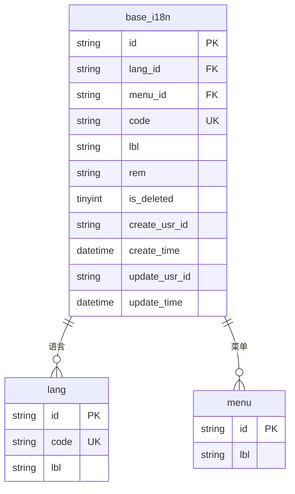
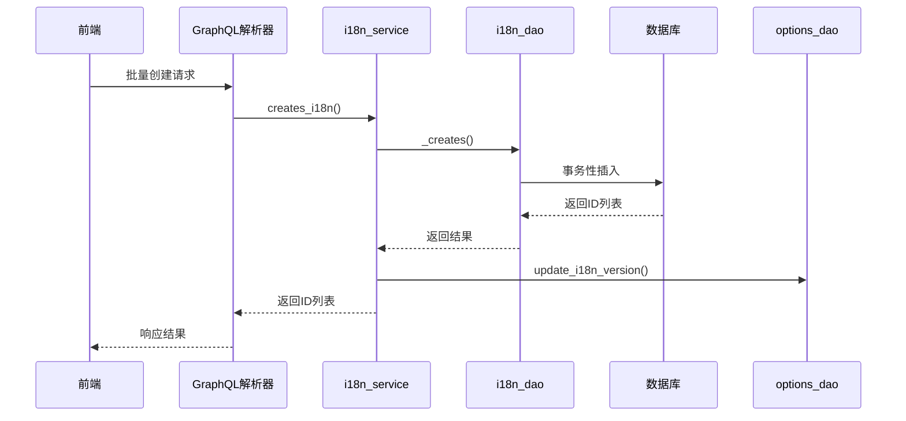
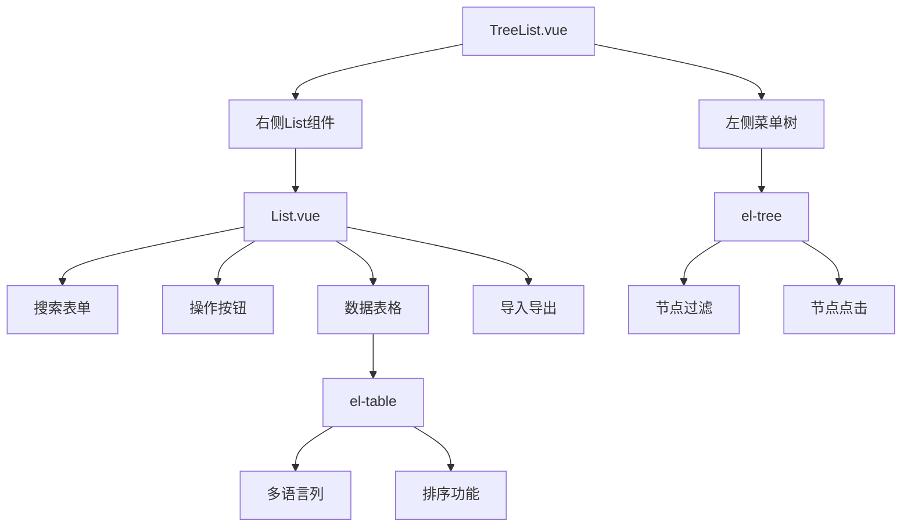
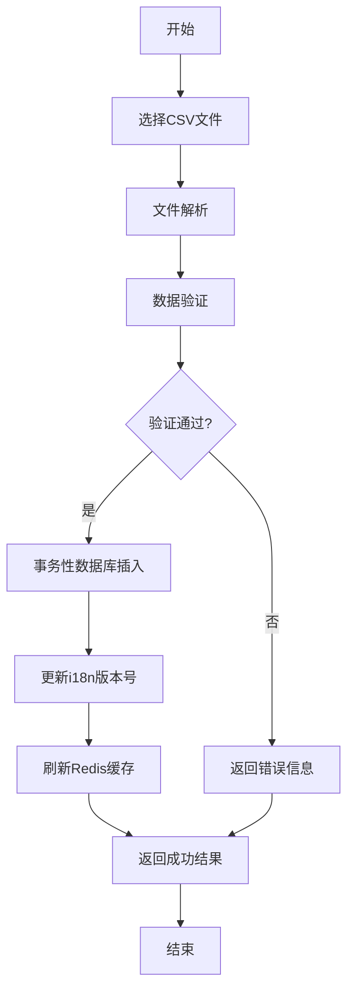
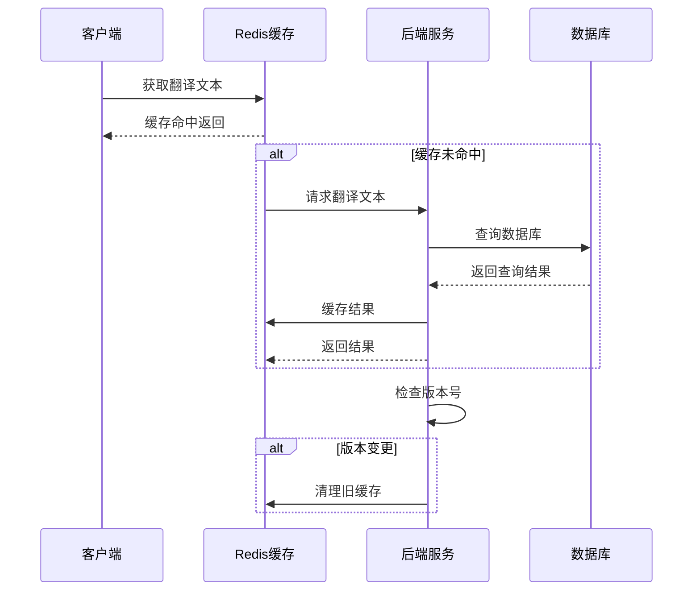

# 翻译文本管理

**本文档引用文件**  
- [i18n_service.rs](https://github.com/sail-sail/nest/blob/main/rust/generated/base/i18n/i18n_service.rs)
- [List.vue](https://github.com/sail-sail/nest/blob/main/pc/src/views/base/i18n/List.vue)
- [TreeList.vue](https://github.com/sail-sail/nest/blob/main/pc/src/views/base/i18n/TreeList.vue)
- [base.i18n.sql](https://github.com/sail-sail/nest/blob/main/codegen/src/tables/base/base.i18n.sql)
- [i18n_model.rs](https://github.com/sail-sail/nest/blob/main/rust/generated/base/i18n/i18n_model.rs)
- [i18n_dao.rs](https://github.com/sail-sail/nest/blob/main/rust/generated/base/i18n/i18n_dao.rs)
- [options_dao.rs](https://github.com/sail-sail/nest/blob/main/rust/generated/common/options/options_dao.rs)

## 目录
1. [简介](#简介)
2. [数据模型设计](#数据模型设计)
3. [后端服务实现](#后端服务实现)
4. [前端组件分析](#前端组件分析)
5. [批量导入导出流程](#批量导入导出流程)
6. [缓存与降级策略](#缓存与降级策略)
7. [结论](#结论)

## 简介
本系统提供完整的翻译文本管理功能，支持多语言环境下的国际化文本存储、检索和管理。系统采用复合主键优化查询性能，通过Rust后端服务实现高效的数据操作，并提供Vue前端组件支持树形结构展示和并行编辑。系统支持CSV文件的批量导入导出，结合Redis缓存提升高并发访问性能，并实现了完善的缺失翻译降级处理机制。

## 数据模型设计

**图示来源**  
- [base.i18n.sql](https://github.com/sail-sail/nest/blob/main/codegen/src/tables/base/base.i18n.sql#L1-L64)

**章节来源**  
- [base.i18n.sql](https://github.com/sail-sail/nest/blob/main/codegen/src/tables/base/base.i18n.sql#L1-L64)
- [i18n_model.rs](https://github.com/sail-sail/nest/blob/main/rust/generated/base/i18n/i18n_model.rs#L49-L94)

### 核心字段设计
- **key（code）**: 翻译文本的唯一标识符，用于在代码中引用翻译内容
- **lang_code（lang_id）**: 语言代码，关联语言字典表，支持多语言环境
- **text（lbl）**: 实际的翻译文本内容，存储不同语言的显示文本
- **menu_id**: 菜单关联字段，支持按功能模块组织翻译文本
- **is_deleted**: 软删除标记，实现回收站功能

### 复合主键与索引策略
系统通过复合索引 `INDEX (lang_id, menu_id, is_deleted)` 实现高效的翻译文本检索。该设计支持：
- 按语言快速过滤
- 按菜单模块分类查询
- 区分正常与已删除记录
- 减少全表扫描，提升查询性能

## 后端服务实现

**图示来源**  
- [i18n_service.rs](https://github.com/sail-sail/nest/blob/main/rust/generated/base/i18n/i18n_service.rs#L1-L299)
- [i18n_dao.rs](https://github.com/sail-sail/nest/blob/main/rust/generated/base/i18n/i18n_dao.rs#L1529-L1660)

**章节来源**  
- [i18n_service.rs](https://github.com/sail-sail/nest/blob/main/rust/generated/base/i18n/i18n_service.rs#L1-L299)
- [i18n_dao.rs](https://github.com/sail-sail/nest/blob/main/rust/generated/base/i18n/i18n_dao.rs#L1529-L1660)

### 批量导入服务
`i18n_service.rs` 中的 `creates_i18n` 服务提供了批量导入功能的核心实现：

1. **输入验证**: 检查输入数据的完整性，确保不包含预设ID
2. **唯一性检查**: 通过 `find_by_unique_i18n` 检查是否存在重复记录
3. **智能合并**: 若记录已存在，根据配置决定是更新还是跳过
4. **事务处理**: 所有插入操作在单个事务中完成，确保数据一致性
5. **版本更新**: 调用 `update_i18n_version` 更新国际化版本号，触发缓存刷新

### 版本控制机制
系统通过 `options_dao.rs` 中的 `update_i18n_version` 函数实现翻译文本的版本管理：
- 每次批量操作后自动递增版本号
- 版本号存储在 `options` 表中，键名为 `i18n_version`
- 前端可通过版本号判断是否需要刷新本地缓存
- 支持多节点环境下的缓存同步

## 前端组件分析

**图示来源**  
- [TreeList.vue](https://github.com/sail-sail/nest/blob/main/pc/src/views/base/i18n/TreeList.vue#L1-L218)
- [List.vue](https://github.com/sail-sail/nest/blob/main/pc/src/views/base/i18n/List.vue#L1-L799)

**章节来源**  
- [TreeList.vue](https://github.com/sail-sail/nest/blob/main/pc/src/views/base/i18n/TreeList.vue#L1-L218)
- [List.vue](https://github.com/sail-sail/nest/blob/main/pc/src/views/base/i18n/List.vue#L1-L799)

### TreeList.vue 组件
`TreeList.vue` 组件以树形结构展示翻译键值，主要特性包括：

- **菜单树展示**: 使用 `el-tree` 组件展示菜单层级结构
- **实时搜索**: 支持对菜单节点进行关键字过滤
- **节点高亮**: 当前选中节点通过CSS类 `is-current` 高亮显示
- **父子联动**: 点击树节点自动刷新右侧列表，显示对应菜单的翻译文本
- **状态保持**: 组件通过 `watch` 监听 `parent_id` 变化，保持树节点选中状态

### List.vue 组件
`List.vue` 组件支持多语言并行编辑，核心功能如下：

- **多语言筛选**: 提供语言下拉选择器，支持多选过滤
- **菜单过滤**: 通过 `CustomTreeSelect` 组件选择菜单范围
- **批量操作**: 支持新增、复制、编辑、删除等批量操作
- **导入导出**: 集成CSV文件导入导出功能，支持模板下载
- **列操作**: 提供 `TableShowColumns` 组件，允许用户自定义显示列
- **快捷键支持**: 实现了丰富的键盘快捷键，如ESC清空选择、Ctrl+Delete删除等

## 批量导入导出流程

**图示来源**  
- [i18n_service.rs](https://github.com/sail-sail/nest/blob/main/rust/generated/base/i18n/i18n_service.rs#L1-L299)
- [List.vue](https://github.com/sail-sail/nest/blob/main/pc/src/views/base/i18n/List.vue#L1-L799)

**章节来源**  
- [i18n_service.rs](https://github.com/sail-sail/nest/blob/main/rust/generated/base/i18n/i18n_service.rs#L1-L299)
- [List.vue](https://github.com/sail-sail/nest/blob/main/pc/src/views/base/i18n/List.vue#L1-L799)

### 完整导入流程
从CSV文件批量导入翻译文本的完整流程如下：

1. **文件选择**: 用户通过 `UploadFileDialog` 组件选择CSV文件
2. **文件解析**: 前端解析CSV内容，转换为JSON格式的翻译数据数组
3. **数据验证**: 检查必填字段（key、lang_code、text）的完整性
4. **批量请求**: 调用GraphQL的 `creates_i18n` 接口发送批量创建请求
5. **服务端处理**: 
   - 执行唯一性检查，避免重复数据
   - 在事务中批量插入数据库
   - 更新国际化版本号
6. **缓存刷新**: 版本号变更触发Redis缓存的自动刷新
7. **结果反馈**: 返回导入结果，通过 `ImportPercentageDialog` 显示进度

## 缓存与降级策略

**图示来源**  
- [i18n_dao.rs](https://github.com/sail-sail/nest/blob/main/rust/generated/common/i18n/i18n_dao.rs#L62-L167)
- [options_dao.rs](https://github.com/sail-sail/nest/blob/main/rust/generated/common/options/options_dao.rs#L0-L64)

**章节来源**  
- [i18n_dao.rs](https://github.com/sail-sail/nest/blob/main/rust/generated/common/i18n/i18n_dao.rs#L62-L167)
- [options_dao.rs](https://github.com/sail-sail/nest/blob/main/rust/generated/common/options/options_dao.rs#L0-L64)

### 缺失翻译降级
系统通过 `n` 和 `ns` 函数实现缺失翻译的优雅降级：

- **默认返回**: 当指定语言的翻译不存在时，返回原始key作为默认值
- **空值处理**: 若用户未设置语言偏好，直接返回原始key
- **批量处理**: `n_batch` 函数支持一次性查询多个翻译键，提高效率
- **映射支持**: 支持通过 `map` 参数实现动态文本替换

### Redis缓存优化
在高并发场景下，系统通过以下方式优化性能：

- **版本控制**: 使用 `i18n_version` 作为缓存版本标识
- **自动刷新**: 每次数据变更自动递增版本号，触发缓存更新
- **批量加载**: 支持按菜单或语言批量加载翻译文本到缓存
- **过期策略**: 设置合理的缓存过期时间，平衡性能与数据新鲜度

## 结论
本翻译文本管理系统通过精心设计的数据模型和高效的前后端实现，提供了完整的国际化支持。系统采用复合主键优化查询性能，通过Rust后端服务确保数据操作的高效与安全。前端组件支持树形结构展示和并行编辑，提升了用户体验。批量导入导出功能结合事务性数据库操作，确保了数据一致性。Redis缓存与版本控制机制有效应对高并发访问，而智能的降级策略保证了系统的健壮性。整体架构合理，可扩展性强，能够满足复杂多语言应用的需求。