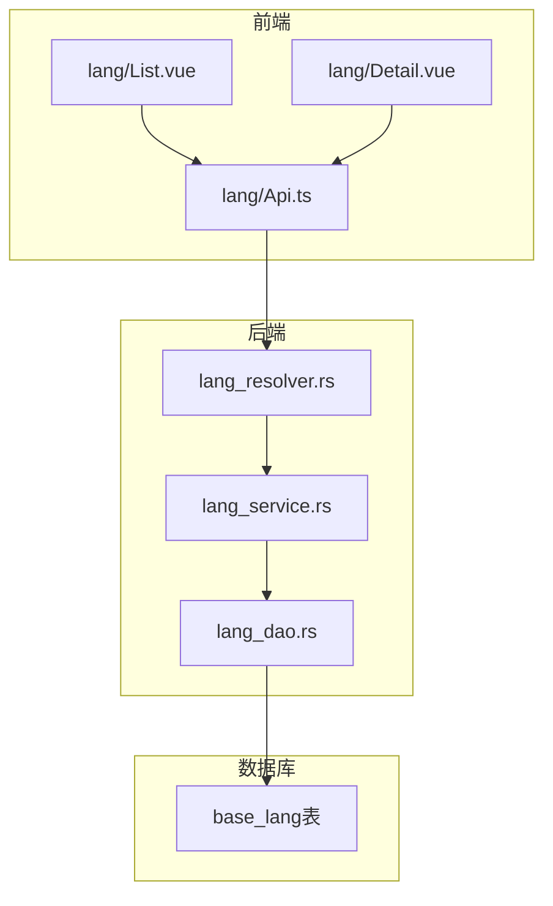
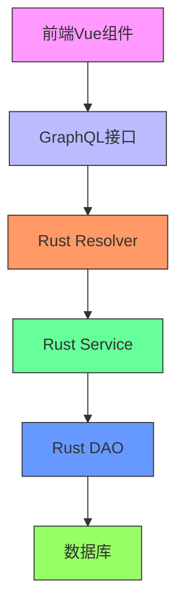
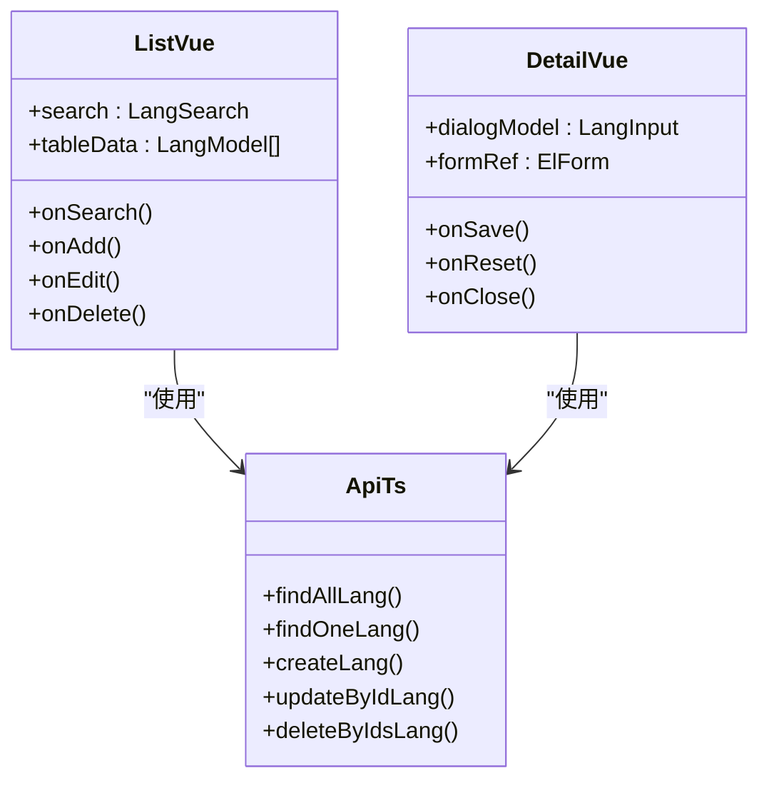
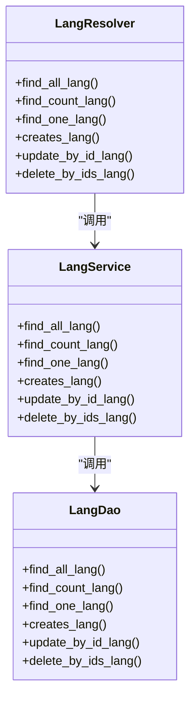
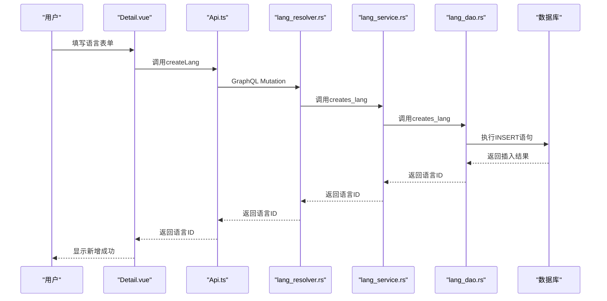
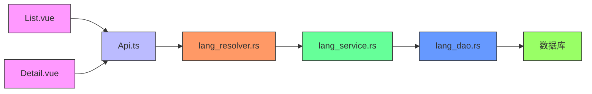

# 语言管理

**本文档引用的文件**   
- [lang_resolver.rs](https://github.com/sail-sail/nest/blob/main/rust/generated/base/lang/lang_resolver.rs)
- [lang_service.rs](https://github.com/sail-sail/nest/blob/main/rust/generated/base/lang/lang_service.rs)
- [lang_dao.rs](https://github.com/sail-sail/nest/blob/main/rust/generated/base/lang/lang_dao.rs)
- [List.vue](https://github.com/sail-sail/nest/blob/main/pc/src/views/base/lang/List.vue)
- [Detail.vue](https://github.com/sail-sail/nest/blob/main/pc/src/views/base/lang/Detail.vue)
- [Api.ts](https://github.com/sail-sail/nest/blob/main/pc/src/views/base/lang/Api.ts)

## 目录
1. [简介](#简介)
2. [项目结构](#项目结构)
3. [核心组件](#核心组件)
4. [架构概述](#架构概述)
5. [详细组件分析](#详细组件分析)
6. [依赖分析](#依赖分析)
7. [性能考虑](#性能考虑)
8. [故障排除指南](#故障排除指南)
9. [结论](#结论)

## 简介
本系统提供完整的语言管理功能，支持多语言环境下的语言配置与管理。系统通过前后端分离架构实现，前端使用Vue 3框架构建用户界面，后端采用Rust语言开发服务逻辑，通过GraphQL协议进行数据交互。系统实现了语言的增删改查、启用禁用、排序管理等核心功能，并提供了导入导出、批量操作等辅助功能。系统设计遵循模块化原则，各组件职责清晰，便于维护和扩展。

## 项目结构
系统采用分层架构设计，包含前端、后端和数据库三层。前端位于`pc`目录下，使用Vue 3和Element Plus构建用户界面；后端位于`rust`目录下，使用Rust语言实现业务逻辑；数据库操作通过DAO层与数据库交互。语言管理模块在前后端均有对应实现，前端包含List.vue和Detail.vue组件，后端包含lang_resolver.rs、lang_service.rs和lang_dao.rs文件，形成完整的MVC架构。

**图表来源**
- [List.vue](https://github.com/sail-sail/nest/blob/main/pc/src/views/base/lang/List.vue)
- [Detail.vue](https://github.com/sail-sail/nest/blob/main/pc/src/views/base/lang/Detail.vue)
- [Api.ts](https://github.com/sail-sail/nest/blob/main/pc/src/views/base/lang/Api.ts)
- [lang_resolver.rs](https://github.com/sail-sail/nest/blob/main/rust/generated/base/lang/lang_resolver.rs)
- [lang_service.rs](https://github.com/sail-sail/nest/blob/main/rust/generated/base/lang/lang_service.rs)
- [lang_dao.rs](https://github.com/sail-sail/nest/blob/main/rust/generated/base/lang/lang_dao.rs)

**章节来源**
- [List.vue](https://github.com/sail-sail/nest/blob/main/pc/src/views/base/lang/List.vue)
- [Detail.vue](https://github.com/sail-sail/nest/blob/main/pc/src/views/base/lang/Detail.vue)
- [Api.ts](https://github.com/sail-sail/nest/blob/main/pc/src/views/base/lang/Api.ts)
- [lang_resolver.rs](https://github.com/sail-sail/nest/blob/main/rust/generated/base/lang/lang_resolver.rs)
- [lang_service.rs](https://github.com/sail-sail/nest/blob/main/rust/generated/base/lang/lang_service.rs)
- [lang_dao.rs](https://github.com/sail-sail/nest/blob/main/rust/generated/base/lang/lang_dao.rs)

## 核心组件
系统的核心组件包括前端的List.vue和Detail.vue组件、后端的lang_resolver.rs、lang_service.rs和lang_dao.rs文件。List.vue组件负责语言列表的展示和批量操作，Detail.vue组件负责单个语言的详细信息编辑，Api.ts文件定义了前端与后端交互的GraphQL接口。后端的lang_resolver.rs文件处理GraphQL请求，lang_service.rs文件实现业务逻辑，lang_dao.rs文件负责数据库操作。这些组件协同工作，实现了完整的语言管理功能。

**章节来源**
- [List.vue](https://github.com/sail-sail/nest/blob/main/pc/src/views/base/lang/List.vue)
- [Detail.vue](https://github.com/sail-sail/nest/blob/main/pc/src/views/base/lang/Detail.vue)
- [Api.ts](https://github.com/sail-sail/nest/blob/main/pc/src/views/base/lang/Api.ts)
- [lang_resolver.rs](https://github.com/sail-sail/nest/blob/main/rust/generated/base/lang/lang_resolver.rs)
- [lang_service.rs](https://github.com/sail-sail/nest/blob/main/rust/generated/base/lang/lang_service.rs)
- [lang_dao.rs](https://github.com/sail-sail/nest/blob/main/rust/generated/base/lang/lang_dao.rs)

## 架构概述
系统采用典型的分层架构，从前端到后端依次为表现层、接口层、服务层和数据访问层。表现层由Vue组件构成，负责用户界面展示和交互；接口层由GraphQL接口构成，负责前后端数据交换；服务层由Rust服务函数构成，负责业务逻辑处理；数据访问层由DAO函数构成，负责数据库操作。各层之间通过明确定义的接口进行通信，保证了系统的可维护性和可扩展性。

**图表来源**
- [List.vue](https://github.com/sail-sail/nest/blob/main/pc/src/views/base/lang/List.vue)
- [Detail.vue](https://github.com/sail-sail/nest/blob/main/pc/src/views/base/lang/Detail.vue)
- [Api.ts](https://github.com/sail-sail/nest/blob/main/pc/src/views/base/lang/Api.ts)
- [lang_resolver.rs](https://github.com/sail-sail/nest/blob/main/rust/generated/base/lang/lang_resolver.rs)
- [lang_service.rs](https://github.com/sail-sail/nest/blob/main/rust/generated/base/lang/lang_service.rs)
- [lang_dao.rs](https://github.com/sail-sail/nest/blob/main/rust/generated/base/lang/lang_dao.rs)

## 详细组件分析

### 前端组件分析
前端语言管理模块由List.vue和Detail.vue两个主要组件构成。List.vue组件实现语言列表的展示和批量操作功能，包括查询、新增、编辑、删除、启用/禁用等操作。Detail.vue组件实现单个语言的详细信息编辑功能，提供表单输入和验证。两个组件通过Api.ts文件定义的GraphQL接口与后端交互，实现了前后端的解耦。

#### 前端组件类图

**图表来源**
- [List.vue](https://github.com/sail-sail/nest/blob/main/pc/src/views/base/lang/List.vue)
- [Detail.vue](https://github.com/sail-sail/nest/blob/main/pc/src/views/base/lang/Detail.vue)
- [Api.ts](https://github.com/sail-sail/nest/blob/main/pc/src/views/base/lang/Api.ts)

**章节来源**
- [List.vue](https://github.com/sail-sail/nest/blob/main/pc/src/views/base/lang/List.vue)
- [Detail.vue](https://github.com/sail-sail/nest/blob/main/pc/src/views/base/lang/Detail.vue)
- [Api.ts](https://github.com/sail-sail/nest/blob/main/pc/src/views/base/lang/Api.ts)

### 后端组件分析
后端语言管理模块由lang_resolver.rs、lang_service.rs和lang_dao.rs三个主要文件构成。lang_resolver.rs文件处理GraphQL请求，验证权限并调用服务层函数。lang_service.rs文件实现核心业务逻辑，包括数据验证、业务规则检查等。lang_dao.rs文件负责数据库操作，生成SQL查询并执行，同时处理数据转换和缓存。

#### 后端组件类图

**图表来源**
- [lang_resolver.rs](https://github.com/sail-sail/nest/blob/main/rust/generated/base/lang/lang_resolver.rs)
- [lang_service.rs](https://github.com/sail-sail/nest/blob/main/rust/generated/base/lang/lang_service.rs)
- [lang_dao.rs](https://github.com/sail-sail/nest/blob/main/rust/generated/base/lang/lang_dao.rs)

**章节来源**
- [lang_resolver.rs](https://github.com/sail-sail/nest/blob/main/rust/generated/base/lang/lang_resolver.rs)
- [lang_service.rs](https://github.com/sail-sail/nest/blob/main/rust/generated/base/lang/lang_service.rs)
- [lang_dao.rs](https://github.com/sail-sail/nest/blob/main/rust/generated/base/lang/lang_dao.rs)

### 数据流分析
系统的主要数据流包括语言列表查询、新增语言、编辑语言和删除语言。以新增语言为例，数据流从用户在Detail.vue组件中填写表单开始，通过Api.ts中的createLang函数发送GraphQL Mutation请求，经由lang_resolver.rs中的creates_lang函数处理，调用lang_service.rs中的业务逻辑，最终由lang_dao.rs执行数据库插入操作。

#### 新增语言序列图

**图表来源**
- [Detail.vue](https://github.com/sail-sail/nest/blob/main/pc/src/views/base/lang/Detail.vue)
- [Api.ts](https://github.com/sail-sail/nest/blob/main/pc/src/views/base/lang/Api.ts)
- [lang_resolver.rs](https://github.com/sail-sail/nest/blob/main/rust/generated/base/lang/lang_resolver.rs)
- [lang_service.rs](https://github.com/sail-sail/nest/blob/main/rust/generated/base/lang/lang_service.rs)
- [lang_dao.rs](https://github.com/sail-sail/nest/blob/main/rust/generated/base/lang/lang_dao.rs)

**章节来源**
- [Detail.vue](https://github.com/sail-sail/nest/blob/main/pc/src/views/base/lang/Detail.vue)
- [Api.ts](https://github.com/sail-sail/nest/blob/main/pc/src/views/base/lang/Api.ts)
- [lang_resolver.rs](https://github.com/sail-sail/nest/blob/main/rust/generated/base/lang/lang_resolver.rs)
- [lang_service.rs](https://github.com/sail-sail/nest/blob/main/rust/generated/base/lang/lang_service.rs)
- [lang_dao.rs](https://github.com/sail-sail/nest/blob/main/rust/generated/base/lang/lang_dao.rs)

## 依赖分析
系统各组件之间存在明确的依赖关系。前端组件依赖Api.ts文件提供的GraphQL接口，Api.ts文件依赖后端的GraphQL服务。后端的lang_resolver.rs文件依赖lang_service.rs文件，lang_service.rs文件依赖lang_dao.rs文件。lang_dao.rs文件依赖数据库连接和查询工具。这些依赖关系形成了清晰的调用链，保证了系统的稳定性和可维护性。

**图表来源**
- [List.vue](https://github.com/sail-sail/nest/blob/main/pc/src/views/base/lang/List.vue)
- [Detail.vue](https://github.com/sail-sail/nest/blob/main/pc/src/views/base/lang/Detail.vue)
- [Api.ts](https://github.com/sail-sail/nest/blob/main/pc/src/views/base/lang/Api.ts)
- [lang_resolver.rs](https://github.com/sail-sail/nest/blob/main/rust/generated/base/lang/lang_resolver.rs)
- [lang_service.rs](https://github.com/sail-sail/nest/blob/main/rust/generated/base/lang/lang_service.rs)
- [lang_dao.rs](https://github.com/sail-sail/nest/blob/main/rust/generated/base/lang/lang_dao.rs)

**章节来源**
- [List.vue](https://github.com/sail-sail/nest/blob/main/pc/src/views/base/lang/List.vue)
- [Detail.vue](https://github.com/sail-sail/nest/blob/main/pc/src/views/base/lang/Detail.vue)
- [Api.ts](https://github.com/sail-sail/nest/blob/main/pc/src/views/base/lang/Api.ts)
- [lang_resolver.rs](https://github.com/sail-sail/nest/blob/main/rust/generated/base/lang/lang_resolver.rs)
- [lang_service.rs](https://github.com/sail-sail/nest/blob/main/rust/generated/base/lang/lang_service.rs)
- [lang_dao.rs](https://github.com/sail-sail/nest/blob/main/rust/generated/base/lang/lang_dao.rs)

## 性能考虑
系统在性能方面做了多项优化。数据库查询使用索引优化，主要字段如id、code、lbl等均有索引支持。数据访问层实现了查询缓存，相同条件的查询结果会被缓存，减少数据库压力。分页查询限制了最大返回记录数，防止一次性加载过多数据导致内存溢出。GraphQL查询支持按需获取字段，避免传输不必要的数据。后端服务使用异步处理，提高并发处理能力。

## 故障排除指南
常见问题包括语言无法新增、编辑后数据未更新、列表查询结果不正确等。对于新增失败，检查语言代码是否已存在，确保权限正确。对于编辑问题，确认表单验证通过，检查网络请求是否成功。对于查询问题，验证搜索条件是否正确，检查数据库连接状态。系统日志记录了详细的请求信息，可通过日志定位问题。前端控制台可查看网络请求和响应，帮助诊断问题。

**章节来源**
- [lang_resolver.rs](https://github.com/sail-sail/nest/blob/main/rust/generated/base/lang/lang_resolver.rs)
- [lang_service.rs](https://github.com/sail-sail/nest/blob/main/rust/generated/base/lang/lang_service.rs)
- [lang_dao.rs](https://github.com/sail-sail/nest/blob/main/rust/generated/base/lang/lang_dao.rs)
- [List.vue](https://github.com/sail-sail/nest/blob/main/pc/src/views/base/lang/List.vue)
- [Detail.vue](https://github.com/sail-sail/nest/blob/main/pc/src/views/base/lang/Detail.vue)
- [Api.ts](https://github.com/sail-sail/nest/blob/main/pc/src/views/base/lang/Api.ts)

## 结论
本语言管理子系统设计合理，功能完整，性能优良。系统采用前后端分离架构，使用现代化的技术栈，具有良好的可维护性和可扩展性。通过GraphQL协议实现高效的数据交互，通过分层设计保证代码的清晰结构。系统实现了语言管理的核心功能，并提供了完善的辅助功能，满足了多语言环境下的管理需求。未来可考虑增加语言包导出导入、多租户语言隔离等高级功能，进一步提升系统的实用性。