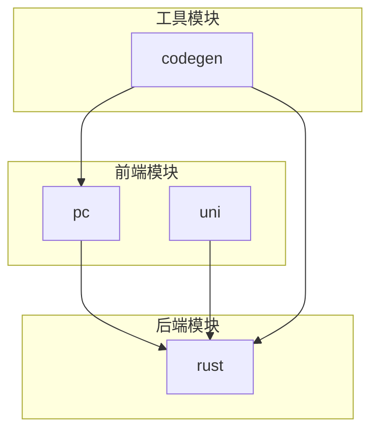
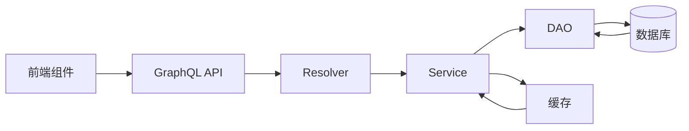
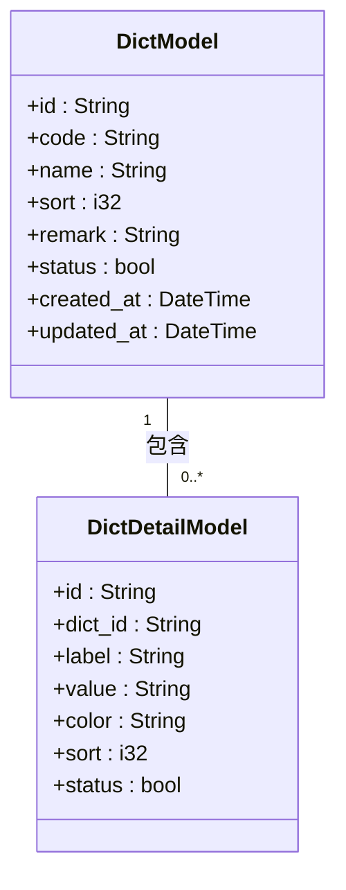
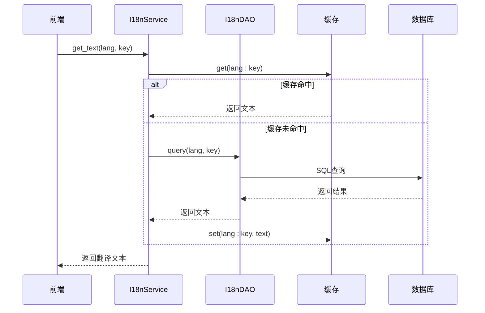
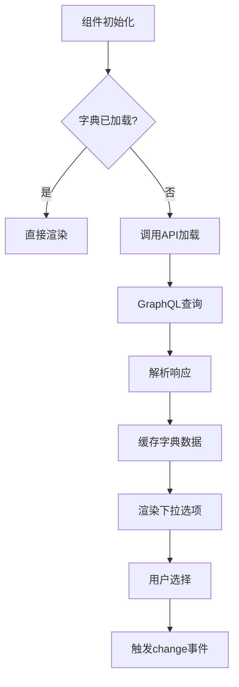
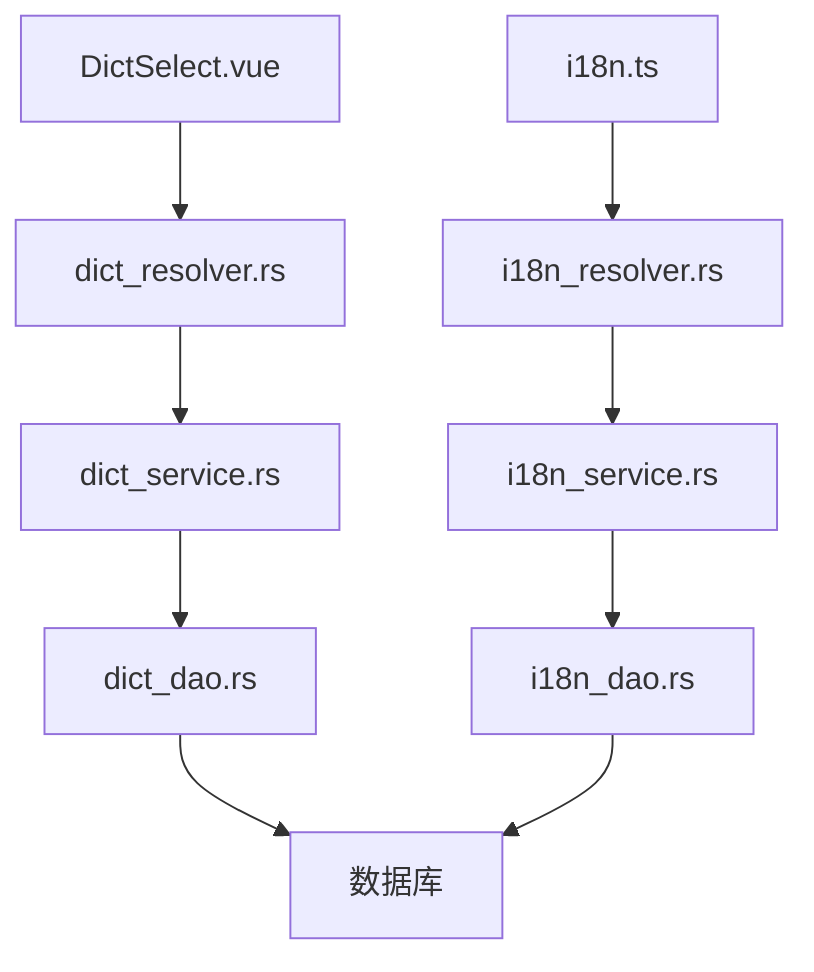

# 字典与多语言

**本文档引用文件**  
- [dict_model.rs](https://github.com/sail-sail/nest/blob/main/rust/generated/base/dict/dict_model.rs)
- [dict_service.rs](https://github.com/sail-sail/nest/blob/main/rust/generated/base/dict/dict_service.rs)
- [dict_dao.rs](https://github.com/sail-sail/nest/blob/main/rust/generated/base/dict/dict_dao.rs)
- [dict_resolver.rs](https://github.com/sail-sail/nest/blob/main/rust/generated/base/dict/dict_resolver.rs)
- [i18n_service.rs](https://github.com/sail-sail/nest/blob/main/rust/generated/common/i18n/i18n_service.rs)
- [i18n_dao.rs](https://github.com/sail-sail/nest/blob/main/rust/generated/common/i18n/i18n_dao.rs)
- [i18n_resolver.rs](https://github.com/sail-sail/nest/blob/main/rust/generated/common/i18n/i18n_resolver.rs)
- [i18n.ts](https://github.com/sail-sail/nest/blob/main/pc/src/locales/i18n.ts)
- [zh-cn.ts](https://github.com/sail-sail/nest/blob/main/pc/src/locales/zh-cn.ts)
- [en.ts](https://github.com/sail-sail/nest/blob/main/pc/src/locales/en.ts)
- [DictSelect.vue](https://github.com/sail-sail/nest/blob/main/pc/src/components/DictSelect.vue)
- [DictbizSelect.vue](https://github.com/sail-sail/nest/blob/main/pc/src/components/DictbizSelect.vue)
- [base.i18n.sql](https://github.com/sail-sail/nest/blob/main/codegen/src/tables/base/base.i18n.sql)

## 目录
1. [简介](#简介)
2. [项目结构](#项目结构)
3. [核心组件](#核心组件)
4. [架构概览](#架构概览)
5. [详细组件分析](#详细组件分析)
6. [依赖分析](#依赖分析)
7. [性能考虑](#性能考虑)
8. [故障排除指南](#故障排除指南)
9. [结论](#结论)

## 简介
本系统实现了完整的字典管理与多语言支持功能，涵盖数据字典(dict)和国际化(i18n)两大核心模块。数据字典模块支持分类管理、动态维护和前端组件集成；多语言模块提供语言(lang)管理、翻译文本存储与运行时检索机制。系统采用前后端协同架构，通过GraphQL接口实现动态数据加载，支持缓存优化与资源热更新。

## 项目结构
系统采用多模块分层架构，包含前端(pc)、后端(rust)、代码生成(codegen)和跨平台(uni)四个主要模块。字典与多语言功能贯穿各层，形成统一的数据管理与国际化支持体系。

**图示来源**  
- [pc](https://github.com/sail-sail/nest/blob/main/pc)
- [rust](https://github.com/sail-sail/nest/blob/main/rust)
- [codegen](https://github.com/sail-sail/nest/blob/main/codegen)

**本节来源**  
- [pc](https://github.com/sail-sail/nest/blob/main/pc)
- [rust](https://github.com/sail-sail/nest/blob/main/rust)
- [codegen](https://github.com/sail-sail/nest/blob/main/codegen)

## 核心组件
系统核心组件包括字典模型、字典服务、国际化服务、前端选择组件等。字典模块通过分类(code)组织字典项，支持动态增删改查；国际化模块基于语言标签管理多语言文本，支持运行时语言切换与文本渲染。

**本节来源**  
- [dict_model.rs](https://github.com/sail-sail/nest/blob/main/rust/generated/base/dict/dict_model.rs)
- [i18n_service.rs](https://github.com/sail-sail/nest/blob/main/rust/generated/common/i18n/i18n_service.rs)
- [DictSelect.vue](https://github.com/sail-sail/nest/blob/main/pc/src/components/DictSelect.vue)

## 架构概览
系统采用分层架构，从前端到后端形成完整的数据流闭环。前端通过GraphQL查询获取字典与翻译数据，后端通过DAO层访问数据库，并利用缓存提高访问性能。

**图示来源**  
- [dict_resolver.rs](https://github.com/sail-sail/nest/blob/main/rust/generated/base/dict/dict_resolver.rs)
- [dict_service.rs](https://github.com/sail-sail/nest/blob/main/rust/generated/base/dict/dict_service.rs)
- [dict_dao.rs](https://github.com/sail-sail/nest/blob/main/rust/generated/base/dict/dict_dao.rs)

## 详细组件分析

### 字典模块分析
字典模块实现数据字典的完整生命周期管理，包括分类定义、字典项维护、状态管理等功能。

#### 类图

**图示来源**  
- [dict_model.rs](https://github.com/sail-sail/nest/blob/main/rust/generated/base/dict/dict_model.rs)

**本节来源**  
- [dict_model.rs](https://github.com/sail-sail/nest/blob/main/rust/generated/base/dict/dict_model.rs)
- [dict_service.rs](https://github.com/sail-sail/nest/blob/main/rust/generated/base/dict/dict_service.rs)

### 多语言模块分析
多语言模块实现国际化文本的存储、检索与前端渲染，支持多语言包的动态加载。

#### 序列图

**图示来源**  
- [i18n_service.rs](https://github.com/sail-sail/nest/blob/main/rust/generated/common/i18n/i18n_service.rs)
- [i18n_dao.rs](https://github.com/sail-sail/nest/blob/main/rust/generated/common/i18n/i18n_dao.rs)

**本节来源**  
- [i18n_service.rs](https://github.com/sail-sail/nest/blob/main/rust/generated/common/i18n/i18n_service.rs)
- [i18n_dao.rs](https://github.com/sail-sail/nest/blob/main/rust/generated/common/i18n/i18n_dao.rs)
- [i18n.ts](https://github.com/sail-sail/nest/blob/main/pc/src/locales/i18n.ts)

### 前端组件分析
前端提供DictSelect和DictbizSelect两个核心组件，用于字典项的选择输入。

#### 流程图

**图示来源**  
- [DictSelect.vue](https://github.com/sail-sail/nest/blob/main/pc/src/components/DictSelect.vue)

**本节来源**  
- [DictSelect.vue](https://github.com/sail-sail/nest/blob/main/pc/src/components/DictSelect.vue)
- [DictbizSelect.vue](https://github.com/sail-sail/nest/blob/main/pc/src/components/DictbizSelect.vue)

## 依赖分析
系统各模块间存在明确的依赖关系，形成稳定的技术架构。

**图示来源**  
- [DictSelect.vue](https://github.com/sail-sail/nest/blob/main/pc/src/components/DictSelect.vue)
- [i18n.ts](https://github.com/sail-sail/nest/blob/main/pc/src/locales/i18n.ts)
- 后端各模块文件

**本节来源**  
- 所有引用文件

## 性能考虑
系统在字典与多语言处理方面采用多项性能优化策略：
- 服务端缓存：常用字典和翻译文本缓存于Redis
- 批量加载：前端一次性加载整个字典而非按需请求
- 内存缓存：前端维护字典数据内存缓存，避免重复请求
- 懒加载：非关键语言包采用按需加载策略

## 故障排除指南
常见问题及解决方案：
- 字典不显示：检查dict_resolver是否正常返回数据
- 翻译缺失：确认i18n表中存在对应lang+key的记录
- 缓存问题：尝试清除Redis缓存后重新加载
- 语言切换无效：检查前端i18n实例是否正确更新locale

**本节来源**  
- [i18n_service.rs](https://github.com/sail-sail/nest/blob/main/rust/generated/common/i18n/i18n_service.rs)
- [DictSelect.vue](https://github.com/sail-sail/nest/blob/main/pc/src/components/DictSelect.vue)

## 结论
本系统实现了功能完整、性能优良的字典与多语言支持体系。通过前后端协同设计，提供了灵活的数据管理与国际化能力，支持复杂业务场景下的扩展需求。建议在实际使用中充分利用缓存机制，合理组织字典分类，规范翻译键值命名，以获得最佳使用体验。