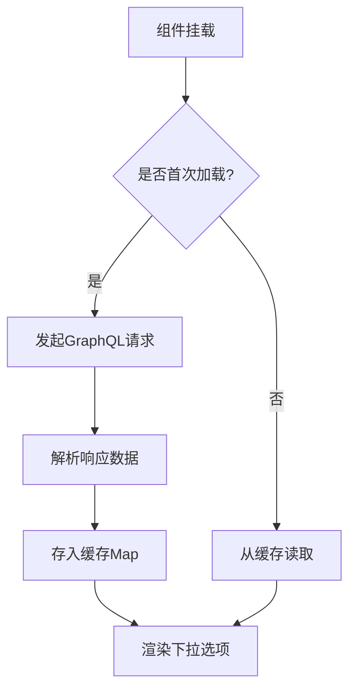
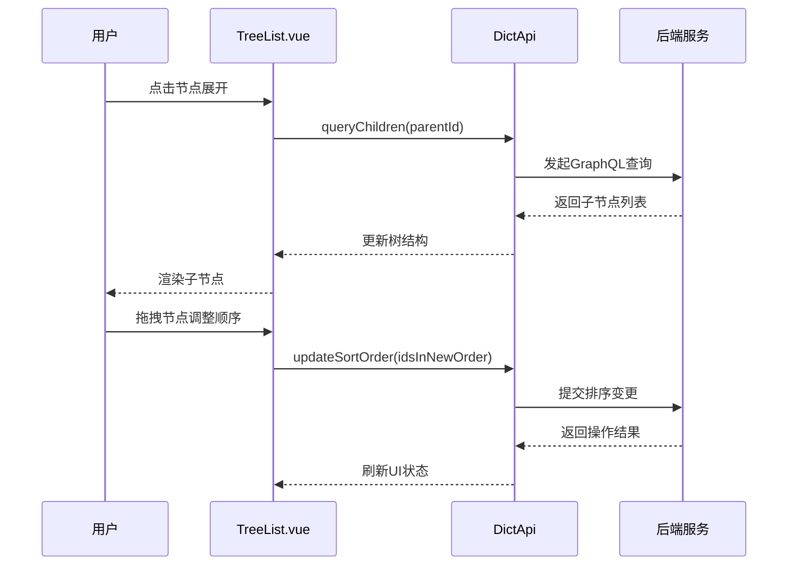

# 前端集成

**本文档中引用的文件**  
- [Api.ts](https://github.com/sail-sail/nest/blob/main/pc/src/components/DictSelect.vue)
- [Model.ts](https://github.com/sail-sail/nest/blob/main/codegen/src/template/uni/src/pages/[[table]]/Model.ts)
- [DictSelect.vue](https://github.com/sail-sail/nest/blob/main/pc/src/components/DictSelect.vue)
- [TreeList.vue](https://github.com/sail-sail/nest/blob/main/pc/src/views/base/dict/TreeList.vue)
- [List.vue](https://github.com/sail-sail/nest/blob/main/pc/src/views/base/dict/List.vue)

## 目录
1. [引言](#引言)
2. [GraphQL API 与类型定义](#graphql-api-与类型定义)
3. [列表组件渲染逻辑](#列表组件渲染逻辑)
4. [字典选择器组件封装](#字典选择器组件封装)
5. [树形字典展示与交互](#树形字典展示与交互)
6. [表单中的最佳实践](#表单中的最佳实践)
7. [结论](#结论)

## 引言
本文档旨在全面阐述 Vue3 前端项目中数据字典模块的集成方式。通过消费 GraphQL API 实现字典数据的获取与管理，重点解析 `DictSelect.vue` 组件的异步加载、缓存机制和多语言支持能力，并介绍 `TreeList.vue` 在树形结构展示中的应用。同时提供在表单中使用字典选择器的最佳实践指导。

## GraphQL API 与类型定义

系统通过 GraphQL 提供统一的数据查询接口，字典模块的相关查询定义于 `Api.ts` 文件中，主要包括字典项的分页查询、详情获取及树形结构加载等操作。这些查询语句采用强类型设计，确保前后端数据交互的一致性。

类型定义位于 `Model.ts` 文件中，包含 `DictItem`、`DictTreeItem` 等核心模型，定义了字典条目的字段结构（如 id、code、label、value、sortOrder 等），并支持嵌套子节点以适应树形结构需求。

**Section sources**
- [Api.ts](https://github.com/sail-sail/nest/blob/main/codegen/src/template/uni/src/pages/[[table]]/Api.ts)
- [Model.ts](https://github.com/sail-sail/nest/blob/main/codegen/src/template/uni/src/pages/[[table]]/Model.ts)

## 列表组件渲染逻辑

`List.vue` 组件负责字典数据的表格化展示，基于 Vue3 的 Composition API 构建，利用 `useList` 组合式函数处理分页、搜索和排序逻辑。组件通过调用 `DictApi.query` 方法发起 GraphQL 请求，将返回的 `DictItem[]` 数据绑定至 `<el-table>` 进行渲染。

表格列支持动态配置，包括操作栏的编辑、删除按钮，以及状态开关控件。所有字段均支持国际化标签显示，依赖全局 `i18n` 服务进行语言切换。

**Section sources**
- [List.vue](https://github.com/sail-sail/nest/blob/main/pc/src/views/base/dict/List.vue)

## 字典选择器组件封装

`DictSelect.vue` 是一个高度可复用的通用选择器组件，专为字典字段设计，具备以下核心特性：

### 异步加载机制
组件在首次展开下拉框时触发异步请求，调用 `DictApi.list` 获取对应字典类型的全部条目，避免页面初始化时的冗余请求。

### 缓存机制
使用 `Map` 对象对已加载的字典类型进行内存缓存，相同 `dictType` 的后续请求直接从缓存读取，显著提升响应速度并减少服务器压力。

### 多语言支持
组件自动识别当前语言环境（zh-cn/en），优先显示对应语言的 `label` 字段。若目标语言缺失，则回退至默认语言或 code 值。

**Diagram sources**
- [DictSelect.vue](https://github.com/sail-sail/nest/blob/main/pc/src/components/DictSelect.vue)

**Section sources**
- [DictSelect.vue](https://github.com/sail-sail/nest/blob/main/pc/src/components/DictSelect.vue)

## 树形字典展示与交互

`TreeList.vue` 组件用于展示具有层级关系的树形字典结构，基于 Element Plus 的 `<el-tree>` 实现。

### 节点展开/折叠
通过 `lazy` 懒加载模式按需加载子节点，提升大数据量下的渲染性能。每个节点点击可展开其子级，支持递归遍历整个字典树。

### 拖拽排序
启用 `draggable` 属性实现节点拖拽排序功能，结合 `allow-drop` 钩子控制合法放置区域。排序变更后通过 `DictApi.updateSortOrder` 提交新顺序至后端。

### 交互流程图

**Diagram sources**
- [TreeList.vue](https://github.com/sail-sail/nest/blob/main/pc/src/views/base/dict/TreeList.vue)

**Section sources**
- [TreeList.vue](https://github.com/sail-sail/nest/blob/main/pc/src/views/base/dict/TreeList.vue)

## 表单中的最佳实践

在实际业务表单中集成字典选择器时，应遵循以下最佳实践：

### 默认值设置
通过 `v-model` 绑定字段值，支持字符串或数组类型。初始化时可预设默认值，组件自动匹配并高亮显示对应选项。

### 禁用状态处理
使用 `disabled` 属性控制组件是否可交互。在详情页或权限受限场景下，设置为 `true` 可防止用户修改。

### 错误校验
集成 `el-form` 的校验规则，支持必填项、格式验证等。自定义校验器可检查所选值是否存在于有效字典范围内。

### 示例代码路径
[SPEC SYMBOL](https://github.com/sail-sail/nest/blob/main/pc/src/views/base/dict/DictDetail.vue#L45-L60)

**Section sources**
- [DictSelect.vue](https://github.com/sail-sail/nest/blob/main/pc/src/components/DictSelect.vue)
- [DictDetail.vue](https://github.com/sail-sail/nest/blob/main/pc/src/views/base/dict/DictDetail.vue)

## 结论

本文档系统性地介绍了 Vue3 前端项目中数据字典模块的集成方案。通过 GraphQL API 实现高效数据通信，结合 `DictSelect.vue` 的封装优势与 `TreeList.vue` 的树形交互能力，构建了一套稳定、可扩展且用户体验良好的字典管理体系。建议在新功能开发中优先复用现有组件，保持系统一致性与维护效率。