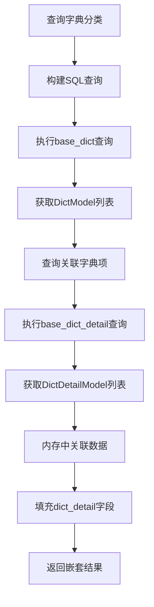
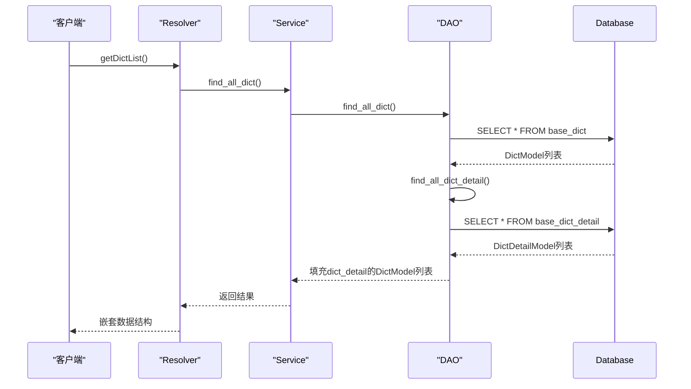
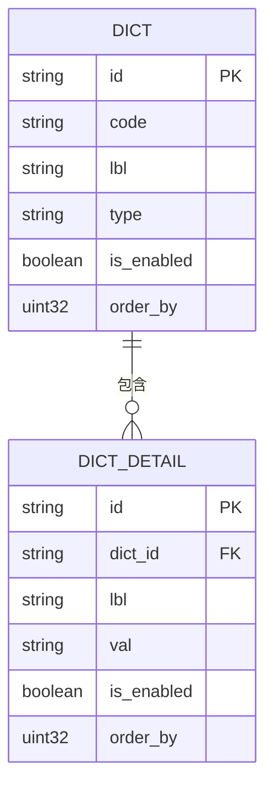

# 后端实现

**本文档中引用的文件**  
- [dict_model.rs](https://github.com/sail-sail/nest/blob/main/rust\generated\base\dict\dict_model.rs)
- [dict_detail_model.rs](https://github.com/sail-sail/nest/blob/main/rust\generated\base\dict_detail\dict_detail_model.rs)
- [dict_dao.rs](https://github.com/sail-sail/nest/blob/main/rust\generated\base\dict\dict_dao.rs)
- [dict_detail_dao.rs](https://github.com/sail-sail/nest/blob/main/rust\generated\base\dict_detail\dict_detail_dao.rs)
- [dict_service.rs](https://github.com/sail-sail/nest/blob/main/rust\generated\base\dict\dict_service.rs)
- [dict_detail_service.rs](https://github.com/sail-sail/nest/blob/main/rust\generated\base\dict_detail\dict_detail_service.rs)
- [dict_resolver.rs](https://github.com/sail-sail/nest/blob/main/rust\generated\base\dict\dict_resolver.rs)
- [dict_detail_resolver.rs](https://github.com/sail-sail/nest/blob/main/rust\generated\base\dict_detail\dict_detail_resolver.rs)

## 目录
1. [数据模型设计](#数据模型设计)
2. [分层架构实现](#分层架构实现)
3. [DAO层关联查询实现](#dao层关联查询实现)
4. [Service层业务逻辑](#service层业务逻辑)
5. [GraphQL查询接口](#graphql查询接口)
6. [缓存策略](#缓存策略)
7. [分页与条件过滤](#分页与条件过滤)
8. [嵌套查询处理](#嵌套查询处理)
9. [数据一致性与完整性](#数据一致性与完整性)
10. [外键约束实现](#外键约束实现)

## 数据模型设计

系统字典模块包含两个核心数据模型：`DictModel`（字典分类）和`DictDetailModel`（字典项）。`DictModel`表示字典的分类信息，包含编码、名称、数据类型等属性；`DictDetailModel`表示具体的字典项，通过`dict_id`字段与`DictModel`建立外键关联。两个模型均实现了`FromRow` trait，支持从数据库查询结果直接映射为Rust结构体实例。

**Section sources**
- [dict_model.rs](https://github.com/sail-sail/nest/blob/main/rust\generated\base\dict\dict_model.rs#L1-L715)
- [dict_detail_model.rs](https://github.com/sail-sail/nest/blob/main/rust\generated\base\dict_detail\dict_detail_model.rs#L1-L572)

## 分层架构实现

系统采用典型的分层架构，包含DAO（数据访问对象）、Service（业务逻辑）和Resolver（GraphQL解析器）三层。DAO层负责与数据库交互，执行SQL查询；Service层封装业务逻辑，处理数据验证和转换；Resolver层暴露GraphQL接口，处理客户端请求。这种分层设计实现了关注点分离，提高了代码的可维护性和可测试性。

**Section sources**
- [dict_dao.rs](https://github.com/sail-sail/nest/blob/main/rust\generated\base\dict\dict_dao.rs#L1-L2950)
- [dict_service.rs](https://github.com/sail-sail/nest/blob/main/rust\generated\base\dict\dict_service.rs#L1-L371)
- [dict_resolver.rs](https://github.com/sail-sail/nest/blob/main/rust\generated\base\dict\dict_resolver.rs#L1-L454)

## DAO层关联查询实现

DAO层通过SQL查询实现字典分类与字典项的关联查询。`find_all_dict`函数在查询`base_dict`表的同时，通过子查询获取关联的字典项数据。查询结果首先通过`find_all_dict_detail`获取所有相关的`DictDetailModel`实例，然后在内存中根据`dict_id`进行过滤和关联，最终将`dict_detail`字段填充到`DictModel`实例中，实现了一对多的嵌套数据结构。

**Diagram sources**
- [dict_dao.rs](https://github.com/sail-sail/nest/blob/main/rust\generated\base\dict\dict_dao.rs#L800-L1200)
- [dict_detail_dao.rs](https://github.com/sail-sail/nest/blob/main/rust\generated\base\dict_detail\dict_detail_dao.rs#L800-L1200)

## Service层业务逻辑

Service层封装了核心业务逻辑，提供了`find_all_dict`、`find_count_dict`等函数。这些函数在调用DAO层之前，会先执行`set_search_query`进行查询条件的预处理。对于更新操作，Service层会先查询旧记录进行验证，确保系统记录的字段不被修改。删除操作会检查待删除记录是否为系统记录，防止误删关键数据，体现了完整的业务规则验证。

**Section sources**
- [dict_service.rs](https://github.com/sail-sail/nest/blob/main/rust\generated\base\dict\dict_service.rs#L1-L371)
- [dict_detail_service.rs](https://github.com/sail-sail/nest/blob/main/rust\generated\base\dict_detail\dict_detail_service.rs#L1-L365)

## GraphQL查询接口

GraphQL Resolver层暴露了`getDictList`和`getDictDetailList`等查询接口。这些接口通过`#[function_name::named]`宏记录详细的日志信息，便于调试和监控。在执行业务逻辑前，会调用`check_sort_dict`验证排序字段的合法性，防止非法的排序请求。权限控制通过`use_permit`函数实现，在执行写操作前验证用户权限，确保系统的安全性。

**Section sources**
- [dict_resolver.rs](https://github.com/sail-sail/nest/blob/main/rust\generated\base\dict\dict_resolver.rs#L1-L454)
- [dict_detail_resolver.rs](https://github.com/sail-sail/nest/blob/main/rust\generated\base\dict_detail\dict_detail_resolver.rs#L1-L454)

## 缓存策略

系统实现了基于Redis的全量字典缓存策略。在`find_all_dict`查询中，通过`Options::set_cache_key`设置缓存键，将SQL查询和参数作为缓存的标识。查询结果会被缓存，后续相同的查询可以直接从缓存中获取，显著提高了查询性能。缓存策略还支持通过`del_caches`函数手动清除缓存，确保数据的及时更新。

**Section sources**
- [dict_dao.rs](https://github.com/sail-sail/nest/blob/main/rust\generated\base\dict\dict_dao.rs#L1500-L1600)
- [context.rs](https://github.com/sail-sail/nest/blob/main/rust\generated\common\context.rs#L1-L100)

## 分页与条件过滤

系统支持灵活的分页查询和条件过滤功能。分页通过`PageInput`参数实现，包含页码和每页大小。条件过滤通过`DictSearch`和`DictDetailSearch`结构体实现，支持按ID、编码、名称、启用状态等多种条件进行精确或模糊查询。查询构建器会根据提供的搜索条件动态生成WHERE子句，支持AND组合的复杂查询逻辑。

**Section sources**
- [dict_dao.rs](https://github.com/sail-sail/nest/blob/main/rust\generated\base\dict\dict_dao.rs#L100-L800)
- [dict_detail_dao.rs](https://github.com/sail-sail/nest/blob/main/rust\generated\base\dict_detail\dict_detail_dao.rs#L100-L800)

## 嵌套查询处理

Resolver层通过`dict_detail`字段实现了嵌套查询功能。当客户端请求字典分类数据时，可以同时获取其关联的字典项列表。这一功能在`find_all_dict`的实现中完成：首先查询字典分类，然后批量查询所有相关的字典项，最后在内存中根据`dict_id`进行关联。这种设计避免了N+1查询问题，通过一次批量查询获取所有关联数据。

**Diagram sources**
- [dict_dao.rs](https://github.com/sail-sail/nest/blob/main/rust\generated\base\dict\dict_dao.rs#L800-L1200)
- [dict_resolver.rs](https://github.com/sail-sail/nest/blob/main/rust\generated\base\dict\dict_resolver.rs#L50-L100)

## 数据一致性与完整性

系统通过多层次机制保证字典数据的一致性与完整性。DAO层的`FromRow`实现确保了数据库字段到Rust结构体的正确映射。Service层在更新和删除操作前进行数据验证，防止非法修改。外键约束在数据库层面强制`dict_detail`表中的`dict_id`必须引用`dict`表中存在的ID。此外，系统还实现了软删除机制，通过`is_deleted`字段标记删除状态，而不是物理删除数据。

**Section sources**
- [dict_model.rs](https://github.com/sail-sail/nest/blob/main/rust\generated\base\dict\dict_model.rs#L1-L715)
- [dict_service.rs](https://github.com/sail-sail/nest/blob/main/rust\generated\base\dict\dict_service.rs#L200-L300)

## 外键约束实现

外键约束在数据库层面通过`dict_detail`表的`dict_id`字段实现，该字段引用`dict`表的`id`字段。在Rust模型中，`DictDetailModel`通过`dict_id: DictId`字段映射这一关系。DAO层的关联查询通过LEFT JOIN操作确保即使没有关联字典项的字典分类也能被查询到。这种设计既保证了数据完整性，又提供了灵活的查询能力。

**Diagram sources**
- [dict_model.rs](https://github.com/sail-sail/nest/blob/main/rust\generated\base\dict\dict_model.rs#L1-L715)
- [dict_detail_model.rs](https://github.com/sail-sail/nest/blob/main/rust\generated\base\dict_detail\dict_detail_model.rs#L1-L572)