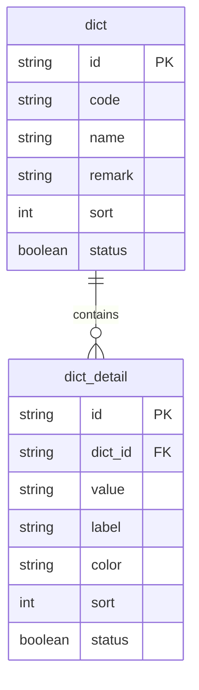

# 数据字典


**本文档引用文件**  
- [dict_model.rs](https://github.com/sail-sail/nest/blob/main/rust/generated/base/dict/dict_model.rs)
- [dict_dao.rs](https://github.com/sail-sail/nest/blob/main/rust/generated/base/dict/dict_dao.rs)
- [dict_resolver.rs](https://github.com/sail-sail/nest/blob/main/rust/generated/base/dict/dict_resolver.rs)
- [dict_detail_model.rs](https://github.com/sail-sail/nest/blob/main/rust/generated/base/dict_detail/dict_detail_model.rs)
- [dict_detail_dao.rs](https://github.com/sail-sail/nest/blob/main/rust/generated/base/dict_detail/dict_detail_dao.rs)
- [DictSelect.vue](https://github.com/sail-sail/nest/blob/main/pc/src/components/DictSelect.vue)
- [Api.ts](https://github.com/sail-sail/nest/blob/main/pc/src/components/Api.ts)
- [TreeList.vue](https://github.com/sail-sail/nest/blob/main/pc/src/views/base/dict/TreeList.vue)
- [cache_dao.rs](https://github.com/sail-sail/nest/blob/main/rust/generated/common/cache/cache_dao.rs)


## 目录
1. [引言](#引言)
2. [数据表结构设计](#数据表结构设计)
3. [层级关系与外键约束](#层级关系与外键约束)
4. [后端DAO层实现](#后端dao层实现)
5. [GraphQL接口暴露](#graphql接口暴露)
6. [前端调用与渲染](#前端调用与渲染)
7. [字典缓存机制](#字典缓存机制)
8. [树形字典展示](#树形字典展示)
9. [增删改查操作流程](#增删改查操作流程)
10. [表单集成最佳实践](#表单集成最佳实践)

## 引言
数据字典模块是系统中用于统一管理分类数据的核心组件，通过`dict`（字典分类）和`dict_detail`（字典项）两张表实现灵活的枚举值管理。本技术文档深入解析其结构设计、业务含义及全栈实现机制。

## 数据表结构设计

### 字典分类表（dict）
该表用于定义字典的分类信息，主要字段包括：
- `id`: 主键，唯一标识一个字典分类
- `code`: 分类编码，用于程序中引用
- `name`: 分类名称，展示用
- `remark`: 备注说明
- `sort`: 排序字段
- `status`: 状态（启用/禁用）

### 字典项表（dict_detail）
该表用于定义具体字典项，主要字段包括：
- `id`: 主键，唯一标识一个字典项
- `dict_id`: 外键，关联所属字典分类
- `value`: 项值，程序中使用
- `label`: 显示标签
- `color`: 颜色标识（可选）
- `sort`: 排序字段
- `status`: 状态（启用/禁用）

**Section sources**
- [dict_model.rs](https://github.com/sail-sail/nest/blob/main/rust/generated/base/dict/dict_model.rs#L10-L50)
- [dict_detail_model.rs](https://github.com/sail-sail/nest/blob/main/rust/generated/base/dict_detail/dict_detail_model.rs#L10-L60)

## 层级关系与外键约束

`dict`与`dict_detail`构成典型的主从结构，其中`dict_detail.dict_id`作为外键指向`dict.id`，确保数据一致性。这种设计支持一对多的层级关系，允许一个字典分类下包含多个字典项。



**Diagram sources**
- [dict_model.rs](https://github.com/sail-sail/nest/blob/main/rust/generated/base/dict/dict_model.rs#L10-L50)
- [dict_detail_model.rs](https://github.com/sail-sail/nest/blob/main/rust/generated/base/dict_detail/dict_detail_model.rs#L10-L60)

## 后端DAO层实现

Rust后端通过DAO（Data Access Object）模式封装数据访问逻辑。`dict_dao.rs`和`dict_detail_dao.rs`分别提供对两张表的CRUD操作，采用异步数据库连接池提升性能。

关键查询方法包括：
- `find_by_code(code: &str)`: 根据分类编码查询字典项列表
- `find_by_dict_id(dict_id: &str)`: 根据分类ID查询所有有效字典项
- `batch_query(codes: Vec<String>)`: 批量查询多个字典分类

**Section sources**
- [dict_dao.rs](https://github.com/sail-sail/nest/blob/main/rust/generated/base/dict/dict_dao.rs#L20-L100)
- [dict_detail_dao.rs](https://github.com/sail-sail/nest/blob/main/rust/generated/base/dict_detail/dict_detail_dao.rs#L25-L110)

## GraphQL接口暴露

通过`dict_resolver.rs`和`dict_detail_resolver.rs`实现GraphQL Resolver，将DAO层功能暴露为GraphQL查询接口。典型查询包括：

```graphql
query GetDictByCode($code: String!) {
  dictByCode(code: $code) {
    id
    code
    name
    details {
      id
      value
      label
      color
    }
  }
}
```

Resolver层负责解析请求、调用DAO并返回结构化数据，支持字段级权限控制。

**Section sources**
- [dict_resolver.rs](https://github.com/sail-sail/nest/blob/main/rust/generated/base/dict/dict_resolver.rs#L15-L80)
- [dict_detail_resolver.rs](https://github.com/sail-sail/nest/blob/main/rust/generated/base/dict_detail/dict_detail_resolver.rs#L20-L90)

## 前端调用与渲染

### Api.ts接口封装
前端通过`Api.ts`统一封装GraphQL查询，提供类型安全的调用方式：

```typescript
export const getDictByCode = (code: string) => {
  return graphqlClient.query({ query: GET_DICT_BY_CODE, variables: { code } });
};
```

### DictSelect组件渲染
`DictSelect.vue`组件封装字典选择器，接收`dictCode`属性自动加载对应字典项，并支持：
- 单选/多选模式
- 自定义标签渲染
- 远程搜索
- 状态过滤（仅显示启用项）

**Section sources**
- [Api.ts](https://github.com/sail-sail/nest/blob/main/pc/src/components/Api.ts#L50-L80)
- [DictSelect.vue](https://github.com/sail-sail/nest/blob/main/pc/src/components/DictSelect.vue#L1-L200)

## 字典缓存机制

为提升性能，系统采用Redis缓存字典数据。`cache_dao.rs`提供缓存操作接口，在首次查询后将字典数据序列化存储，设置合理过期时间。

缓存策略：
- 缓存键格式：`dict:{code}`
- 过期时间：30分钟
- 更新机制：字典数据变更时主动清除缓存

此机制显著减少数据库压力，提升高并发场景下的响应速度。

**Section sources**
- [cache_dao.rs](https://github.com/sail-sail/nest/blob/main/rust/generated/common/cache/cache_dao.rs#L30-L120)
- [dict_service.rs](https://github.com/sail-sail/nest/blob/main/rust/generated/base/dict/dict_service.rs#L80-L110)

## 树形字典展示

`TreeList.vue`组件专门用于展示具有层级结构的字典数据。通过递归组件实现无限层级树形渲染，支持：
- 展开/折叠节点
- 拖拽排序
- 节点右键菜单
- 懒加载子节点

适用于组织机构、分类目录等场景，提供直观的树形交互体验。

**Section sources**
- [TreeList.vue](https://github.com/sail-sail/nest/blob/main/pc/src/views/base/dict/TreeList.vue#L1-L300)

## 增删改查操作流程

### 创建字典分类
1. 前端提交`code`、`name`等信息
2. 后端验证唯一性
3. 插入`dict`表
4. 清除相关缓存

### 添加字典项
1. 指定所属`dict_id`
2. 验证`value`在分类内唯一
3. 插入`dict_detail`表
4. 更新缓存

### 修改与删除
支持软删除（更新`status`字段），保留历史数据完整性。

**Section sources**
- [dict_service.rs](https://github.com/sail-sail/nest/blob/main/rust/generated/base/dict/dict_service.rs#L20-L150)
- [dict_detail_service.rs](https://github.com/sail-sail/nest/blob/main/rust/generated/base/dict_detail/dict_detail_service.rs#L25-L160)

## 表单集成最佳实践

在表单中集成`DictSelect`组件时建议：
1. 使用`v-model`双向绑定值
2. 设置`placeholder`提升用户体验
3. 对于必填项添加校验规则
4. 利用`filterable`属性支持搜索
5. 通过`props`自定义`label`和`value`字段

示例：
```vue
<DictSelect v-model="form.status" dictCode="user_status" placeholder="选择用户状态" />
```

此模式确保代码复用性和一致性。

**Section sources**
- [DictSelect.vue](https://github.com/sail-sail/nest/blob/main/pc/src/components/DictSelect.vue#L100-L200)
- [form_example.vue](https://github.com/sail-sail/nest/blob/main/pc/src/views/base/user/form.vue#L45-L60)