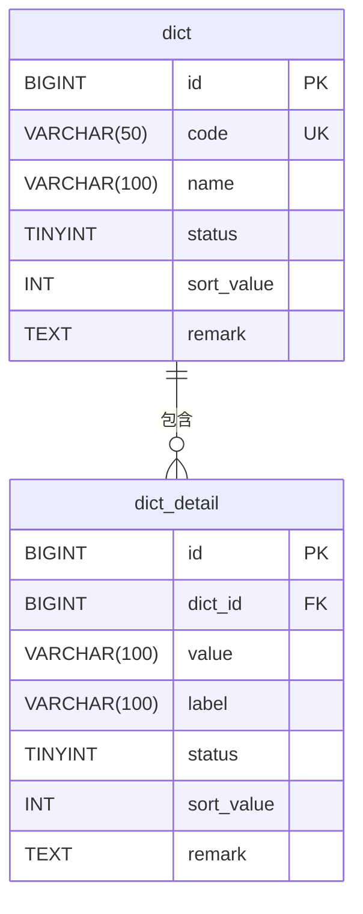

# 数据模型

**本文档引用的文件**  
- [dict_model.rs](https://github.com/sail-sail/nest/blob/main/rust/generated/base/dict/dict_model.rs)
- [dict_detail_model.rs](https://github.com/sail-sail/nest/blob/main/rust/generated/base/dict_detail/dict_detail_model.rs)
- [Model.ts](https://github.com/sail-sail/nest/blob/main/pc/src/views/base/dict/Model.ts)
- [Model.ts](https://github.com/sail-sail/nest/blob/main/pc/src/views/base/dict_detail/Model.ts)
- [base.sql](https://github.com/sail-sail/nest/blob/main/codegen/src/tables/base/base.sql)

## 目录
1. [引言](#引言)
2. [数据表结构](#数据表结构)
3. [字段详细说明](#字段详细说明)
4. [表间关系与外键约束](#表间关系与外键约束)
5. [ER图：表结构关系](#er图表结构关系)
6. [排序字段（sort_value）设计解析](#排序字段sort_value设计解析)
7. [字典编码（code）命名规范与引用方式](#字典编码code命名规范与引用方式)
8. [状态字段（status）枚举定义](#状态字段status枚举定义)
9. [Rust与TypeScript模型映射](#rust与typescript模型映射)
10. [总结](#总结)

## 引言
本文档旨在深入解析系统中数据字典模块的核心数据模型，重点分析 `dict`（字典分类）与 `dict_detail`（字典项）两张数据库表的设计。文档将详细阐述各字段的含义、数据类型、约束条件及业务规则，阐明两表之间的1:N关联机制，并展示其在Rust和TypeScript中的模型映射方式。通过本模型文档，开发人员可全面理解字典模块的数据结构设计，确保在开发和维护过程中保持数据一致性与业务逻辑的正确性。

## 数据表结构
`dict` 表用于存储字典的分类信息，如“性别”、“用户状态”、“订单类型”等。每个分类下可包含多个具体的字典项，这些项存储在 `dict_detail` 表中。

### dict（字典分类表）
| 字段名 | 数据类型 | 约束 | 说明 |
|--------|----------|------|------|
| id | BIGINT | 主键，自增 | 唯一标识符 |
| code | VARCHAR(50) | 唯一索引，非空 | 字典分类编码 |
| name | VARCHAR(100) | 非空 | 字典分类名称 |
| status | TINYINT | 非空 | 状态（0:禁用, 1:启用） |
| sort_value | INT | 非空 | 排序值 |
| remark | TEXT | 可为空 | 备注 |

### dict_detail（字典项表）
| 字段名 | 数据类型 | 约束 | 说明 |
|--------|----------|------|------|
| id | BIGINT | 主键，自增 | 唯一标识符 |
| dict_id | BIGINT | 外键，非空 | 关联的字典分类ID |
| value | VARCHAR(100) | 非空 | 字典项值（如“男”、“女”） |
| label | VARCHAR(100) | 非空 | 字典项标签（显示名称） |
| status | TINYINT | 非空 | 状态（0:禁用, 1:启用） |
| sort_value | INT | 非空 | 排序值 |
| remark | TEXT | 可为空 | 备注 |

**Section sources**
- [base.sql](https://github.com/sail-sail/nest/blob/main/codegen/src/tables/base/base.sql#L1-L50)

## 字段详细说明
本节对核心字段的业务含义、数据类型选择及约束条件进行详细解释。

- **code**: 字典分类的唯一编码，是系统内引用该分类的主键。采用 `VARCHAR(50)` 类型，便于语义化命名，如 `user_status`、`gender`。
- **name**: 字典分类的可读名称，用于前端展示。
- **value** 与 **label**: `value` 通常为程序内部使用的值（如数据库存储），`label` 为用户可见的显示文本。两者分离设计支持国际化和灵活展示。
- **status**: 通用状态字段，控制字典项是否可用，避免物理删除。
- **sort_value**: 控制字典项在列表中的显示顺序，数值越小越靠前。

**Section sources**
- [dict_model.rs](https://github.com/sail-sail/nest/blob/main/rust/generated/base/dict/dict_model.rs#L10-L40)
- [dict_detail_model.rs](https://github.com/sail-sail/nest/blob/main/rust/generated/base/dict_detail/dict_detail_model.rs#L10-L45)

## 表间关系与外键约束
`dict` 与 `dict_detail` 表之间存在明确的1:N（一对多）关系。一个字典分类（`dict`）可以包含多个字典项（`dict_detail`），而每个字典项必须且只能属于一个字典分类。

该关系通过 `dict_detail` 表中的 `dict_id` 字段实现外键关联，指向 `dict` 表的 `id` 字段。数据库层面的外键约束确保了数据的引用完整性，防止出现孤立的字典项记录。

**Section sources**
- [base.sql](https://github.com/sail-sail/nest/blob/main/codegen/src/tables/base/base.sql#L30-L45)

## ER图：表结构关系

**Diagram sources**
- [base.sql](https://github.com/sail-sail/nest/blob/main/codegen/src/tables/base/base.sql#L1-L50)

## 排序字段（sort_value）设计解析
`sort_value` 字段存在于 `dict` 和 `dict_detail` 两张表中，其设计意图是为字典数据提供灵活的排序能力。

- **使用场景**:
  1. **前端展示排序**：在下拉框、选项列表等UI组件中，字典项需按特定顺序显示，而非数据库默认的插入顺序。
  2. **业务逻辑排序**：某些业务流程可能依赖字典项的顺序，例如状态流转。
  3. **管理后台配置**：管理员可通过调整 `sort_value` 的数值来重新排列字典项，操作直观且无需修改代码。

该设计优于使用 `created_at` 时间戳排序，因为它允许完全自定义顺序，不受数据创建时间的限制。

**Section sources**
- [dict_model.rs](https://github.com/sail-sail/nest/blob/main/rust/generated/base/dict/dict_model.rs#L25-L30)
- [dict_detail_model.rs](https://github.com/sail-sail/nest/blob/main/rust/generated/base/dict_detail/dict_detail_model.rs#L28-L33)

## 字典编码（code）命名规范与引用方式
`code` 字段的命名遵循清晰、一致的规范，以确保系统的可维护性。

- **命名规范**:
  - 使用小写字母和下划线（snake_case）。
  - 语义化命名，清晰表达分类含义，如 `order_type`、`payment_method`。
  - 避免使用缩写或模糊词汇。

- **引用方式**:
  - **后端服务**：在Rust代码中，通过 `code` 值查询 `dict` 表，获取其ID，再根据ID查询 `dict_detail` 表获取所有有效项。
  - **前端组件**：在TypeScript中，`code` 作为参数传递给 `DictSelect` 等通用组件，组件内部调用API获取对应字典数据并渲染。
  - **API接口**：REST或GraphQL接口通常提供 `/dict/{code}/items` 这样的端点，通过 `code` 直接获取字典项列表。

**Section sources**
- [Model.ts](https://github.com/sail-sail/nest/blob/main/pc/src/views/base/dict/Model.ts#L5-L20)
- [dict_service.rs](https://github.com/sail-sail/nest/blob/main/rust/generated/base/dict/dict_service.rs#L15-L35)

## 状态字段（status）枚举定义
`status` 字段采用整型（TINYINT）存储，其值具有明确的业务含义。

- **枚举值定义**:
  - `0`: **禁用** - 该字典项当前不可用，通常在前端下拉框中不显示或置灰。
  - `1`: **启用** - 该字典项处于可用状态，可被正常选择和使用。

此设计通过软删除（逻辑删除）的方式管理字典项的生命周期，保留了历史数据，便于审计和恢复。在查询字典项时，通常会添加 `WHERE status = 1` 条件以获取有效数据。

**Section sources**
- [dict_model.rs](https://github.com/sail-sail/nest/blob/main/rust/generated/base/dict/dict_model.rs#L20-L22)
- [dict_detail_model.rs](https://github.com/sail-sail/nest/blob/main/rust/generated/base/dict_detail/dict_detail_model.rs#L23-L25)

## Rust与TypeScript模型映射
数据模型在服务端（Rust）和客户端（TypeScript）均进行了对象化映射，保持了数据结构的一致性。

### Rust 模型 (Serde 映射)
在Rust中，`dict` 和 `dict_detail` 表分别映射为 `Dict` 和 `DictDetail` 结构体，位于 `dict_model.rs` 文件中。它们使用 `serde` 库进行序列化/反序列化，与数据库字段通过属性宏（如 `#[sqlx::Type]`）进行映射。

### TypeScript 模型 (接口定义)
在TypeScript中，`dict` 和 `dict_detail` 表分别定义了 `Dict` 和 `DictDetail` 接口，位于 `Model.ts` 文件中。这些接口定义了前端组件和API交互所需的数据结构，确保类型安全。

**Section sources**
- [dict_model.rs](https://github.com/sail-sail/nest/blob/main/rust/generated/base/dict/dict_model.rs)
- [dict_detail_model.rs](https://github.com/sail-sail/nest/blob/main/rust/generated/base/dict_detail/dict_detail_model.rs)
- [Model.ts](https://github.com/sail-sail/nest/blob/main/pc/src/views/base/dict/Model.ts)
- [Model.ts](https://github.com/sail-sail/nest/blob/main/pc/src/views/base/dict_detail/Model.ts)

## 总结
`dict` 和 `dict_detail` 表构成了系统数据字典功能的核心。其设计遵循了高内聚、低耦合的原则，通过 `code` 实现灵活引用，通过 `status` 实现软删除，通过 `sort_value` 实现自定义排序，并通过外键约束保证了数据完整性。Rust和TypeScript中的模型映射确保了全栈数据结构的一致性，为系统的稳定运行和高效开发提供了坚实的基础。