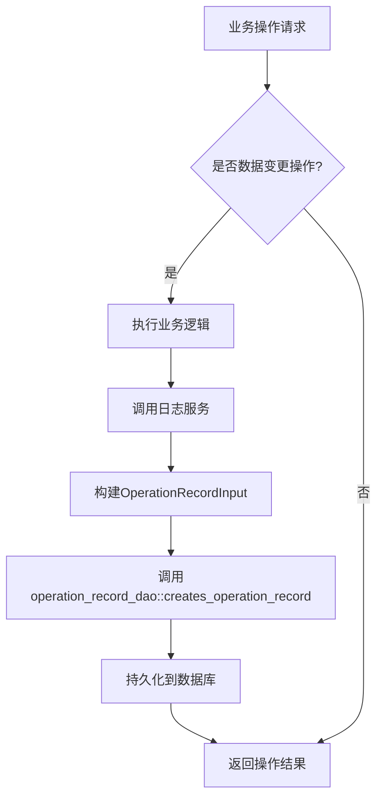
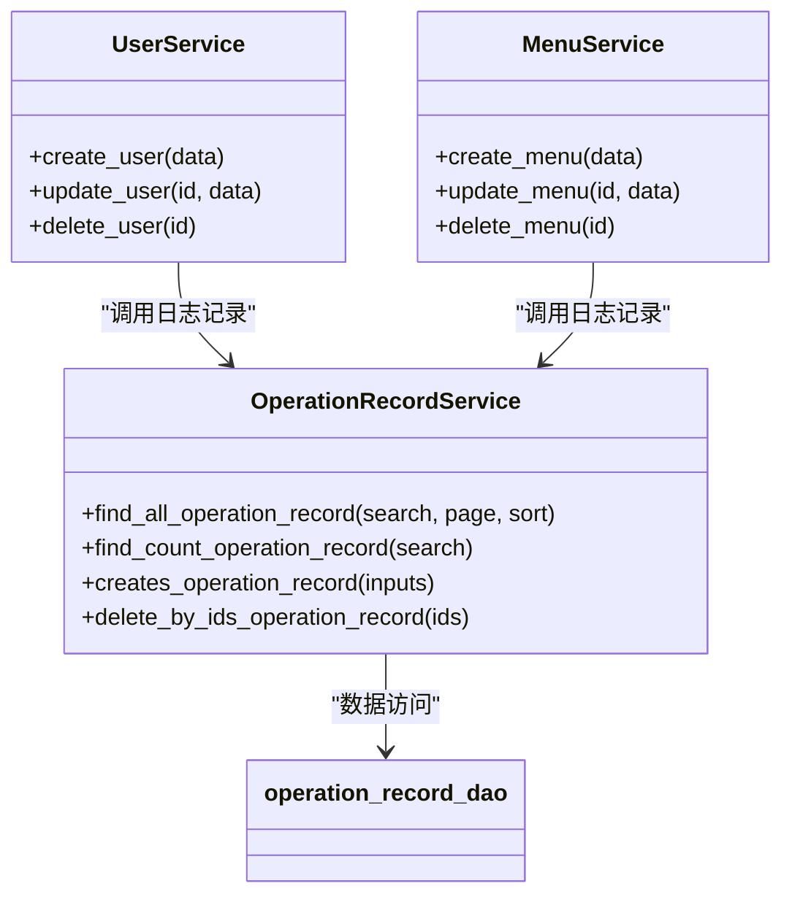
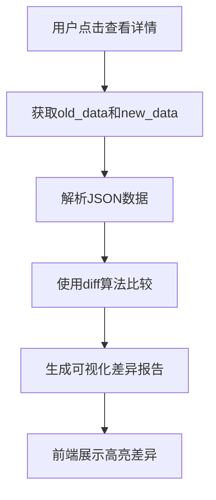

# 操作日志


**本文档引用文件**  
- [operation_record_model.rs](https://github.com/sail-sail/nest/blob/main/rust\generated\base\operation_record\operation_record_model.rs)
- [operation_record_service.rs](https://github.com/sail-sail/nest/blob/main/rust\generated\base\operation_record\operation_record_service.rs)
- [dao.rs](https://github.com/sail-sail/nest/blob/main/rust\generated\common\util\dao.rs)
- [List.vue](https://github.com/sail-sail/nest/blob/main/pc\src\views\base\operation_record\List.vue)
- [Api.ts](https://github.com/sail-sail/nest/blob/main/pc\src\views\base\operation_record\Api.ts)


## 目录
1. [简介](#简介)
2. [数据模型设计](#数据模型设计)
3. [日志生成机制](#日志生成机制)
4. [服务集成与无侵入设计](#服务集成与无侵入设计)
5. [GraphQL查询能力](#graphql查询能力)
6. [前端展示与差异对比](#前端展示与差异对比)
7. [高性能写入与索引优化](#高性能写入与索引优化)
8. [审计合规性指导](#审计合规性指导)

## 简介
本技术文档深入解析操作日志系统的实现机制，涵盖从数据模型设计、日志自动生成、服务集成、查询能力到前端展示的完整技术链条。系统通过Rust中间件在数据变更时自动记录操作行为，支持增删改查全操作类型追踪，具备高性能、可审计、易扩展的特性。

## 数据模型设计

操作日志系统的核心数据模型`OperationRecordModel`定义了完整的用户行为记录结构，包含操作上下文、变更内容、执行者和时间戳等关键信息。

### 核心字段说明

| 字段名 | 中文名称 | 数据类型 | 说明 |
|--------|--------|--------|------|
| `module` | 模块 | String | 操作所属功能模块标识 |
| `module_lbl` | 模块名称 | String | 模块的可读中文名称 |
| `method` | 方法 | String | 操作类型标识（如create, update, delete） |
| `method_lbl` | 方法名称 | String | 操作类型的可读中文名称 |
| `lbl` | 操作 | String | 具体操作描述 |
| `time` | 耗时(毫秒) | u32 | 操作执行耗时 |
| `old_data` | 操作前数据 | `Option<String>` | 变更前的数据快照（JSON格式） |
| `new_data` | 操作后数据 | `Option<String>` | 变更后的数据快照（JSON格式） |
| `create_usr_id` | 操作人 | UsrId | 执行操作的用户ID |
| `create_usr_id_lbl` | 操作人 | String | 操作用户的可读名称 |
| `create_time` | 操作时间 | `Option<chrono::NaiveDateTime>` | 操作发生的时间戳 |

**Section sources**
- [operation_record_model.rs](https://github.com/sail-sail/nest/blob/main/rust\generated\base\operation_record\operation_record_model.rs#L464-L524)

## 日志生成机制

系统通过Rust服务层的通用逻辑在数据变更时自动创建操作日志，确保所有业务操作都被完整记录。

### 中间件拦截流程



**Diagram sources**
- [operation_record_service.rs](https://github.com/sail-sail/nest/blob/main/rust\generated\base\operation_record\operation_record_service.rs#L250-L270)
- [operation_record_dao.rs](https://github.com/sail-sail/nest/blob/main/rust\generated\base\operation_record\operation_record_dao.rs)

### 通用日志记录逻辑

`util::dao.rs`文件中实现了跨模块的通用数据操作辅助函数，为操作日志的自动生成提供了底层支持。虽然该文件主要包含加密解密和多对多关系处理逻辑，但其设计模式体现了系统对通用功能抽象的理念。

**Section sources**
- [dao.rs](https://github.com/sail-sail/nest/blob/main/rust\generated\common\util\dao.rs#L0-L332)

## 服务集成与无侵入设计

`OperationRecordService`通过标准化接口与各业务服务集成，实现低侵入性的日志记录。

### 服务调用关系



**Diagram sources**
- [operation_record_service.rs](https://github.com/sail-sail/nest/blob/main/rust\generated\base\operation_record\operation_record_service.rs#L0-L308)
- [operation_record_dao.rs](https://github.com/sail-sail/nest/blob/main/rust\generated\base\operation_record\operation_record_dao.rs)

**Section sources**
- [operation_record_service.rs](https://github.com/sail-sail/nest/blob/main/rust\generated\base\operation_record\operation_record_service.rs#L0-L308)

## GraphQL查询能力

系统提供强大的GraphQL接口，支持复杂条件组合查询，满足审计和分析需求。

### 支持的查询类型

| 查询类型 | 参数 | 说明 |
|---------|------|------|
| 按操作类型过滤 | method, method_like | 精确或模糊匹配操作类型 |
| 按操作人查询 | create_usr_id, create_usr_id_lbl | 按用户ID或用户名查询 |
| 内容模糊搜索 | old_data_like, new_data_like | 在操作前后数据中搜索关键词 |
| 时间范围查询 | create_time | 指定操作时间区间 |
| 模块过滤 | module, module_lbl | 按功能模块筛选操作记录 |

**Section sources**
- [operation_record_model.rs](https://github.com/sail-sail/nest/blob/main/rust\generated\base\operation_record\operation_record_model.rs#L150-L300)

## 前端展示与差异对比

PC端`List.vue`组件实现了操作日志的完整展示界面，支持丰富的交互功能。

### 组件功能特性

- **多条件组合查询**：支持模块名称、方法名称、操作描述、操作时间等多维度筛选
- **数据表格展示**：以表格形式展示操作记录，包含模块、方法、操作、耗时、操作人、操作时间等列
- **选择与批量操作**：支持行选择，提供删除、还原、彻底删除等批量操作按钮
- **列显示控制**：通过`TableShowColumns`组件实现列的显示/隐藏和顺序调整
- **分页支持**：内置分页组件，支持页大小切换和页码跳转

### 差异对比实现

虽然当前代码未直接展示差异对比(diff)功能的具体实现，但通过`old_data`和`new_data`字段的存储，系统已具备实现数据变更差异对比的基础。前端可通过JSON比较库对这两个字段进行解析和可视化对比。



**Section sources**
- [List.vue](https://github.com/sail-sail/nest/blob/main/pc\src\views\base\operation_record\List.vue#L0-L799)
- [Api.ts](https://github.com/sail-sail/nest/blob/main/pc\src\views\base\operation_record\Api.ts#L2-L45)

## 高性能写入与索引优化

为确保操作日志系统的高性能，建议采用以下策略：

### 写入优化策略

1. **异步写入**：将日志记录操作放入消息队列，由后台worker异步处理，避免阻塞主业务流程
2. **批量提交**：收集一定数量的日志记录后批量写入数据库，减少I/O开销
3. **连接池优化**：使用数据库连接池，复用数据库连接，降低连接建立开销

### 索引优化建议

```sql
-- 主要查询字段创建索引
CREATE INDEX idx_operation_record_create_time ON operation_record(create_time);
CREATE INDEX idx_operation_record_create_usr_id ON operation_record(create_usr_id);
CREATE INDEX idx_operation_record_module ON operation_record(module);
CREATE INDEX idx_operation_record_method ON operation_record(method);
CREATE INDEX idx_operation_record_lbl ON operation_record(lbl);

-- 复合索引用于常见组合查询
CREATE INDEX idx_operation_record_time_usr ON operation_record(create_time, create_usr_id);
CREATE INDEX idx_operation_record_module_method ON operation_record(module, method);
```

## 审计合规性指导

为满足审计合规要求，建议实施以下措施：

1. **不可变性保证**：操作日志一旦创建，禁止直接修改，只能通过"还原"或"删除"标记进行状态变更
2. **访问控制**：严格控制操作日志的访问权限，仅授权人员可查看敏感操作记录
3. **数据保留策略**：根据合规要求制定日志保留周期，过期日志可归档或安全删除
4. **完整性校验**：定期对日志数据进行完整性校验，确保无篡改
5. **审计追踪**：对日志本身的访问和操作也应记录，形成审计的审计

**Section sources**
- [operation_record_service.rs](https://github.com/sail-sail/nest/blob/main/rust\generated\base\operation_record\operation_record_service.rs#L275-L295)
- [operation_record_model.rs](https://github.com/sail-sail/nest/blob/main/rust\generated\base\operation_record\operation_record_model.rs)