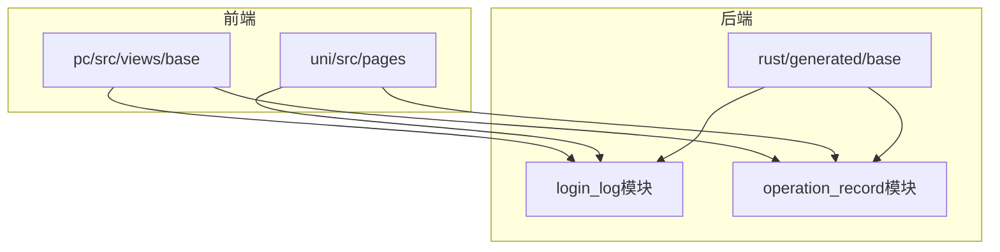
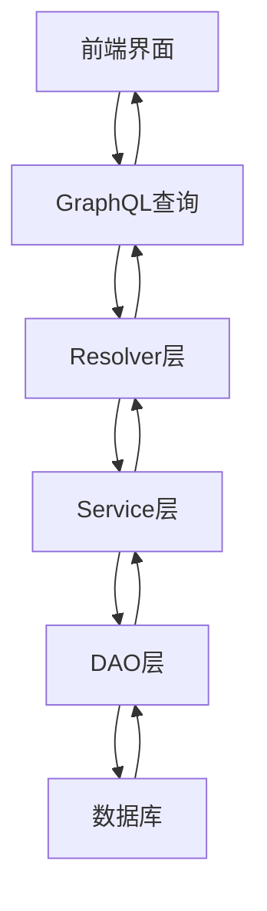
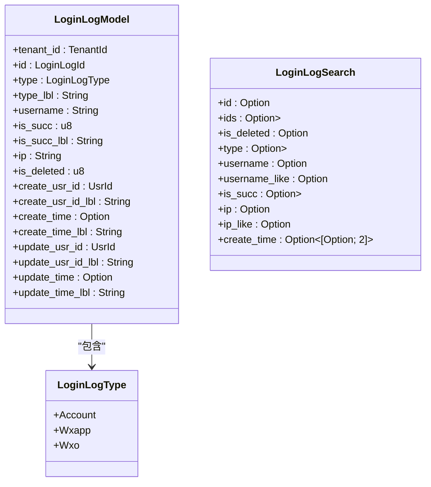
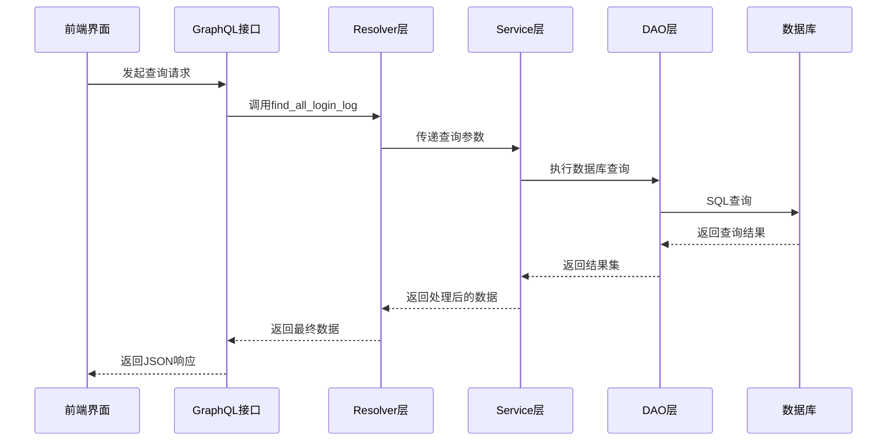
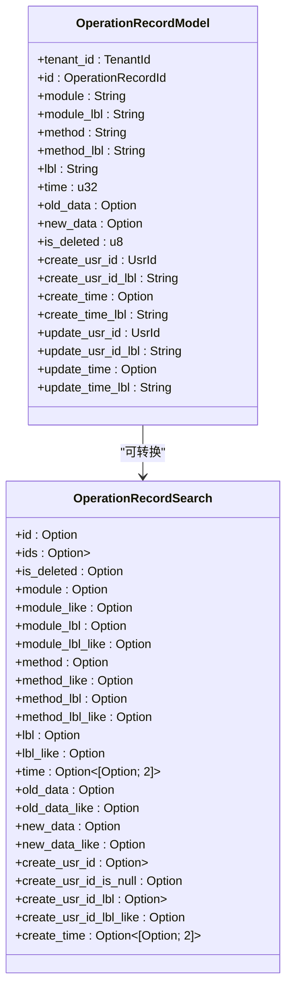
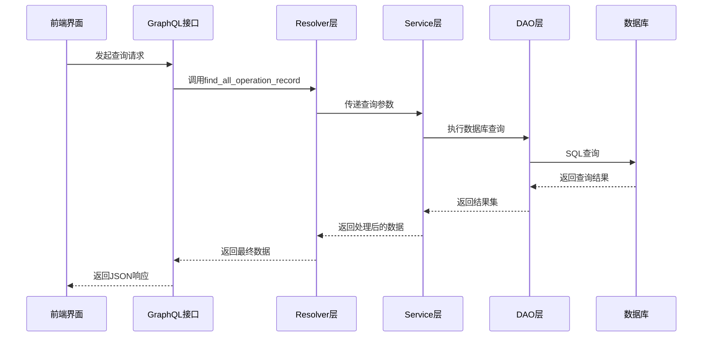
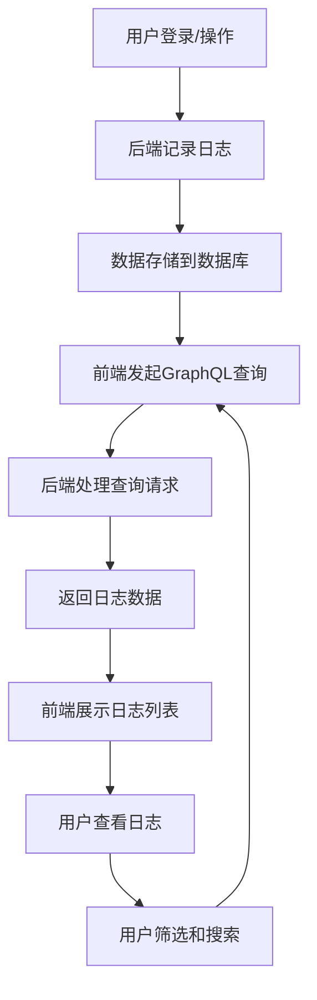
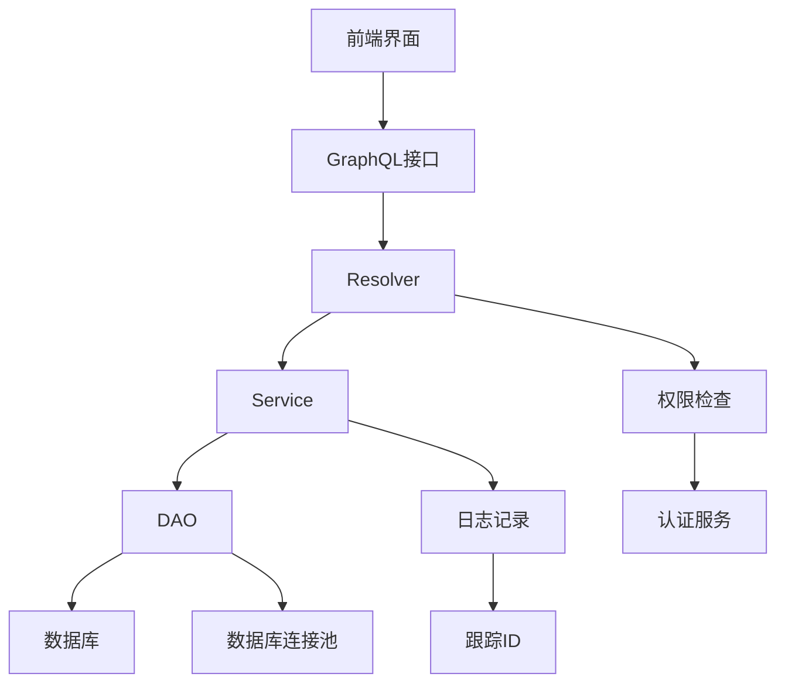

# 日志系统

**本文档引用的文件**
- [login_log_model.rs](https://github.com/sail-sail/nest/blob/main/rust/generated/base/login_log/login_log_model.rs)
- [login_log_resolver.rs](https://github.com/sail-sail/nest/blob/main/rust/generated/base/login_log/login_log_resolver.rs)
- [login_log_graphql.rs](https://github.com/sail-sail/nest/blob/main/rust/generated/base/login_log/login_log_graphql.rs)
- [operation_record_model.rs](https://github.com/sail-sail/nest/blob/main/rust/generated/base/operation_record/operation_record_model.rs)
- [operation_record_resolver.rs](https://github.com/sail-sail/nest/blob/main/rust/generated/base/operation_record/operation_record_resolver.rs)
- [operation_record_graphql.rs](https://github.com/sail-sail/nest/blob/main/rust/generated/base/operation_record/operation_record_graphql.rs)
- [login_log](https://github.com/sail-sail/nest/blob/main/pc/src/views/base/login_log)
- [operation_record](https://github.com/sail-sail/nest/blob/main/pc/src/views/base/operation_record)

## 目录
1. [简介](#简介)
2. [项目结构](#项目结构)
3. [核心组件](#核心组件)
4. [架构概述](#架构概述)
5. [详细组件分析](#详细组件分析)
6. [依赖分析](#依赖分析)
7. [性能考虑](#性能考虑)
8. [故障排除指南](#故障排除指南)
9. [结论](#结论)

## 简介
本文档详细描述了系统中的日志模块，涵盖登录日志和操作日志两大功能。文档深入分析了日志记录机制、数据采集与存储、前后端协同流程、查询接口实现以及安全审计最佳实践。

## 项目结构
日志系统在项目中分为前端和后端两个主要部分，分别位于不同的目录结构中。后端采用Rust语言实现，前端使用Vue.js框架构建。

**图示来源**
- [login_log](https://github.com/sail-sail/nest/blob/main/pc/src/views/base/login_log)
- [operation_record](https://github.com/sail-sail/nest/blob/main/pc/src/views/base/operation_record)
- [rust/generated/base](https://github.com/sail-sail/nest/blob/main/rust/generated/base)

**本节来源**
- [project_structure](https://github.com/sail-sail/nest/blob/main/project_structure#L1-L200)

## 核心组件
日志系统的核心组件包括登录日志模块和操作日志模块，分别用于记录用户登录行为和系统操作行为。两个模块都遵循相同的架构模式，包括模型定义、服务层、数据访问层和GraphQL接口层。

**本节来源**
- [login_log_model.rs](https://github.com/sail-sail/nest/blob/main/rust/generated/base/login_log/login_log_model.rs#L1-L592)
- [operation_record_model.rs](https://github.com/sail-sail/nest/blob/main/rust/generated/base/operation_record/operation_record_model.rs#L1-L600)

## 架构概述
日志系统的整体架构采用分层设计，从前端到后端形成了完整的数据流闭环。系统通过GraphQL接口提供数据查询能力，实现了高效的数据交互。

**图示来源**
- [login_log_graphql.rs](https://github.com/sail-sail/nest/blob/main/rust/generated/base/login_log/login_log_graphql.rs#L1-L201)
- [operation_record_graphql.rs](https://github.com/sail-sail/nest/blob/main/rust/generated/base/operation_record/operation_record_graphql.rs#L1-L201)

## 详细组件分析

### 登录日志模块分析
登录日志模块负责记录用户的登录行为，包括登录时间、IP地址、设备信息等关键字段。

#### 登录日志数据模型

**图示来源**
- [login_log_model.rs](https://github.com/sail-sail/nest/blob/main/rust/generated/base/login_log/login_log_model.rs#L1-L592)

#### 登录日志查询流程

**图示来源**
- [login_log_resolver.rs](https://github.com/sail-sail/nest/blob/main/rust/generated/base/login_log/login_log_resolver.rs#L1-L330)
- [login_log_graphql.rs](https://github.com/sail-sail/nest/blob/main/rust/generated/base/login_log/login_log_graphql.rs#L1-L201)

**本节来源**
- [login_log_model.rs](https://github.com/sail-sail/nest/blob/main/rust/generated/base/login_log/login_log_model.rs#L1-L592)
- [login_log_resolver.rs](https://github.com/sail-sail/nest/blob/main/rust/generated/base/login_log/login_log_resolver.rs#L1-L330)
- [login_log_graphql.rs](https://github.com/sail-sail/nest/blob/main/rust/generated/base/login_log/login_log_graphql.rs#L1-L201)

### 操作日志模块分析
操作日志模块用于记录用户在系统中的各种操作行为，实现自动化的操作追踪。

#### 操作日志数据模型

**图示来源**
- [operation_record_model.rs](https://github.com/sail-sail/nest/blob/main/rust/generated/base/operation_record/operation_record_model.rs#L1-L600)

#### 操作日志查询流程

**图示来源**
- [operation_record_resolver.rs](https://github.com/sail-sail/nest/blob/main/rust/generated/base/operation_record/operation_record_resolver.rs#L1-L330)
- [operation_record_graphql.rs](https://github.com/sail-sail/nest/blob/main/rust/generated/base/operation_record/operation_record_graphql.rs#L1-L201)

**本节来源**
- [operation_record_model.rs](https://github.com/sail-sail/nest/blob/main/rust/generated/base/operation_record/operation_record_model.rs#L1-L600)
- [operation_record_resolver.rs](https://github.com/sail-sail/nest/blob/main/rust/generated/base/operation_record/operation_record_resolver.rs#L1-L330)
- [operation_record_graphql.rs](https://github.com/sail-sail/nest/blob/main/rust/generated/base/operation_record/operation_record_graphql.rs#L1-L201)

### 前后端协同工作流程
日志系统的前后端协同工作流程展示了数据从生成到展示的完整生命周期。

**本节来源**
- [login_log](https://github.com/sail-sail/nest/blob/main/pc/src/views/base/login_log)
- [operation_record](https://github.com/sail-sail/nest/blob/main/pc/src/views/base/operation_record)

## 依赖分析
日志系统各组件之间的依赖关系清晰，遵循了良好的分层架构原则。

**图示来源**
- [login_log_resolver.rs](https://github.com/sail-sail/nest/blob/main/rust/generated/base/login_log/login_log_resolver.rs#L1-L330)
- [operation_record_resolver.rs](https://github.com/sail-sail/nest/blob/main/rust/generated/base/operation_record/operation_record_resolver.rs#L1-L330)

**本节来源**
- [login_log_resolver.rs](https://github.com/sail-sail/nest/blob/main/rust/generated/base/login_log/login_log_resolver.rs#L1-L330)
- [operation_record_resolver.rs](https://github.com/sail-sail/nest/blob/main/rust/generated/base/operation_record/operation_record_resolver.rs#L1-L330)

## 性能考虑
日志系统的性能优化主要体现在以下几个方面：

1. **查询优化**：系统限制了前端可排序的字段，仅允许`create_time`和`update_time`字段排序，避免了全表扫描。
2. **分页支持**：所有查询接口都支持分页，防止一次性加载大量数据。
3. **索引优化**：数据库表设计中对常用查询字段建立了索引，如IP地址、用户名、创建时间等。
4. **缓存机制**：系统可能使用了缓存机制来存储频繁访问的日志数据。

**本节来源**
- [login_log_model.rs](https://github.com/sail-sail/nest/blob/main/rust/generated/base/login_log/login_log_model.rs#L1-L592)
- [operation_record_model.rs](https://github.com/sail-sail/nest/blob/main/rust/generated/base/operation_record/operation_record_model.rs#L1-L600)

## 故障排除指南
当遇到日志系统相关问题时，可以参考以下排查步骤：

1. **检查GraphQL接口是否正常**：确认接口能够正常响应查询请求。
2. **验证数据库连接**：确保后端服务能够正常连接到数据库。
3. **检查日志记录权限**：确认当前用户具有记录和查询日志的权限。
4. **查看系统日志**：检查服务器日志中是否有相关错误信息。
5. **验证数据完整性**：确认数据库中的日志数据是否完整且格式正确。

**本节来源**
- [login_log_resolver.rs](https://github.com/sail-sail/nest/blob/main/rust/generated/base/login_log/login_log_resolver.rs#L1-L330)
- [operation_record_resolver.rs](https://github.com/sail-sail/nest/blob/main/rust/generated/base/operation_record/operation_record_resolver.rs#L1-L330)

## 结论
本文档详细介绍了日志系统的架构和实现细节。系统通过清晰的分层设计和规范的接口定义，实现了高效的日志记录和查询功能。登录日志和操作日志模块都采用了相似的架构模式，保证了代码的一致性和可维护性。前后端通过GraphQL接口进行数据交互，实现了灵活的数据查询能力。系统在性能和安全性方面也做了充分考虑，为系统的稳定运行提供了保障。