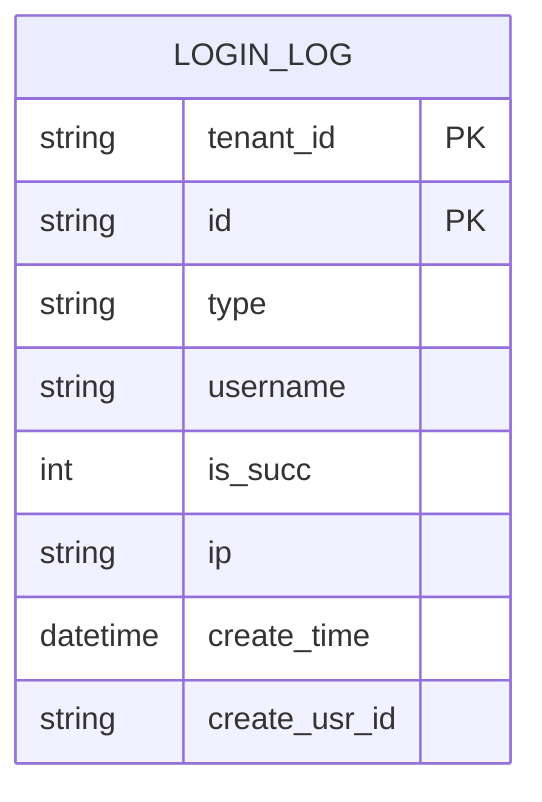
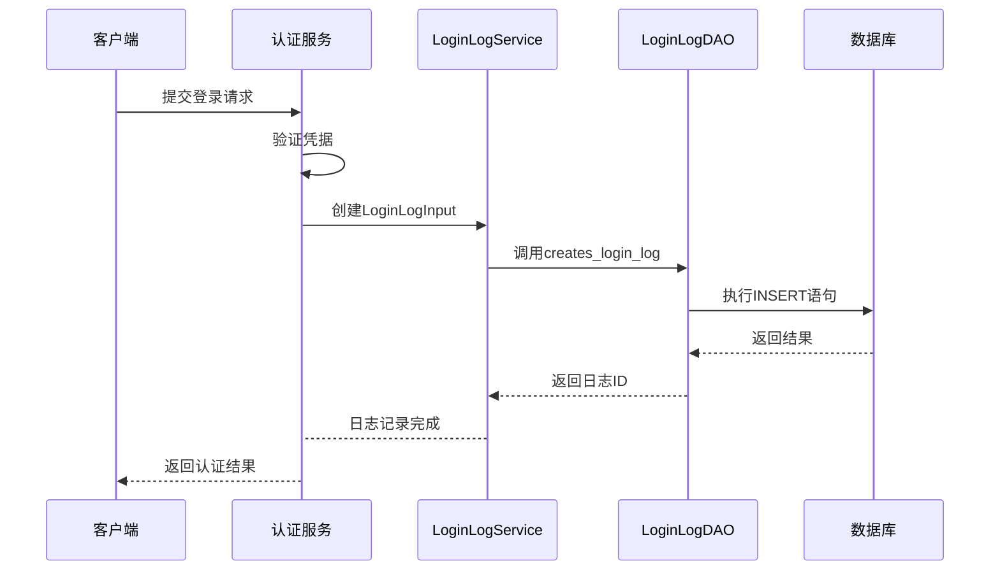
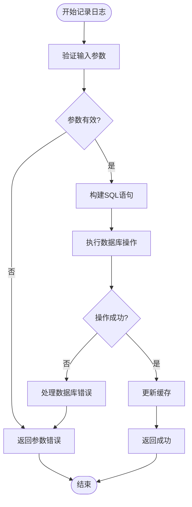
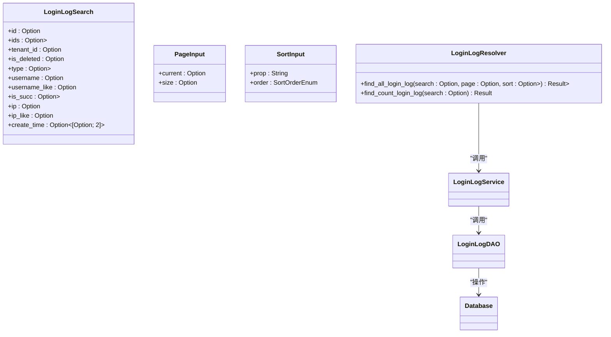
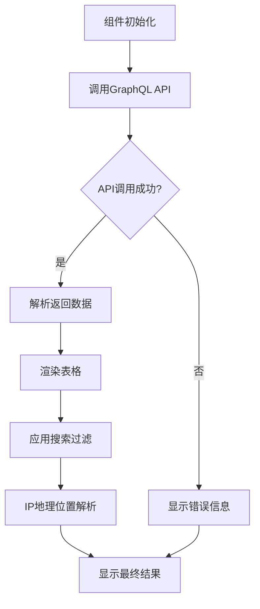

# 登录日志


**本文档引用文件**  
- [login_log_model.rs](https://github.com/sail-sail/nest/blob/main/rust/generated/base/login_log/login_log_model.rs)
- [login_log_service.rs](https://github.com/sail-sail/nest/blob/main/rust/generated/base/login_log/login_log_service.rs)
- [login_log_dao.rs](https://github.com/sail-sail/nest/blob/main/rust/generated/base/login_log/login_log_dao.rs)
- [login_log_resolver.rs](https://github.com/sail-sail/nest/blob/main/rust/generated/base/login_log/login_log_resolver.rs)
- [List.vue](https://github.com/sail-sail/nest/blob/main/pc/src/views/base/login_log/List.vue)
- [Api.ts](https://github.com/sail-sail/nest/blob/main/pc/src/views/base/login_log/Api.ts)


## 目录
1. [简介](#简介)
2. [数据模型](#数据模型)
3. [后端日志记录机制](#后端日志记录机制)
4. [GraphQL查询接口](#graphql查询接口)
5. [前端日志展示](#前端日志展示)
6. [安全存储建议](#安全存储建议)

## 简介
登录日志系统用于记录用户的所有登录行为，包括成功和失败的登录尝试。系统通过Rust后端在认证流程中自动记录日志，前端通过GraphQL API查询和展示日志数据。日志包含登录时间、IP地址、用户代理、登录结果等关键信息，为安全审计和异常检测提供数据支持。

## 数据模型

### 登录日志字段说明
登录日志数据模型（`LoginLogModel`）包含以下核心字段：

| 字段名 | 类型 | 说明 |
|--------|------|------|
| `tenant_id` | TenantId | 租户ID，用于多租户隔离 |
| `id` | LoginLogId | 日志记录唯一标识 |
| `type` | LoginLogType | 登录类型（账号、微信小程序、微信公众号） |
| `username` | String | 用户名 |
| `is_succ` | u8 | 登录是否成功（1=成功，0=失败） |
| `ip` | String | 客户端IP地址 |
| `create_time` | chrono::NaiveDateTime | 登录时间 |
| `create_usr_id` | UsrId | 创建人用户ID |

**字段采集方式**：
- **登录时间**：系统在认证流程开始时自动记录当前时间戳
- **IP地址**：从HTTP请求头中提取客户端真实IP
- **用户代理**：从HTTP请求的User-Agent头获取，用于识别客户端类型
- **登录结果**：根据认证流程的最终结果设置成功或失败标志



**Diagram sources**
- [login_log_model.rs](https://github.com/sail-sail/nest/blob/main/rust/generated/base/login_log/login_log_model.rs#L50-L150)

**Section sources**
- [login_log_model.rs](https://github.com/sail-sail/nest/blob/main/rust/generated/base/login_log/login_log_model.rs#L1-L200)

## 后端日志记录机制

### 认证流程中的日志记录
Rust后端在用户认证过程中通过`LoginLogService`自动记录登录日志。认证流程如下：



**Diagram sources**
- [login_log_service.rs](https://github.com/sail-sail/nest/blob/main/rust/generated/base/login_log/login_log_service.rs#L100-L150)
- [login_log_dao.rs](https://github.com/sail-sail/nest/blob/main/rust/generated/base/login_log/login_log_dao.rs#L500-L600)

### DAO层持久化实现
DAO层负责将日志数据持久化到数据库，主要实现包括：

1. **SQL生成**：根据`LoginLogInput`生成INSERT语句
2. **参数绑定**：安全地绑定所有字段值，防止SQL注入
3. **事务处理**：确保日志记录的原子性
4. **错误处理**：捕获并处理数据库操作异常



**Diagram sources**
- [login_log_dao.rs](https://github.com/sail-sail/nest/blob/main/rust/generated/base/login_log/login_log_dao.rs#L500-L800)

**Section sources**
- [login_log_service.rs](https://github.com/sail-sail/nest/blob/main/rust/generated/base/login_log/login_log_service.rs#L100-L200)
- [login_log_dao.rs](https://github.com/sail-sail/nest/blob/main/rust/generated/base/login_log/login_log_dao.rs#L500-L800)

## GraphQL查询接口

### 查询能力
GraphQL Resolver提供了丰富的查询接口，支持以下功能：

- **分页查询**：通过`PageInput`参数实现分页
- **时间范围筛选**：按`create_time`范围查询
- **用户名搜索**：支持精确匹配和模糊搜索
- **登录结果过滤**：按成功/失败状态筛选
- **IP地址过滤**：支持精确匹配和模糊搜索

### 查询示例
```graphql
query GetLoginLogs($search: LoginLogSearch, $page: PageInput, $sort: [SortInput]) {
  find_all_login_log(search: $search, page: $page, sort: $sort) {
    id
    username
    is_succ
    ip
    create_time
    type
  }
  find_count_login_log(search: $search)
}
```



**Diagram sources**
- [login_log_resolver.rs](https://github.com/sail-sail/nest/blob/main/rust/generated/base/login_log/login_log_resolver.rs#L20-L100)
- [login_log_model.rs](https://github.com/sail-sail/nest/blob/main/rust/generated/base/login_log/login_log_model.rs#L200-L300)

**Section sources**
- [login_log_resolver.rs](https://github.com/sail-sail/nest/blob/main/rust/generated/base/login_log/login_log_resolver.rs#L1-L150)

## 前端日志展示

### PC端List.vue组件
前端通过`List.vue`组件展示登录日志列表，主要功能包括：



### 功能实现
1. **表格渲染**：使用Element Plus表格组件展示日志数据
2. **搜索过滤**：提供用户名、IP地址等字段的搜索框
3. **分页控制**：集成分页组件，支持页码跳转和每页数量设置
4. **IP地理位置解析**：调用第三方API解析IP地址的地理位置信息
5. **排序功能**：支持按登录时间等字段排序

**Section sources**
- [List.vue](https://github.com/sail-sail/nest/blob/main/pc/src/views/base/login_log/List.vue#L1-L200)
- [Api.ts](https://github.com/sail-sail/nest/blob/main/pc/src/views/base/login_log/Api.ts#L1-L50)

## 安全存储建议

### 敏感信息处理
为确保日志安全，建议采取以下措施：

1. **敏感信息脱敏**：
   - 对IP地址进行部分掩码处理
   - 不记录完整的用户凭据信息
   - 对User-Agent中的敏感信息进行过滤

2. **日志保留周期**：
   - 设置合理的日志保留策略（建议90天）
   - 定期归档历史日志
   - 实现自动清理机制

3. **防止日志注入攻击**：
   - 严格验证所有日志字段的输入
   - 使用参数化查询防止SQL注入
   - 对特殊字符进行转义处理
   - 限制单条日志的长度

4. **访问控制**：
   - 实施基于角色的日志访问权限
   - 记录所有日志查询操作
   - 对敏感操作进行二次验证

5. **加密存储**：
   - 对存储的日志数据进行加密
   - 使用安全的密钥管理机制
   - 定期轮换加密密钥

**Section sources**
- [login_log_dao.rs](https://github.com/sail-sail/nest/blob/main/rust/generated/base/login_log/login_log_dao.rs#L100-L200)
- [login_log_service.rs](https://github.com/sail-sail/nest/blob/main/rust/generated/base/login_log/login_log_service.rs#L50-L100)