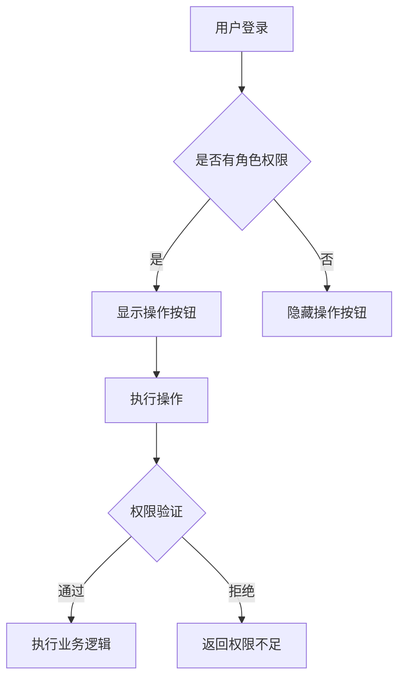
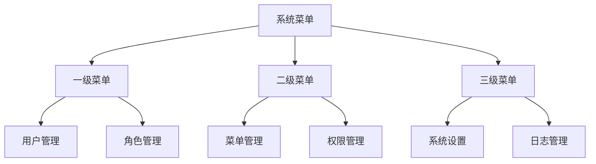
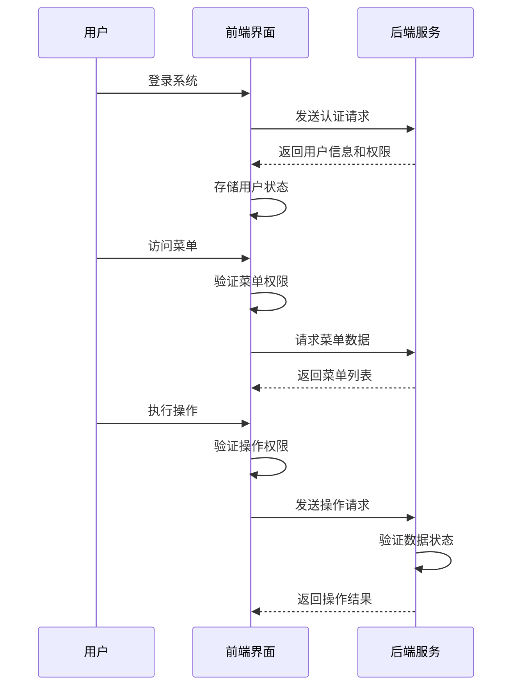

# 核心功能模块详解

**本文档引用文件**  
- [usr.ts](https://github.com/sail-sail/nest/blob/main/pc/src/store/usr.ts)
- [usr_service.rs](https://github.com/sail-sail/nest/blob/main/rust/generated/base/usr/usr_service.rs)
- [role_service.rs](https://github.com/sail-sail/nest/blob/main/rust/generated/base/role/role_service.rs)
- [menu_service.rs](https://github.com/sail-sail/nest/blob/main/rust/generated/base/menu/menu_service.rs)
- [List.vue](https://github.com/sail-sail/nest/blob/main/pc/src/views/base/usr/List.vue)
- [List.vue](https://github.com/sail-sail/nest/blob/main/pc/src/views/base/role/List.vue)
- [List.vue](https://github.com/sail-sail/nest/blob/main/pc/src/views/base/menu/List.vue)
- [auth_model.rs](https://github.com/sail-sail/nest/blob/main/rust/generated/common/auth/auth_model.rs)

## 目录
1. [用户管理模块](#用户管理模块)
2. [角色权限模块](#角色权限模块)
3. [菜单管理模块](#菜单管理模块)
4. [模块协同工作流程](#模块协同工作流程)
5. [二次开发与扩展指南](#二次开发与扩展指南)

## 用户管理模块

用户管理模块负责系统用户信息的维护与认证管理。该模块通过前端Vue组件与后端Rust服务协同工作，实现用户增删改查、启用禁用、锁定解锁等核心功能。

前端通过`usr.ts`中的`useStorage`管理用户登录状态、权限信息和租户ID，使用`authorization`存储认证令牌，并提供`login`、`logout`、`hasRole`等方法进行用户会话控制。用户认证信息通过`AuthModel`结构体定义，包含用户ID、租户ID、过期时间等字段。

后端服务通过`usr_service.rs`提供完整的用户管理接口，包括`find_all_usr`、`find_count_usr`等查询方法，以及`creates_usr`、`update_by_id_usr`、`delete_by_ids_usr`等操作方法。服务层实现了完善的业务逻辑校验，如在删除用户前检查是否被锁定，确保数据安全。

**Section sources**
- [usr.ts](https://github.com/sail-sail/nest/blob/main/pc/src/store/usr.ts#L0-L147)
- [usr_service.rs](https://github.com/sail-sail/nest/blob/main/rust/generated/base/usr/usr_service.rs#L0-L414)
- [auth_model.rs](https://github.com/sail-sail/nest/blob/main/rust/generated/common/auth/auth_model.rs#L0-L37)

## 角色权限模块

角色权限模块实现基于角色的访问控制（RBAC）机制，通过角色分配和权限验证来管理用户操作权限。该模块包含角色管理、菜单权限、按钮权限、数据权限和字段权限等多个维度的控制。

前端`role/List.vue`组件提供角色管理界面，支持通过树形选择器配置菜单权限，并通过链接形式展示已分配的按钮权限、数据权限和字段权限数量。权限验证通过`permit`方法实现，根据当前用户权限动态显示操作按钮。

后端`role_service.rs`提供角色管理服务，包含`find_all_role`、`find_count_role`等查询接口，以及`creates_role`、`update_by_id_role`、`delete_by_ids_role`等操作接口。服务层实现了系统角色保护机制，禁止删除系统角色，并在修改角色前检查锁定状态。

**Diagram sources**
- [List.vue](https://github.com/sail-sail/nest/blob/main/pc/src/views/base/role/List.vue#L0-L799)
- [role_service.rs](https://github.com/sail-sail/nest/blob/main/rust/generated/base/role/role_service.rs#L0-L421)

**Section sources**
- [List.vue](https://github.com/sail-sail/nest/blob/main/pc/src/views/base/role/List.vue#L0-L799)
- [role_service.rs](https://github.com/sail-sail/nest/blob/main/rust/generated/base/role/role_service.rs#L0-L421)

## 菜单管理模块

菜单管理模块负责系统的动态菜单生成和权限控制。该模块支持树形结构的菜单管理，允许配置父菜单关系、路由路径和显示顺序，并与角色权限模块集成实现菜单级别的访问控制。

前端`menu/List.vue`组件提供菜单管理界面，支持通过树形选择器选择父菜单，并通过排序输入框调整菜单显示顺序。菜单数据通过`findAllMenu`和`findCountMenu`接口获取，支持分页查询和条件筛选。

后端`menu_service.rs`提供菜单管理服务，包含`find_all_menu`、`find_count_menu`等查询接口，以及`creates_menu`、`update_by_id_menu`、`delete_by_ids_menu`等操作接口。服务层实现了菜单锁定保护机制，在修改或删除菜单前检查锁定状态。

**Diagram sources**
- [List.vue](https://github.com/sail-sail/nest/blob/main/pc/src/views/base/menu/List.vue#L0-L799)
- [menu_service.rs](https://github.com/sail-sail/nest/blob/main/rust/generated/base/menu/menu_service.rs#L0-L395)

**Section sources**
- [List.vue](https://github.com/sail-sail/nest/blob/main/pc/src/views/base/menu/List.vue#L0-L799)
- [menu_service.rs](https://github.com/sail-sail/nest/blob/main/rust/generated/base/menu/menu_service.rs#L0-L395)

## 模块协同工作流程

用户管理、角色权限和菜单管理三个模块通过统一的权限验证机制协同工作，构建完整的系统管理功能。用户登录后，系统根据用户所属角色加载对应的菜单权限和操作权限。

当用户访问系统时，首先通过`usr.ts`中的`login`方法进行认证，认证成功后将用户信息存储在`loginInfo`中。系统根据用户的角色代码通过`hasRole`方法验证权限，并从`permitsStore`中获取具体的操作权限。

在界面展示层面，通过`permit`方法检查用户是否具有特定操作权限，动态显示或隐藏相应的操作按钮。在数据访问层面，后端服务在执行敏感操作前通过`get_is_locked_by_id`等方法检查数据锁定状态，确保数据安全。

**Diagram sources**
- [usr.ts](https://github.com/sail-sail/nest/blob/main/pc/src/store/usr.ts#L0-L147)
- [List.vue](https://github.com/sail-sail/nest/blob/main/pc/src/views/base/usr/List.vue#L0-L799)
- [List.vue](https://github.com/sail-sail/nest/blob/main/pc/src/views/base/role/List.vue#L0-L799)
- [List.vue](https://github.com/sail-sail/nest/blob/main/pc/src/views/base/menu/List.vue#L0-L799)

## 二次开发与扩展指南

为支持二次开发和功能扩展，系统提供了清晰的模块化设计和标准化的接口规范。开发者可以通过以下方式扩展系统功能：

1. **新增业务模块**：在`codegen`目录下创建新的表结构定义，通过代码生成工具自动生成前后端代码框架。

2. **扩展权限控制**：在`permit`模块中定义新的权限类型，并在前端组件中通过`permit`方法进行权限验证。

3. **自定义菜单配置**：通过`menu_service.rs`提供的接口动态生成菜单，支持根据用户角色和业务场景定制化菜单结构。

4. **集成第三方认证**：通过扩展`auth_model.rs`中的`AuthModel`结构体，支持微信、LDAP等第三方认证方式。

5. **数据权限扩展**：在`data_permit`和`field_permit`模块基础上，实现更细粒度的数据访问控制策略。

开发者应遵循现有代码风格和设计模式，在扩展功能时确保与现有权限验证机制的兼容性，并通过单元测试验证新功能的正确性。

**Section sources**
- [usr_service.rs](https://github.com/sail-sail/nest/blob/main/rust/generated/base/usr/usr_service.rs#L0-L414)
- [role_service.rs](https://github.com/sail-sail/nest/blob/main/rust/generated/base/role/role_service.rs#L0-L421)
- [menu_service.rs](https://github.com/sail-sail/nest/blob/main/rust/generated/base/menu/menu_service.rs#L0-L395)
- [usr.ts](https://github.com/sail-sail/nest/blob/main/pc/src/store/usr.ts#L0-L147)