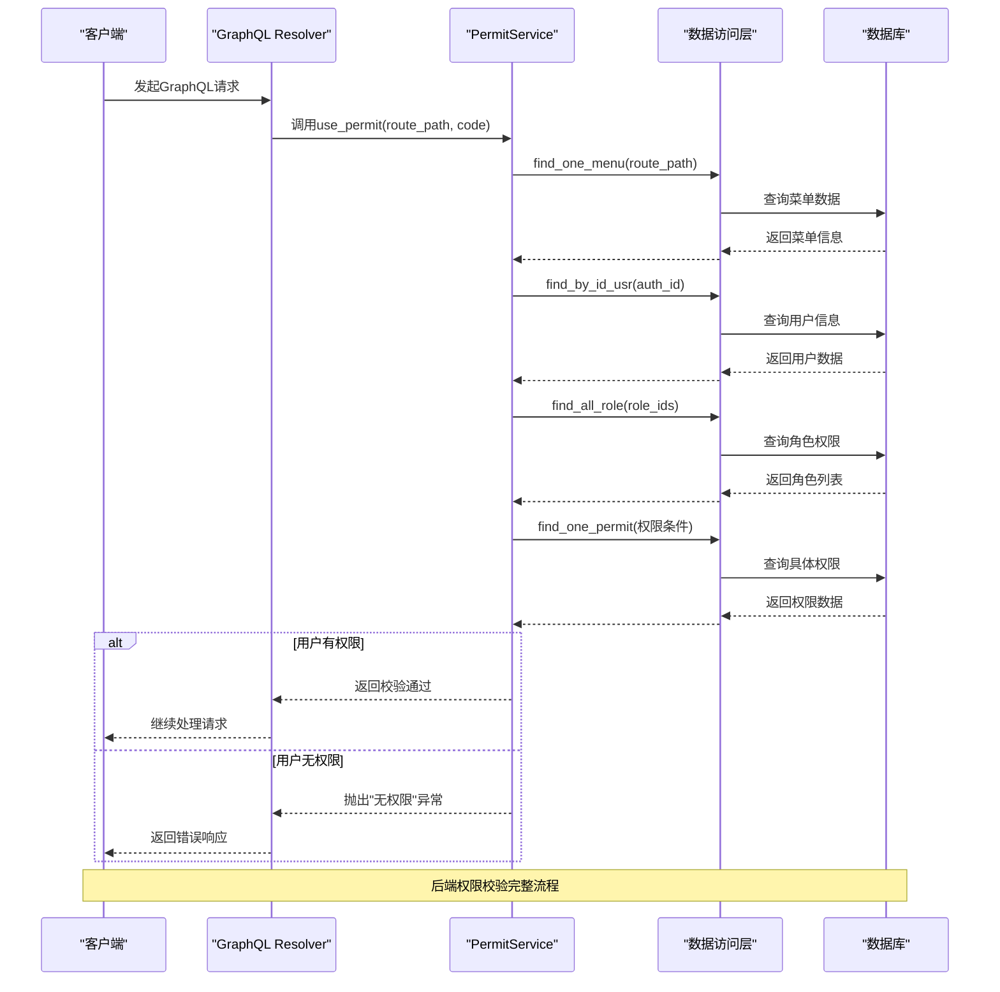
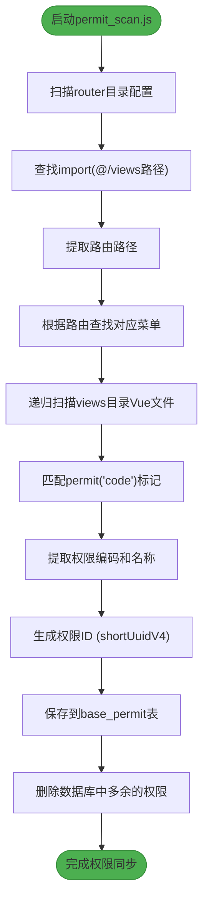

# 功能权限


**本文档引用的文件**
- [permit_model.rs](https://github.com/sail-sail/nest/blob/main/rust/generated/base/permit/permit_model.rs)
- [permit_resolver.rs](https://github.com/sail-sail/nest/blob/main/rust/generated/base/permit/permit_resolver.rs)
- [permit_service.rs](https://github.com/sail-sail/nest/blob/main/rust/generated/common/permit/permit_service.rs)
- [permit.ts](https://github.com/sail-sail/nest/blob/main/pc/src/store/permit.ts)
- [permit_scan.js](https://github.com/sail-sail/nest/blob/main/pc/src/utils/permit_scan.js)


## 目录
1. [简介](#简介)
2. [权限表结构设计](#权限表结构设计)
3. [后端权限校验机制](#后端权限校验机制)
4. [前端权限扫描与动态渲染](#前端权限扫描与动态渲染)
5. [权限流程完整示例](#权限流程完整示例)

## 简介
功能权限（permit）是系统中用于控制菜单和功能访问的核心机制。该机制通过权限编码、菜单关联和层级关系实现细粒度的访问控制。系统采用前后端协同的方式，后端通过GraphQL Resolver进行权限校验，前端通过自动扫描Vue组件中的权限标记并结合用户权限数据实现菜单和按钮的动态渲染。

## 权限表结构设计

权限表（base_permit）是权限系统的基础数据结构，其核心字段设计如下：

- **id**: 权限唯一标识符，使用UUID格式
- **is_sys**: 系统字段，标记是否为系统自动生成的权限记录
- **menu_id**: 关联的菜单ID，建立权限与菜单的从属关系
- **menu_id_lbl**: 菜单名称，用于显示和查询
- **code**: 权限编码，作为权限的唯一标识，在代码中用于权限判断
- **lbl**: 权限名称，用于界面显示，支持多语言
- **order_by**: 排序字段，控制权限在界面中的显示顺序
- **rem**: 备注信息，用于记录权限的附加说明

权限表通过`menu_id`字段与菜单表建立关联，形成"菜单-权限"的层级结构。每个菜单可以拥有多个功能权限，如"查看"、"添加"、"编辑"、"删除"等操作权限。

**Section sources**
- [permit_model.rs](https://github.com/sail-sail/nest/blob/main/rust/generated/base/permit/permit_model.rs#L50-L100)

## 后端权限校验机制

后端采用Rust语言实现，通过GraphQL Resolver和中间件服务层进行权限校验，确保用户只能执行被授权的操作。

### GraphQL Resolver层
在`permit_resolver.rs`中定义了多个查询接口，包括：
- `find_all_permit`: 根据搜索条件和分页查找权限列表
- `find_by_id_permit`: 根据ID查找特定权限
- `find_one_ok_permit`: 查找第一个匹配的权限，若不存在则抛出异常

这些Resolver函数在执行前会调用`check_sort_permit`函数验证排序字段的合法性，防止非法排序操作。

### 服务层权限校验
核心权限校验逻辑位于`permit_service.rs`的`use_permit`函数中：

1. 首先根据路由路径查找对应的菜单
2. 获取当前用户的身份认证信息
3. 查询用户所属角色及其关联的权限ID列表
4. 分批次查询用户拥有的所有权限
5. 检查用户是否拥有访问指定路由和执行指定操作（code）的权限

对于超级管理员（username为"admin"）的用户，系统会跳过权限校验，直接授予所有权限。



**Diagram sources**
- [permit_resolver.rs](https://github.com/sail-sail/nest/blob/main/rust/generated/base/permit/permit_resolver.rs#L50-L100)
- [permit_service.rs](https://github.com/sail-sail/nest/blob/main/rust/generated/common/permit/permit_service.rs#L50-L150)

**Section sources**
- [permit_resolver.rs](https://github.com/sail-sail/nest/blob/main/rust/generated/base/permit/permit_resolver.rs#L50-L100)
- [permit_service.rs](https://github.com/sail-sail/nest/blob/main/rust/generated/common/permit/permit_service.rs#L50-L150)

## 前端权限扫描与动态渲染

前端采用Vue3 + Pinia架构，通过`permit_scan.js`工具和Pinia store实现权限的自动扫描和动态渲染。

### 权限扫描机制
`permit_scan.js`是一个Node.js脚本，其主要功能包括：

1. 扫描`router`目录下的路由配置文件
2. 递归遍历`views`目录下的所有Vue组件
3. 使用正则表达式`/permit\('(.*)?'\)/g`匹配组件中的权限标记
4. 提取权限编码（code）和名称（lbl）
5. 根据路由路径关联到对应的菜单
6. 自动生成权限记录并存入数据库

该脚本在项目构建时自动执行，确保权限配置与代码实现保持同步。

### Pinia Store管理
`permit.ts`文件定义了权限的Pinia store，主要功能包括：

- 存储用户权限数据到浏览器本地存储
- 提供`getPermit`方法用于权限判断
- 支持传入路由路径进行跨路由权限检查
- 对超级管理员用户自动授予所有权限



**Diagram sources**
- [permit_scan.js](https://github.com/sail-sail/nest/blob/main/pc/src/utils/permit_scan.js#L50-L200)
- [permit.ts](https://github.com/sail-sail/nest/blob/main/pc/src/store/permit.ts#L1-L20)

**Section sources**
- [permit_scan.js](https://github.com/sail-sail/nest/blob/main/pc/src/utils/permit_scan.js#L50-L200)
- [permit.ts](https://github.com/sail-sail/nest/blob/main/pc/src/store/permit.ts#L1-L20)

## 权限流程完整示例

以下展示用户登录后权限数据的加载、存储及在路由守卫和组件中进行权限判断的完整流程：

1. **用户登录成功**
   - 后端生成JWT令牌，包含用户ID等认证信息
   - 前端存储JWT令牌到localStorage

2. **加载权限数据**
   ```mermaid
sequenceDiagram
participant Frontend as "前端"
participant Backend as "后端"
participant Store as "Pinia Store"
Frontend->>Backend : 请求get_usr_permits
Backend->>Backend : get_auth_model()
Backend->>Backend : find_by_id_usr(auth_id)
Backend->>Backend : find_all_role(user.role_ids)
Backend->>Backend : find_all_permit(权限ID列表)
Backend-->>Frontend : 返回权限列表
Frontend->>Store : 存储权限数据到permits
```

3. **路由守卫中的权限判断**
   - 在路由守卫中调用`getPermit()`方法
   - 检查用户是否拥有访问目标路由的权限
   - 若无权限则重定向到无权限页面或首页

4. **组件中的权限判断**
   ```javascript
   // 在Vue组件中使用
   const permit = usePermitStore();
   
   // 检查当前路由的"add"权限
   if (permit.getPermit()("add")) {
     // 显示添加按钮
   }
   
   // 检查指定路由的"edit"权限
   if (permit.getPermit("/user/list")("edit")) {
     // 显示编辑按钮
   }
   ```

5. **动态渲染菜单和按钮**
   - 根据用户权限数据过滤可访问的菜单项
   - 在界面上只显示用户有权访问的功能按钮
   - 对于无权限的操作，按钮保持隐藏状态

该流程确保了从用户登录到界面交互的完整权限控制链条，实现了安全、灵活的功能访问控制。

**Section sources**
- [permit_service.rs](https://github.com/sail-sail/nest/blob/main/rust/generated/common/permit/permit_service.rs#L1-L50)
- [permit.ts](https://github.com/sail-sail/nest/blob/main/pc/src/store/permit.ts#L1-L42)
- [permit_scan.js](https://github.com/sail-sail/nest/blob/main/pc/src/utils/permit_scan.js#L1-L50)