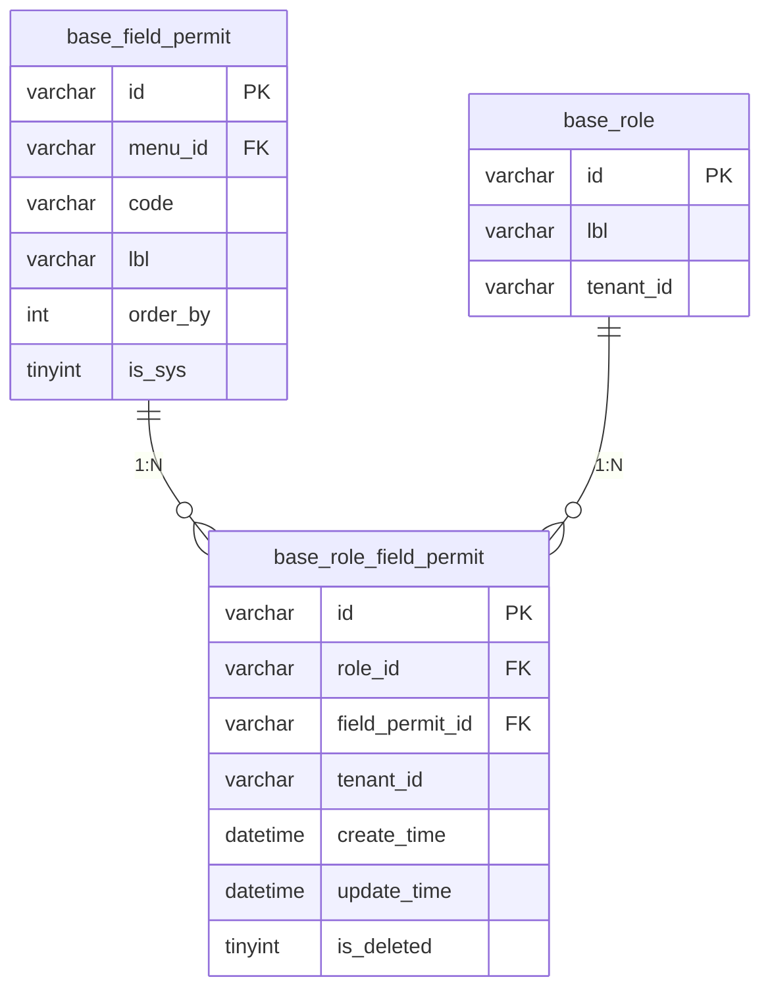
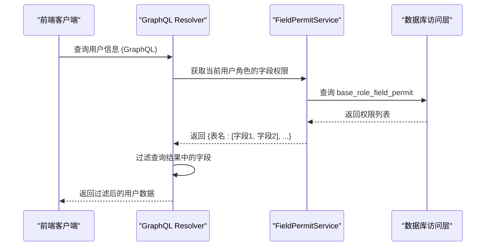
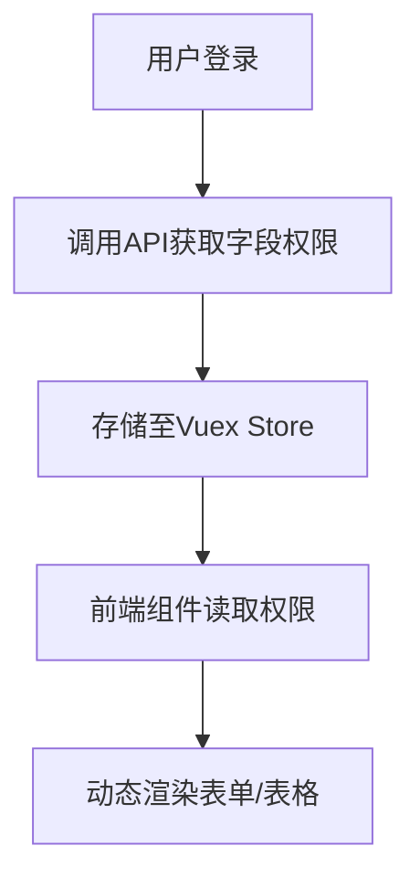
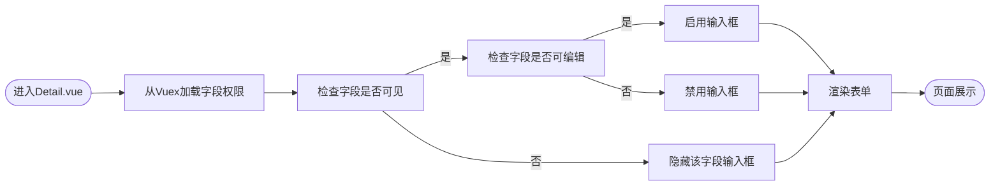
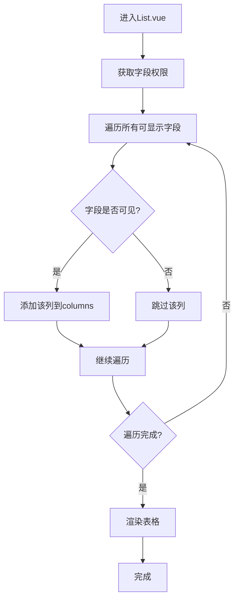

# 字段权限

**本文档引用文件**  
- [base.sql](https://github.com/sail-sail/nest/blob/main/codegen/src/tables/base/base.sql)
- [field_permit_model.rs](https://github.com/sail-sail/nest/blob/main/rust/generated/base/field_permit/field_permit_model.rs)
- [field_permit_service.rs](https://github.com/sail-sail/nest/blob/main/rust/generated/common/field_permit/field_permit_service.rs)
- [field_permit_resolver.rs](https://github.com/sail-sail/nest/blob/main/rust/generated/common/field_permit/field_permit_resolver.rs)
- [field_permit.ts](https://github.com/sail-sail/nest/blob/main/pc/src/store/field_permit.ts)
- [Detail.vue](https://github.com/sail-sail/nest/blob/main/pc/src/views/base/usr/Detail.vue)
- [List.vue](https://github.com/sail-sail/nest/blob/main/pc/src/views/base/usr/List.vue)

## 目录
1. [简介](#简介)
2. [字段权限数据模型](#字段权限数据模型)
3. [权限控制机制](#权限控制机制)
4. [前端动态渲染](#前端动态渲染)
5. [实际应用场景](#实际应用场景)
6. [结论](#结论)

## 简介
字段权限（field_permit）是系统中用于精细化控制数据模型字段读写能力的核心机制。通过该机制，系统可根据用户角色动态控制特定表中字段的可见性与可编辑性，实现敏感信息的访问控制。例如，HR 可查看员工的身份证号，而普通员工则无法查看。本文档将详细说明字段权限的实现原理、数据模型设计、服务层处理逻辑以及前端组件的动态渲染策略。

## 字段权限数据模型

字段权限系统基于数据库表 `base_field_permit` 和关联表 `base_role_field_permit` 构建，实现角色与字段权限的映射。

**图示来源**  
- [base.sql](https://github.com/sail-sail/nest/blob/main/codegen/src/tables/base/base.sql#L650-L670)

**本节来源**  
- [base.sql](https://github.com/sail-sail/nest/blob/main/codegen/src/tables/base/base.sql#L650-L670)

### 字段权限表（base_field_permit）
该表定义了系统中可被控制的字段权限项，每个条目对应一个数据表中的字段。

| 字段 | 类型 | 说明 |
|------|------|------|
| `id` | varchar(22) | 主键，权限项唯一标识 |
| `menu_id` | varchar(22) | 关联菜单，标识权限所属功能模块 |
| `code` | varchar(64) | 权限编码，通常为“表名.字段名”格式 |
| `lbl` | varchar(100) | 权限名称，用于界面展示 |
| `order_by` | int unsigned | 排序字段 |
| `is_sys` | tinyint | 是否为系统内置权限 |

### 角色字段权限表（base_role_field_permit）
该表建立角色与字段权限之间的多对多关系，实现权限分配。

| 字段 | 类型 | 说明 |
|------|------|------|
| `role_id` | varchar(22) | 角色ID，外键引用 base_role |
| `field_permit_id` | varchar(22) | 字段权限ID，外键引用 base_field_permit |
| `tenant_id` | varchar(22) | 租户ID，支持多租户隔离 |
| `is_deleted` | tinyint | 软删除标记 |

## 权限控制机制

在 GraphQL 查询解析过程中，服务层会根据当前用户的角色动态过滤响应数据中的字段，确保敏感信息不被泄露。

**图示来源**  
- [field_permit_service.rs](https://github.com/sail-sail/nest/blob/main/rust/generated/common/field_permit/field_permit_service.rs#L15-L40)
- [field_permit_resolver.rs](https://github.com/sail-sail/nest/blob/main/rust/generated/common/field_permit/field_permit_resolver.rs#L22-L55)

**本节来源**  
- [field_permit_service.rs](https://github.com/sail-sail/nest/blob/main/rust/generated/common/field_permit/field_permit_service.rs#L15-L40)
- [field_permit_resolver.rs](https://github.com/sail-sail/nest/blob/main/rust/generated/common/field_permit/field_permit_resolver.rs#L22-L55)

### 服务层字段过滤流程
1. **身份识别**：从请求上下文中获取当前用户信息。
2. **角色获取**：查询该用户所属的所有角色。
3. **权限查询**：通过 `FieldPermitService` 查询这些角色所拥有的所有字段权限。
4. **结果过滤**：在返回 GraphQL 响应前，移除用户无权访问的字段。

### 权限缓存优化
为提升性能，系统在用户登录后会将该用户的所有字段权限加载至前端 Vuex Store 中，避免频繁请求。

**图示来源**  
- [field_permit.ts](https://github.com/sail-sail/nest/blob/main/pc/src/store/field_permit.ts#L10-L35)

**本节来源**  
- [field_permit.ts](https://github.com/sail-sail/nest/blob/main/pc/src/store/field_permit.ts#L10-L35)

## 前端动态渲染

前端视图组件（如 Detail.vue 和 List.vue）根据字段权限配置动态生成表单和表格列，实现界面元素的按需显示与禁用。

### Detail.vue 表单动态控制
在用户详情页中，系统根据字段权限决定是否显示或禁用输入框。

**图示来源**  
- [Detail.vue](https://github.com/sail-sail/nest/blob/main/pc/src/views/base/usr/Detail.vue#L50-L120)

**本节来源**  
- [Detail.vue](https://github.com/sail-sail/nest/blob/main/pc/src/views/base/usr/Detail.vue#L50-L120)

### List.vue 表格列动态生成
在用户列表页中，系统根据权限动态生成表格列，隐藏用户无权查看的字段。

**图示来源**  
- [List.vue](https://github.com/sail-sail/nest/blob/main/pc/src/views/base/usr/List.vue#L30-L80)

**本节来源**  
- [List.vue](https://github.com/sail-sail/nest/blob/main/pc/src/views/base/usr/List.vue#L30-L80)

## 实际应用场景

以 HR 和普通员工查看用户信息为例，演示字段权限的实际效果。

### 场景描述
- **HR 角色**：拥有 `usr.id_card` 字段的读取权限。
- **普通员工角色**：无 `usr.id_card` 字段权限。

### 权限配置
在 `base_field_permit` 表中配置：
- `menu_id`: 指向“用户管理”菜单
- `code`: `usr.id_card`
- `lbl`: “身份证号”

在 `base_role_field_permit` 表中为 HR 角色分配该权限。

### 查询结果对比
当查询用户信息时：

| 字段 | HR 查看 | 普通员工查看 |
|------|--------|------------|
| 用户名 | 显示 | 显示 |
| 邮箱 | 显示 | 显示 |
| 手机号 | 显示 | 显示 |
| 身份证号 | 显示 | **不显示** |

此机制有效防止了敏感信息的越权访问，提升了系统的安全性与合规性。

**本节来源**  
- [base.sql](https://github.com/sail-sail/nest/blob/main/codegen/src/tables/base/base.sql#L650-L670)
- [Detail.vue](https://github.com/sail-sail/nest/blob/main/pc/src/views/base/usr/Detail.vue)
- [List.vue](https://github.com/sail-sail/nest/blob/main/pc/src/views/base/usr/List.vue)

## 结论
字段权限机制通过 `base_field_permit` 和 `base_role_field_permit` 表实现了对数据模型字段的精细化控制。服务层在 GraphQL 查询过程中动态过滤字段，前端组件根据权限配置动态渲染界面元素。该机制不仅保障了敏感数据的安全，还提升了系统的灵活性与可配置性，适用于多角色、多租户的复杂业务场景。