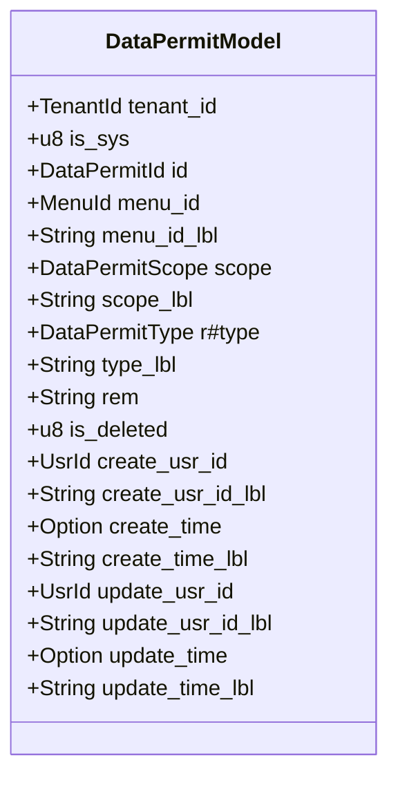
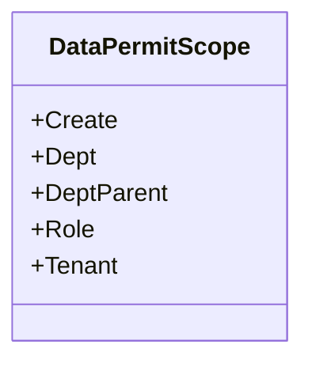
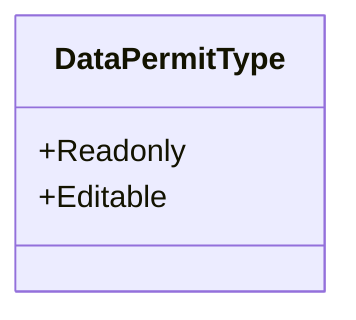
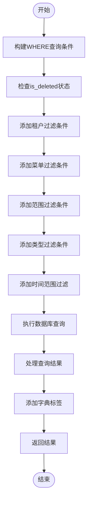
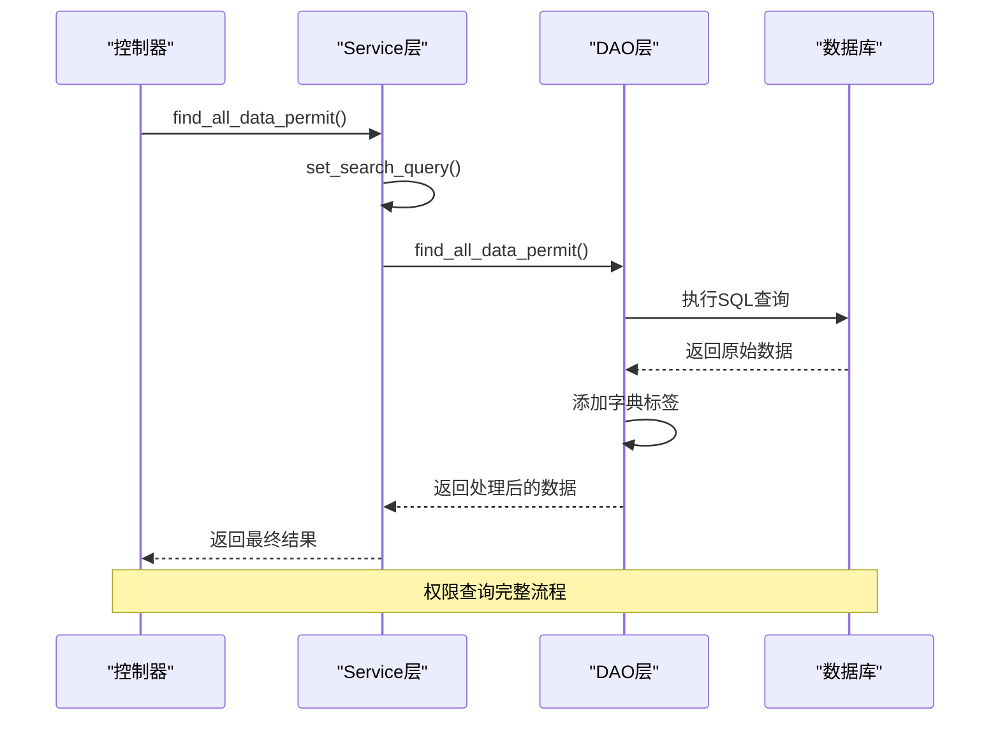
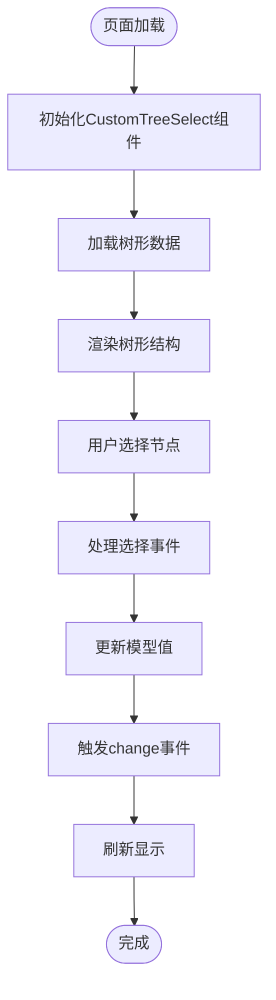
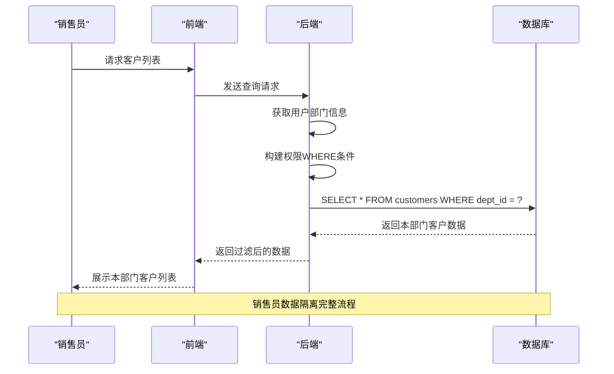

# 数据权限

**本文档引用的文件**
- [data_permit_model.rs](https://github.com/sail-sail/nest/blob/main/rust\generated\base\data_permit\data_permit_model.rs)
- [data_permit_dao.rs](https://github.com/sail-sail/nest/blob/main/rust\generated\base\data_permit\data_permit_dao.rs)
- [data_permit_service.rs](https://github.com/sail-sail/nest/blob/main/rust\generated\base\data_permit\data_permit_service.rs)
- [CustomTreeSelect.vue](https://github.com/sail-sail/nest/blob/main/pc\src\components\CustomTreeSelect.vue)
- [List.vue](https://github.com/sail-sail/nest/blob/main/pc\src\views\base\data_permit\List.vue)

## 目录
1. [简介](#简介)
2. [数据权限模型](#数据权限模型)
3. [数据权限范围与类型](#数据权限范围与类型)
4. [DAO层权限查询实现](#dao层权限查询实现)
5. [Service层权限逻辑处理](#service层权限逻辑处理)
6. [前端数据范围选择与展示](#前端数据范围选择与展示)
7. [典型应用示例：销售员部门数据隔离](#典型应用示例销售员部门数据隔离)
8. [总结](#总结)

## 简介
数据权限（data_permit）机制是系统中实现基于数据范围的访问控制的核心组件。该机制通过定义角色对特定数据记录的访问规则，实现按部门、组织或自定义条件的数据隔离。本系统通过在DAO层和Service层将权限规则转化为数据库查询的WHERE条件，确保用户只能查询到被授权的数据集。前端通过列表组件和树形选择器（CustomTreeSelect）实现数据范围的选择与展示，形成从配置到执行的完整权限控制链路。

## 数据权限模型
数据权限模型定义了权限规则的核心结构，包括菜单、范围、类型等关键字段。

**图示来源**
- [data_permit_model.rs](https://github.com/sail-sail/nest/blob/main/rust\generated\base\data_permit\data_permit_model.rs#L50-L100)

**本节来源**
- [data_permit_model.rs](https://github.com/sail-sail/nest/blob/main/rust\generated\base\data_permit\data_permit_model.rs#L50-L100)

## 数据权限范围与类型
数据权限系统定义了多种数据访问范围和权限类型，以满足不同的业务需求。

### 数据权限范围
数据权限范围定义了用户可以访问的数据边界。

**图示来源**
- [data_permit_model.rs](https://github.com/sail-sail/nest/blob/main/rust\generated\base\data_permit\data_permit_model.rs#L375-L427)

### 数据权限类型
数据权限类型定义了用户对数据的操作权限。

**图示来源**
- [data_permit_model.rs](https://github.com/sail-sail/nest/blob/main/rust\generated\base\data_permit\data_permit_model.rs#L375-L427)

**本节来源**
- [data_permit_model.rs](https://github.com/sail-sail/nest/blob/main/rust\generated\base\data_permit\data_permit_model.rs#L375-L427)

## DAO层权限查询实现
DAO层负责将权限规则转化为具体的数据库查询条件，通过构建WHERE子句实现数据过滤。

**图示来源**
- [data_permit_dao.rs](https://github.com/sail-sail/nest/blob/main/rust\generated\base\data_permit\data_permit_dao.rs#L1567-L1608)

**本节来源**
- [data_permit_dao.rs](https://github.com/sail-sail/nest/blob/main/rust\generated\base\data_permit\data_permit_dao.rs#L1567-L1608)

## Service层权限逻辑处理
Service层在DAO层的基础上，增加了业务逻辑处理，确保权限规则的正确应用。

**图示来源**
- [data_permit_service.rs](https://github.com/sail-sail/nest/blob/main/rust\generated\base\data_permit\data_permit_service.rs#L0-L342)

**本节来源**
- [data_permit_service.rs](https://github.com/sail-sail/nest/blob/main/rust\generated\base\data_permit\data_permit_service.rs#L0-L342)

## 前端数据范围选择与展示
前端通过CustomTreeSelect组件实现数据范围的选择与展示，提供友好的用户界面。

**图示来源**
- [CustomTreeSelect.vue](https://github.com/sail-sail/nest/blob/main/pc\src\components\CustomTreeSelect.vue#L0-L349)

**本节来源**
- [CustomTreeSelect.vue](https://github.com/sail-sail/nest/blob/main/pc\src\components\CustomTreeSelect.vue#L0-L349)

## 典型应用示例：销售员部门数据隔离
以销售员只能查看自己部门的客户数据为例，展示数据权限从配置到查询执行的完整链路。

**图示来源**
- [List.vue](https://github.com/sail-sail/nest/blob/main/pc\src\views\base\data_permit\List.vue#L0-L799)

**本节来源**
- [List.vue](https://github.com/sail-sail/nest/blob/main/pc\src\views\base\data_permit\List.vue#L0-L799)

## 总结
数据权限系统通过data_permit表定义角色对特定数据记录的访问规则，实现了按部门、组织或自定义条件的数据隔离。系统在DAO层将权限规则转化为数据库查询的WHERE条件，确保用户只能查询到被授权的数据集。前端通过CustomTreeSelect等组件实现数据范围的选择与展示，形成了从配置到执行的完整权限控制链路。该机制有效保障了数据安全，满足了多租户、多部门等复杂业务场景下的数据访问控制需求。