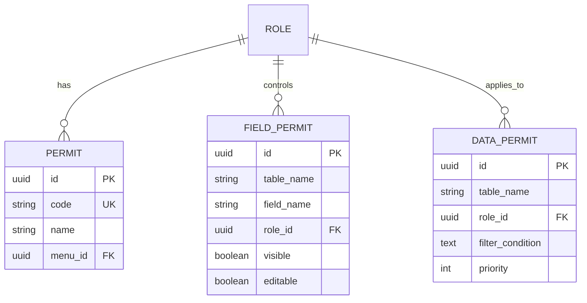
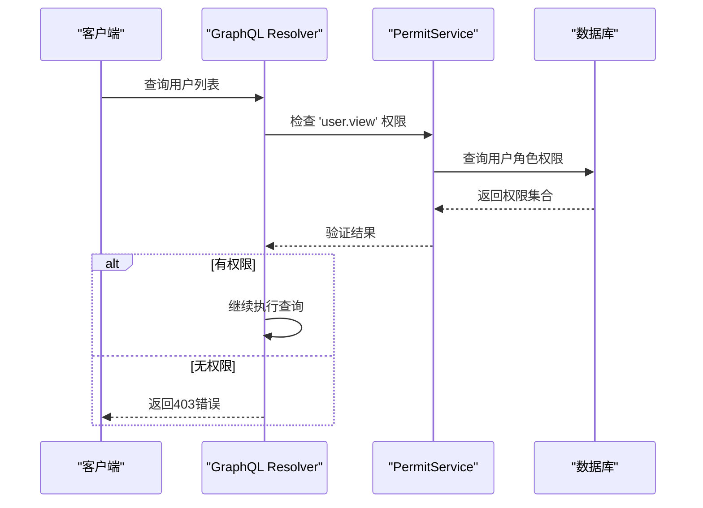
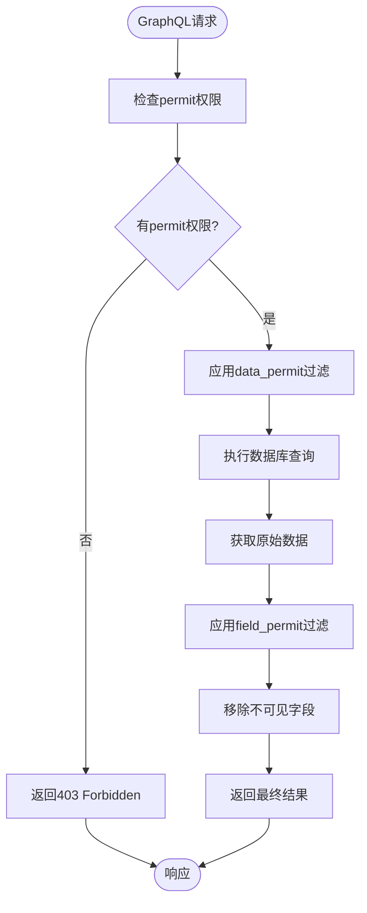
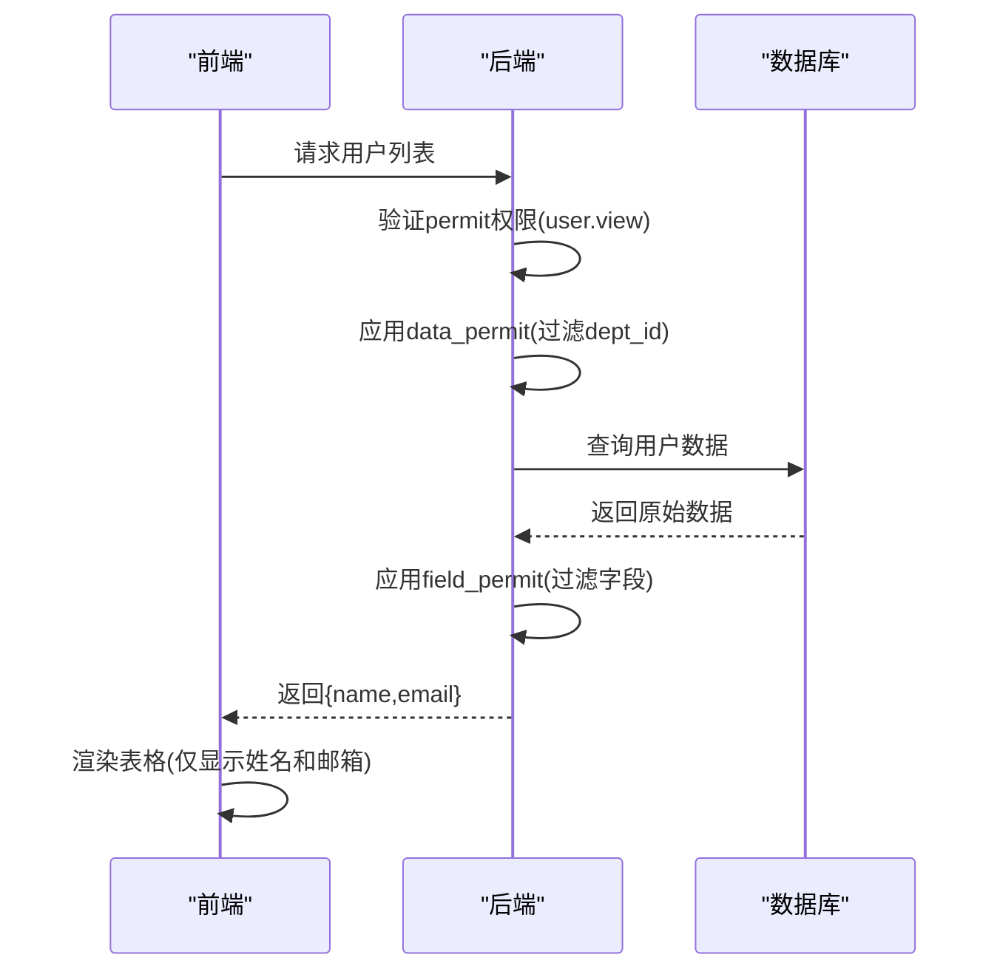

# 权限控制体系

**本文档引用文件**  
- [base.sql](https://github.com/sail-sail/nest/blob/main/codegen/src/tables/base/base.sql)
- [permit_scan.js](https://github.com/sail-sail/nest/blob/main/pc/src/utils/permit_scan.js)
- [permit_resolver.rs](https://github.com/sail-sail/nest/blob/main/rust/generated/base/permit/permit_resolver.rs)
- [field_permit_resolver.rs](https://github.com/sail-sail/nest/blob/main/rust/generated/base/field_permit/field_permit_resolver.rs)
- [data_permit_resolver.rs](https://github.com/sail-sail/nest/blob/main/rust/generated/base/data_permit/data_permit_resolver.rs)

## 目录
1. [引言](#引言)
2. [三级权限模型概述](#三级权限模型概述)
3. [数据库表结构设计](#数据库表结构设计)
4. [GraphQL查询中的权限验证逻辑](#graphql查询中的权限验证逻辑)
5. [前端界面的权限渲染策略](#前端界面的权限渲染策略)
6. [三级权限协同工作流程示例](#三级权限协同工作流程示例)
7. [权限规则自定义与扩展开发指南](#权限规则自定义与扩展开发指南)
8. [总结](#总结)

## 引言
本系统采用三级权限控制模型，涵盖菜单/功能权限（permit）、字段级权限（field_permit）和数据级权限（data_permit），旨在实现细粒度、可扩展的安全访问控制。该体系贯穿后端服务、GraphQL接口层及前端展示层，确保用户只能访问其被授权的功能、字段和数据记录。

## 三级权限模型概述
系统权限体系由三个层次构成，逐层细化访问控制：

- **permit（菜单/功能权限）**：控制用户是否可以访问特定菜单项或执行特定操作，如“用户管理”页面的查看或编辑权限。
- **field_permit（字段级权限）**：在数据展示层面控制字段的可见性与可编辑性，例如隐藏用户的身份证号字段或禁止修改创建时间。
- **data_permit（数据级权限）**：基于业务规则限制用户可访问的数据范围，如部门员工仅能查看本部门的数据记录。

这三层权限共同作用，形成完整的访问控制链，确保安全性与灵活性的统一。

**Section sources**
- [base.sql](https://github.com/sail-sail/nest/blob/main/codegen/src/tables/base/base.sql)

## 数据库表结构设计
权限相关的核心数据表包括 `permit`、`field_permit` 和 `data_permit`，均定义于基础SQL脚本中。

### permit 表
存储菜单与功能权限定义，主要字段包括：
- `id`: 权限唯一标识
- `code`: 权限编码（如 `user.view`, `user.edit`）
- `name`: 权限名称
- `menu_id`: 关联菜单ID（可为空，支持非菜单类操作权限）

### field_permit 表
定义字段级别的访问控制规则，关键字段如下：
- `table_name`: 数据表名
- `field_name`: 字段名
- `role_id`: 角色ID
- `visible`: 是否可见
- `editable`: 是否可编辑

### data_permit 表
实现基于条件的数据行级过滤，核心字段包括：
- `table_name`: 应用权限的数据表
- `role_id`: 角色ID
- `filter_condition`: 过滤表达式（如 `dept_id = ${current_dept_id}`）
- `priority`: 优先级，用于处理多条规则冲突

上述表结构支持通过角色与用户关联，实现基于角色的访问控制（RBAC）。

**Diagram sources**
- [base.sql](https://github.com/sail-sail/nest/blob/main/codegen/src/tables/base/base.sql)

## GraphQL查询中的权限验证逻辑
在GraphQL解析器（resolver）中，通过中间件机制实现三层权限的逐级校验。

### permit 权限验证
在调用任何受保护的GraphQL字段前，系统会检查当前用户是否拥有对应的 `permit.code`。该逻辑实现在 `permit_resolver.rs` 中，通过拦截器获取用户角色并查询其关联的权限列表。

**Diagram sources**
- [permit_resolver.rs](https://github.com/sail-sail/nest/blob/main/rust/generated/base/permit/permit_resolver.rs)

### field_permit 权限处理
在返回数据前，系统根据用户角色动态过滤响应字段。`field_permit_resolver.rs` 在数据序列化阶段介入，移除不可见字段或标记只读状态。

### data_permit 数据过滤
`data_permit_resolver.rs` 在构建数据库查询时注入动态WHERE条件。例如，当用户属于部门A时，自动添加 `dept_id = 'A'` 到所有相关查询中，确保数据隔离。

**Diagram sources**
- [field_permit_resolver.rs](https://github.com/sail-sail/nest/blob/main/rust/generated/base/field_permit/field_permit_resolver.rs)
- [data_permit_resolver.rs](https://github.com/sail-sail/nest/blob/main/rust/generated/base/data_permit/data_permit_resolver.rs)

## 前端界面的权限渲染策略
前端通过 `permit_scan.js` 实现组件级的权限控制，动态决定UI元素的显示与交互行为。

### 扫描机制
`permit_scan.js` 遍历Vue组件树，识别带有特定指令（如 `v-permit="'user.edit'"`）的DOM节点。根据当前用户权限列表，动态隐藏或禁用对应元素。

### 渲染控制
- 若用户无 `user.view` 权限，则整个“用户管理”菜单项不渲染。
- 若用户无 `user.email.edit` 字段权限，则邮箱输入框置为只读。
- 表格列根据 `field_permit` 配置动态生成，隐藏无权查看的列。

此机制确保前端界面与后端权限规则保持一致，防止信息泄露。

**Section sources**
- [permit_scan.js](https://github.com/sail-sail/nest/blob/main/pc/src/utils/permit_scan.js)

## 三级权限协同工作流程示例
以“普通用户查看用户列表”为例，展示三级权限的协同工作流程。

### 场景描述
- 用户角色：普通员工
- 所属部门：销售部（dept_id = 'sales'）
- 权限配置：
  - permit: 拥有 `user.view`，无 `user.edit`
  - field_permit: 可见 `name`, `email`，不可见 `salary`, `id_card`
  - data_permit: 仅能查看 `dept_id = ${current_dept_id}` 的数据

### 执行流程
1. 用户访问“用户管理”页面
2. 前端 `permit_scan.js` 检测到有 `user.view` 权限，渲染列表页面
3. 发起GraphQL查询 `{ users { id name email salary id_card } }`
4. 后端 `permit_resolver` 验证 `user.view` 权限通过
5. `data_permit_resolver` 注入过滤条件 `dept_id = 'sales'`
6. `field_permit_resolver` 过滤响应字段，仅保留 `name`, `email`
7. 返回数据 `{ users: [{ name: "张三", email: "zhang@example.com" }] }`
8. 前端表格仅显示姓名与邮箱列，隐藏其他字段

该流程确保用户只能看到本部门成员的基本信息，无法访问敏感字段或跨部门数据。

**Diagram sources**
- [permit_resolver.rs](https://github.com/sail-sail/nest/blob/main/rust/generated/base/permit/permit_resolver.rs)
- [field_permit_resolver.rs](https://github.com/sail-sail/nest/blob/main/rust/generated/base/field_permit/field_permit_resolver.rs)
- [data_permit_resolver.rs](https://github.com/sail-sail/nest/blob/main/rust/generated/base/data_permit/data_permit_resolver.rs)
- [permit_scan.js](https://github.com/sail-sail/nest/blob/main/pc/src/utils/permit_scan.js)

## 权限规则自定义与扩展开发指南
开发者可通过以下方式自定义和扩展权限体系：

### 添加新功能权限
1. 在数据库中插入新的 `permit` 记录，定义 `code` 和 `name`
2. 在前端组件使用 `v-permit="'your.code'"` 指令
3. 在GraphQL resolver中调用 `checkPermit("your.code")`

### 扩展字段权限支持
修改 `field_permit` 表结构以支持新属性（如 `exportable` 控制导出权限），并在 `field_permit_resolver.rs` 中实现相应逻辑。

### 自定义数据过滤表达式
支持在 `data_permit.filter_condition` 中使用模板变量（如 `${current_user_id}`, `${current_dept_id}`），系统会在运行时自动替换。可扩展解析器以支持更复杂的表达式语言。

### 集成外部权限系统
可通过实现自定义 `PermitProvider` 接口，从LDAP、OAuth等外部系统同步权限数据，实现统一身份管理。

**Section sources**
- [base.sql](https://github.com/sail-sail/nest/blob/main/codegen/src/tables/base/base.sql)
- [permit_resolver.rs](https://github.com/sail-sail/nest/blob/main/rust/generated/base/permit/permit_resolver.rs)
- [field_permit_resolver.rs](https://github.com/sail-sail/nest/blob/main/rust/generated/base/field_permit/field_permit_resolver.rs)
- [data_permit_resolver.rs](https://github.com/sail-sail/nest/blob/main/rust/generated/base/data_permit/data_permit_resolver.rs)

## 总结
本权限控制体系通过 `permit`、`field_permit` 和 `data_permit` 三层机制，实现了从功能到字段再到数据行的全方位安全防护。系统设计兼顾安全性与灵活性，支持动态配置与扩展，适用于多租户、多组织架构的复杂业务场景。前后端协同的权限校验机制，确保了权限策略的一致性与可靠性。