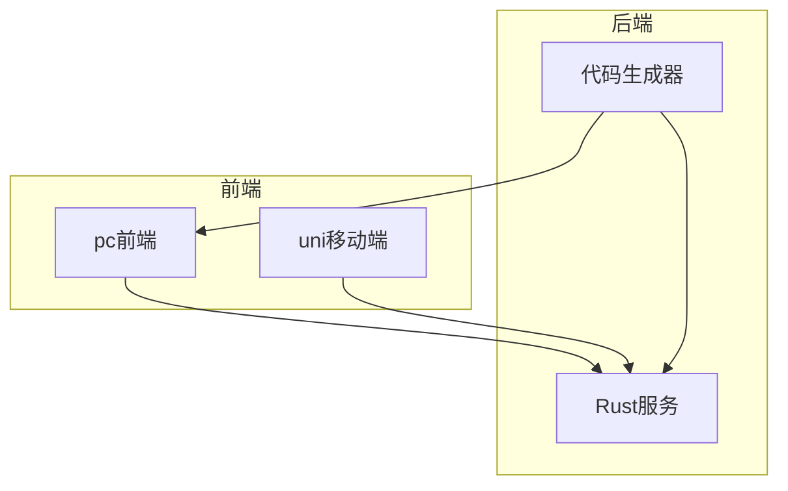
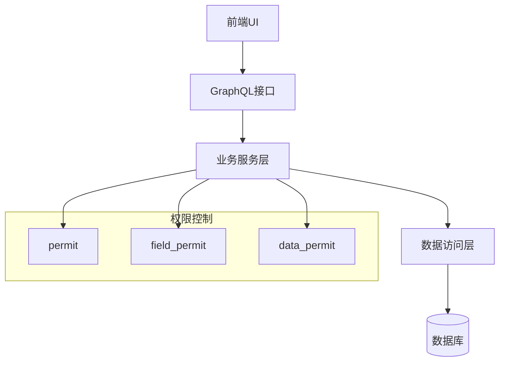
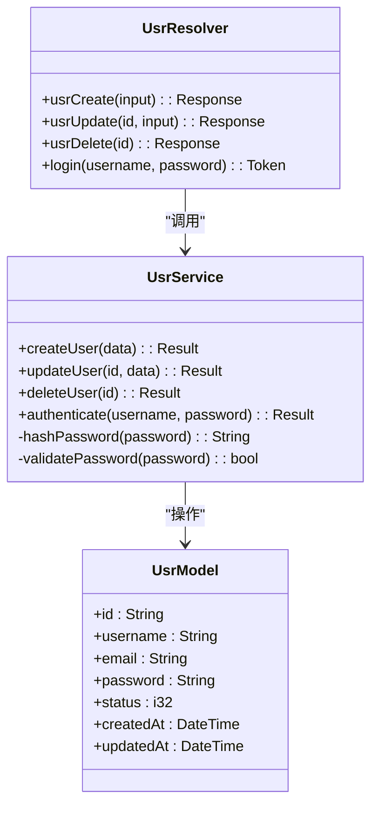
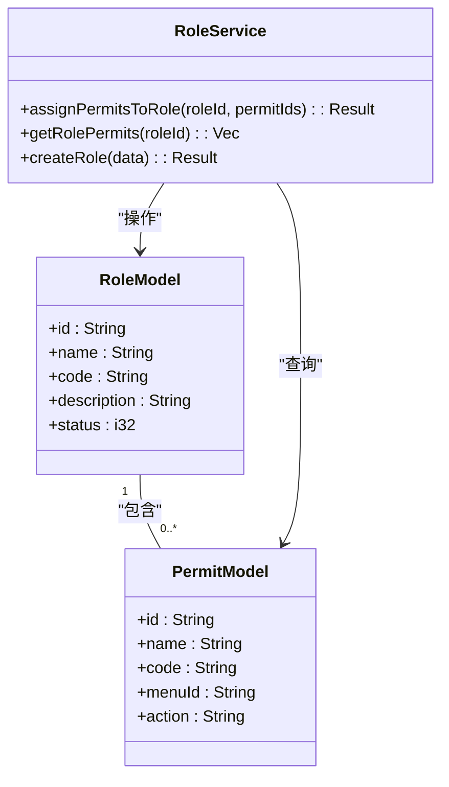
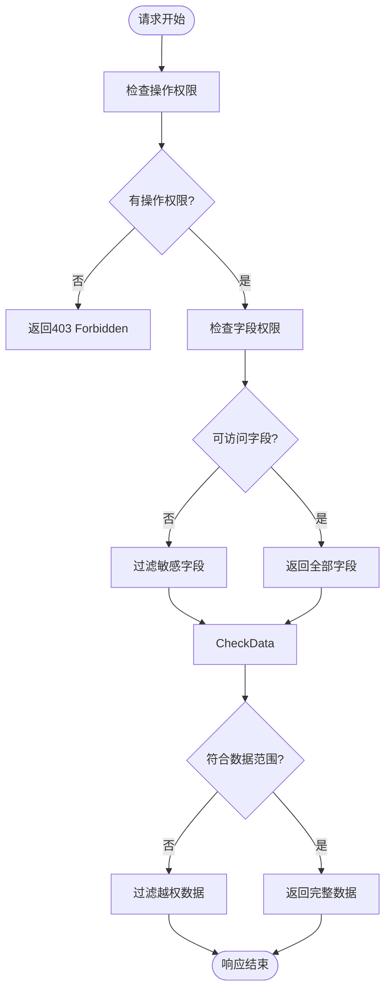
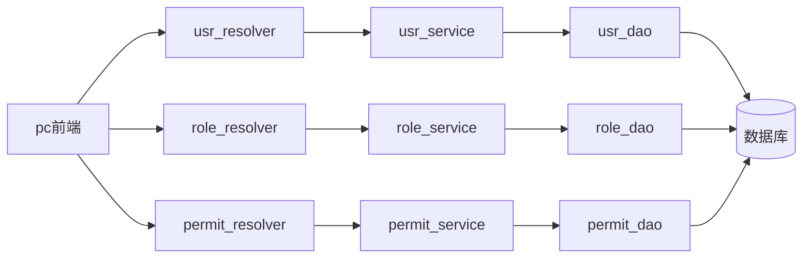

# 用户与权限系统

**本文档引用的文件**  
- [usr_model.rs](https://github.com/sail-sail/nest/blob/main/rust/generated/base/usr/usr_model.rs)
- [usr_service.rs](https://github.com/sail-sail/nest/blob/main/rust/generated/base/usr/usr_service.rs)
- [usr_resolver.rs](https://github.com/sail-sail/nest/blob/main/rust/generated/base/usr/usr_resolver.rs)
- [role_model.rs](https://github.com/sail-sail/nest/blob/main/rust/generated/base/role/role_model.rs)
- [role_service.rs](https://github.com/sail-sail/nest/blob/main/rust/generated/base/role/role_service.rs)
- [permit_model.rs](https://github.com/sail-sail/nest/blob/main/rust/generated/base/permit/permit_model.rs)
- [field_permit_service.rs](https://github.com/sail-sail/nest/blob/main/rust/generated/common/field_permit/field_permit_service.rs)
- [data_permit_service.rs](https://github.com/sail-sail/nest/blob/main/rust/generated/common/data_permit/data_permit_service.rs)
- [graphql.ts](https://github.com/sail-sail/nest/blob/main/pc/src/utils/graphql.ts)
- [permit_scan.js](https://github.com/sail-sail/nest/blob/main/pc/src/utils/permit_scan.js)

## 目录
1. [简介](#简介)
2. [项目结构](#项目结构)
3. [核心组件](#核心组件)
4. [架构概览](#架构概览)
5. [详细组件分析](#详细组件分析)
6. [依赖分析](#依赖分析)
7. [性能考虑](#性能考虑)
8. [故障排除指南](#故障排除指南)
9. [结论](#结论)

## 简介
本系统实现了一套完整的用户与权限管理体系，涵盖用户管理、角色分配、三级权限控制（permit、field_permit、data_permit）等核心功能。系统采用Rust后端+Vue前端的架构，通过GraphQL接口进行数据交互，实现了前后端协同的细粒度权限控制。

## 项目结构
系统主要由四个部分组成：codegen（代码生成器）、pc（PC端前端）、rust（后端服务）、uni（移动端前端）。其中权限相关的核心逻辑集中在rust和pc目录下。

**Diagram sources**
- [usr_model.rs](https://github.com/sail-sail/nest/blob/main/rust/generated/base/usr/usr_model.rs)
- [role_model.rs](https://github.com/sail-sail/nest/blob/main/rust/generated/base/role/role_model.rs)

**Section sources**
- [usr_model.rs](https://github.com/sail-sail/nest/blob/main/rust/generated/base/usr/usr_model.rs)
- [role_model.rs](https://github.com/sail-sail/nest/blob/main/rust/generated/base/role/role_model.rs)

## 核心组件
系统包含三大核心模块：用户管理、角色分配、权限控制。用户模块负责用户信息存储与认证；角色模块实现权限的分组管理；权限控制模块提供三级细粒度访问控制。

**Section sources**
- [usr_service.rs](https://github.com/sail-sail/nest/blob/main/rust/generated/base/usr/usr_service.rs)
- [role_service.rs](https://github.com/sail-sail/nest/blob/main/rust/generated/base/role/role_service.rs)
- [permit_model.rs](https://github.com/sail-sail/nest/blob/main/rust/generated/base/permit/permit_model.rs)

## 架构概览
系统采用分层架构设计，从前端到后端依次为：UI层、GraphQL接口层、业务逻辑层、数据访问层。

**Diagram sources**
- [usr_resolver.rs](https://github.com/sail-sail/nest/blob/main/rust/generated/base/usr/usr_resolver.rs)
- [permit_model.rs](https://github.com/sail-sail/nest/blob/main/rust/generated/base/permit/permit_model.rs)
- [field_permit_service.rs](https://github.com/sail-sail/nest/blob/main/rust/generated/common/field_permit/field_permit_service.rs)

## 详细组件分析

### 用户模块分析
用户模块负责用户信息的管理与认证流程，包括用户创建、密码策略、登录认证等功能。

**Diagram sources**
- [usr_model.rs](https://github.com/sail-sail/nest/blob/main/rust/generated/base/usr/usr_model.rs)
- [usr_service.rs](https://github.com/sail-sail/nest/blob/main/rust/generated/base/usr/usr_service.rs)
- [usr_resolver.rs](https://github.com/sail-sail/nest/blob/main/rust/generated/base/usr/usr_resolver.rs)

**Section sources**
- [usr_model.rs](https://github.com/sail-sail/nest/blob/main/rust/generated/base/usr/usr_model.rs)
- [usr_service.rs](https://github.com/sail-sail/nest/blob/main/rust/generated/base/usr/usr_service.rs)

### 角色模块分析
角色模块实现权限的分组管理，通过角色与权限的关联关系实现灵活的权限分配机制。

**Diagram sources**
- [role_model.rs](https://github.com/sail-sail/nest/blob/main/rust/generated/base/role/role_model.rs)
- [permit_model.rs](https://github.com/sail-sail/nest/blob/main/rust/generated/base/permit/permit_model.rs)
- [role_service.rs](https://github.com/sail-sail/nest/blob/main/rust/generated/base/role/role_service.rs)

**Section sources**
- [role_model.rs](https://github.com/sail-sail/nest/blob/main/rust/generated/base/role/role_model.rs)
- [permit_model.rs](https://github.com/sail-sail/nest/blob/main/rust/generated/base/permit/permit_model.rs)

### 权限控制体系分析
系统实现三级权限控制体系：permit（操作权限）、field_permit（字段权限）、data_permit（数据权限），提供细粒度的访问控制。

**Diagram sources**
- [field_permit_service.rs](https://github.com/sail-sail/nest/blob/main/rust/generated/common/field_permit/field_permit_service.rs)
- [data_permit_service.rs](https://github.com/sail-sail/nest/blob/main/rust/generated/common/data_permit/data_permit_service.rs)

**Section sources**
- [field_permit_service.rs](https://github.com/sail-sail/nest/blob/main/rust/generated/common/field_permit/field_permit_service.rs)
- [data_permit_service.rs](https://github.com/sail-sail/nest/blob/main/rust/generated/common/data_permit/data_permit_service.rs)

## 依赖分析
系统各组件之间存在明确的依赖关系，从前端到后端形成完整的调用链路。

**Diagram sources**
- [usr_resolver.rs](https://github.com/sail-sail/nest/blob/main/rust/generated/base/usr/usr_resolver.rs)
- [role_service.rs](https://github.com/sail-sail/nest/blob/main/rust/generated/base/role/role_service.rs)
- [permit_dao.rs](https://github.com/sail-sail/nest/blob/main/rust/generated/base/permit/permit_dao.rs)

**Section sources**
- [usr_resolver.rs](https://github.com/sail-sail/nest/blob/main/rust/generated/base/usr/usr_resolver.rs)
- [role_service.rs](https://github.com/sail-sail/nest/blob/main/rust/generated/base/role/role_service.rs)

## 性能考虑
系统在权限验证方面进行了优化，通过缓存机制减少数据库查询次数，提高响应速度。同时采用GraphQL的批量查询能力，减少网络请求次数。

## 故障排除指南
常见问题包括权限配置不生效、字段过滤异常、数据范围越权等。可通过检查权限配置、查看日志记录、验证缓存状态等方式进行排查。

**Section sources**
- [permit_scan.js](https://github.com/sail-sail/nest/blob/main/pc/src/utils/permit_scan.js)
- [graphql.ts](https://github.com/sail-sail/nest/blob/main/pc/src/utils/graphql.ts)

## 结论
本用户与权限系统提供了完整的用户管理、角色分配和三级权限控制功能，具有良好的扩展性和安全性，能够满足复杂业务场景下的权限管理需求。